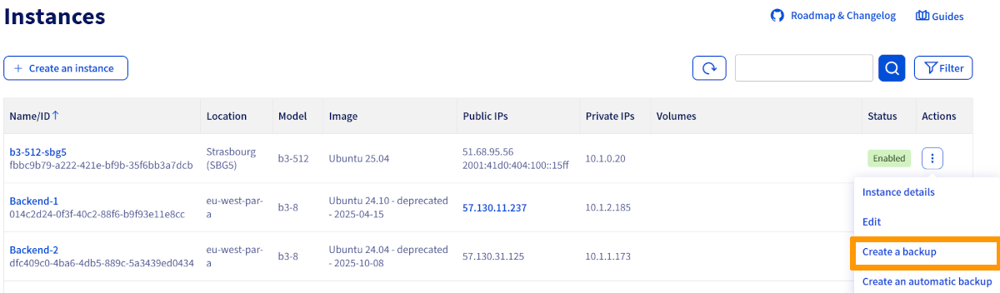
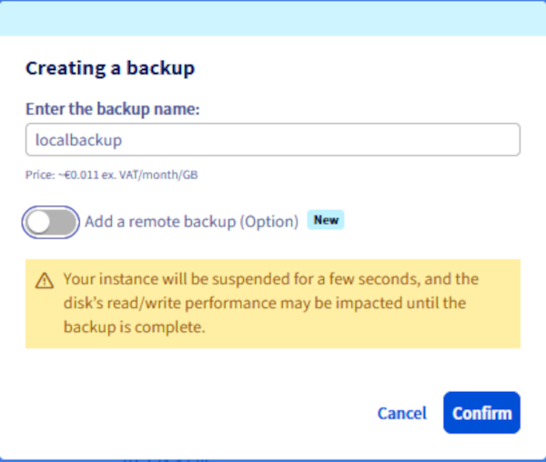
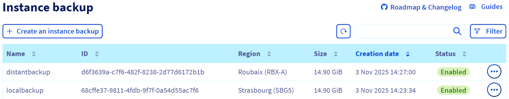
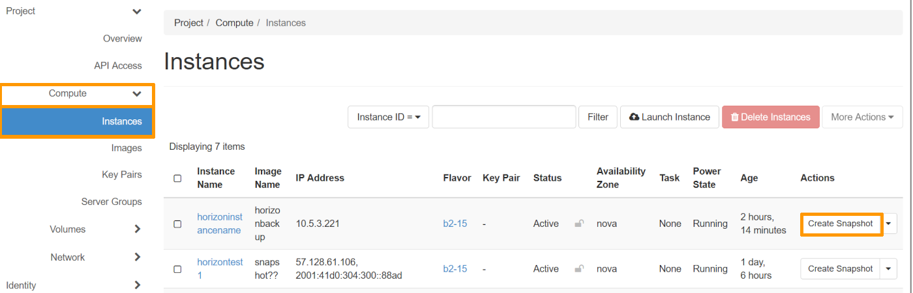
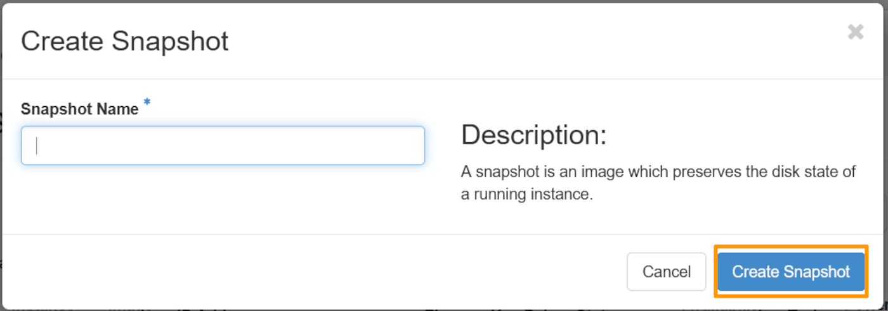
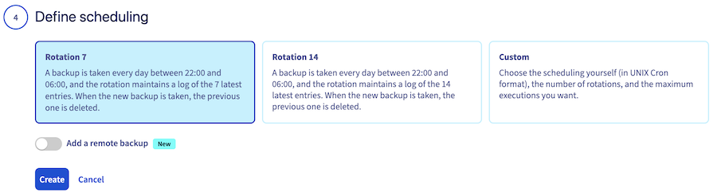

<style>
details>summary {
    color:rgb(33, 153, 232) !important;
    cursor: pointer;
}
details>summary::before {
    content:'\25B6';
    padding-right:1ch;
}
details[open]>summary::before {
    content:'\25BC';
}
</style>

## Obiettivo

Crea un backup unico di un'istanza o configura una pianificazione per automatizzare i backup delle tue istanze. I backup possono essere utilizzati per ripristinare lo stato dell'istanza o per creare una nuova istanza identica.

**Questa guida ti mostra come creare backup manuali e automatici di un'istanza Public Cloud.**

## Prerequisiti

- Disporre di un'istanza [Public Cloud](/links/public-cloud/public-cloud) sul proprio account OVHcloud.
- Avere accesso allo [Spazio Cliente OVHcloud](/links/manager).
- CLI OpenStack. Consulta la nostra guida "[Preparare l’ambiente per utilizzare l’API OpenStack](/pages/public_cloud/public_cloud_cross_functional/prepare_the_environment_for_using_the_openstack_api)". (opzionale)

## Procedura

### Effettua un backup dell’istanza

> [!warning]
> Questa opzione è disponibile solo via **Cold Snapshot** per le istanze Metal. L'istanza Metal passerà in modalità Rescue e, una volta effettuato il backup, l'istanza sarà riavviata in modalità normale.
>

> [!primary]
>
> Due tipi di backup sono disponibili:
>
> - Locale: Un backup locale viene archiviato nella stessa regione della tua istanza.
> - Remoto: Un backup remoto crea automaticamente una copia del backup locale in un'altra regione a tua scelta.
>
> Ogni backup è fatturato separatamente. Il backup remoto verrà fatturato in base alla tariffa di archiviazione della regione remota selezionata.
>
> Al momento, la creazione di un backup remoto non è disponibile tramite il Spazio Cliente OVHcloud. Puoi eseguirla solo tramite l'API OVHcloud e Openstack.

> [!tabs]
> Attraverso il Spazio Cliente OVHcloud
>>
>> Accedi al [Spazio Cliente OVHcloud](/links/manager), vai alla sezione `Public Cloud`{.action} e seleziona il progetto Public Cloud desiderato.<br>
>> Clicca su `Istanze`{.action} nel menu a sinistra.<br>
>> Nella pagina delle istanze, clicca sul pulsante `...`{.action} a destra dell'istanza e seleziona `Crea un backup`{.action}.
>>
>> {.thumbnail}
>>
>> /// details | Backup locale
>>
>> Assegna un nome al backup, consulta le informazioni sui prezzi e clicca su `Conferma`{.action}.
>>
>> {.thumbnail}
>>
>> ///
>>
>> Non è possibile seguire in tempo reale l'avanzamento del backup. Tuttavia, puoi consultare lo stato del backup nella sezione `Instance Backup`{.action} sotto la voce **Compute** del menu a sinistra, dove verrà visualizzato lo stato `Backup in corso`.
>>
>> {.thumbnail}
>>
>> Una volta completato il backup, sarà disponibile nella sezione `Instance Backup`{.action} sotto la voce **Compute** nel menu a sinistra.
>>
>> {.thumbnail}
>>
> Attraverso l'API OVHcloud <a name="createinstanceviaapi"></a>
>>
>> Accedi all'[API OVHcloud](/links/console) e utilizza la seguente chiamata API:
>>
>> > [!api]
>> >
>> > @api {v1} /cloud POST /cloud/project/{serviceName}/region/{regionName}/instance/{instanceId}/snapshot
>> >
>>
>> Compila le variabili:
>>
>> - **instanceId**: ID unico dell'istanza desiderata.
>> - **regionName**: Nome della regione in cui si trova l'istanza di origine.
>> - **serviceName**: ID del progetto OVHcloud.
>> - **distantRegionName (opzionale)**: Nome della regione remota dove verrà archiviato il backup.
>> - **distantSnapshotName (opzionale)**: Nome del backup remoto da creare nella regione remota.
>> - **snapshotName**: Nome dello snapshot (backup locale) da creare.
>>
>> > [!primary]
>> >
>> > Crea un backup remoto solo se i parametri relativi alla regione remota (**distantRegionName** e **distantSnapshotName**) sono compilati.
>> >
>>
> Attraverso la CLI OpenStack
>>
>> Esegui il seguente comando per visualizzare l'elenco delle istanze:
>>
>> ```bash
>> $ openstack server list
>>
>> +--------------------------------------+-----------+--------+--------------------------------------------------+--------------+
>> | ID | Name | Status | Networks | Image Name |
>> +--------------------------------------+-----------+--------+--------------------------------------------------+--------------+
>> | aa7115b3-83df-4375-b2ee-19339041dcfa | Server 1 | ACTIVE | Ext-Net=51.xxx.xxx.xxx, 2001:41d0:xxx:xxxx::xxxx | Ubuntu 16.04 |
>> +--------------------------------------+-----------+--------+--------------------------------------------------+--------------+
>> ```
>>
>> /// details | Backup locale
>>
>> Esegui il seguente comando per creare un backup della tua istanza:
>>
>> ```bash
>> $ openstack server image create --name snap_server1 aa7115b3-83df-4375-b2ee-19339041dcfa
>> ```
>>
>> ///
>>
>> /// details | Backup remoto
>>
>> Esegui il seguente comando dopo aver creato il backup locale:
>>
>> ```bash
>> $ openstack workflow execution create ovh.glance.glance_download '{"src_image_id": "<image_id>", "src_region": "<current_region>", "dst_region": "<remote_region>"}'
>> ```
>>
>> ///
>>
> Attraverso Horizon
>>
>> Clicca sul menu `Compute`{.action} a sinistra e seleziona `Istanze`{.action}.<br>
>> Clicca sul pulsante `Create Snapshot`{.action} a destra della riga corrispondente all'istanza.
>>
>> {.thumbnail}
>>
>> Assegna un nome al backup e clicca su `Create Snapshot`{.action}.
>>
>> {.thumbnail}
>>

### Creare un backup automatizzato di un'istanza

> [!primary]
>
> Se desideri automatizzare questa funzione direttamente tramite OpenStack, puoi creare un workflow Mistral associato a un cron trigger.

Clicca sui tre puntini `...`{.action} a destra dell'istanza e seleziona `Crea un backup automatizzato`{.action}.

{.thumbnail}

Puoi configurare questi parametri di backup:

#### **Il workflow** 

Al momento esiste un unico workflow. Crea un backup per l'istanza e il suo volume principale.

{.thumbnail}

#### **La risorsa** 

È possibile selezionare l'istanza da salvare.

{.thumbnail}

#### **La pianificazione** 

È possibile definire una pianificazione di backup personalizzata o scegliere una delle frequenze predefinite:

- Backup giornaliero con retention degli ultimi 7 backup
- Backup giornaliero con retention degli ultimi 14 backup

{.thumbnail}

#### **Il nome** 

Inserisci un nome per la pianificazione del backup automatico. Leggi le informazioni relative alla tariffazione e imposta il calendario cliccando sul pulsante `Crea`{.action}.
 
{.thumbnail}

### Gestione di backup e pianificazione

Le pianificazioni possono essere create ed eliminate nella sezione `Workflow Management`{.action}, che si trova sotto **Compute** nel menu di sinistra.

{.thumbnail}

I backup delle istanze sono gestiti nella sezione `Instance Backup`{.action}, che si trova sotto **Compute** nel menu di sinistra.

{.thumbnail}

> [!warning]
> L’opzione di backup dell’istanza deve essere eliminata separatamente se non vuoi più che ti venga fatturata. L’eliminazione di un’istanza non comporta l’eliminazione delle opzioni ad essa associate.
>

> [!warning]
> **Si noti che non è possibile eliminare un backup dell'istanza se un'istanza creata da questo backup è in esecuzione al momento dell'azione di eliminazione.**

Questa guida ti mostra come utilizzare i backup per clonare o ripristinare le istanze in [questa guida](/pages/public_cloud/compute/create_restore_a_virtual_server_with_a_backup).

## Per saperne di più

[Crea/ripristina il tuo server virtuale da un backup](/pages/public_cloud/compute/create_restore_a_virtual_server_with_a_backup)

Contatta la nostra Community di utenti all’indirizzo <https://community.ovh.com/en/>.