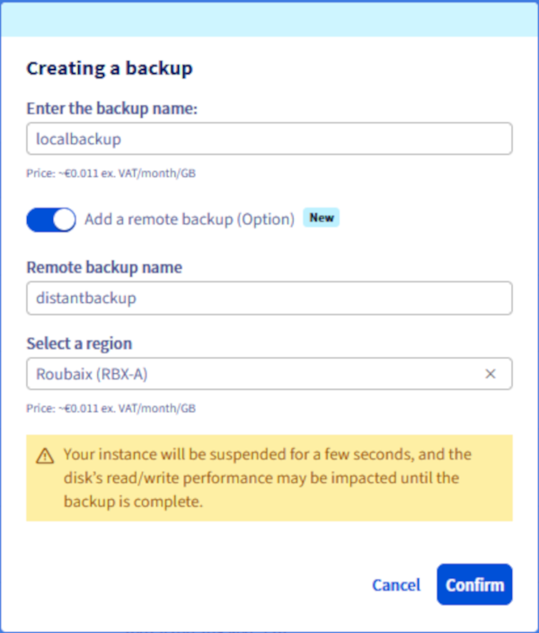
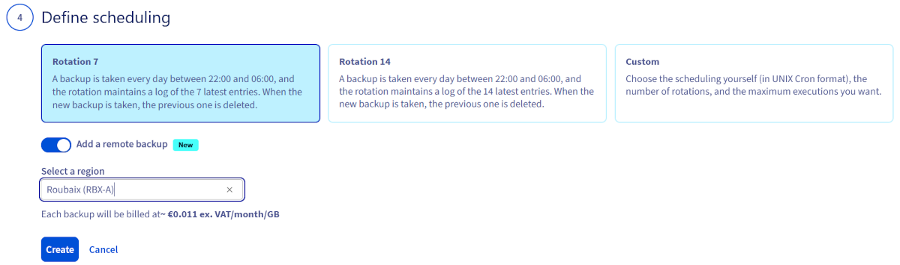

<style>
details>summary {
    color:rgb(33, 153, 232) !important;
    cursor: pointer;
}
details>summary::before {
    content:'\25B6';
    padding-right:1ch;
}
details[open]>summary::before {
    content:'\25BC';
}
</style>

## Wprowadzenie

Możesz utworzyć kopię zapasową instancji lub skonfigurować harmonogram, aby zautomatyzować tworzenie kopii zapasowych instancji. Kopie zapasowe mogą być używane do przywrócenia instancji do wcześniejszego stanu lub do utworzenia nowej identycznej instancji.

**Niniejszy przewodnik wyjaśnia, jak tworzyć ręczne i automatyczne kopie zapasowe instancji Public Cloud.**

## Wymagania początkowe

- Posiadanie instancji [Public Cloud](/links/public-cloud/public-cloud) na Twoim koncie OVHcloud.
- Dostęp do [Panelu client OVHcloud](/links/manager).
- CLI OpenStack. Skorzystaj z naszego przewodnika "[Przygotowanie środowiska do korzystania z API OpenStack](/pages/public_cloud/public_cloud_cross_functional/prepare_the_environment_for_using_the_openstack_api)". (opcjonalnie)

## W praktyce

### Tworzenie kopii zapasowej instancji

> [!warning]
> Ta opcja jest dostępna tylko przez **Cold Snapshot** dla instancji Metal. Instancja Metal przejdzie do trybu Rescue. Po wykonaniu kopii zapasowej instancja zostanie zrestartowana w trybie normalnym.
>

> [!primary]
>
> Dostępne są dwa typy kopii zapasowych:
>
> - Lokalna: Kopia zapasowa lokalna jest przechowywana w tej samej regionie co Twoja instancja.
> - Dystansowa: Kopia zapasowa dystansowa automatycznie tworzy kopię kopii zapasowej lokalnej w innej, wybranej przez Ciebie regionie.
>
> Każda kopia zapasowa jest rozliczana oddzielnie. Kopia zapasowa dystansowa zostanie rozliczona zgodnie z opłatami za przechowywanie danych w wybranej regionie dystansowej.
>
> **Uwaga:** Local Zones nie są uprawnione do odległych kopii zapasowych.

> [!tabs]
> Przez Panelu Klienta OVHcloud
>>
>> Zaloguj się do [Panelu Klienta OVHcloud](/links/manager), przejdź do sekcji `Public Cloud`{.action} i wybierz odpowiedni projekt Public Cloud.<br>
>> Kliknij `Instancje`{.action} w lewym menu.<br>
>> Na stronie instancji kliknij przycisk `...`{.action} obok instancji i wybierz `Utwórz kopię zapasową`{.action}.
>>
>> {.thumbnail}
>>
>> /// details | Lokalna kopia zapasowa
>>
>> Podaj nazwę kopii zapasowej, sprawdź informacje o cenach i kliknij `Potwierdź`{.action}.
>>
>> {.thumbnail}
>>
>> ///
>>
>> /// details | Dystansowa kopia zapasowa
>>
>> Wprowadź nazwę kopii zapasowej. Przejrzyj informacje o cenach. Kliknij `Dodaj odległą kopię zapasową (Opcja)`{.action}, wprowadź nazwę dla odległej kopii zapasowej, wybierz region i kliknij `Potwierdź`{.action}
>>
>> {.thumbnail}
>>
>> ///
>>
>> Nie jest możliwe monitorowanie postępu kopii zapasowej w czasie rzeczywistym. Jednak w sekcji `Instance Backup`{.action} pod **Compute** w lewym menu, podczas procesu będzie wyświetlany status `Kopia zapasowa w trakcie wykonywania`.
>>
>> Po zakończeniu kopii zapasowej będzie ona dostępna w sekcji `Instance Backup`{.action} pod sekcją **Compute** w lewym menu.
>>
>> {.thumbnail}
>>
> Przez API OVHcloud <a name="createinstanceviaapi"></a>
>> Zaloguj się do [API OVHcloud](/links/console).
>>
>> Możesz następnie wyświetlić listę wszystkich dostępnych regionów za pomocą poniższego wywołania API:
>>
>> > [!api]
>> >
>> > @api {v1} /cloud GET  /cloud/project/{serviceName}/region
>> >
>>
>> Następnie użyj poniższego wywołania API:
>>
>> > [!api]
>> >
>> > @api {v1} /cloud POST /cloud/project/{serviceName}/region/{regionName}/instance/{instanceId}/snapshot
>> >
>>
>> Wypełnij zmienne:
>>
>> - **instanceId**: Unikalny identyfikator odpowiedniej instancji.
>> - **regionName**: Nazwa regionu, w którym znajduje się źródłowa instancja.
>> - **serviceName**: Identyfikator projektu OVHcloud.
>> - **distantRegionName (opcjonalnie)**: Nazwa regionu, w którym zostanie przechowywana kopia zapasowa.
>> - **distantSnapshotName (opcjonalnie)**: Nazwa kopii zapasowej w regionie docelowym.
>> - **snapshotName**: Nazwa snapshotu (lokalnej kopii zapasowej) do utworzenia.
>>
>> > [!primary]
>> >
>> > Twórz kopię zapasową w regionie docelowym tylko wtedy, gdy parametry **distantRegionName** i **distantSnapshotName** są wypełnione.
>> >
>>
> Za pośrednictwem CLI OpenStack
>>
>> Uruchom poniższe polecenie, aby wyświetlić listę instancji:
>>
>> ```bash
>> $ openstack server list
>>
>> +--------------------------------------+-----------+--------+--------------------------------------------------+--------------+
>> | ID | Name | Status | Networks | Image Name |
>> +--------------------------------------+-----------+--------+--------------------------------------------------+--------------+
>> | aa7115b3-83df-4375-b2ee-19339041dcfa | Server 1 | ACTIVE | Ext-Net=51.xxx.xxx.xxx, 2001:41d0:xxx:xxxx::xxxx | Ubuntu 16.04 |
>> +--------------------------------------+-----------+--------+--------------------------------------------------+--------------+
>> ```
>>
>> Możesz wyświetlić listę wszystkich dostępnych regionów za pomocą poniższego polecenia:
>>
>> ```bash
>> $ openstack region list
>> ```
>>
>> /// details | Lokalna kopia zapasowa
>>
>> Uruchom poniższe polecenie, aby utworzyć kopię zapasową swojej instancji:
>>
>> ```bash
>> $ openstack server image create --name snap_server1 aa7115b3-83df-4375-b2ee-19339041dcfa
>> ```
>>
>> ///
>>
>> /// details | Kopia zapasowa w regionie docelowym
>>
>> Uruchom poniższe polecenie po utworzeniu lokalnej kopii zapasowej:
>>
>> ```bash
>> $ openstack workflow execution create ovh.glance.glance_download '{"src_image_id": "<image_id>", "src_region": "<current_region>", "dst_region": "<remote_region>"}'
>> ```
>>
>> ///
>>
> Przez Horizon
>>
>> Kliknij menu `Compute`{.action} po lewej stronie i wybierz `Instancje`{.action}.<br>
>> Kliknij przycisk `Create Snapshot`{.action} po prawej stronie wiersza odpowiadającego instancji.
>>
>> {.thumbnail}
>>
>> Podaj nazwę kopii zapasowej i kliknij `Create Snapshot`{.action}.
>>
>> {.thumbnail}
>>

### Tworzenie zautomatyzowanych kopii zapasowych instancji

> [!primary]
>
> Jeśli chcesz automatyzować tę funkcję bezpośrednio za pomocą OpenStack, możesz utworzyć workflow Mistral powiązany z cron trigger.

Kliknij przycisk `...`{.action} po prawej stronie instancji i wybierz `Utwórz automatyczną`{.action} kopię zapasową.

{.thumbnail}

Następnie będziesz mógł skonfigurować następujące parametry kopii zapasowej:

#### **Workflow (Przepływ pracy)** 

Aktualnie istnieje tylko jeden przepływ pracy. Tworzy kopię zapasową instancji i jej głównego woluminu.

{.thumbnail}

#### **Zasoby** 

Możesz wybrać instancję do zapisania.

{.thumbnail}

#### **Nazwa** 

Wprowadź nazwę do automatycznego planowania tworzenia kopii zapasowych. Zapoznaj się z informacjami na temat cennika i utwórz harmonogram, klikając przycisk `Utwórz`{.action}.
 
{.thumbnail}

#### **Harmonogram** 

Możesz zdefiniować spersonalizowane planowanie kopii zapasowych lub wybrać jedną z domyślnych częstotliwości:

- Codzienna kopia zapasowa z retencją ostatnich 7 kopii zapasowych
- Codzienna kopia zapasowa z retencją ostatnich 14 kopii zapasowych

{.thumbnail}

/// details | **Dodawanie kopia zapasowej w oddalonym miejscu**

Kliknij przycisk `Dodaj zdalny backup`{.action}, wybierz lokalizację, przejrzyj informacje o cenie i kliknij przycisk `Utwórz`{.action}.

{.thumbnail}

///


### Zarządzanie kopiami zapasowymi i planami

Planowanie może zostać utworzone i usunięte w sekcji `Workflow Management`{.action}, która znajduje się pod **Compute** w menu po lewej stronie.

{.thumbnail}

Kopie zapasowe instancji są zarządzane w sekcji `Instance Backup`{.action}, która znajduje się pod rubryką **Compute** w menu po lewej stronie.

{.thumbnail}

> [!warning]
> Opcja kopii zapasowej instancji musi zostać usunięta oddzielnie, jeśli nie chcesz już ponosić za nią opłat. Usunięcie instancji nie powoduje usunięcia powiązanych z nią opcji.
>

> [!warning]
> **Nie można usunąć kopii instancji, jeśli instancja uruchomiona z tej kopii zapasowej jest uruchomiona w czasie wykonywania akcji usuwania.**

Dowiedz się, jak w [tym przewodniku](/pages/public_cloud/compute/create_restore_a_virtual_server_with_a_backup) wykorzystać kopie zapasowe do klonowania lub przywracania instancji.

## Sprawdź również

[Tworzenie/ przywracanie serwera wirtualnego na podstawie kopii zapasowej](/pages/public_cloud/compute/create_restore_a_virtual_server_with_a_backup)

Przyłącz się do społeczności naszych użytkowników na stronie <https://community.ovh.com/en/>.