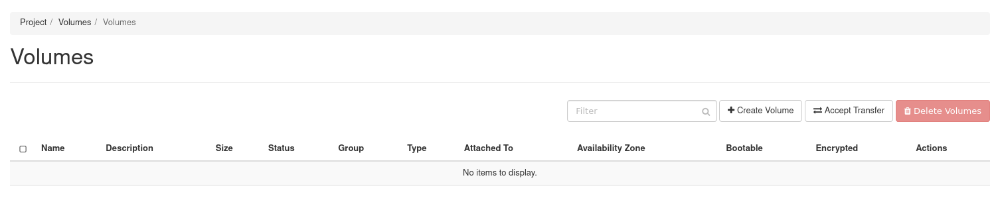
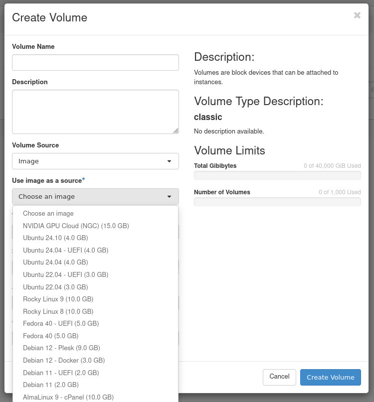
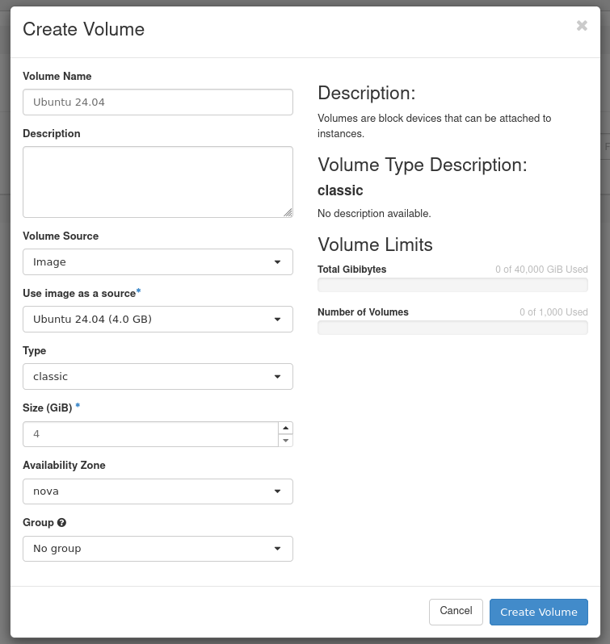
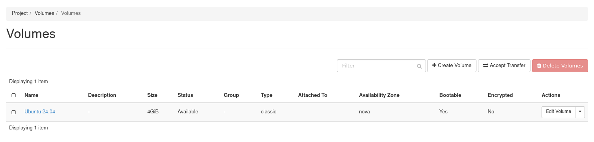
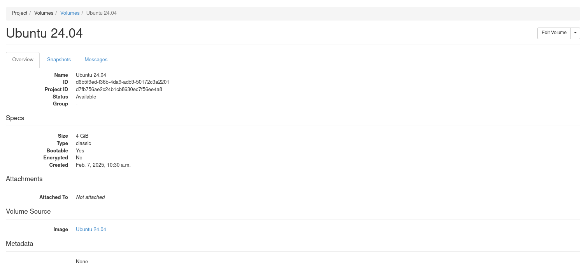
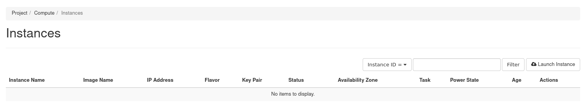
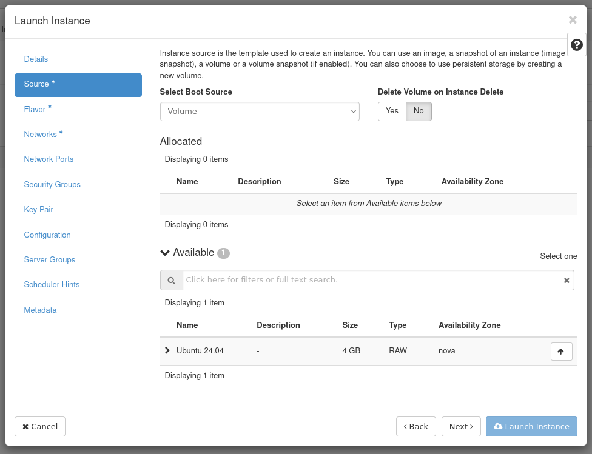
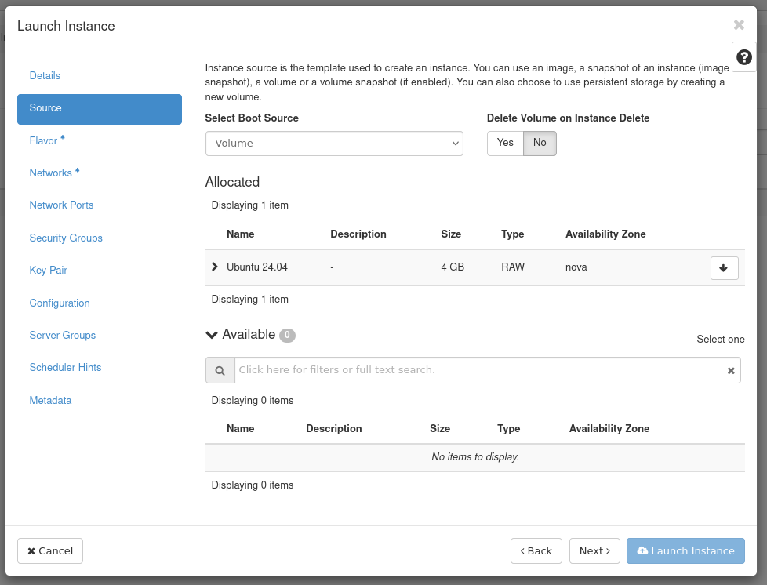
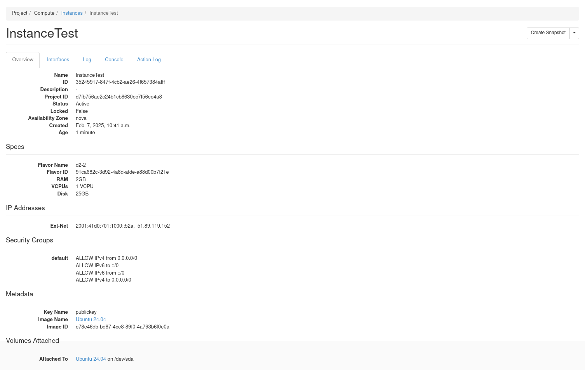

## Ziel

Die Public Cloud Instanzen werden mit einer Originalfestplatte geliefert, die von einem System-Image kopiert wurde (Debian 12, Windows Server etc.). Es können auch zusätzliche Volumes verwendet werden, d. h. persistente Festplatten, auf denen Daten gespeichert werden können.

Sie können ein Betriebssystem auch von einem Volume aus oder auf einem Volume bereitstellen. Die Public Cloud Instanz startet dann auf diesem Volume anstelle der ursprünglichen Festplatte.

**In dieser Anleitung erfahren Sie, wie Sie eine Instanz auf einem angeschlossenen Volume starten.**

{.thumbnail}

> [!success]
>
> Mit OpenStack können Sie nativ von einem Volume starten.
> Das Volume bootfähig machen und die Instanz von diesem Volume starten.
> Die Änderungen führen dazu, dass die ursprüngliche Festplatte nicht mehr angezeigt wird, wenn das neue Volume den Betrieb übernimmt.
> Die in diesem Handbuch beschriebenen Funktionen machen den Zugriff auf die Originalfestplatte überflüssig und nutzen somit das Volume.

> [!warning]
>
> Für die aktuelle Version von OpenStack, mit einem bootfähigen Volume, ist der Rescue-Pro Modus für eine Volume-gesicherte Instanz nicht verfügbar.
>

## Voraussetzungen

- Sie haben Zugang zum [Horizon-Interface](/pages/public_cloud/compute/introducing_horizon). 
- [OpenStack Umgebungsvariablen einrichten](/pages/public_cloud/compute/loading_openstack_environment_variables)

## Anweisungen

### Erstellen eines Startvolumes von einem Abbild aus.

> [!tabs]
> **Horizon**
>> Loggen Sie sich ins [Horizon-Interface](https://horizon.cloud.ovh.net/auth/login/).
>>
>> Wählen Sie oben links die korrekte Region aus.</br>
>>
>> Öffnen Sie in der Registerkarte Projekt die Registerkarte `Volumes`{.action} und klicken Sie auf die Kategorie `Volumes`{.action}.
>>
>> Klicken Sie auf `Create Volume`{.action}.
>>
>> {.thumbnail width="800"}
>>
>> Geben Sie im angezeigten Dialogfeld die folgenden Werte ein bzw. wählen Sie diese aus:
>>
>> | Information | Beschreibung |
>> | --- | --- |
>> | Volume Name | Geben Sie einen Namen für das Volume an |
>> | Description | Optional, kurze Beschreibung des Volumes angeben |
>> | Volume Source | Wählen Sie die Option `Image`.<br><br> {.thumbnail} |
>> | Use image as a source | Sie können das Bild aus der Liste auswählen.<br><br> {.thumbnail} |
>> | Type | Abhängig vom Typ des zu verwendenden Volumes |
>> | Size (GB) | Volumegröße in Gigabyte (GB) |
>> | Availability Zone | nova <br><br> {.thumbnail} |
>>
>> Klicken Sie auf `Create Volume`{.action}.
>>
>> Das Volume befindet sich im Status *`creating`* und dann im Status *`downloading`*, bevor es verfügbar ist.
>>
>> {.thumbnail width="800"}
>>
>> Wie in der Abbildung unten oder durch Klicken auf den Namen des Volumes dargestellt, wird es als bootfähig (*bootable*) definiert.
>>
>> {.thumbnail width="800"}
>>
> **OpenStack-Client**
>> Sie können ein Startvolume aus einem vorhandenen Image, Volume oder Snapshot erstellen. In diesem Verfahren wird gezeigt, wie Sie ein Volume aus einem Abbild erstellen und das Volume zum Starten einer Instanz verwenden.
>>
>> ```console
>> $ openstack image list
>> ```
>> > [!primary]
>> >
>> > Notieren Sie sich die ID oder den Namen des Bildes, das Sie verwenden möchten.
>>
>> Erstellen Sie ein startfähiges Volume mit hoher Geschwindigkeit und einer Speicherkapazität von 10 GB mit dem Namen **volume_ubuntu** aus einem Ubuntu 24.04 Image:
>>
>> Sie können ein Image auf einem Volume mit dem `--image`-Argument installieren:
>>
>> ```console
>> $ openstack volume create --type high-speed --image 2c2e28dc-9124-49c3-b92d-7f00bd83ac86 --size 10 volume_ubuntu
>> +---------------------+--------------------------------------+
>> | Field | Value |
>> +---------------------+--------------------------------------+
>> | attachments | [] |
>> | availability_zone | nova |
>> | bootable | false |
>> | consistencygroup_id | None |
>> | created_at | 2025-02-06T17:04:34.000000 |
>> | description | None |
>> | encrypted | False |
>> | id | d7611318-fd7b-4b6a-8a7a-8d368049f747 |
>> | multiattach | False |
>> | name | volume_ubuntu |
>> | properties | |
>> | replication_status | None |
>> | size | 20 |
>> | snapshot_id | None |
>> | source_volid | None |
>> | status | creating |
>> | type | high-speed |
>> | updated_at | None |
>> | user_id | 1a67934f87ef481d9cb617a913bfa8bb |
>> +---------------------+--------------------------------------+
>> ```
>>
>> In diesem Befehl ist **2c2e28dc-9124-49c3-b92d-7f00bd83ac86** die Ubuntu 24.04-Image-ID.
>>
>> > [!primary]
>> >
>> > Cinder macht ein Volume bootfähig, wenn der `--image`-Parameter übergeben wird.
>>

### Eine Instanz mit einem bootfähigen Volume starten

> [!tabs]
> **Horizon**
> Loggen Sie sich ins [Horizon-Interface](https://horizon.cloud.ovh.net/auth/login/).
>>
>> Wählen Sie oben links die korrekte Region aus.</br>
>>
>> Öffnen Sie in der Registerkarte Projekt die Registerkarte `Compute`{.action} und klicken Sie auf `Instances`{.action} Kategorie.
>>
>> Klicken Sie auf `Launch Instance`{.action}.
>>
>> {.thumbnail width="800"}
>>
>> Wählen Sie im Dialogfeld `Launch Instance` auf der Registerkarte Quelle im Feld `Select Boot Source` die Option "Volume".
>>
>> {.thumbnail}
>>
>> Ein neues Volume-Auswahlfeld wird angezeigt. Sie können das zuvor erstellte Volume aus der Liste auswählen.
>>
>> {.thumbnail}
>>
>> Klicken Sie auf `Launch Instance`{.action}.
>>
>> Die Instanz befindet sich im Status `build` und dann im Status `Block Device Mapping`, bevor sie verfügbar ist.
>>
>> Die Instanz wird am Ende mit dem Volume verbunden.
>>
>> {.thumbnail width="800"}
>>
> Erstellen Sie eine Instanz, indem Sie das bootfähige Volume **volume_ubuntu** als Bootgerät angeben.
>>
>> ```console
>> openstack server create --volume volume_ubuntu --flavor d2-2 --key-name publickey --nic net-id=Ext-Net InstanceTest
>> ```
>>
>> Volumes auflisten, um sicherzustellen, dass sich der Status in In-Use geändert hat und dass das Volume korrekt angehängt wird:
>>
>> ```console
>> $ openstack volume list
>> +--------------------------------------+---------------+--------+------+--------------------------------------+
>> | ID | Name | Status | Size | Attached to |
>> +--------------------------------------+---------------+--------+------+--------------------------------------+
>> | d7611318-fd7b-4b6a-8a7a-8d368049f747 | volume_ubuntu | in-use | 10 | Attached to InstanceTest on /dev/sda |
>> +--------------------------------------+---------------+--------+------+--------------------------------------+
>> ```
>>
>> Mit der Instanz verbundene Volumes auflisten **InstanceTest**:
>>
>> ```console
>> $ openstack server volume list InstanceTest
>> +--------------------------------------+----------+--------------------------------------+--------------------------------------+------+
>> | ID | Device | Server ID | Volume ID | Tag |
>> +--------------------------------------+----------+--------------------------------------+--------------------------------------+------+
>> | d7611318-fd7b-4b6a-8a7a-8d368049f747 | /dev/sda | 5d97c190-f2e3-4af4-a010-6fa7bffbf88b | d7611318-fd7b-4b6a-8a7a-8d368049f747 | None |
>> +--------------------------------------+----------+--------------------------------------+--------------------------------------+------+
>> ```
>>
>> > [!primary]
>> >
>> > Sie können auch eine Instanz erstellen, indem Sie das gewählte Image verwenden und das "boot from volume" Verhalten anfordern.
>>
>> ```console
>> $ openstack server create --flavor d2-2 --key-name publickey --nic net-id=Ext-Net --image b680f0aa-8eb8-4ac8-b008-2a90bb71af4f --boot-from-volume 10 InstanceTest2
>> +-----------------------------+---------------------------------------------+
>> | Field | Value |
>> +-----------------------------+---------------------------------------------+
>> | OS-DCF:diskConfig | MANUAL |
>> | OS-EXT-AZ:availability_zone | |
>> | OS-EXT-STS:power_state | NOSTATE |
>> | OS-EXT-STS:task_state | scheduling |
>> | OS-EXT-STS:vm_state | building |
>> | OS-SRV-USG:launched_at | None |
>> | OS-SRV-USG:terminated_at | None |
>> | accessIPv4 | |
>> | accessIPv6 | |
>> | addresses | |
>> | adminPass | dP4e4iY3eWWC |
>> | config_drive | |
>> | created | 2025-02-06T17:20:06Z |
>> | flavor | d2-2 (dc3fe9e7-e374-4ad8-b200-fa3bdf45069f) |
>> | hostId | |
>> | id | a4632249-e1b4-4047-be1c-87f8b0328f7c |
>> | image | N/A (booted from volume) |
>> | key_name | publickey |
>> | name | InstanceTest2 |
>> | progress | 0 |
>> | project_id | d7fb756ae2c24b1cb8630ec7f56ee4a8 |
>> | properties | |
>> | security_groups | name='default' |
>> | status | BUILD |
>> | updated | 2025-02-06T17:20:06Z |
>> | user_id | 1a67934f87ef481d9cb617a913bfa8bb |
>> | volumes_attached | |
>> +-----------------------------+---------------------------------------------+
>> ```
>>
>> Im obigen Befehl ist `b680f0aa-8eb8-4ac8-b008-2a90bb71af4f` die Debian Image ID 12.
>>
>> - Volumes auflisten:
>>
>> Listet die Volumes auf, um sicherzustellen, dass der Status in *in-use* geändert wurde und dass das Volume den Anschluss korrekt signalisiert.
>>
>> ```console
>> $ openstack volume list
>> +--------------------------------------+---------------+--------+------+----------------------------------------+
>> | ID | Name | Status | Size | Attached to |
>> +--------------------------------------+---------------+--------+------+----------------------------------------+
>> | 27f8332d-8bfd-4515-b0a8-18667ae50ff8 | | in-use | 10 | Attached to InstanceTest2 on /dev/sda |
>> | d7611318-fd7b-4b6a-8a7a-8d368049f747 | volume_ubuntu | in-use | 10 | Attached to InstanceTest on /dev/sda |
>> +--------------------------------------+---------------+--------+------+----------------------------------------+
>> ```
>>
>> Listet das Volume auf dem Server auf, um sicherzustellen, dass es ordnungsgemäß angeschlossen ist.
>> ```console
>> $ openstack server volume list InstanceTest
>> +--------------------------------------+----------+--------------------------------------+--------------------------------------+------+
>> | ID | Device | Server ID | Volume ID | Tag |
>> +--------------------------------------+----------+--------------------------------------+--------------------------------------+------+
>> | d7611318-fd7b-4b6a-8a7a-8d368049f747 | /dev/sda | 5d97c190-f2e3-4af4-a010-6fa7bffbf88b | d7611318-fd7b-4b6a-8a7a-8d368049f747 | None |
>> +--------------------------------------+----------+--------------------------------------+--------------------------------------+------+
>> ```

## Weiterführende Informationen

Für den Austausch mit unserer [User Community](/links/community).

