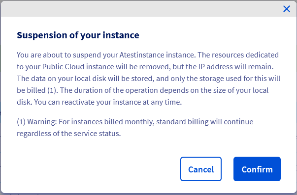

## Objective

As part of the configuration of a high-availability infrastructure, you may encounter the need to cut access to your instances in order to perform different tests. OpenStack allows you to suspend, pause or shelve your instance. In each case, your IP is maintained.

> [!warning]
> The naming of these options in the OVHcloud Control Panel is different from the naming in Openstack/Horizon. If you are doing this via the OVHcloud Control Panel, make sure you select the right option.
>

**This guide explains how to shelve, pause or suspend your instance.**

## Requirements

- An [OVHcloud Public Cloud instance](/pages/public_cloud/compute/public-cloud-first-steps) on **hourly** billing
- Access to the [OVHcloud Control Panel](/links/manager) or [Horizon interface](/pages/public_cloud/public_cloud_cross_functional/introducing_horizon)
- Knowledge of [Openstack API](/pages/public_cloud/public_cloud_cross_functional/prepare_the_environment_for_using_the_openstack_api) and [Openstack variables](/pages/public_cloud/public_cloud_cross_functional/loading_openstack_environment_variables)

## Instructions

> [!alert]
>
> This guide only applies to instances on **hourly billing**. If your instances are on **monthly billing**, standard billing will continue regardless of the status of the service.
> 
> Whether your instance is shelved, paused or suspended, you will still be billed for it. If you do not wish to be billed, you must delete the instance.
>

The table below allows you to differentiate the options available on your instances. Continue reading this guide by clicking on the option of your choice. We put the terminology used in the Horizon interface in brackets.

|Term|Description|Billing|
|---|---|---|
|[Suspend (*shelve*)](#shelve-instance)|Retains the resources and data in your disk by creating a snapshot, all other resources are released.|You are only billed for the snapshot.|
|[Stop (*suspend*)](#stop-suspend-instance)|Stores the VM state on disk, the resources dedicated to instance are still reserved.|You will still be billed the same price for your instance.|
|[Pause](#pause-instance)|Stores the state of the VM in RAM, a paused instance becomes frozen.|You will still be billed the same price for your instance.|

### Content overview

- [Suspend (*shelve*) an instance](#shelve-instance)
    - [From the OVHcloud Control Panel](#control-panel)
    - [From the Horizon Interface](#horizon)
    - [Using Openstack/Nova APIs](#openstack-nova)
-[Reactivate (*unshelve*) an instance](#unshelve-instance)
    - [From the OVHcloud Control Panel](#control-panel-unshelve)
    - [From the Horizon Interface](#horizon-unshelve)
    - [Using Openstack/Nova APIs](#openstack-nova-unshelve)
- [Stop (*suspend*) an instance](#stop-suspend-instance)
    - [From the OVHcloud Control Panel](#stop-control-panel)
    - [From the Horizon Interface](#stop-horizon)
    - [Using Openstack/Nova APIs](#stop-openstack-nova)
- [Pause an instance](#pause-instance)
    - [From the Horizon Interface](#pause-horizon)
    - [Using Openstack/Nova APIs](#pause-openstack-nova)

<a name="shelve-instance"></a>

### Suspend (*shelve*) an instance 

> [!alert]
> Please note that suspending an IOPS or T1/T2-180 instance will result in the loss of data on the NVMe passthrough drives.
>
> Suspending this type of instance leads to its decommissioning from the host, and therefore from the disks in passthrough.
>

This option will allow you to release the resources dedicated to your Public Cloud instance, but the IP address will remain. The data on your local disk will be stored in a snapshot automatically created once the instance is shelved. Data stored in the memory and elsewhere will not be retained.

<a name="control-panel"></a>

#### From the OVHcloud Control Panel

In the OVHcloud Control Panel, select your project from the `Public Cloud`{.action} section. Click on `Instances`{.action} in the left side menu.

Click on the `...`{.action} button to the right of the instance you want to suspend, then click on `Suspend`{.action}.

{.thumbnail}

In the pop-up window, take note of the message and click on `Confirm`{.action}.

{.thumbnail}

Once the process is completed, your instance will now appear as *Suspended*.

{.thumbnail}

To view the snapshot, click on `Instance Backup`{.action} underneath the **Compute** tab in the left side menu. A snapshot named *xxxxx-shelved* will now be visible:

{.thumbnail}

<a name="horizon"></a>

#### From the Horizon Interface

To proceed, you need to [log in to the Horizon interface](https://horizon.cloud.ovh.net/auth/login/):

- To log in with OVHcloud Single Sign-On: use the `Horizon`{.action} link in the left-hand menu under "Management Interfaces" after opening your `Public Cloud`{.action} project in the [OVHcloud Control Panel](/links/manager).

- To log in with a specific OpenStack user: open the [Horizon login page](https://horizon.cloud.ovh.net/auth/login/) and enter the [OpenStack user credentials](/pages/public_cloud/public_cloud_cross_functional/create_and_delete_a_user) previously created, then click on `Connect`{.action}.

If you have deployed instances in different regions, make sure you are in the correct region. You can verify this on the top left corner in the Horizon interface.

{.thumbnail}

Click on the `Compute`{.action} menu on the left side and select `Instances`{.action}. Select `Shelve Instance`{.action} in the drop list for the corresponding instance.

{.thumbnail}

Once the process is completed, your instance will now appear as *Shelved Offloaded*.

{.thumbnail}

To view the snapshot, in the `Compute`{.action} menu, click on `Images`{.action}.

{.thumbnail}

<a name="openstack-nova"></a>

#### Using Openstack/Nova APIs

Before proceeding, it is recommended that you consult these guides:

- [Prepare the environment to use the OpenStack API](/pages/public_cloud/public_cloud_cross_functional/prepare_the_environment_for_using_the_openstack_api)
- [Set OpenStack environment variables](/pages/public_cloud/public_cloud_cross_functional/loading_openstack_environment_variables)

Once your environment is ready, type the following at the command line:

```bash
openstack server shelve <UUID server>

=====================================

nova shelve <UUID server> 
```

<a name="unshelve-instance"></a>

### Reactivate (*unshelve*) an instance

This option will allow you to re-up your instance so that you can continue using it. Please note that once this is done, the regular billing will resume.

> [!alert] **Actions on the snapshot**
>
> Any actions on the snapshot other than *unshelve* can be very dangerous for your infrastructure in case of misuse. Once you *unshelve* an instance, the snapshot is automatically deleted. It is not recommended to deploy a new instance from any snapshot created as a result of shelving (suspending) an instance.
>
> OVHcloud is providing you with machines that you are responsible for. We have no access to these machines, and therefore cannot manage them. You are responsible for your own software and security management. If you experience any issues or doubts when it comes to managing, using or securing your server, we recommend that you contact a [specialist service provider](/links/partner).
>

<a name="control-panel-unshelve"></a>

#### From the OVHcloud Control Panel

In the OVHcloud Control Panel, select your project from the `Public Cloud`{.action} section and click on `Instances`{.action} in the left side menu.

Click on the `...`{.action} button to the right of the instance, then click on `Reactivate`{.action}.

{.thumbnail}

In the pop-up window, take note of the message and click on `Confirm`{.action}.

Once the process is completed, your instance will now appear as *Activated*.

<a name="horizon-unshelve"></a>

#### From the Horizon interface

In the Horizon interface, click on the `Compute`{.action} menu on the left and then select `Instances`{.action}. Select `Unshelve Instance`{.action} in the drop list for the corresponding instance.

{.thumbnail}

Once the process is completed, your instance will now appear as *Active*.

<a name="openstack-nova-unshelve"></a>

#### Using Openstack/Nova APIs

Once your environment is ready, type the following at the command line:

```bash
~$ openstack server unshelve <UUID server>

=========================================

~$ nova unshelve <UUID server>
```

<a name="stop-suspend-instance"></a>

### Stop (*suspend*) an instance

This option will allow you to shutdown your instance and store the VM state on disk, the memory will be written to the disk as well.

<a name="stop-control-panel"></a>

#### From the OVHcloud Control Panel

In the OVHcloud Control Panel, select your project from the `Public Cloud`{.action} section and click on `Instances`{.action} in the left side menu.

Click on the `...`{.action} button to the right of the instance you want to stop, then click on `Stop`{.action}.

{.thumbnail}

In the pop-up window, take note of the message and click on `Confirm`{.action}.

Once the process is completed, your instance will now appear as *Off*.

To **resume** the instance, perform the same steps as mentioned above. Click on the `...`{.action} button to the right of the instance and select `Boot`{.action}. In some cases, you might need to do a cold reboot.

<a name="stop-horizon"></a>

#### From the Horizon interface 

In the Horizon interface, click on the `Compute`{.action} menu on the left and then select `Instances`{.action}. Select `Suspend Instance`{.action} in the drop list for the corresponding instance.

{.thumbnail}

The confirmation message will appear, indicating that the instance has been suspended.

To **resume** the instance, perform the same steps as mentioned above. In the drop list for the corresponding instance select `Resume Instance`{.action}.

<a name="stop-openstack-nova"></a>

#### Using Openstack/Nova API

Once your environment is ready, type the following at the command line:

```bash
~$ openstack server suspend <UUID server>

=========================================

~$ nova suspend <UUID server>
```

To **resume** the instance, type the following at the command line:

```bash
~$ openstack server unsuspend <UUID server>

=========================================

~$ nova unsuspend <UUID server>
```

<a name="pause-instance"></a>

### Pause an instance

This action is **only** possible in the Horizon interface or via the Openstack/Nova API. It allows you to *freeze* your instance.

<a name="pause-horizon"></a>

#### From the Horizon Interface

In the Horizon interface, click on the `Compute`{.action} menu on the left and then select `Instances`{.action}. Select `Pause Instance`{.action} in the drop list for the corresponding instance.

{.thumbnail}

The confirmation message will appear, indicating that the instance has been paused.

To **unpause** the instance, perform the same steps as mentioned above. In the drop list for the corresponding instance select `Resume Instance`{.action}.

<a name="pause-openstack-nova"></a>

#### Using Openstack/Nova APIs

Once your environment is ready, type the following at the command line:

```bash
~$ openstack server pause <UUID server>

=========================================

~$ nova pause <UUID server>
```

To **unpause** the instance, type the following at the command line:

```bash
~$ openstack server unpause <UUID server>

=========================================

~$ nova unpause <UUID server>
```

## Go further

[OpenStack documentation](https://docs.openstack.org/mitaka/user-guide/cli_stop_and_start_an_instance.html).

Join our [community of users](/links/community).