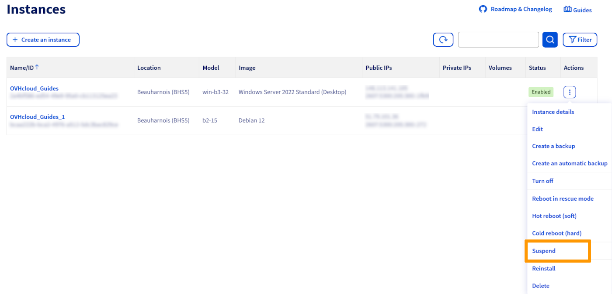
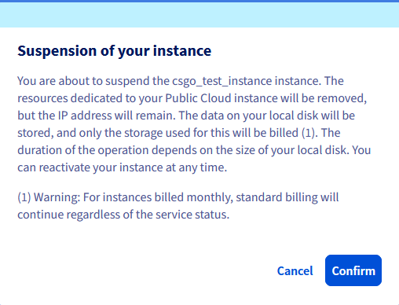
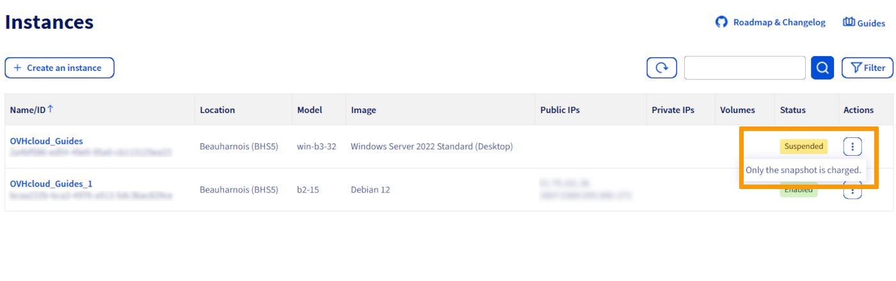
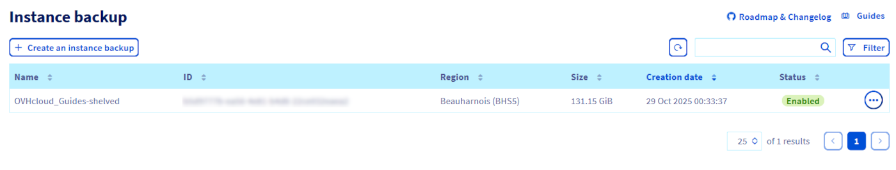
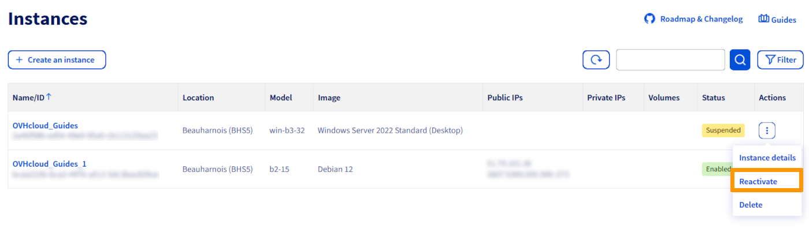
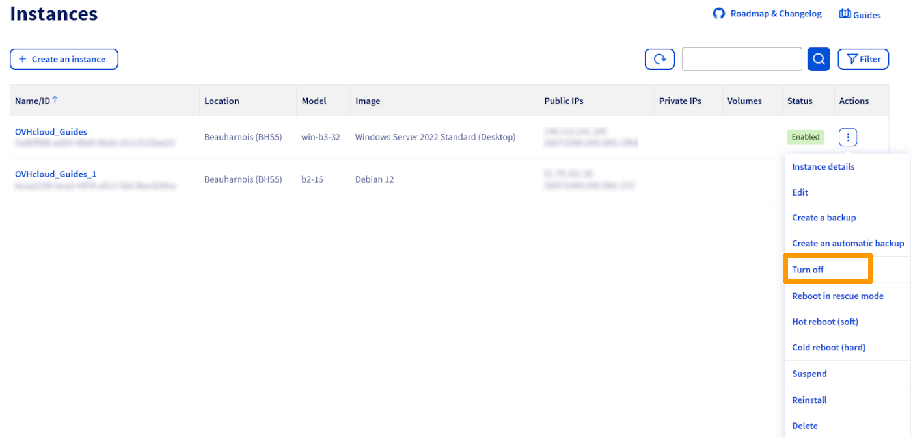
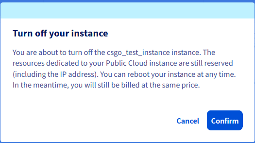

## Obiettivo

Durante la configurazione di un'infrastruttura ad alta disponibilità, potresti avere bisogno di interrompere l’esecuzione delle tue istanze per effettuare alcuni test. OpenStack ti permette di sospendere, arrestare o mettere in pausa le tue istanze. In ogni caso, il tuo IP viene mantenuto.

> [!warning]
> Il nome di queste opzioni nello Spazio Cliente OVHcloud è diverso dal nome in OpenStack/Horizon. Se effettui questa operazione utilizzando lo Spazio Cliente OVHcloud, assicurati di selezionare l'opzione più adatta.
>

**Questa guida ti mostra come sospendere, arrestare o mettere in pausa un'istanza.**

## Prerequisiti

- un'[istanza Public Cloud](/pages/public_cloud/compute/public-cloud-first-steps) con la fatturazione **oraria**
- Avere accesso allo [Spazio Cliente OVHcloud](/links/manager) o all'[interfaccia Horizon](/pages/public_cloud/public_cloud_cross_functional/introducing_horizon)
- Conoscenza dell'[API OpenStack](/pages/public_cloud/public_cloud_cross_functional/prepare_the_environment_for_using_the_openstack_api) e delle [variabili d’ambiente OpenStack](/pages/public_cloud/public_cloud_cross_functional/loading_openstack_environment_variables)

## Procedura

> [!alert]
>
> Questa guida si applica solo alle istanze con **fatturazione oraria**. Se le tue istanze hanno una **fatturazione mensile**, la fatturazione classica continuerà a essere applicata indipendentemente dallo stato del servizio.
>
> Queste manipolazioni comportano sempre la fatturazione dell'istanza finché non viene **eliminata**.
>

La tabella qui sotto ti permette di differenziare le opzioni disponibili sulle tue istanze. Prosegui nella lettura di questa guida cliccando sull'opzione che preferisci. Abbiamo messo tra parentesi la terminologia utilizzata nell'interfaccia di Horizon.


|Termine|Descrizione|Fatturazione|
|---|---|---|
|[Sospendere (*shelve*)](#shelve-instance)|Conserva il tuo IP e le risorse e i dati del disco creando uno Snapshot. Tutte le altre risorse vengono liberate.|Viene fatturato solo lo Snapshot.|
|[Spegnere (*suspend*)](#stop-suspend-instance)|Salvare lo stato della macchina virtuale sul disco, le risorse dedicate all'istanza sono sempre riservate.|Riceverai sempre la stessa tariffa per la tua istanza.|
|[Pausare](#pause-instance)|Salva lo stato della macchina virtuale nella RAM, un'istanza sospesa diventa «bloccata».|Riceverai sempre la stessa tariffa per la tua istanza.|

### Sommario

- [Sospendere (shelve) un'istanza](#shelve-instance)
    - [Nello Spazio Cliente OVHcloud](#control-panel)
    - [Dall'interfaccia Horizon](#horizon)
    - [Dalle API OpenStack/Nova](#openstack-nova)
- [Riattivare (unshelve) un'istanza](#unshelve-instance)
    - [Nello Spazio Cliente OVHcloud](#control-panel-unshelve)
    - [Dall'interfaccia Horizon](#horizon-unshelve)
    - [Dalle API OpenStack/Nova](#openstack-nova-unshelve)
- [Spegnere (suspend) un'istanza](#stop-suspend-instance)
    - [Nello Spazio Cliente OVHcloud](#stop-control-panel)
    - [Dall'interfaccia Horizon](#stop-horizon)
    - [Dalle API OpenStack/Nova](#stop-openstack-nova)
- [Mettere in pausa un'istanza](#pause-instance)
    - [Dall'interfaccia Horizon](#pause-horizon)
    - [Dalle API OpenStack/Nova](#pause-openstack-nova)


<a name="shelve-instance"></a>

### Sospendere (shelve) un'istanza

> [!alert]
> Si noti che la sospensione di un'istanza IOPS o T1/T2-180 comporta la perdita di dati sulle unità NVMe passthrough.
>
> La sospensione di questo tipo di istanza comporta la sua disattivazione dall'host e quindi dai dischi in passthrough.
>

Questa opzione permette di liberare le risorse dedicate all'istanza Public Cloud, ma l'indirizzo IP resta. I dati del disco locale saranno salvati in un snapshot «istantanea» creata automaticamente una volta che l'istanza è sospesa. I dati archiviati nella memoria e altrove non saranno conservati.

<a name="control-panel"></a>

#### Nello Spazio Cliente OVHcloud

Nello Spazio Cliente OVHcloud, vai alla sezione `Public Cloud`{.action}, seleziona il tuo progetto Public Cloud e clicca su `Istanze`{.action} nella barra di navigazione a sinistra. 

Clicca su `⋮`{.action} a destra dell'istanza da sospendere, poi clicca su `Sospendere`{.action}.

{.thumbnail}

Nella finestra contestuale, annota il messaggio e clicca su `Confermare`{.action}.

{.thumbnail}

Durante l'operazione viene visualizzato un messaggio:

{.thumbnail}

Una volta completata la procedura, l'istanza si presenta come *Sospesa*.

{.thumbnail}

Lo snapshot sarà quindi disponibile nella sezione `Instance Backup`{.action} del menu **Compute** a sinistra dello spazio Public Cloud. Sarà quindi visibile uno snapshot denominato *xxxxx-shelved*:

{.thumbnail}

<a name="horizon"></a>

#### Dall'interfaccia Horizon

Per utilizzare questo metodo, è necessario [connettersi all’interfaccia Horizon](https://horizon.cloud.ovh.net/auth/login/):

- Per accedere con l’autenticazione unica OVHcloud, clicca sul link `Horizon`{.action} nel menu di sinistra sotto "Management Interfaces" dopo aver aperto il progetto `Public Cloud`{.action} nello [Spazio Cliente OVHcloud](/links/manager).

- Per accedere con un utente OpenStack specifico: apri la pagina di accesso a [Horizon](https://horizon.cloud.ovh.net/auth/login/) e inserisci le [credenziali OpenStack](/pages/public_cloud/public_cloud_cross_functional/create_and_delete_a_user) precedentemente create, poi clicca su `Connect`{.action}.

Se hai installato istanze in diverse regioni, assicurati di essere nella localizzazione giusta. Puoi verificarlo nell'angolo superiore sinistro dell'interfaccia Horizon.

{.thumbnail}

Clicca su `Compute`{.action} nel menu a sinistra e seleziona `Instances`{.action}. Seleziona `Shelve Instance`{.action} nel menu a tendina dell'istanza.

{.thumbnail}

Una volta terminata la procedura, l'istanza apparirà come *Shelved Offloaded*.

{.thumbnail}

Per visualizzare lo snapshot, nel menu `Compute`{.action}, clicca su `Images`{.action}.

{.thumbnail}

<a name="openstack-nova"></a>

#### Dalle API OpenStack/Nova

Prima di continuare, si raccomanda di consultare le seguenti guide:

- [Preparare l’ambiente per utilizzare l’API OpenStack](/pages/public_cloud/public_cloud_cross_functional/prepare_the_environment_for_using_the_openstack_api)
- [Impostare le variabili d’ambiente OpenStack](/pages/public_cloud/public_cloud_cross_functional/loading_openstack_environment_variables)

Una volta che l'ambiente è pronto, esegui questo comando:

```bash
~$ openstack server shelve <UUID server>

=====================================

~$ nova shelve <UUID server> 
```

<a name="unshelve-instance"></a>

### Riattivare (unshelve) un'istanza

Questa opzione ti permette di riattivare l'istanza per poterla utilizzare. Ti ricordiamo che, una volta completata l'operazione, la fatturazione riprenderà normalmente.

> [!alert] **Azioni sullo snapshot**
>
> Qualsiasi azione sullo snapshot diversa dalla riattivazione (*unshelve*) può essere molto pericolosa per la tua infrastruttura in caso di uso improprio. Quando un'istanza è riattivata (*unshelved*), lo snapshot viene automaticamente eliminata. Non è consigliabile creare una nuova istanza da un snapshot creata in seguito alla Sospesa (*shelve*) di un'istanza.
>
> OVHcloud fornisce i servizi di cui sei responsabile. Non avendo accesso a queste macchine, non siamo noi gli amministratori e pertanto non possiamo fornirti alcuna assistenza. È responsabilità dell’utente garantire ogni giorno la gestione e la sicurezza del software. In caso di difficoltà o dubbi relativi ad amministrazione e sicurezza, ti consigliamo di contattare un [fornitore specializzato](/links/partner). Per maggiori informazioni consulta la sezione “Per saperne di più” di questa guida.
>

<a name="control-panel-unshelve"></a>

#### Nello Spazio Cliente OVHcloud

Nello Spazio Cliente OVHcloud, vai alla sezione `Public Cloud`{.action}, seleziona il tuo progetto Public Cloud e clicca su `Istanze`{.action} nella barra di navigazione a sinistra.

Clicca su `⋮`{.action} a destra dell'istanza e poi clicca su `Riattivare`{.action}.

{.thumbnail}

Nella finestra contestuale, annota il messaggio e clicca su `Confermare`{.action}.

Una volta terminato il processo, l'istanza apparirà come *Attivata*.

<a name="horizon-unshelve"></a>

#### Dall'interfaccia Horizon

Nell'interfaccia Horizon, clicca su `Compute`{.action} nel menu a sinistra e seleziona `Instances`{.action}. Seleziona `Unshelve Instance`{.action} nel menu a tendina dell'istanza.

{.thumbnail}

Una volta terminato il processo, l'istanza apparirà come *Active*.

<a name="openstack-nova-unshelve"></a>

#### Dalle API OpenStack/Nova

Una volta che l'ambiente è pronto, esegui questo comando:

```bash
~$ openstack server unshelve <UUID server>

=========================================

~$ nova unshelve <UUID server>
```

<a name="stop-suspend-instance"></a>

### Spegnere (suspend) un'istanza 

Questa opzione ti permette di spegnere la tua istanza e salvare lo stato della macchina virtuale sul disco. La memoria sarà anche scritta sul disco.

<a name="stop-control-panel"></a>

#### Nello Spazio Cliente OVHcloud

Nello Spazio Cliente OVHcloud, vai alla sezione `Public Cloud`{.action}, seleziona il tuo progetto Public Cloud e clicca su `Istanze`{.action} nella barra di navigazione a sinistra.

Clicca su `⋮`{.action} a destra dell'istanza da arrestare, poi clicca su `Spegnere`{.action}.

{.thumbnail}

Nella finestra contestuale, annota il messaggio e clicca su `Confermare`{.action}.

{.thumbnail}

Una volta completata la procedura, l'istanza apparirà come *Spento*.

Per **riattivare** l'istanza, effettua gli stessi step indicati in precedenza. Clicca su `⋮`{.action} a destra dell'istanza e seleziona `Comincia ora`{.action}. In alcuni casi, potrebbe essere necessario riavviare a freddo.

<a name="stop-horizon"></a>

#### Dall'interfaccia Horizon 

Nell'interfaccia Horizon, clicca su `Compute`{.action} nel menu a sinistra e seleziona `Instances`{.action}. Seleziona `Suspend Instance`{.action} nel menu a tendina dell'istanza.

{.thumbnail}

Compare il messaggio di conferma che l'istanza è stata sospesa.

Per **riattivare** l'istanza, effettua le stesse operazioni indicate in precedenza. Nella lista a tendina dell'istanza corrispondente, seleziona `Resume Instance`{.action}.

<a name="stop-openstack-nova"></a>

#### Dalle API OpenStack/Nova

Una volta che l'ambiente è pronto, esegui questo comando:

```bash
~$ openstack server suspend <UUID server>

=========================================

~$ nova suspend <UUID server>
```

Per **riattivare** l'istanza, esegui questo comando:

```bash
~$ openstack server unsuspend <UUID server>

=========================================

~$ nova unsuspend <UUID server>
```

<a name="pause-instance"></a>

### Mettere in pausa un'istanza 

Questa operazione è possibile **solo** nell'interfaccia Horizon o tramite l'API Openstack/Nova. Permette di mettere l'istanza in *standby*.

<a name="pause-horizon"></a>

#### Dall'interfaccia Horizon 

Nell'interfaccia Horizon, clicca su `Compute`{.action} nel menu a sinistra e seleziona `Instances`{.action}. Seleziona `Pause Instance`{.action} nel menu a tendina dell'istanza.

{.thumbnail}

Compare il messaggio di conferma che l'istanza è stata messa in pausa.

Per **riattivare** l'istanza, segui gli step indicati qui sotto. Nella lista a tendina dell'istanza corrispondente, seleziona `Resume Instance`{.action}.

<a name="pause-openstack-nova"></a>

#### Dalle API OpenStack/Nova

Una volta che l'ambiente è pronto, esegui questo comando:

```bash
~$ openstack server pause <UUID server>

=========================================

~$ nova pause <UUID server>
```

Per **riattivare** l'istanza, esegui questo comando:

```bash
~$ openstack server unpause <UUID server>

=========================================

~$ nova unpause <UUID server>
```

## Per saperne di più

[Documentazione OpenStack](https://docs.openstack.org/mitaka/user-guide/cli_stop_and_start_an_instance.html).

Contatta la nostra [Community di utenti](/links/community).