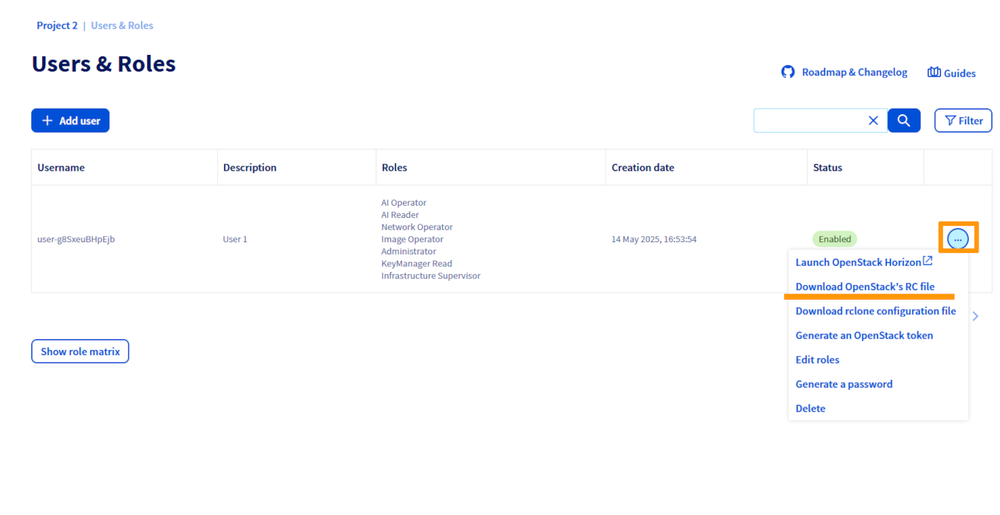

## Ziel

OVHcloud oferuje klientom Public Cloud obrazy gotowe do użycia, a także możliwość korzystania z własnych obrazów.

**Dowiedz się, jak importować własne obrazy do projektu Public Cloud.**

## Wymagania początkowe

- instancja [Public Cloud](/pages/public_cloud/compute/public-cloud-first-steps) w Panelu klienta OVHcloud
- własny obraz RAW/QCOW2 (zalecane formaty)
- użytkownik [OpenStack](/pages/public_cloud/public_cloud_cross_functional/create_and_delete_a_user)
- środowisko [kompatybilne z CLI OpenStack](/pages/public_cloud/public_cloud_cross_functional/prepare_the_environment_for_using_the_openstack_api) (jeśli używasz CLI)

## W praktyce

### Zanim zaczniesz

Zalecamy użycie kompatybilnych obrazów cloud dostarczonych przez dystrybutora lub utworzenie własnego obrazu za pomocą rozwiązań, takich jak [Packer OpenStack builder](/pages/public_cloud/compute/create_image_from_existing_image_with_packer).

Obrazy kompatybilne z chmurą są dostępne tutaj:

- <https://cloud.centos.org/centos/>{.external}
- <https://cloud.debian.org/images/cloud/>{.external}
- <https://cloud-images.ubuntu.com/releases/>{.external}
- <https://alt.fedoraproject.org/cloud/>{.external}

Inne systemy operacyjne oferują również obrazy ISO, które mają zastosowanie podczas [tworzenia obrazów za pomocą pakietu](https://www.packer.io/docs/builders), takich jak QEMU i VirtualBox.

Upewnij się, że następujące elementy są zainstalowane na Twoich obrazach, aby można je było zintegrować ze środowiskiem cloud:

- *QEMU Guest Agent* : Ta operacja pozwala na korzystanie z lepszego środowiska tworzenia kopii zapasowych, ponieważ umożliwia hostowi komunikację z instancją w przypadku kopii zapasowych na żywo. Nie wszystkie systemy operacyjne są zgodne z tym pakietem.
- *cloud-init* : pozwoli Ci to na uruchomienie instancji podczas pierwszego uruchomienia, z dodaniem kluczy SSH i konfiguracją sieci. Większość systemów operacyjnych jest kompatybilna z tą funkcjonalnością.

Zalecamy korzystanie z obrazów w formacie RAW lub QCOW2. Zoptymalizuj rozmiar obrazu, aby był jak najmniejszy, aby zminimalizować miesięczne koszty fakturowania i skrócić czas generowania instancji.

### Importuj obraz

W OpenStack istnieją dwie metody importu własnego obrazu. Możesz to zrobić za pomocą interfejsu wiersza poleceń OpenStack lub [interfejsu Horizon](https://horizon.cloud.ovh.net/auth/login/).

### Z linii poleceń OpenStack

Kiedy Twój obraz jest gotowy, wykonaj poniższe kroki, aby rozpocząć import za pomocą CLI OpenStack:

1\. Pobierz plik openrc.sh dla użytkownika OpenStack z Panelu klienta OVHcloud (wybierz region, w którym chcesz go pobrać).

{.thumbnail}

2\. Załaduj plik openrc:

```sh
source openrc.sh
```

3\. Po załadowaniu pliku zostaniesz poproszony o wprowadzenie hasła użytkownika OpenStack.

4\. Teraz możesz zaimportować obraz. Poniższy przykład polecenia wykonuje następujące czynności:

- Format dysku to "RAW"
- Pobierz obraz z aktualnej ścieżki o nazwie "debian9.raw"
- Nazwij obrazek "Debian 9 - Mój obraz"
- Ustawia obraz na prywatny
- Ustawia zalecane właściwości. Optymalna konfiguracja pozwala na korzystanie z funkcji takich jak *live-snapshot* i *cloud-init* (wymaga użycia nazwy użytkownika)

```sh
openstack image create --disk-format raw --container-format bare --file debian9.raw "Debian 9 - My Image" --private --property distribution=debian --property hw_disk_bus=scsi --property hw_scsi_model=virtio-scsi --property hw_qemu_guest_agent=yes --property image_original_user=debian
```

### Z poziomu interfejsu Horizon

Kiedy Twój obraz jest gotowy do importu, wykonaj poniższe kroki, aby zaimportować go z interfejsu OpenStack Horizon:

1\. Zaloguj się do [interfejsu Horizon](https://horizon.cloud.ovh.net/auth/login/).

2\. W lewym górnym rogu wybierz region, do którego chcesz przesłać obraz.

{.thumbnail}

3\. Przejdź do sekcji `Images` i kliknij `Create Image`{.action}.

{.thumbnail}

4\. Wprowadź szczegóły obrazu i wybierz plik z komputera.

{.thumbnail}

5\. Wprowadź metadane instancji (możesz również wprowadzić wybrane metadane niestandardowe), następnie kliknij `Create Image`{.action}.

{.thumbnail}

## Sprawdź również <a name="go-further"></a>

Dołącz do [grona naszych użytkowników](/links/community).
