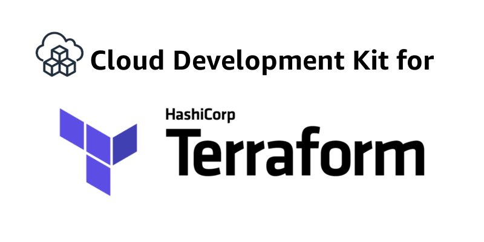
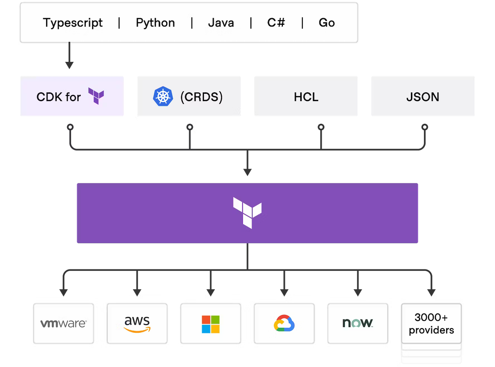
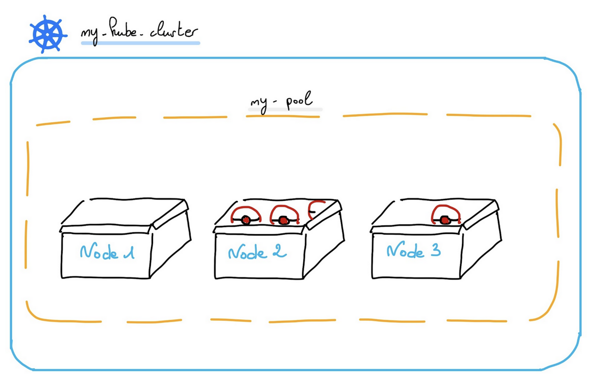
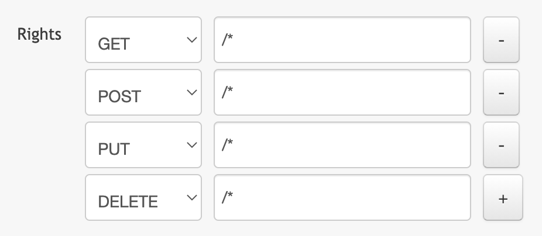
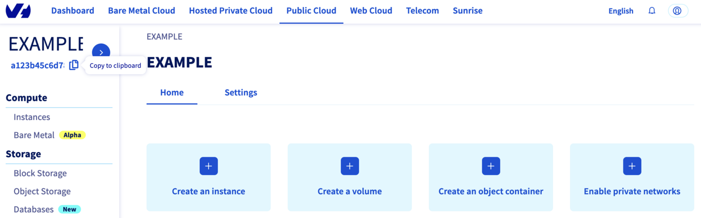
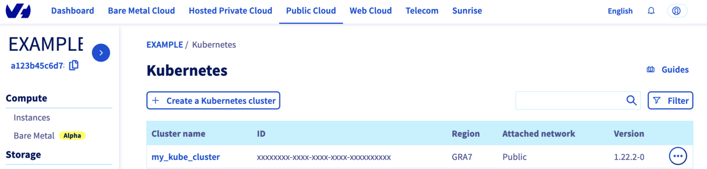
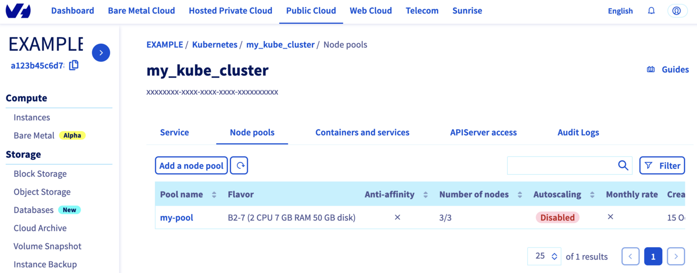

<style>
details>summary {
    color:rgb(33, 153, 232) !important;
    cursor: pointer;
}
details>summary::before {
    content:'\25B6';
    padding-right:1ch;
}
details[open]>summary::before {
    content:'\25BC';
}
</style>

## Objective

The OVHcloud Managed Kubernetes service lets you deploy production-ready clusters without the operational overhead of setting them up or maintaining them. You can create a cluster directly through the OVHcloud Control Panel, or automate the process using Infrastructure as Code (IaC) tools.

OVHcloud offers a native Terraform provider, and for developers who prefer working in their own programming languages, tools like Pulumi provide even more flexibility. This guide walks you through the different ways to create a Kubernetes cluster, so you can choose the one that best fits your workflow.

/// details | OVHcloud Control Panel

<iframe class="video" width="560" height="315" src="https://www.youtube-nocookie.com/embed/ApfujBFT82g" title="YouTube video player" frameborder="0" allow="accelerometer; autoplay; clipboard-write; encrypted-media; gyroscope; picture-in-picture" allowfullscreen></iframe>

///

/// details | Terraform

[Terraform](https://www.terraform.io/) is an open-source infrastructure as code (IaC) tool created by [Hashicorp](https://www.hashicorp.com/) in 2014, written in Go. It aims to build, change and version control your infrastructure. You can define and provision your infrastructure by writing the definition of your resources in Hashicorp Configuration Language (HCL).

This tool has a powerful and very intuitive command line interface (CLI).  
If you are interested in leveraging your knowledge about Terraform CLI, a [Cheat Sheet](https://github.com/scraly/terraform-cheat-sheet/blob/master/terraform-cheat-sheet.pdf){.external} exists.

///

/// details | CDK for Terraform

{.thumbnail}

[Cloud Development Kit for Terraform](https://developer.hashicorp.com/terraform/cdktf), also called CDKTF, converts the definitions you write in your preferred programming language to Terraform configuration files. It uses Terraform to provision and manage your infrastructure when you deploy your application.

It supports several programming languages: Go, Python, Java, TypeScript and C#. There is no need to define your infrastructures in HCL (Hashicorp Configuration Language) and it supports all existing Terraform providers and modules.

{.thumbnail}

Read the [official documentation of CDK for Terraform](https://developer.hashicorp.com/terraform/cdktf) if you need further information. 

///

/// details | Pulumi

{.thumbnail}

[Pulumi](https://www.pulumi.com/) is an Infrastructure as code (IasC) tool that allows you to build your infrastructures with a programming language, in Golang for example.  
Users define the desired state in Pulumi programs and Pulumi create the desired resources.

Pulumi offers an intuitive command line interface (CLI), to provision, update or delete your infrastructure. If you are familiar with Docker Compose CLI and Terraform CLI, you will adopt [Pulumi CLI](https://www.pulumi.com/docs/cli/) too.

///

## Requirements

> [!primary]
>
> The specific prerequisites for each tool will be annotated in it directly.
>

- A [Public Cloud project](/pages/public_cloud/public_cloud_cross_functional/create_a_public_cloud_project) in your OVHcloud account

> [!success]
> Take advantage of reduced prices by committing to a period of 1 to 36 months on your Public Cloud resources. More information on our [Savings Plans](/links/public-cloud/savings-plan) page.

## Instructions

/// details | Via OVHcloud Control Panel

Log in to the [OVHcloud Control Panel](/links/manager), go to the `Public Cloud`{.action} section and select the Public Cloud project concerned.

Access the administration UI for your OVHcloud Managed Kubernetes clusters by clicking on `Managed Kubernetes Service`{.action} in the left-hand menu and click on `Create a cluster`{.action}.

{.thumbnail}

Select a location for your new cluster.

{.thumbnail}

Choose the minor version of Kubernetes.

{.thumbnail}

> [!primary]
> We recommend to always use the last stable version.  
> Please read our [End of life / end of support](/pages/public_cloud/containers_orchestration/managed_kubernetes/eos-eol-policies) page to understand our version policy.
>

You can now choose to integrate your Kubernetes cluster into a private network using OVHcloud vRack. For more information about this option, please read our guide [Using the vRack](/pages/public_cloud/containers_orchestration/managed_kubernetes/using-vrack).

{.thumbnail}

Now you can configure the default node pool. A node pool is a group of nodes sharing the same configuration, allowing you a lot of flexibility in your cluster management. 

> [!primary]
>
> You can read the [Managing node pools](/pages/public_cloud/containers_orchestration/managed_kubernetes/managing-nodes) guide for more information on node pools.
>

{.thumbnail}

In the next step, define the size of the default node pool.

{.thumbnail}

Alternatively, you can enable the `Autoscaling`{.action} feature for the cluster. Define the minimum and maximum pool size in that case.

{.thumbnail}

In the next step, choose the appropriate billing mode (monthly or hourly). You can also enable the anti-affinity mode here. 

{.thumbnail}

> [!primary]
>
> By enabling anti-affinity, current and future nodes will be launched on different hypervisors (physical servers), guaranteeing higher fault tolerance. Anti-affinity node pools can only include up to 5 nodes.
>
> Moreover, if you choose the monthly billing method, you cannot change later from monthly to hourly. A change is only possible the other way around.
> 

Enter a name for your cluster.

{.thumbnail}

Finally, click the `Send`{.action} button.

The cluster creation is now in progress. It should be available within a few minutes in your OVHcloud Control Panel.

> [!warning]
>
> After a cluster is created, you can no longer change:
>
> -  The region.
> -  The private network ID.
> 

///

/// details | Via Terraform

> [!primary]
>
> Before starting, you should have installed Terraform CLI, version 0.12.x minimum, on your machine. You can install it by following [detailed installation instructions](https://www.terraform.io/docs/cli/index.html){.external} or with the tool [tfenv](https://github.com/tfutils/tfenv){.external}.
>

### OVHcloud Terraform provider

{.thumbnail}

In order to create a Kubernetes cluster and other resources, OVHcloud provides a [Terraform provider](https://registry.terraform.io/providers/ovh/ovh/latest){.external} which is available in the official Terraform registry.

All available resources and data sources have their definition and documentation.

In this guide, we will create two resources:

- A [cloud_project_kube](https://registry.terraform.io/providers/ovh/ovh/latest/docs/resources/cloud_project_kube){.external}, that represents an OVHcloud managed Kubernetes cluster
- A [cloud_project_kube_nodepool](https://registry.terraform.io/providers/ovh/ovh/latest/docs/resources/cloud_project_kube_nodepool){.external}, that represents a Kubernetes Node Pool

{.thumbnail}

### Getting your cluster/API tokens information

The "OVH provider" needs to be configured with a set of credentials:

- `application_key`
- `application_secret`
- `consumer_key`

Why?

Because, behind the scenes, the "OVH Terraform provider" is doing requests to OVHcloud APIs. 

In order to retrieve this necessary information, please follow [First steps with the OVHcloud APIs](/pages/manage_and_operate/api/first-steps) tutorial.

Concretely, you have to generate these credentials via the [OVH token generation page](https://api.ovh.com/createToken/?GET=/*&POST=/*&PUT=/*&DELETE=/*) with the following rights:

{.thumbnail}

When you have successfully generated your OVH tokens, please keep them. You'll have to define them in the coming minutes ;-).

The last needed information is the `service_name`: it is the ID of your Public Cloud project.

How to get it?

In the Public Cloud section, you can retrieve your service name ID thanks to the `Copy to clipboard`{.action} button.

{.thumbnail}

You will also use this information in Terraform resources definition files.

### Create a cluster 

When you want to manage (create, modify, and remove) your infrastructure, getting started with Terraform is easy.
Just create files ending with `.tf` containing the description of the resources you want to have.

In our case, we want to create:

- An OVHcloud managed Kubernetes cluster.
- A nodepool.

So, let's start!

#### Resources definition

First, create a `provider.tf` file with the minimum version, european endpoint ("ovh-eu") and keys you previously got in this guide.

Terraform 0.13 and later:

```bash
terraform {
  required_providers {
    ovh = {
      source  = "ovh/ovh"
    }
  }
}

provider "ovh" {
  endpoint           = "ovh-eu"
  application_key    = "<your_access_key>"
  application_secret = "<your_application_secret>"
  consumer_key       = "<your_consumer_key>"
}
```

Terraform 0.12 and earlier:

```bash
# Configure the OVHcloud Provider
provider "ovh" {
  endpoint           = "ovh-eu"
  application_key    = "<your_access_key>"
  application_secret = "<your_application_secret>"
  consumer_key       = "<your_consumer_key>"
}
```

Alternatively the secret keys can be retrieved from your environment.

- `OVH_ENDPOINT`
- `OVH_APPLICATION_KEY`
- `OVH_APPLICATION_SECRET`
- `OVH_CONSUMER_KEY`

This later method (or a similar alternative) is recommended to avoid storing secret data in a source repository.

Here, we defined the `ovh-eu` endpoint because we want to call the OVHcloud Europe API, but other endpoints exist, depending on your needs:

- `ovh-eu` for OVHcloud Europe API
- `ovh-us` for OVHcloud US API
- `ovh-ca` for OVHcloud North-America API

Then, create a `variables.tf` with service_name:

```bash
variable service_name {
  type        = string
  default     = "<your_service_name>"
}
```

Define the resources you want to create in a new file called `ovh_kube_cluster.tf`:

```bash
resource "ovh_cloud_project_kube" "my_kube_cluster" {
   service_name = "${var.service_name}"
   name         = "my_kube_cluster"
   region       = "GRA7"
   version      = "1.22"
}

resource "ovh_cloud_project_kube_nodepool" "node_pool" {
   service_name  = "${var.service_name}"
   kube_id       = ovh_cloud_project_kube.my_kube_cluster.id
   name          = "my-pool" //Warning: "_" char is not allowed!
   flavor_name   = "b2-7"
   desired_nodes = 3
   max_nodes     = 3
   min_nodes     = 3
}
```

In this resources configuration, we ask Terraform to create a Kubernetes cluster, in the GRA7 region, using the Kubernetes version 1.22 (the last and recommended version at the time we wrote this tutorial).

And we tell Terraform to create a Node Pool with 3 Nodes with B2-7 machine type.

> [!warning]
>
> You can't use "_" or "." as a separator in a node pool name or a flavor name.
> You would obtain a "gzip: invalid header" during node pool creation.

Finally, create a `output.tf` file with the following content:

```bash
output "kubeconfig" {
  value = ovh_cloud_project_kube.my_kube_cluster.kubeconfig
  sensitive = true
}
```

With this output, we tell Terraform to retrieve the `kubeconfig file` content. This information is needed to connect to the new Kubernetes cluster.

For your information, outputs are useful to retrieve and display specific information after the resources creation.

Your code organisation should be like this: 

```bash
.
├── output.tf
├── ovh_kube_cluster.tf
├── provider.tf
└── variables.tf
```

#### Create our cluster through Terraform

Now we need to initialise Terraform, generate a plan, and apply it.

```bash
$ terraform init

Initializing the backend...

Initializing provider plugins...
- Finding latest version of ovh/ovh...
- Installing ovh/ovh v0.17.1...
- Installed ovh/ovh v0.17.1 (signed by a HashiCorp partner, key ID F56D1A6CBDAAADA5)

Partner and community providers are signed by their developers.
If you'd like to know more about provider signing, you can read about it here:
https://www.terraform.io/docs/cli/plugins/signing.html

Terraform has created a lock file .terraform.lock.hcl to record the provider
selections it made above. Include this file in your version control repository
so that Terraform can guarantee to make the same selections by default when
you run "terraform init" in the future.

Terraform has been successfully initialized!

You may now begin working with Terraform. Try running "terraform plan" to see
any changes that are required for your infrastructure. All Terraform commands
should now work.

If you ever set or change modules or backend configuration for Terraform,
rerun this command to reinitialize your working directory. If you forget, other
commands will detect it and remind you to do so if necessary.
```

The `init` command will initialize your working directory which contains `.tf` configuration files.

It’s the first command to execute for a new configuration, or after doing a checkout of an existing configuration in a given git repository for example.

The `init` command will:

- Download and install Terraform providers/plugins.
- Initialise backend (if defined).
- Download and install modules (if defined).

Now, we can generate our plan:

```bash
$ terraform plan

Terraform used the selected providers to generate the following execution plan. Resource actions are indicated with the following symbols:
  + create

Terraform will perform the following actions:

  # ovh_cloud_project_kube.my_kube_cluster will be created
  + resource "ovh_cloud_project_kube" "my_kube_cluster" {
      + control_plane_is_up_to_date = (known after apply)
      + id                          = (known after apply)
      + is_up_to_date               = (known after apply)
      + kubeconfig                  = (sensitive value)
      + name                        = "my_kube_cluster"
      + next_upgrade_versions       = (known after apply)
      + nodes_url                   = (known after apply)
      + region                      = "GRA7"
      + service_name                = "<YOUR_SERVICE_NAME>"
      + status                      = (known after apply)
      + update_policy               = (known after apply)
      + url                         = (known after apply)
      + version                     = "1.22"
    }

  # ovh_cloud_project_kube_nodepool.node_pool will be created
  + resource "ovh_cloud_project_kube_nodepool" "node_pool" {
      + anti_affinity    = false
      + autoscale        = false
      + available_nodes  = (known after apply)
      + created_at       = (known after apply)
      + current_nodes    = (known after apply)
      + desired_nodes    = 3
      + flavor           = (known after apply)
      + flavor_name      = "b2-7"
      + id               = (known after apply)
      + kube_id          = (known after apply)
      + max_nodes        = 3
      + min_nodes        = 3
      + monthly_billed   = false
      + name             = "my-pool"
      + project_id       = (known after apply)
      + service_name     = "<YOUR_SERVICE_NAME>"
      + size_status      = (known after apply)
      + status           = (known after apply)
      + up_to_date_nodes = (known after apply)
      + updated_at       = (known after apply)
    }

Plan: 2 to add, 0 to change, 0 to destroy.

Changes to Outputs:
  + kubeconfig = (sensitive value)

───────────────────────────────────────────────────────────────────────────────────────────────────────────────────────────────────────────────────────────────────────────────────────────────────────────

Note: You didn't use the -out option to save this plan, so Terraform can't guarantee to take exactly these actions if you run "terraform apply" now.
```

Thanks to the `plan` command, we can check what Terraform wants to create, modify or remove.

The plan is OK for us, so let's apply it:

```bash
$ terraform apply

An execution plan has been generated and is shown below.
Resource actions are indicated with the following symbols:
  + create

Terraform will perform the following actions:

  # ovh_cloud_project_kube.my_kube_cluster will be created
  + resource "ovh_cloud_project_kube" "my_kube_cluster" {
      + control_plane_is_up_to_date = (known after apply)
      + id                          = (known after apply)
      + is_up_to_date               = (known after apply)
      + kubeconfig                  = (sensitive value)
      + name                        = "my_kube_cluster"
      + next_upgrade_versions       = (known after apply)
      + nodes_url                   = (known after apply)
      + region                      = "GRA7"
      + service_name                = "<YOUR_SERVICE_NAME>"
      + status                      = (known after apply)
      + update_policy               = (known after apply)
      + url                         = (known after apply)
      + version                     = "1.22"
    }

  # ovh_cloud_project_kube_nodepool.node_pool will be created
  + resource "ovh_cloud_project_kube_nodepool" "node_pool" {
      + anti_affinity  = false
      + desired_nodes  = 3
      + flavor_name    = "b2-7"
      + id             = (known after apply)
      + kube_id        = (known after apply)
      + max_nodes      = 3
      + min_nodes      = 3
      + monthly_billed = false
      + name           = "my-pool"
      + service_name   = "<YOUR_SERVICE_NAME>"
      + status         = (known after apply)
    }

Plan: 2 to add, 0 to change, 0 to destroy.

Do you want to perform these actions?
  Terraform will perform the actions described above.
  Only 'yes' will be accepted to approve.

  Enter a value: yes

ovh_cloud_project_kube.my_kube_cluster: Creating...
ovh_cloud_project_kube.my_kube_cluster: Still creating... [10s elapsed]
ovh_cloud_project_kube.my_kube_cluster: Still creating... [20s elapsed]
ovh_cloud_project_kube.my_kube_cluster: Still creating... [30s elapsed]
ovh_cloud_project_kube.my_kube_cluster: Still creating... [40s elapsed]
ovh_cloud_project_kube.my_kube_cluster: Still creating... [50s elapsed]
ovh_cloud_project_kube.my_kube_cluster: Still creating... [1m0s elapsed]
ovh_cloud_project_kube.my_kube_cluster: Still creating... [1m10s elapsed]
ovh_cloud_project_kube.my_kube_cluster: Still creating... [1m20s elapsed]
ovh_cloud_project_kube.my_kube_cluster: Still creating... [1m30s elapsed]
ovh_cloud_project_kube.my_kube_cluster: Still creating... [1m40s elapsed]
ovh_cloud_project_kube.my_kube_cluster: Still creating... [1m50s elapsed]
ovh_cloud_project_kube.my_kube_cluster: Still creating... [2m0s elapsed]
ovh_cloud_project_kube.my_kube_cluster: Still creating... [2m10s elapsed]
ovh_cloud_project_kube.my_kube_cluster: Still creating... [2m20s elapsed]
ovh_cloud_project_kube.my_kube_cluster: Still creating... [2m30s elapsed]
ovh_cloud_project_kube.my_kube_cluster: Creation complete after 2m32s [id=7628f0e1-a082-4ec5-98df-2aba283ca3f3]
ovh_cloud_project_kube_nodepool.node_pool: Creating...
ovh_cloud_project_kube_nodepool.node_pool: Still creating... [10s elapsed]
ovh_cloud_project_kube_nodepool.node_pool: Still creating... [20s elapsed]
ovh_cloud_project_kube_nodepool.node_pool: Still creating... [30s elapsed]
ovh_cloud_project_kube_nodepool.node_pool: Still creating... [40s elapsed]
ovh_cloud_project_kube_nodepool.node_pool: Still creating... [50s elapsed]
ovh_cloud_project_kube_nodepool.node_pool: Still creating... [1m0s elapsed]
ovh_cloud_project_kube_nodepool.node_pool: Still creating... [1m10s elapsed]
ovh_cloud_project_kube_nodepool.node_pool: Still creating... [1m20s elapsed]
ovh_cloud_project_kube_nodepool.node_pool: Still creating... [1m30s elapsed]
ovh_cloud_project_kube_nodepool.node_pool: Still creating... [1m40s elapsed]
ovh_cloud_project_kube_nodepool.node_pool: Still creating... [1m50s elapsed]
ovh_cloud_project_kube_nodepool.node_pool: Still creating... [2m0s elapsed]
ovh_cloud_project_kube_nodepool.node_pool: Still creating... [2m10s elapsed]
ovh_cloud_project_kube_nodepool.node_pool: Still creating... [2m20s elapsed]
ovh_cloud_project_kube_nodepool.node_pool: Still creating... [2m30s elapsed]
ovh_cloud_project_kube_nodepool.node_pool: Still creating... [2m40s elapsed]
ovh_cloud_project_kube_nodepool.node_pool: Still creating... [2m50s elapsed]
ovh_cloud_project_kube_nodepool.node_pool: Still creating... [3m0s elapsed]
ovh_cloud_project_kube_nodepool.node_pool: Still creating... [3m10s elapsed]
ovh_cloud_project_kube_nodepool.node_pool: Still creating... [3m20s elapsed]
ovh_cloud_project_kube_nodepool.node_pool: Still creating... [3m30s elapsed]
ovh_cloud_project_kube_nodepool.node_pool: Still creating... [3m40s elapsed]
ovh_cloud_project_kube_nodepool.node_pool: Still creating... [3m50s elapsed]
ovh_cloud_project_kube_nodepool.node_pool: Still creating... [4m0s elapsed]
ovh_cloud_project_kube_nodepool.node_pool: Creation complete after 4m5s [id=ebfa7726-d50c-4fbc-8b24-e722a1ff28f5]

Apply complete! Resources: 2 added, 0 changed, 0 destroyed.

Outputs:

kubeconfig = <sensitive>
```

Now, log in to the [OVHcloud Control Panel](/links/manager), go to the `Public Cloud`{.action} section and click on `Managed Kubernetes Service`.  
As you can see, your cluster has been successfuly created:

{.thumbnail}

Now, click on `my_kube_cluster`, then on the `Node pools` tab:

{.thumbnail}

Our node pool is created too.

Perfect!

///

/// details | Via CDK for Terraform

> [!primary]
>
> You need to have:
>
> - [Kubernetes CLI](https://kubernetes.io/docs/tasks/tools/){.external} installed.
> - [Cloud Development Kit for Terraform CLI](https://developer.hashicorp.com/terraform/tutorials/cdktf/cdktf-install){.external} installed.
> - [Go](https://go.dev/doc/install) installed.
> 

### OVHcloud Terraform provider

In order to create a Kubernetes cluster and other resources, OVHcloud provides a [Terraform provider](https://registry.terraform.io/providers/ovh/ovh/latest){.external} which is available in the official Terraform registry.

All available resources and data sources have their own definition and documentation.

CDKTF will "translate" your code into an HCL configuration file and then call `terraform` and use the existing OVHcloud Terraform provider.

We will create two resources:

- A [cloud_project_kube](https://registry.terraform.io/providers/ovh/ovh/latest/docs/resources/cloud_project_kube){.external}, that represents an OVHcloud managed Kubernetes cluster
- A [cloud_project_kube_nodepool](https://registry.terraform.io/providers/ovh/ovh/latest/docs/resources/cloud_project_kube_nodepool){.external}, that represents a Kubernetes Node Pool

{.thumbnail}

### Getting your cluster/API tokens information

The "OVH provider" needs to be configured with a set of credentials:

- `endpoint`
- `application_key`
- `application_secret`
- `consumer_key`
- `service_name`

This is because, behind the scenes, the "OVH Terraform provider" is doing requests to OVHcloud APIs.

To retrieve the necessary information, please follow the tutorial [First steps with the OVHcloud APIs](/pages/manage_and_operate/api/first-steps).

Concretely, you have to generate these credentials via the [OVH token generation page](https://api.ovh.com/createToken/?GET=/*&POST=/*&PUT=/*&DELETE=/*) with the following rights:

{.thumbnail}

Once you have successfully generated your OVH tokens, keep them. You will need to define them later.

The last piece of information you need is the `service_name`: this is the ID of your Public Cloud project.

How do you get it?

In the Public Cloud section, you can retrieve your Public Cloud project ID thanks to the `Copy to clipboard`{.action} button.

{.thumbnail}

Summary of the needed environment variables:

| Provider Argument | Environment Variables    | Description                                                                                                           | Mandatory |
| ----------------- | ------------------------ | --------------------------------------------------------------------------------------------------------------------- | --------- |
| `endpoint`      | `OVH_ENDPOINT`         | OVHcloud Endpoint. Possible value are: `ovh-eu`, `ovh-ca`, `ovh-us`, `soyoustart-eu`, `soyoustart-ca`, `kimsufi-ca`, `kimsufi-eu`, `runabove-ca`                                       | ✅        |
| `application_key`      | `OVH_APPLICATION_KEY`         | OVHcloud Access Key                                       | ✅        |
| `application_secret`      | `OVH_APPLICATION_SECRET`         | OVHcloud Secret Key                               | ✅        |
| `consumer_key`      | `OVH_CONSUMER_KEY` | OVHcloud Consumer Key | ✅        |
| `service_name`      | `OVH_CLOUD_PROJECT_SERVICE` | OVHcloud Public Cloud project ID| ✅        |

These keys can be generated via the [OVHcloud token generation page](https://api.ovh.com/createToken/?GET=/*&POST=/*&PUT=/*&DELETE=/*).

Example:

```bash
# OVHcloud provider needed keys
export OVH_ENDPOINT="ovh-eu"
export OVH_APPLICATION_KEY="xxx"
export OVH_APPLICATION_SECRET="xxx"
export OVH_CONSUMER_KEY="xxx"
export OVH_CLOUD_PROJECT_SERVICE="xxx"
```

### Deploying an OVHcloud Managed Kubernetes cluster and a node pool in Go / Golang

In this guide, we want to create, in Go:

- An OVHcloud managed Kubernetes cluster.
- A node pool.

#### Project initialization

Create a folder and access it:

```bash
$ mkdir ovhcloud-kube
$ cd ovhcloud-kube
```

Initialize your project with cdktf CLI:

```bash
$ cdktf init --template=go --providers="ovh/ovh@~>0.37.0" "hashicorp/local" --providers-force-local --local --project-name=ovhcloud-kube --project-description="Go app that deploy an OVHcloud Managed Kubernetes cluster and a node pool" --enable-crash-reporting

Note: By providing the '--local' option, you have chosen local storage mode to store your stack state.
This means that your Terraform state file will be stored locally on disk in a file 'terraform.<STACK NAME>.tfstate' at the root of your project.
go: upgraded github.com/aws/jsii-runtime-go v1.67.0 => v1.94.0
========================================================================================================

  Your cdktf go project is ready!

  cat help                Prints this message

  Compile:
    go build              Builds your go project

  Synthesize:
    cdktf synth [stack]   Synthesize Terraform resources to cdktf.out/

  Diff:
    cdktf diff [stack]    Perform a diff (terraform plan) for the given stack

  Deploy:
    cdktf deploy [stack]  Deploy the given stack

  Destroy:
    cdktf destroy [stack] Destroy the given stack

  Learn more about using modules and providers https://cdk.tf/modules-and-providers

Use Providers:

  Use the add command to add providers:
  
  cdktf provider add "aws@~>3.0" null kreuzwerker/docker

  Learn more: https://cdk.tf/modules-and-providers

========================================================================================================
[2024-03-14T10:46:23.030] [INFO] default - Adding local provider registry.terraform.io/ovh/ovh with version constraint ~>0.37.0 to cdktf.json
[2024-03-14T10:46:23.032] [INFO] default - Adding local provider registry.terraform.io/hashicorp/local with version constraint undefined to cdktf.json
Local providers have been updated. Running cdktf get to update...
Generated go constructs in the output directory: generated

The generated code depends on jsii-runtime-go. If you haven't yet installed it, you can run go mod tidy to automatically install it.
Run 'go mod tidy' after adding imports for any needed modules such as prebuilt providers
```

The command initializes the application in the programming language you have specified (Go in our case) with the list of existing Terraform providers you have defined (OVHcloud and Hashicorp local) and stores the Terraform State locally (thanks to the `--local` flag).

The code organization of your project is created:

```bash
-rw-r--r-- 1 gitpod gitpod  265 Mar 14 10:15 cdktf.json
-rwxr-xr-x 3 gitpod gitpod   62 Mar 14 10:16 generated/
-rw-r--r-- 1 gitpod gitpod  354 Mar 14 10:15 .gitignore
-rw-r--r-- 1 gitpod gitpod  265 Mar 14 10:15 go.mod
-rw-r--r-- 1 gitpod gitpod 1238 Mar 14 10:15 go.sum
-rw-r--r-- 1 gitpod gitpod  902 Mar 14 10:15 help
-rw-r--r-- 1 gitpod gitpod  401 Mar 14 10:15 main.go
-rw-r--r-- 1 gitpod gitpod  974 Mar 14 10:15 main_test.go
```

Let's explain the different generated files:

- `cdktf.json` contains configuration settings for your application
- `generated` folder contains the OVHcloud Terraform provider translated in Go
- `.gitignore` contains the gitignore file
- `go.mod` and `go.sum` files contain the dependencies of your Go application
- `help` contains useful cdktf commands to execute
- `main.go` is the Go program
- `main_test.go` is for declaring unit test for your Go program

#### Resources definition

Edit the `main.go` file and replace the existing content with the following content:

```go
package main

import (
    "os"
    "path"

    "cdk.tf/go/stack/generated/hashicorp/local/file"
    local "cdk.tf/go/stack/generated/hashicorp/local/provider"
    "cdk.tf/go/stack/generated/ovh/ovh/cloudprojectkube"
    "cdk.tf/go/stack/generated/ovh/ovh/cloudprojectkubenodepool"

    ovh "cdk.tf/go/stack/generated/ovh/ovh/provider"
    "github.com/aws/constructs-go/constructs/v10"
    "github.com/aws/jsii-runtime-go"
    "github.com/hashicorp/terraform-cdk-go/cdktf"
)

func NewMyStack(scope constructs.Construct, id string) cdktf.TerraformStack {
    stack := cdktf.NewTerraformStack(scope, &id)

    // Initialize the OVH provider
    ovh.NewOvhProvider(stack, jsii.String("ovh"), &ovh.OvhProviderConfig{
        Endpoint: jsii.String("ovh-eu"), //required
    })

    // Initialize the Local provider
    local.NewLocalProvider(stack, jsii.String("local"), &local.LocalProviderConfig{})

    // Get serviceName from the env var OVH_CLOUD_PROJECT_SERVICE
    serviceName := os.Getenv("OVH_CLOUD_PROJECT_SERVICE")

    // Deploy a new Kubernetes cluster
    kube := cloudprojectkube.NewCloudProjectKube(stack, jsii.String("my_desired_cluster"), &cloudprojectkube.CloudProjectKubeConfig{
        ServiceName: jsii.String(serviceName),
        Name:        jsii.String("my_desired_cluster"),
        Region:      jsii.String("GRA5"),
    })

    cdktf.NewTerraformOutput(stack, jsii.String("cluster_version"), &cdktf.TerraformOutputConfig{
        Value: kube.Version(),
    })

    //Save the kubeconfig file in your current directory
    pwd, _ := os.Getwd()
    file.NewFile(stack, jsii.String("kubeconfig"), &file.FileConfig{
        Filename: jsii.String(path.Join(pwd, "kubeconfig.yaml")),
        Content:  kube.Kubeconfig(),
        FilePermission: jsii.String("0644"),
    })

    // Deploy a Node Pool
    nodePool := cloudprojectkubenodepool.NewCloudProjectKubeNodepool(stack, jsii.String("my-pool"), &cloudprojectkubenodepool.CloudProjectKubeNodepoolConfig{
        ServiceName:  kube.ServiceName(),
        KubeId:       kube.Id(),
        Name:         jsii.String("my-pool"),
        DesiredNodes: jsii.Number(1),
        MaxNodes:     jsii.Number(3),
        MinNodes:     jsii.Number(1),
        FlavorName:   jsii.String("b2-7"),
    })

    cdktf.NewTerraformOutput(stack, jsii.String("nodePoolID"), &cdktf.TerraformOutputConfig{
        Value: nodePool.Id(),
    })

    return stack
}

func main() {
    app := cdktf.NewApp(nil)

    NewMyStack(app, "ovhcloud")

    app.Synth()
}
```

In this resource configuration, we ask Terraform to create a Kubernetes cluster, in the GRA5 region, using the latest recommended version of Kubernetes.

We tell Terraform to create a node pool with 3 nodes with machine type B2-7.

And we tell Terraform to save the Kubernetes cluster configuration in a local file named `kubeconfig.yaml`. This information is needed to connect to the new Kubernetes cluster.

For your information, outputs are useful for retrieving and displaying specific information after resources have been created.

### Creating a cluster through CDKTF

We can now use Terraform, via the CDK, to deploy our Kubernetes cluster and its node pool.

The following command will generate the Terraform plan. If you aprove it, the changes will be applied.

```bash
$ cdktf deploy

ovhcloud  Initializing the backend...
ovhcloud  Initializing provider plugins...
          - Reusing previous version of ovh/ovh from the dependency lock file
ovhcloud  - Reusing previous version of hashicorp/local from the dependency lock file
ovhcloud  - Using previously-installed ovh/ovh v0.37.0
ovhcloud  - Using previously-installed hashicorp/local v2.5.1

          Terraform has been successfully initialized!
          
          You may now begin working with Terraform. Try running "terraform plan" to see
          any changes that are required for your infrastructure. All Terraform commands
ovhcloud  should now work.

          If you ever set or change modules or backend configuration for Terraform,
          rerun this command to reinitialize your working directory. If you forget, other
          commands will detect it and remind you to do so if necessary.
ovhcloud  Terraform used the selected providers to generate the following execution plan.
          Resource actions are indicated with the following symbols:
            + create

          Terraform will perform the following actions:

            # local_file.kubeconfig (kubeconfig) will be created
            + resource "local_file" "kubeconfig" {
                + content              = (sensitive value)
                + content_base64sha256 = (known after apply)
                + content_base64sha512 = (known after apply)
                + content_md5          = (known after apply)
                + content_sha1         = (known after apply)
                + content_sha256       = (known after apply)
                + content_sha512       = (known after apply)
                + directory_permission = "0777"
                + file_permission      = "0644"
                + filename             = "/workspace/guide/ovhcloud-kube/kubeconfig.yaml"
                + id                   = (known after apply)
              }
ovhcloud    # ovh_cloud_project_kube.my_desired_cluster (my_desired_cluster) will be created
            + resource "ovh_cloud_project_kube" "my_desired_cluster" {
                + control_plane_is_up_to_date = (known after apply)
                + id                          = (known after apply)
                + is_up_to_date               = (known after apply)
                + kube_proxy_mode             = (known after apply)
                + kubeconfig                  = (sensitive value)
                + kubeconfig_attributes       = (sensitive value)
                + name                        = "my_desired_cluster"
                + next_upgrade_versions       = (known after apply)
                + nodes_url                   = (known after apply)
                + region                      = "GRA5"
                + service_name                = "xxxxxxxxxxxxxxxxxxxxxxxxxxxx"
                + status                      = (known after apply)
                + update_policy               = (known after apply)
                + url                         = (known after apply)
                + version                     = (known after apply)
              }

            # ovh_cloud_project_kube_nodepool.my-pool (my-pool) will be created
            + resource "ovh_cloud_project_kube_nodepool" "my-pool" {
                + anti_affinity                                = (known after apply)
                + autoscale                                    = (known after apply)
                + autoscaling_scale_down_unneeded_time_seconds = (known after apply)
                + autoscaling_scale_down_unready_time_seconds  = (known after apply)
                + autoscaling_scale_down_utilization_threshold = (known after apply)
                + available_nodes                              = (known after apply)
                + created_at                                   = (known after apply)
                + current_nodes                                = (known after apply)
                + desired_nodes                                = 1
                + flavor                                       = (known after apply)
                + flavor_name                                  = "b2-7"
                + id                                           = (known after apply)
                + kube_id                                      = (known after apply)
                + max_nodes                                    = 3
                + min_nodes                                    = 1
                + monthly_billed                               = (known after apply)
                + name                                         = "my-pool"
                + project_id                                   = (known after apply)
                + service_name                                 = "xxxxxxxxxxxxxxxxxxxxxxxxxxxx"
                + size_status                                  = (known after apply)
                + status                                       = (known after apply)
                + up_to_date_nodes                             = (known after apply)
                + updated_at                                   = (known after apply)
              }

          Plan: 3 to add, 0 to change, 0 to destroy.
          
          Changes to Outputs:
            + cluster_version = (known after apply)
            + nodePoolID      = (known after apply)
          
          Do you want to perform these actions?
            Terraform will perform the actions described above.
            Only 'yes' will be accepted to approve.
ovhcloud  Enter a value: yes
ovhcloud  ovh_cloud_project_kube.my_desired_cluster: Creating...
ovhcloud  ovh_cloud_project_kube.my_desired_cluster: Still creating... [10s elapsed]
ovhcloud  ovh_cloud_project_kube.my_desired_cluster: Still creating... [20s elapsed]
ovhcloud  ovh_cloud_project_kube.my_desired_cluster: Still creating... [30s elapsed]
ovhcloud  ovh_cloud_project_kube.my_desired_cluster: Still creating... [40s elapsed]
ovhcloud  ovh_cloud_project_kube.my_desired_cluster: Still creating... [50s elapsed]
ovhcloud  ovh_cloud_project_kube.my_desired_cluster: Still creating... [1m0s elapsed]
ovhcloud  ovh_cloud_project_kube.my_desired_cluster: Still creating... [1m10s elapsed]
ovhcloud  ovh_cloud_project_kube.my_desired_cluster: Still creating... [1m20s elapsed]
ovhcloud  ovh_cloud_project_kube.my_desired_cluster: Still creating... [1m30s elapsed]
ovhcloud  ovh_cloud_project_kube.my_desired_cluster: Still creating... [1m40s elapsed]
ovhcloud  ovh_cloud_project_kube.my_desired_cluster: Still creating... [1m50s elapsed]
ovhcloud  ovh_cloud_project_kube.my_desired_cluster: Still creating... [2m0s elapsed]
ovhcloud  ovh_cloud_project_kube.my_desired_cluster: Still creating... [2m10s elapsed]
ovhcloud  ovh_cloud_project_kube.my_desired_cluster: Still creating... [2m20s elapsed]
ovhcloud  ovh_cloud_project_kube.my_desired_cluster: Still creating... [2m30s elapsed]
ovhcloud  ovh_cloud_project_kube.my_desired_cluster: Still creating... [2m40s elapsed]
ovhcloud  ovh_cloud_project_kube.my_desired_cluster: Still creating... [2m50s elapsed]
ovhcloud  ovh_cloud_project_kube.my_desired_cluster: Still creating... [3m0s elapsed]
ovhcloud  ovh_cloud_project_kube.my_desired_cluster: Still creating... [3m10s elapsed]
ovhcloud  ovh_cloud_project_kube.my_desired_cluster: Still creating... [3m20s elapsed]
ovhcloud  ovh_cloud_project_kube.my_desired_cluster: Still creating... [3m30s elapsed]
ovhcloud  ovh_cloud_project_kube.my_desired_cluster: Still creating... [3m40s elapsed]
ovhcloud  ovh_cloud_project_kube.my_desired_cluster: Still creating... [3m50s elapsed]
ovhcloud  ovh_cloud_project_kube.my_desired_cluster: Still creating... [4m0s elapsed]
ovhcloud  ovh_cloud_project_kube.my_desired_cluster: Still creating... [4m10s elapsed]
ovhcloud  ovh_cloud_project_kube.my_desired_cluster: Still creating... [4m20s elapsed]
ovhcloud  ovh_cloud_project_kube.my_desired_cluster: Still creating... [4m30s elapsed]
ovhcloud  ovh_cloud_project_kube.my_desired_cluster: Still creating... [4m40s elapsed]
ovhcloud  ovh_cloud_project_kube.my_desired_cluster: Still creating... [4m50s elapsed]
ovhcloud  ovh_cloud_project_kube.my_desired_cluster: Still creating... [5m0s elapsed]
ovhcloud  ovh_cloud_project_kube.my_desired_cluster: Still creating... [5m10s elapsed]
ovhcloud  ovh_cloud_project_kube.my_desired_cluster: Still creating... [5m20s elapsed]
ovhcloud  ovh_cloud_project_kube.my_desired_cluster: Still creating... [5m30s elapsed]
ovhcloud  ovh_cloud_project_kube.my_desired_cluster: Still creating... [5m40s elapsed]
ovhcloud  ovh_cloud_project_kube.my_desired_cluster: Still creating... [5m50s elapsed]
ovhcloud  ovh_cloud_project_kube.my_desired_cluster: Still creating... [6m0s elapsed]
ovhcloud  ovh_cloud_project_kube.my_desired_cluster: Still creating... [6m10s elapsed]
ovhcloud  ovh_cloud_project_kube.my_desired_cluster: Still creating... [6m20s elapsed]
ovhcloud  ovh_cloud_project_kube.my_desired_cluster: Still creating... [6m30s elapsed]
ovhcloud  ovh_cloud_project_kube.my_desired_cluster: Still creating... [6m40s elapsed]
ovhcloud  ovh_cloud_project_kube.my_desired_cluster: Still creating... [6m50s elapsed]
ovhcloud  ovh_cloud_project_kube.my_desired_cluster: Still creating... [7m0s elapsed]
ovhcloud  ovh_cloud_project_kube.my_desired_cluster: Still creating... [7m10s elapsed]
ovhcloud  ovh_cloud_project_kube.my_desired_cluster: Creation complete after 7m15s [id=xxxxxxxx-xxxx-xxxx-xxxx-xxxxxxxxxx]
ovhcloud  ovh_cloud_project_kube_nodepool.my-pool: Creating...
ovhcloud  local_file.kubeconfig: Creating...
ovhcloud  local_file.kubeconfig: Creation complete after 0s [id=xxxxxxxxxxxxxxxxxxxxx]
ovhcloud  ovh_cloud_project_kube_nodepool.my-pool: Still creating... [10s elapsed]
ovhcloud  ovh_cloud_project_kube_nodepool.my-pool: Still creating... [20s elapsed]
ovhcloud  ovh_cloud_project_kube_nodepool.my-pool: Still creating... [30s elapsed]
ovhcloud  ovh_cloud_project_kube_nodepool.my-pool: Still creating... [40s elapsed]
ovhcloud  ovh_cloud_project_kube_nodepool.my-pool: Still creating... [50s elapsed]
ovhcloud  ovh_cloud_project_kube_nodepool.my-pool: Still creating... [1m0s elapsed]
ovhcloud  ovh_cloud_project_kube_nodepool.my-pool: Still creating... [1m10s elapsed]
ovhcloud  ovh_cloud_project_kube_nodepool.my-pool: Still creating... [1m20s elapsed]
ovhcloud  ovh_cloud_project_kube_nodepool.my-pool: Still creating... [1m30s elapsed]
ovhcloud  ovh_cloud_project_kube_nodepool.my-pool: Still creating... [1m40s elapsed]
ovhcloud  ovh_cloud_project_kube_nodepool.my-pool: Still creating... [1m50s elapsed]
ovhcloud  ovh_cloud_project_kube_nodepool.my-pool: Still creating... [2m0s elapsed]
ovhcloud  ovh_cloud_project_kube_nodepool.my-pool: Still creating... [2m10s elapsed]
ovhcloud  ovh_cloud_project_kube_nodepool.my-pool: Still creating... [2m20s elapsed]
ovhcloud  ovh_cloud_project_kube_nodepool.my-pool: Still creating... [2m30s elapsed]
ovhcloud  ovh_cloud_project_kube_nodepool.my-pool: Still creating... [2m40s elapsed]
ovhcloud  ovh_cloud_project_kube_nodepool.my-pool: Still creating... [2m50s elapsed]
ovhcloud  ovh_cloud_project_kube_nodepool.my-pool: Still creating... [3m0s elapsed]
ovhcloud  ovh_cloud_project_kube_nodepool.my-pool: Still creating... [3m10s elapsed]
ovhcloud  ovh_cloud_project_kube_nodepool.my-pool: Still creating... [3m20s elapsed]
ovhcloud  ovh_cloud_project_kube_nodepool.my-pool: Still creating... [3m30s elapsed]
ovhcloud  ovh_cloud_project_kube_nodepool.my-pool: Still creating... [3m40s elapsed]
ovhcloud  ovh_cloud_project_kube_nodepool.my-pool: Still creating... [3m50s elapsed]
ovhcloud  ovh_cloud_project_kube_nodepool.my-pool: Still creating... [4m0s elapsed]
ovhcloud  ovh_cloud_project_kube_nodepool.my-pool: Still creating... [4m10s elapsed]
ovhcloud  ovh_cloud_project_kube_nodepool.my-pool: Still creating... [4m20s elapsed]
ovhcloud  ovh_cloud_project_kube_nodepool.my-pool: Still creating... [4m30s elapsed]
ovhcloud  ovh_cloud_project_kube_nodepool.my-pool: Still creating... [4m40s elapsed]
ovhcloud  ovh_cloud_project_kube_nodepool.my-pool: Still creating... [4m50s elapsed]
ovhcloud  ovh_cloud_project_kube_nodepool.my-pool: Still creating... [5m0s elapsed]
ovhcloud  ovh_cloud_project_kube_nodepool.my-pool: Still creating... [5m10s elapsed]
ovhcloud  ovh_cloud_project_kube_nodepool.my-pool: Still creating... [5m20s elapsed]
ovhcloud  ovh_cloud_project_kube_nodepool.my-pool: Still creating... [5m30s elapsed]
ovhcloud  ovh_cloud_project_kube_nodepool.my-pool: Creation complete after 5m33s [id=xxxxxxxx-xxxx-xxxx-xxxx-xxxxxxxxxx]
ovhcloud  
          Apply complete! Resources: 3 added, 0 changed, 0 destroyed.
          
          Outputs:

          cluster_version = "1.28"
          nodePoolID = "xxxxxxxx-xxxx-xxxx-xxxx-xxxxxxxxxx"

  ovhcloud
  cluster_version = 1.28
  nodePoolID = xxxxxxxx-xxxx-xxxx-xxxx-xxxxxxxxxx
```

Log in to the [OVHcloud Control Panel](/links/manager), go to the `Public Cloud`{.action} section and click on `Managed Kubernetes Service`.  
As you can see, your cluster has been successfuly created:

{.thumbnail}

Click on `my_desired_cluster`, then on the `Node pools`{.action} tab:

{.thumbnail}

Our node pool is also created.

///

/// details | Via Pulumi

> [!primary]
>
> You need to:
>
> - Install [Pulumi CLI](https://www.pulumi.com/docs/install/){.external}.
> - Have an account in [Pulumi](https://www.pulumi.com/).
> - Have a [Pulumi access token](https://app.pulumi.com/account/tokens).
> - Install [kubectl CLI](https://kubernetes.io/docs/tasks/tools/).
>

One advantage of Pulumi is that it allows you to build your infrastructures with the programming language of your choice. It supports a variety of programming languages.

In this tutorial you will be able to deploy your Kubernetes cluster and its node pool in the Go/Golang programming language.  
For your information, our OVH Pulumi provider currently supports Go but also Python, Node.js/Typescript and C#/Dotnet.

Examples:

- [Python](https://github.com/ovh/pulumi-ovh/tree/main/examples/kubernetes/ovh-python)
- [Typescript](https://github.com/ovh/pulumi-ovh/tree/main/examples/kubernetes/ovh-typescript)
- [C#](https://github.com/ovh/pulumi-ovh/tree/main/examples/kubernetes/ovh-csharp)
- [Go](https://github.com/ovh/pulumi-ovh/tree/main/examples/kubernetes/ovh-go)
- [Java](https://github.com/ovh/pulumi-ovh/tree/main/examples/kubernetes/ovh-java)


### Before you begin

Verify the Pulumi CLI is successfully installed in your machine with the `pulumi version` command.

You should have a result like this:

```bash
$ pulumi version
v3.81.0
```

#### OVHcloud Pulumi provider

In order to create a Kubernetes cluster and other resources, you will use the [OVHcloud Pulumi provider](https://github.com/ovh/pulumi-ovh). This provider is a bridge to our official [Terraform provider](https://registry.terraform.io/providers/ovh/ovh/latest){.external}.

All available Pulumi resources have their definition and [documentation](https://www.pulumi.com/registry/packages/ovh).

In this guide, we will create two resources:

- A [Kube resource](https://www.pulumi.com/registry/packages/ovh/api-docs/cloudproject/kube/){.external} that represents an OVHcloud managed Kubernetes cluster
- A [KubeNodePool resource](https://www.pulumi.com/registry/packages/ovh/api-docs/cloudproject/kubenodepool/){.external} that represents a Kubernetes Node Pool

{.thumbnail}

#### Getting your cluster/API tokens information

The “OVH provider” needs to be configured with a set of credentials, which can be set using [Pulumi stack configuration](https://www.pulumi.com/docs/concepts/config/) or environment variables:

- `ovh:endpoint` (environment variable: `OVH_ENDPOINT`)
- `ovh:applicationKey` (environment variable: `OVH_APPLICATION_KEY`)
- `ovh:applicationSecret` (secret) (environment variable: `OVH_APPLICATION_SECRET`)
- `ovh:consumerKey` (environment variable: `OVH_CONSUMER_KEY`)

**Why?**

Behind the scenes, the provider is doing requests to OVHcloud APIs. 

In order to retrieve this necessary information, please follow our [first steps with the OVHcloud APIs](/pages/manage_and_operate/api/first-steps) guide.

In concrete terms, you have to generate these credentials via the [OVH token generation page](https://api.ovh.com/createToken/?GET=/*&POST=/*&PUT=/*&DELETE=/*) with the following rights:

{.thumbnail}

When you have successfully generated your OVH tokens, please save them as you will have to use them in the coming minutes.

The last needed information is the `serviceName`: it is the ID of your Public Cloud project.

**How to get it?**

In the Public Cloud section, you can retrieve your service name ID thanks to the `Copy to clipboard`{.action} button.

{.thumbnail}

Define the secret keys as environment variables:

```bash
export OVH_ENDPOINT="ovh-eu"
export OVH_APPLICATION_KEY="xxx"
export OVH_APPLICATION_SECRET="xxx"
export OVH_CONSUMER_KEY="xxx"
```

> [!primary]
>
> Replace `xxx` by the correct values and `ovh-eu` with the correct endpoint.
>

### Deploy your Kubernetes cluster in Go / Golang

#### Pulumi project creation and initialization

In Pulumi, the infrastructure is organized into projects. In the Pulumi ecosystem, a project represents a Pulumi program which, when run, declares the desired infrastructure for Pulumi to manage.

First, create a folder named `pulumi_ovh_kube` which represents our project and go into it.

```bash
mkdir pulumi_ovh_kube
cd pulumi_ovh_kube
```

Initialize your project:

```bash
pulumi new go -y
```

The output should be like this:

```bash
$ pulumi new go -y
Created project 'pulumi_ovh_kube'

Please enter your desired stack name.
To create a stack in an organization, use the format <org-name>/<stack-name> (e.g. `acmecorp/dev`).
Created stack 'dev'

Installing dependencies...

Finished installing dependencies

Your new project is ready to go! 

To perform an initial deployment, run `pulumi up`
```

The command creates a `dev` stack and the code organization of your project:

```bash
$ tree
.
├── go.mod
├── go.sum
├── main.go
└── Pulumi.yaml
```

Now you need to install the Pulumi OVH provider.

```bash
go get github.com/ovh/pulumi-ovh/sdk/go/...
```

In order to create an OVHcloud Managed Kubernetes cluster, you need to define the `serviceName`.
Edit the `Pulumi.yaml` file with the following content:

```yaml
config:
 serviceName: <your-service-name>
```

> [!primary]
>
> Replace `<your-service-name>` by your Public Cloud project.

Then, edit the `main.go` file and replace the content with the following:

```go
package main

import (
    "github.com/pulumi/pulumi/sdk/v3/go/pulumi"
    "github.com/pulumi/pulumi/sdk/v3/go/pulumi/config"
    "github.com/ovh/pulumi-ovh/sdk/go/ovh/cloudproject"
)

func main() {
    pulumi.Run(func(ctx *pulumi.Context) error {

        serviceName := config.Require(ctx, "serviceName")

        // Deploy a new Kubernetes cluster
        myKube, err := cloudproject.NewKube(ctx, "my_desired_cluster", &cloudproject.KubeArgs{
            ServiceName: pulumi.String(serviceName),
            Name:        pulumi.String("my_desired_cluster"),
            Region:      pulumi.String("GRA5"),
        })
        if err != nil {
            return err
        }

        // Export kubeconfig file to a secret
        ctx.Export("kubeconfig", pulumi.ToSecret(myKube.Kubeconfig))

        //Create a Node Pool
        nodePool, err := cloudproject.NewKubeNodePool(ctx, "my-desired-pool", &cloudproject.KubeNodePoolArgs{
            ServiceName:  pulumi.String(serviceName),
            KubeId:       myKube.ID(),
            Name:         pulumi.String("my-desired-pool"),
            DesiredNodes: pulumi.Int(1),
            MaxNodes:     pulumi.Int(3),
            MinNodes:     pulumi.Int(1),
            FlavorName:   pulumi.String("b2-7"),
        })
        if err != nil {
            return err
        }

        ctx.Export("nodePoolID", nodePool.ID())

        return nil
    })
}
```

This Go program will create an OVHcloud Managed Kubernetes cluster:

- Named `my-desired-cluster`.
- In the `GRA5` region.
- In your Public Cloud project (depending on the `serviceName` you defined).

And a Kubernetes Node Pool:

- Named `my-desired-pool`.
- With `b2-7` flavor/machine type.
- With 1 desired node, 2 node minimum and 3 node maximum.

Then, run the `go mod tidy` command to ask Go to download and install the necessary Go providers and dependencies.

```bash
go mod tidy
```

#### Create your Kubernetes cluster through Pulumi

Now you can deploy your cluster and the node pool. To do that, just execute the `pulumi up` comand.  
This will display the plan/the preview of the desireed state. You will be prompted to choose the stack (`dev` by default) and to confirm that you want to perform/apply the changes.

```bash
$ pulumi up
Previewing update (dev)

View in Browser (Ctrl+O): https://app.pulumi.com/scraly/pulumi_ovh_kube/dev/previews/xxxxxxxx-xxxx-xxxx-xxxx-xxxxxxxxxxxx

Downloading plugin: 18.02 MiB / 18.02 MiB [=========================] 100.00% 5s
                                                                                [resource plugin ovh-0.34.0] installing
     Type                              Name                  Plan
 +   pulumi:pulumi:Stack               pulumi_ovh_kube-dev   create
 +   ├─ ovh:CloudProject:Kube          my_desired_cluster    create
 +   └─ ovh:CloudProject:KubeNodePool  my-desired-pool       create


Outputs:
    kubeconfig: [secret]
    nodePoolID: output<string>

Resources:
    + 3 to create

Do you want to perform this update? yes
Updating (dev)

View in Browser (Ctrl+O): https://app.pulumi.com/scraly/pulumi_ovh_kube/dev/updates/1

     Type                              Name                 Status             
 +   pulumi:pulumi:Stack               pulumi_ovh_kube-dev  created (394s)     
 +   ├─ ovh:CloudProject:Kube          my_desired_cluster   created (241s)    
 +   └─ ovh:CloudProject:KubeNodePool  my-desired-pool      created (150s)     


Outputs:
    kubeconfig: [secret]
    nodePoolID: "xxxxxxxx-xxxx-xxxx-xxxx-xxxxxxxxxxxx"

Resources:
    + 3 created

Duration: 6m37s
```

Log in to the [OVHcloud Control Panel](/links/manager), go to the `Public Cloud`{.action} section and click on `Managed Kubernetes Service`.  
As you can see, your cluster has been successfuly created:

{.thumbnail}

Now, click on `my_kube_cluster` then on the `Node pools` tab:

{.thumbnail}

YOur node pool is created too.

///

## Connect to the cluster

/// details | Via Terraform

Our cluster is created, now we need to connect to it in order to check our nodes, existing pods and to deploy our applications.

In order to do this, retrieve the kubeconfig file locally:

```bash
$ terraform output -raw kubeconfig > /Users/<your-user>/.kube/my_kube_cluster.yml
```

You can define it in your `$KUBECONFIG` environment variable or you can use it directly in the `kubectl` command with `--kubeconfig` option.

List our Node Pool:

```bash
$ kubectl --kubeconfig=/Users/<your-user>/.kube/my_kube_cluster.yml get nodepool
NAME      FLAVOR   AUTO SCALED   MONTHLY BILLED   ANTI AFFINITY   DESIRED   CURRENT   UP-TO-DATE   AVAILABLE   MIN   MAX   AGE
my-pool   b2-7     false         false            false           3         3         3            3           3     3     1d
```

Display the list of Nodes:

```
$ kubectl --kubeconfig=/Users/<your-user>/.kube/my_kube_cluster.yml get node
NAME                  STATUS   ROLES    AGE   VERSION
my-pool-node-1bb290   Ready    <none>   1d   v1.22.2
my-pool-node-8280a6   Ready    <none>   1d   v1.22.2
my-pool-node-8a1bfe   Ready    <none>   1d   v1.22.2
```

Awesome!

You can now deploy your applications and/or create new clusters through Terraform.

///

/// details | Via CDK for Terraform

Our cluster has been created, we now need to connect to it to check our nodes and existing pods and deploy our applications.

In order to do this, the kubeconfig file was created locally:

You can define it in your `$KUBECONFIG` environment variable or you can use it directly in the `kubectl` command with `--kubeconfig` option.

List of our Node Pool:

```bash
$ kubectl --kubeconfig=kubeconfig.yaml get nodepool
NAME      FLAVOR   AUTOSCALED   MONTHLYBILLED   ANTIAFFINITY   DESIRED   CURRENT   UP-TO-DATE   AVAILABLE   MIN   MAX   AGE
my-pool   b2-7     false        false           false          1         1         1            1           1     3     80m
```

Display the list of Nodes:

```bash
$ kubectl --kubeconfig=kubeconfig.yaml get node
NAME                  STATUS   ROLES    AGE   VERSION
my-pool-node-0784ed   Ready    <none>   76m   v1.28.3
```

You can now deploy your applications and/or create new clusters through Terraform.

///

/// details | Via Pulumi

Your cluster is created, you now need to connect to it in order to check your nodes, existing pods and to deploy your applications.

In order to do this, retrieve the kubeconfig file locally from the `dev` Pulumi stack:

```bash
pulumi stack output kubeconfig --show-secrets -s dev > kubeconfig.yaml
```

You can define it in your `$KUBECONFIG` environment variable or you can use it directly in the `kubectl` command with the `--kubeconfig` option.

List your Node Pools:

```bash
$ kubectl --kubeconfig=kubeconfig.yaml get nodepool
NAME              FLAVOR   AUTOSCALED   MONTHLYBILLED   ANTIAFFINITY   DESIRED   CURRENT   UP-TO-DATE   AVAILABLE   MIN   MAX   AGE
my-desired-pool   b2-7     false        false           false          1         1         1            1           1     3     3m25s
```

Display the list of Nodes:

```bash
$ kubectl --kubeconfig=kubeconfig.yaml get node
NAME                          STATUS   ROLES    AGE    VERSION
my-desired-pool-node-a90c09   Ready    <none>   115s   v1.27.4
```

You can now deploy your applications and/or create new clusters through Pulumi.

///

## Known issues

/// details | Via Terraform

### "gzip: invalid header"

You defined the node pool you want to create? So it's time to enter  the `terraform apply` command.

```bash
ovh_cloud_project_kube_nodepool.node_pool[0]: Creating...
local_file.kubeconfig[0]: Creating...
local_file.kubeconfig[0]: Creation complete after 0s [id=c5d11f6df9df77a0b57b6c14c3be4fb48178f6ac]
 
Error: calling Post /cloud/project/a212a1e43b614c4ba27a247b890fcf59/kube/90cb98f1-ad48-4f98-95c8-07188ea765cf/nodepool with params my-pool-0(d2.8): 3/3/3:
                "gzip: invalid header"
 
  on ovh_kube_cluster.tf line 10, in resource "ovh_cloud_project_kube_nodepool" "node_pool":
  10: resource "ovh_cloud_project_kube_nodepool" "node_pool" {
```

We do agree the error message is not user friendly, we will work on it. ;-)

If you get this "gzip: invalid header" error message, the issue is that you name the flavor or the node pool name with an invalid character: "_" or ".".

The API don't support these characters so that's the reason why you obtained this error message.  
In order to fix it, change the flavor name and/or the pool name to a correct one, for example:

```bash
resource "ovh_cloud_project_kube_nodepool" "node_pool" {
  service_name  = var.service_name
  kube_id       = ovh_cloud_project_kube.my_kube_cluster.id
  name          = "my-pool" //Warning: "_" char is not allowed!
  flavor_name   = "b2-7"
  desired_nodes = 3
  max_nodes     = 3
  min_nodes     = 3
}
```

### "not enough xxx quotas"

By default, the Public Cloud projects as well as the resources total (RAM, CPU, disk space, number of instances, etc.) you can use are limited for security reasons.

When you create a new Kubernetes Node Pool, if you run out of resources in your available quota, the Nodes might be in error.

You may get the following error message: "not enough xxx quotas".  
xxx can be: RAM, CPU, VM, Disk or Port.

If this is the case, the quotas must be increased.  
In order to check your quotas and increase them, please follow this tutorial:

[Increasing Public Cloud quotas](/pages/public_cloud/public_cloud_cross_functional/increasing_public_cloud_quota){.external}.


///

/// details | Via CDK for Terraform

### "not enough xxx quotas"

By default, Public Cloud projects as well as the total resources (RAM, CPU, disk space, number of instances, etc.) that you can use are limited for security reasons.

When you create a new Kubernetes Node pool, if you run out of resources in your available quota, the Nodes might be in error.

You may get the following error message: `"not enough xxx quotas".`
"xxx" can be: RAM, CPU, VM, Disk or Port.

If this is the case, the quotas must be increased. In order to check your quotas and increase them, please follow this tutorial:

[Increasing Public Cloud quotas](/pages/public_cloud/public_cloud_cross_functional/increasing_public_cloud_quota){.external}.

///

/// details | Via Pulumi

### "Provider is missing a required configuration key"

If you encounter the following error, it means you forgot to export the needed OVHcloud environment variables.

```bash
$ pulumi up
Previewing update (dev)

View in Browser (Ctrl+O): https://app.pulumi.com/scraly/pulumi_ovh_kube/dev/previews/xxxxxxxx-xxxx-xxxx-xxxx-xxxxxxxxxxxx

     Type                     Name                                              Plan       Info
 +   pulumi:pulumi:Stack      pulumi_ovh_kube-dev                              create     1 message
     └─ pulumi:providers:ovh  default_github_/api.github.com/ovh/pulumi-ovh             1 error


Diagnostics:
  pulumi:providers:ovh (default_github_/api.github.com/ovh/pulumi-ovh):
    error: pulumi:providers:ovh resource 'default_github_/api.github.com/ovh/pulumi-ovh' has a problem: Provider is missing a required configuration key, try `pulumi config set ovh:endpoint`: The OVH API endpoint to target (ex: "ovh-eu").

  pulumi:pulumi:Stack (pulumi_ovh_kube-dev):
    2023/08/10 07:04:39 {0xc0001e25b0}
```

The solution is to export the missing required configuration:

```bash
export OVH_ENDPOINT="ovh-eu"
export OVH_APPLICATION_KEY="xxx"
export OVH_APPLICATION_SECRET="xxx"
export OVH_CONSUMER_KEY="xxx"
```

> [!primary]
>
> Replace `xxx` by the correct values and `ovh-eu` with the correct endpoint.

### "Node pool name xxx is invalid, only lowercase characters, digits and '-' are accepted"

Have you defined the node pool you want to create? If so, it's time to enter  the `pulumi up` command.

```bash
     Type                              Name                 Status                  Info
 +   pulumi:pulumi:Stack               pulumi_ovh_kube-dev  **creating failed**     1 error
 +   ├─ ovh:CloudProject:Kube          my_desired_cluster   created (222s)          
 +   └─ ovh:CloudProject:KubeNodePool  my_desired_pool      **creating failed**     1 error


Diagnostics:
  pulumi:pulumi:Stack (pulumi_ovh_kube-dev):
    error: update failed

  ovh:CloudProject:KubeNodePool (my_desired_pool):
    error: 1 error occurred:
        * calling Post /cloud/project/xxxxxxxxxx/kube/xxxxxxxxx-xxxx-xxxx-xxxx-xxxxxxxxxxxx/nodepool with params my_desired_pool(b2-7): 1/1/3:
         OVHcloud API error (status code 400): Client::BadRequest: "[InvalidDataError] 400: Node pool name my_desired_pool is invalid, only lowercase characters, digits and '-' are accepted (regex: '^[a-z0-9]([-a-z0-9]*[a-z0-9])?$') (request ID: xxxxxx-xxxx-xxxx-xxxx-xxxxxxxxxx)" (X-OVH-Query-Id: EU.ext-3.xxxxxxxx.xxxxx.xxxxxxxxxxxxxxxxx)

Resources:
    + 2 created

Duration: 3m47s
```

If you get this error message, the issue is that you named the flavor or the node pool with an invalid character: "_" or ".".

The API don't support these characters so that's the reason why you obtained this error message.  
In order to fix this, change the flavor name and/or the pool name to a correct one, for example in Go:

```go
nodePool, err := cloudproject.NewKubeNodePool(ctx, "my-desired-pool", &cloudproject.KubeNodePoolArgs{
			ServiceName:  pulumi.String(serviceName),
			KubeId:       myKube.ID(),
			Name:         pulumi.String("my-desired-pool"),
			DesiredNodes: pulumi.Int(1),
			MaxNodes:     pulumi.Int(3),
			MinNodes:     pulumi.Int(1),
			FlavorName:   pulumi.String("b2-7"),
		})
```

### "not enough xxx quotas"

By default, the Public Cloud projects as well as the resources total (RAM, CPU, disk space, number of instances, etc.) you can use are limited for security reasons.

When you create a new Kubernetes Node Pool, if you run out of resources in your available quota, the Nodes might be in error.

You may get the following error message: "not enough xxx quotas".  
"xxx" can be RAM, CPU, VM, Disk or Port.

If this is the case, the quotas must be increased.  
In order to check your quotas and increase them, please follow this tutorial:

[Increasing Public Cloud quotas](/pages/public_cloud/public_cloud_cross_functional/increasing_public_cloud_quota)

///

## Destroy (cleanup)

/// details | Via Terraform

If you want to easily destroy created resources, you can use `terraform destroy` command.

```bash
$ terraform destroy
ovh_cloud_project_kube.my_kube_cluster: Refreshing state... [id=7628f0e1-a082-4ec5-98df-2aba283ca3f3]
ovh_cloud_project_kube_nodepool.node_pool: Refreshing state... [id=ebfa7726-d50c-4fbc-8b24-e722a1ff28f5]

An execution plan has been generated and is shown below.
Resource actions are indicated with the following symbols:
  - destroy

Terraform will perform the following actions:

  # ovh_cloud_project_kube.my_kube_cluster will be destroyed
  - resource "ovh_cloud_project_kube" "my_kube_cluster" {
      - control_plane_is_up_to_date = true -> null
      - id                          = "7628f0e1-a082-4ec5-98df-2aba283ca3f3" -> null
      - is_up_to_date               = true -> null
      - kubeconfig                  = (sensitive value)
      - name                        = "my_kube_cluster" -> null
      - next_upgrade_versions       = [] -> null
      - nodes_url                   = "z2tj25.nodes.c1.gra7.k8s.ovh.net" -> null
      - region                      = "GRA7" -> null
      - service_name                = "<your_service_name>" -> null
      - status                      = "READY" -> null
      - update_policy               = "ALWAYS_UPDATE" -> null
      - url                         = "xxxxxx.c1.gra7.k8s.ovh.net" -> null
      - version                     = "1.22" -> null
    }

  # ovh_cloud_project_kube_nodepool.node_pool will be destroyed
  - resource "ovh_cloud_project_kube_nodepool" "node_pool" {
      - anti_affinity  = false -> null
      - desired_nodes  = 3 -> null
      - flavor_name    = "b2-7" -> null
      - id             = "ebfa7726-d50c-4fbc-8b24-e722a1ff28f5" -> null
      - kube_id        = "7628f0e1-a082-4ec5-98df-2aba283ca3f3" -> null
      - max_nodes      = 3 -> null
      - min_nodes      = 3 -> null
      - monthly_billed = false -> null
      - name           = "my-pool" -> null
      - service_name   = "<your_service_name>" -> null
      - status         = "READY" -> null
    }

Plan: 0 to add, 0 to change, 2 to destroy.

Do you really want to destroy all resources?
  Terraform will destroy all your managed infrastructure, as shown above.
  There is no undo. Only 'yes' will be accepted to confirm.

  Enter a value: yes

ovh_cloud_project_kube_nodepool.node_pool: Destroying... [id=ebfa7726-d50c-4fbc-8b24-e722a1ff28f5]
ovh_cloud_project_kube_nodepool.node_pool: Still destroying... [id=ebfa7726-d50c-4fbc-8b24-e722a1ff28f5, 10s elapsed]
ovh_cloud_project_kube_nodepool.node_pool: Still destroying... [id=ebfa7726-d50c-4fbc-8b24-e722a1ff28f5, 20s elapsed]
ovh_cloud_project_kube_nodepool.node_pool: Still destroying... [id=ebfa7726-d50c-4fbc-8b24-e722a1ff28f5, 30s elapsed]
ovh_cloud_project_kube_nodepool.node_pool: Still destroying... [id=ebfa7726-d50c-4fbc-8b24-e722a1ff28f5, 40s elapsed]
ovh_cloud_project_kube_nodepool.node_pool: Still destroying... [id=ebfa7726-d50c-4fbc-8b24-e722a1ff28f5, 50s elapsed]
ovh_cloud_project_kube_nodepool.node_pool: Still destroying... [id=ebfa7726-d50c-4fbc-8b24-e722a1ff28f5, 1m0s elapsed]
ovh_cloud_project_kube_nodepool.node_pool: Destruction complete after 1m2s
ovh_cloud_project_kube.my_kube_cluster: Destroying... [id=7628f0e1-a082-4ec5-98df-2aba283ca3f3]
ovh_cloud_project_kube.my_kube_cluster: Still destroying... [id=7628f0e1-a082-4ec5-98df-2aba283ca3f3, 10s elapsed]
ovh_cloud_project_kube.my_kube_cluster: Still destroying... [id=7628f0e1-a082-4ec5-98df-2aba283ca3f3, 20s elapsed]
ovh_cloud_project_kube.my_kube_cluster: Still destroying... [id=7628f0e1-a082-4ec5-98df-2aba283ca3f3, 30s elapsed]
ovh_cloud_project_kube.my_kube_cluster: Destruction complete after 33s

Destroy complete! Resources: 2 destroyed.
```

Perfect, your Kubernetes cluster and associated resources (Nodes, Pods...) have been correctly destroyed!

///

/// details | Via CDK for Terraform

If you want to easily destroy created resources, you can use the `cdktf destroy` command.

```bash
$ cdktf destroy

ovhcloud  Initializing the backend...
ovhcloud  Initializing provider plugins...
          - Reusing previous version of hashicorp/local from the dependency lock file
ovhcloud  - Reusing previous version of ovh/ovh from the dependency lock file
ovhcloud  - Using previously-installed hashicorp/local v2.5.1
ovhcloud
ovhcloud  - Using previously-installed ovh/ovh v0.37.0
ovhcloud  Terraform has been successfully initialized!
          
          You may now begin working with Terraform. Try running "terraform plan" to see
          any changes that are required for your infrastructure. All Terraform commands
          should now work.

          If you ever set or change modules or backend configuration for Terraform,
          rerun this command to reinitialize your working directory. If you forget, other
          commands will detect it and remind you to do so if necessary.
ovhcloud  ovh_cloud_project_kube.my_desired_cluster: Refreshing state... [id=xxxxxxxx-xxxx-xxxx-xxxx-xxxxxxxxxx]
ovhcloud  ovh_cloud_project_kube_nodepool.my-pool: Refreshing state... [id=xxxxxxxx-xxxx-xxxx-xxxx-xxxxxxxxxx]
ovhcloud  local_file.kubeconfig: Refreshing state... [id=xxxxxxxx-xxxx-xxxx-xxxx-xxxxxxxxxx]
ovhcloud  Terraform used the selected providers to generate the following execution plan.
          Resource actions are indicated with the following symbols:
            - destroy

          Terraform will perform the following actions:
ovhcloud    # local_file.kubeconfig (kubeconfig) will be destroyed
            - resource "local_file" "kubeconfig" {
                - content              = (sensitive value) -> null
                - content_base64sha256 = "sk91kA2+oGCg2PmlfkpGRKdY2Zo4PCRHx3DMywcUksQ=" -> null
                - content_base64sha512 = "1lJHwzWN5BY+dnXW/eQXg+7su89rAOakt8gSN0cK1obxQV8B0ElKPDkHWXXcsM0aUpQKCHRBSvpumKpapfYkTw==" -> null
                - content_md5          = "2f46756dbc613886932627a666b21c5b" -> null
                - content_sha1         = "82cc5e86199e7c7e80a9797fd7ccb641898cd9c7" -> null
                - content_sha256       = "b24f75900dbea060a0d8f9a57e4a4644a758d99a383c2447c770cccb071492c4" -> null
                - content_sha512       = "d65247c3358de4163e7675d6fde41783eeecbbcf6b00e6a4b7c81237470ad686f1415f01d0494a3c39075975dcb0cd1a52940a0874414afa6e98aa5aa5f6244f" -> null
                - directory_permission = "0777" -> null
                - file_permission      = "0644" -> null
                - filename             = "/workspace/guide/ovhcloud-kube/kubeconfig.yaml" -> null
                - id                   = "xxxxxxxxxxxxxxxxxxx" -> null
              }

            # ovh_cloud_project_kube.my_desired_cluster (my_desired_cluster) will be destroyed
            - resource "ovh_cloud_project_kube" "my_desired_cluster" {
                - control_plane_is_up_to_date = true -> null
                - id                          = "xxxxxxxx-xxxx-xxxx-xxxx-xxxxxxxxxx" -> null
                - is_up_to_date               = true -> null
                - kube_proxy_mode             = "iptables" -> null
                - kubeconfig                  = (sensitive value) -> null
                - kubeconfig_attributes       = (sensitive value) -> null
                - name                        = "my_desired_cluster" -> null
                - next_upgrade_versions       = [] -> null
                - nodes_url                   = "xxxxxx.nodes.c2.gra.k8s.ovh.net" -> null
                - region                      = "GRA5" -> null
                - service_name                = "xxxxxxxxxxxxxxxxxxxxxxxxxxxx" -> null
                - status                      = "READY" -> null
                - update_policy               = "ALWAYS_UPDATE" -> null
                - url                         = "xxxxxx.c2.gra.k8s.ovh.net" -> null
                - version                     = "1.28" -> null

                - customization_apiserver {
                    - admissionplugins {
                        - disabled = [] -> null
                        - enabled  = [
                            - "AlwaysPullImages",
                            - "NodeRestriction",
                          ] -> null
                      }
                  }
              }

            # ovh_cloud_project_kube_nodepool.my-pool (my-pool) will be destroyed
            - resource "ovh_cloud_project_kube_nodepool" "my-pool" {
                - anti_affinity                                = false -> null
                - autoscale                                    = false -> null
                - autoscaling_scale_down_unneeded_time_seconds = 600 -> null
                - autoscaling_scale_down_unready_time_seconds  = 1200 -> null
                - autoscaling_scale_down_utilization_threshold = 0.5 -> null
                - available_nodes                              = 1 -> null
ovhcloud  - created_at                                   = "2024-03-14T10:56:35Z" -> null
                - current_nodes                                = 1 -> null
                - desired_nodes                                = 1 -> null
                - flavor                                       = "b2-7" -> null
                - flavor_name                                  = "b2-7" -> null
                - id                                           = "xxxxxxxx-xxxx-xxxx-xxxx-xxxxxxxxxx" -> null
                - kube_id                                      = "xxxxxxxx-xxxx-xxxx-xxxx-xxxxxxxxxx" -> null
                - max_nodes                                    = 3 -> null
                - min_nodes                                    = 1 -> null
                - monthly_billed                               = false -> null
                - name                                         = "my-pool" -> null
                - project_id                                   = "xxxxxxxxxxxxxxxxxxxxxxxxxxxx" -> null
                - service_name                                 = "xxxxxxxxxxxxxxxxxxxxxxxxxxxx" -> null
                - size_status                                  = "CAPACITY_OK" -> null
                - status                                       = "READY" -> null
                - up_to_date_nodes                             = 1 -> null
                - updated_at                                   = "2024-03-14T11:02:04Z" -> null
              }

          Plan: 0 to add, 0 to change, 3 to destroy.
          
          Changes to Outputs:
            - cluster_version = "1.28" -> null
            - nodePoolID      = "xxxxxxxx-xxxx-xxxx-xxxx-xxxxxxxxxx" -> null
          
          Do you really want to destroy all resources?
            Terraform will destroy all your managed infrastructure, as shown above.
            There is no undo. Only 'yes' will be accepted to confirm.
ovhcloud  Enter a value: yes
ovhcloud  local_file.kubeconfig: Destroying... [id=xxxxxxxxxxxxxxxxxxx]
ovhcloud  local_file.kubeconfig: Destruction complete after 0s
ovhcloud  ovh_cloud_project_kube_nodepool.my-pool: Destroying... [id=xxxxxxxx-xxxx-xxxx-xxxx-xxxxxxxxxx]
ovhcloud  ovh_cloud_project_kube_nodepool.my-pool: Still destroying... [id=xxxxxxxx-xxxx-xxxx-xxxx-xxxxxxxxxx, 10s elapsed]
ovhcloud  ovh_cloud_project_kube_nodepool.my-pool: Still destroying... [id=xxxxxxxx-xxxx-xxxx-xxxx-xxxxxxxxxx, 20s elapsed]
ovhcloud  ovh_cloud_project_kube_nodepool.my-pool: Still destroying... [id=xxxxxxxx-xxxx-xxxx-xxxx-xxxxxxxxxx, 30s elapsed]
ovhcloud  ovh_cloud_project_kube_nodepool.my-pool: Still destroying... [id=xxxxxxxx-xxxx-xxxx-xxxx-xxxxxxxxxx, 40s elapsed]
ovhcloud  ovh_cloud_project_kube_nodepool.my-pool: Still destroying... [id=xxxxxxxx-xxxx-xxxx-xxxx-xxxxxxxxxx, 50s elapsed]
ovhcloud  ovh_cloud_project_kube_nodepool.my-pool: Still destroying... [id=xxxxxxxx-xxxx-xxxx-xxxx-xxxxxxxxxx, 1m0s elapsed]
ovhcloud  ovh_cloud_project_kube_nodepool.my-pool: Still destroying... [id=xxxxxxxx-xxxx-xxxx-xxxx-xxxxxxxxxx, 1m10s elapsed]
ovhcloud  ovh_cloud_project_kube_nodepool.my-pool: Still destroying... [id=xxxxxxxx-xxxx-xxxx-xxxx-xxxxxxxxxx, 1m20s elapsed]
ovhcloud  ovh_cloud_project_kube_nodepool.my-pool: Still destroying... [id=xxxxxxxx-xxxx-xxxx-xxxx-xxxxxxxxxx, 1m30s elapsed]
ovhcloud  ovh_cloud_project_kube_nodepool.my-pool: Still destroying... [id=xxxxxxxx-xxxx-xxxx-xxxx-xxxxxxxxxx, 1m40s elapsed]
ovhcloud  ovh_cloud_project_kube_nodepool.my-pool: Destruction complete after 1m46s
ovhcloud  ovh_cloud_project_kube.my_desired_cluster: Destroying... [id=xxxxxxxx-xxxx-xxxx-xxxx-xxxxxxxxxx]
ovhcloud  ovh_cloud_project_kube.my_desired_cluster: Still destroying... [id=xxxxxxxx-xxxx-xxxx-xxxx-xxxxxxxxxx, 10s elapsed]
ovhcloud  ovh_cloud_project_kube.my_desired_cluster: Still destroying... [id=xxxxxxxx-xxxx-xxxx-xxxx-xxxxxxxxxx, 20s elapsed]
ovhcloud  ovh_cloud_project_kube.my_desired_cluster: Still destroying... [id=xxxxxxxx-xxxx-xxxx-xxxx-xxxxxxxxxx, 30s elapsed]
ovhcloud  ovh_cloud_project_kube.my_desired_cluster: Still destroying... [id=xxxxxxxx-xxxx-xxxx-xxxx-xxxxxxxxxx, 40s elapsed]
ovhcloud  ovh_cloud_project_kube.my_desired_cluster: Still destroying... [id=xxxxxxxx-xxxx-xxxx-xxxx-xxxxxxxxxx, 50s elapsed]
ovhcloud  ovh_cloud_project_kube.my_desired_cluster: Still destroying... [id=xxxxxxxx-xxxx-xxxx-xxxx-xxxxxxxxxx, 1m0s elapsed]
ovhcloud  ovh_cloud_project_kube.my_desired_cluster: Still destroying... [id=xxxxxxxx-xxxx-xxxx-xxxx-xxxxxxxxxx, 1m10s elapsed]
ovhcloud  ovh_cloud_project_kube.my_desired_cluster: Destruction complete after 1m16s
ovhcloud  
          Destroy complete! Resources: 3 destroyed.
```

Your Kubernetes cluster and associated resources (Nodes, Pods...) have been correctly destroyed!

///

/// details | Via Pulumi

If you want to easily destroy created resources, you can use the `pulumi destroy` command.

```bash
$ pulumi destroy
Previewing destroy (dev)

View in Browser (Ctrl+O): https://app.pulumi.com/scraly/pulumi_ovh_kube/dev/previews/xxxxxxxx-xxxx-xxxx-xxxx-xxxxxxxxxxxx

     Type                              Name                  Plan
 -   pulumi:pulumi:Stack               pulumi_ovh_kube-dev   delete
 -   ├─ ovh:CloudProject:KubeNodePool  my-desired-pool       delete
 -   └─ ovh:CloudProject:Kube          my_desired_cluster    delete


Outputs:
  - kubeconfig: [secret]
  - nodePoolID: "xxxxxxxx-xxxx-xxxx-xxxx-xxxxxxxxxxxx"

Resources:
    - 3 to delete

Do you want to perform this destroy? yes
Destroying (dev)

View in Browser (Ctrl+O): https://app.pulumi.com/scraly/pulumi_ovh_kube/dev/updates/2

     Type                              Name                 Status            
     pulumi:pulumi:Stack               pulumi_ovh_kube-dev                    
 -   ├─ ovh:CloudProject:KubeNodePool  my-desired-pool      deleted (66s)     
 -   └─ ovh:CloudProject:Kube          my_desired_cluster   deleted (96s)     


Outputs:
  - kubeconfig: [secret]
  - nodePoolID: "xxxxxxxx-xxxx-xxxx-xxxx-xxxxxxxxxxxx"

Resources:
    - 3 deleted

Duration: 2m45s

The resources in the stack have been deleted, but the history and configuration associated with the stack are still maintained.
If you want to remove the stack completely, run `pulumi stack rm dev`.
```

Your Kubernetes cluster and associated resources (Nodes, Pods...) have been correctly destroyed.

///

## Go further

To have an overview of OVHcloud Managed Kubernetes service, you can go to the [OVHcloud Managed Kubernetes page](/links/public-cloud/kubernetes).

To deploy your first application on your Kubernetes cluster, we invite you to follow our guide to [configuring default settings for `kubectl`](/pages/public_cloud/containers_orchestration/managed_kubernetes/configuring-kubectl-on-an-ovh-managed-kubernetes-cluster) and [deploying a Hello World application](/pages/public_cloud/containers_orchestration/managed_kubernetes/deploying-hello-world).

- If you need training or technical assistance to implement our solutions, contact your sales representative or click on [this link](/links/professional-services) to get a quote and ask our Professional Services experts for assisting you on your specific use case of your project.

- Join our [community of users](/links/community).