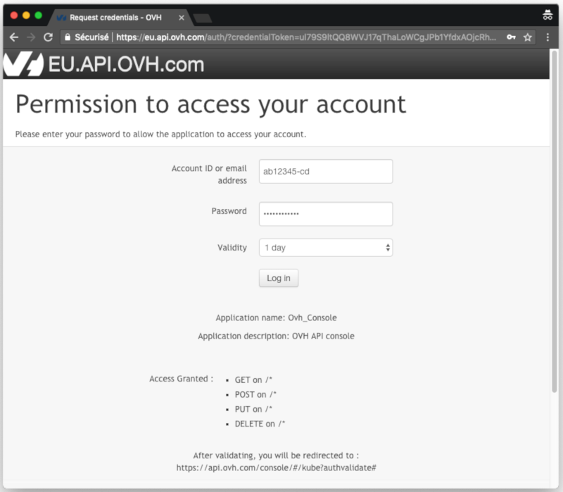
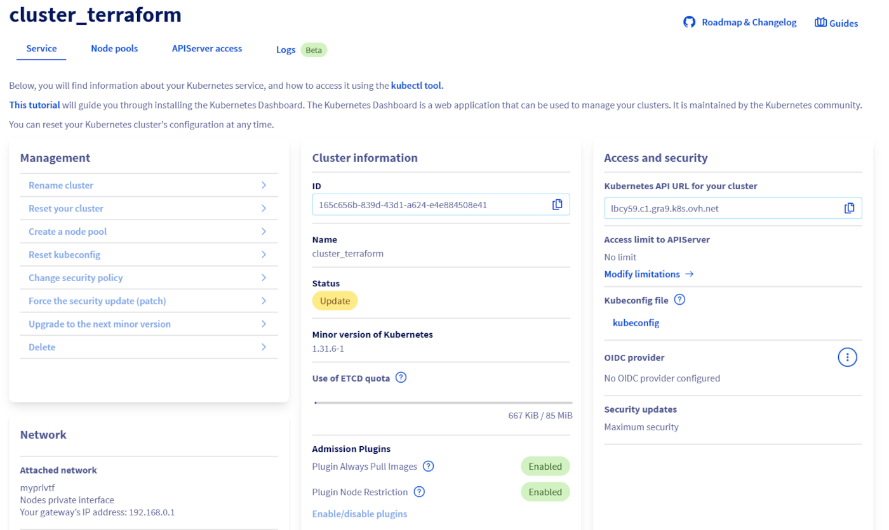
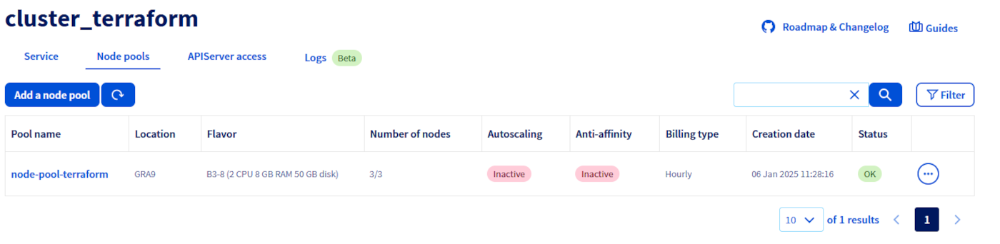

## Objective

The OVHcloud Managed Kubernetes service provides you with production-ready Kubernetes clusters without the hassle of installing or operating them.

This guide covers one of the first steps after ordering a cluster: managing nodes and node pools.

Depending on your preferred workflow, you can manage them through:

- The [OVHcloud Control Panel](/links/manager).
- The [OVHcloud API](/links/api).
- The `NodePools` Custom Resource Definition (CRD) via `kubectl`.

We will walk you through each method to help you efficiently scale and manage your Kubernetes infrastructure.

## Requirements

- You have an OVHcloud Managed Kubernetes cluster.
- If you plan to manage node pools using the `NodePools` CRD, make sure you have the [kubectl](https://kubernetes.io/docs/reference/kubectl/overview/){.external} command-line tool installed. You can find [detailed installation instructions](https://kubernetes.io/docs/tasks/tools/install-kubectl/){.external} on the official Kubernetes website.

### On nodes and node pools

> [!tabs]
> Via the OVHcloud Control Panel
>> In your OVHcloud Managed Kubernetes cluster, nodes are grouped in node pools (group of nodes sharing the same configuration).
>>
>> When you order a new cluster, it is created with a default node pool. Refer to our guide on [creating a cluster](/pages/public_cloud/containers_orchestration/managed_kubernetes/creating-a-cluster) for more information.
>>
>> In this guide we explain how to do some basic operations with nodes and node pools using the Public Cloud section of the [OVHcloud Control Panel](/links/manager).
>>
> Via the OVHcloud API
>> In your OVHcloud Managed Kubernetes cluster, nodes are grouped in node pools (group of nodes sharing the same configuration).
>>
>> In the cluster creation call, you can specify the specs of a first node pool that will be created with it. Then, you can update this node pool, or add additional node pools of different sizes and types.
>>
>> Upon creation, a node pool is defined by its name (`name`), the type of instance within our available catalog (`flavorName`), the number of identical nodes that you want in that node pool (`desiredNodes`), and potentially self-defined boundaries to limit the value of desired nodes (`minNodes` and `maxNodes`).
>>
>> You can also enable the `autoscale` feature, and the `desiredNodes` will be automatically updated at runtime within the `minNodes` and `maxNodes` boundaries, depending on the resource reservations of your workload (see [Using the cluster autoscaler](/pages/public_cloud/containers_orchestration/managed_kubernetes/using-cluster-autoscaler)).
>>
>> Setting the `antiAffinity` boolean ensures that nodes in that node pool will be created on different hypervisors (baremetal machines) and therefore ensure the best availability for your workload. The maximum number of nodes is set to 5 if this feature is activated on a nodepool (you can of course create multiple node pools with each 5 anti-affinity nodes max).
>>
>> Setting the `template` property will allow you to define some specs (annotations, finalizers, labels, taints, schedulability) that will be applied to each node under this node pool.
>>
>> Finally the boolean `monthlyBilled` ensures that all nodes in a node pool will be spawned in monthly billing mode and therefore benefit from the monthly discount.
>>
>> After creation, the `desiredNodes`, `minNodes`, `maxNodes`, `autoscale` and `template` properties can also be edited at any time.
>>
>> In this guide we explain how to do some basic operations with nodes and node pools using the [OVHcloud API](/links/manager): adding nodes to an existing node pool, creating a new node pool, etc.
>>
> Via the NodePools CRD
>> In your OVHcloud Managed Kubernetes cluster, nodes are grouped in node pools (group of nodes sharing the same configuration).
>>
>> When you create your cluster, it's created with a default node pool. Then, you can modify the size of this node pool, or add additional node pools of different sizes and types.
>>
>> In this guide we explain how to do some basic operations with nodes and node pools using the `NodePools` CRD: adding nodes to an existing node pool, creating a new node pool, etc.
>>

## Instructions

> [!tabs]
> Via the OVHcloud Control Panel
>> Access our administration UI for your OVHcloud Managed Kubernetes clusters by clicking on `Managed Kubernetes Service`{.action} in the left-hand menu in the Public Cloud section of the [OVHcloud Control Panel](/links/manager). In the table, select a cluster by clicking on the cluster name.
>>
>> {.thumbnail}
>>
>> In this administration UI you have several tabs:
>>
>> - **Service**: Here you will have a global view of your cluster, with important information like the status, the API URL or the `kubectl` configuration file.
>>
>> - **Node pools**: You will find here the active node pools of your cluster. You will be able to add, resize or remove node pools.
>>
>> - **APIServer access**: You can add IPv4 ranges in order to restrict access to your cluster’s APIServer.
>>
>> - **Audit Logs**: Here, you will find the logs for your Kubernetes cluster’s control plane.
>>
> Via the OVHcloud API
>> To simplify things, we are using the [API Explorer](/links/api), which allows to explore, learn and interact with the API in an interactive way.
>>
>> Log in to the API Explorer using your OVH NIC.
>>
>> {.thumbnail}
>>
>> If you go to the [Cloud section of the API Explorer](/links/api), you will see the available `/cloud/project/{serviceName}/kube` endpoint.
>>
> Via the NodePools CRD
>> Kubernetes [Custom Resources](https://kubernetes.io/docs/concepts/extend-kubernetes/api-extension/custom-resources/) are extensions of the Kubernetes API. Like the default Kubernetes resources, the Custom Resources are endpoints in the Kubernetes API that store collections of API objects of a certain kind. Custom Resources allows to easily extend Kubernetes by adding new features and behaviors.
>>
>> The simplest way to add a Custom Resource to Kubernetes is to define a [`CustomResourceDefinition` (CRD)](https://kubernetes.io/docs/concepts/extend-kubernetes/api-extension/custom-resources/#customresourcedefinitions) with the resource schema.
>>
>> One of our targets in developing the node pools for OVHcloud Managed Kubernetes was to give our users the capability to fully manage node pools (and by extension nodes themselves) from within Kubernetes, so the logical way to do it was to propose them as Custom Resources in your Kubernetes cluster, by developing the `NodePools` CRD.
>>
>> To verify that the `NodePools` CRD in available in your cluster, do:
>>
>> ```bash
>> kubectl get crd
>> ```
>>
>> You get the list of installed CRDs and inside it the `nodepools.kube.cloud.ovh.com`
>>
>> ```console
>> $ kubectl get crd
>> NAME                                             CREATED AT
>> ...
>> ingresses.networking.internal.knative.dev              2023-01-03T07:25:05Z
>> ipamblocks.crd.projectcalico.org                       2022-09-22T07:00:52Z
>> ipamconfigs.crd.projectcalico.org                      2022-09-22T07:00:52Z
>> ipamhandles.crd.projectcalico.org                      2022-09-22T07:00:53Z
>> ippools.crd.projectcalico.org                          2022-09-22T07:00:53Z
>> ipreservations.crd.projectcalico.org                   2022-09-22T07:00:53Z
>> kubecontrollersconfigurations.crd.projectcalico.org    2022-09-22T07:00:53Z
>> metrics.autoscaling.internal.knative.dev               2023-01-03T07:25:05Z
>> networkpolicies.crd.projectcalico.org                  2022-09-22T07:00:53Z
>> networksets.crd.projectcalico.org                      2022-09-22T07:00:53Z
>> nodefeaturerules.nfd.k8s-sigs.io                       2023-04-25T07:59:58Z
>> nodefeatures.nfd.k8s-sigs.io                           2023-04-25T07:59:58Z
>> <b style="color: yellow">nodepools.kube.cloud.ovh.com                           2022-09-22T06:59:43Z</b>
>> podautoscalers.autoscaling.internal.knative.dev        2023-01-03T07:25:05Z
>> podmonitors.monitoring.coreos.com                      2023-04-26T09:19:12Z
>> podvolumebackups.velero.io                             2022-10-04T06:56:54Z
>> podvolumerestores.velero.io                            2022-10-04T06:56:54Z
>> probes.monitoring.coreos.com                           2023-04-26T09:19:12Z
>> ...
>> ```
>>
>> You can get the details of the `NodePools` CRD by doing:
>>
>> ```bash
>> kubectl describe crd nodepools.kube.cloud.ovh.com
>> ```
>>
>> The most interesting part is the spec of the CRD, describing the `NodePool` object and its properties:
>>
>> ```yaml
>> spec:
>>   description: NodePoolSpec defines the desired state of NodePool
>>   properties:
>>     antiAffinity:
>>       type: boolean
>>       description: If true, all nodes present in the pool will be spawned on different hosts (or hypervisors).
>>     autoscale:
>>       type: boolean
>>       description: Represents whether the pool should be autoscaled.
>>     autoscaling:
>>       description:  Represents the autoscaling customization of a node pool.
>>       nullable:     true
>>       properties:
>>         scaleDownUnneededTimeSeconds:
>>           description:  Represents how long a node should be unneeded before it is eligible for scale down.
>>           format:       int32
>>           minimum:      0
>>           nullable:     true
>>           type:         integer
>>         scaleDownUnreadyTimeSeconds:
>>           description:  Represents how long an unready node should be unneeded before it is eligible for scale down.
>>           format:       int32
>>           minimum:      0
>>           nullable:     true
>>           type:         integer
>>         scaleDownUtilizationThreshold:
>>           description:  Represents the ratio of used resources (CPU & RAM) over allocatable resources below which a node is eligible for scale down Kubebuilder does not handle float, this must be a string.
>>           nullable:     true
>>           type:         string
>>       type:             object
>>     desiredNodes:
>>       description: Represents number of nodes wanted in the pool.
>>       format: int32
>>       maximum: 100
>>       minimum: 0
>>       type: integer
>>     flavor:
>>       description: Represents the flavor nodes wanted in the pool.
>>       type: string
>>     maxNodes:
>>       description: Represents the maximum number of nodes which should be
>>         present in the pool.
>>       format: int32
>>       maximum: 100
>>       minimum: 0
>>       type: integer
>>     minNodes:
>>       description: Represents the minimum number of nodes which should be
>>         present in the pool.
>>       format: int32
>>       maximum: 100
>>       minimum: 0
>>       type: integer
>>     monthlyBilled:
>>       type: boolean
>>       description: If true, all nodes present in the pool will be billed each month (not hourly).
>>   required:
>>   - desiredNodes
>>   - flavor
>>   type: object
>> ```
>>
>> After creation:
>>
>> - The `desiredNodes` can be edited and the node pool will automatically be resized to accommodate this new value. 
>> - `minNodes`, `maxNodes`, `autoscale` and `autoscaling` can also be edited at any time.
>> - /!\ `flavor`, `name` and `antiAffinity` are not editable.
>>
>> Be aware that `maxNodes` is set by default to 5 when `antiAffinity` is enabled.
>>
>> To configure cluster autoscaling based on node pools, follow the documentation [Configuring the cluster autoscaler](/pages/public_cloud/containers_orchestration/managed_kubernetes/configuring-cluster-autoscaler) and [Cluster autoscaler example](/pages/public_cloud/containers_orchestration/managed_kubernetes/cluster-autoscaler-example).  
>> To customers developing they own autoscaling scripts, we strongly encourage you to define `minNodes` and `maxNodes`.
>>

### Getting your cluster information

> [!tabs]
> Via the OVHcloud Control Panel
>> Go to your Public Cloud project in the OVHcloud Control Panel and click on the `Managed Kubernetes Service`{.action}, then click on the name of the relevant cluster.
>>
>> 
>>
> Via the OVHcloud API
>> The `GET /cloud/project/{serviceName}/kube/{kubeId}` API endpoint provides important information about your OVHcloud Managed Kubernetes cluster, including its status and URL.
>>
>> > [!api]
>> >
>> > @api {v1} /cloud GET /cloud/project/{serviceName}/kube/{kubeId}
>> > 
>>
>> **Result:**
>>
>> ```json
>> {
>>   "id": "xxxxxxxx-xxxx-4cdf-xxxx-xxxxxxxxxxxx",
>>   "region": "GRA5",
>>   "name": "my_kube_cluster",
>>   "url": "xxxxxx.c1.gra.k8s.ovh.net",
>>   "nodesUrl": "xxxxxx.nodes.c1.gra.k8s.ovh.net",
>>   "version": "1.25.4-1",
>>   "nextUpgradeVersions": [],
>>   "kubeProxyMode": "iptables",
>>   "customization": {
>>     "apiServer": {
>>       "admissionPlugins": {
>>         "enabled": [
>>           "NodeRestriction"
>>         ],
>>         "disabled": [
>>           "AlwaysPullImages"
>>         ]
>>       }
>>     },
>>     "kubeProxy": {
>>       "iptables": {},
>>       "ipvs": {}
>>     }
>>   },
>>   "status": "READY",
>>   "updatePolicy": "ALWAYS_UPDATE",
>>   "isUpToDate": true,
>>   "controlPlaneIsUpToDate": true,
>>   "privateNetworkId": null,
>>   "createdAt": "2023-02-09T10:41:13Z",
>>   "updatedAt": "2023-02-09T10:45:06Z"
>> }
>> ```
>>

### Listing node pools

> [!tabs]
> Via the OVHcloud Control Panel
>> Go to your Public Cloud project in the OVHcloud Control Panel and click on the `Managed Kubernetes Service`{.action}, then click on the name of the relevant cluster and `Node pools`{.action}.
>>
>> {.thumbnail}
>>
> Via the OVHcloud API
>> The `GET /cloud/project` API endpoint lists all the available Public Cloud Services associated to your OVHcloud account:
>>
>> > [!api]
>> >
>> > @api {v1} /cloud GET /cloud/project
>> > 
>>
>> **Result:**
>>
>> ```json
>> [
>>   "a212xxxxxxxxxxxxxxxxx59"
>> ]
>> ```
>>
>> Choose the Public Cloud Service corresponding to your OVHcloud Managed Kubernetes. In this example, we will refer to it as `serviceName`.
>>
>> The `GET /cloud/project/{serviceName}/kube` API endpoint lists all the available clusters in your chosen project:
>>
>> > [!api]
>> >
>> > @api {v1} /cloud GET /cloud/project/{serviceName}/kube
>> > 
>>
>> **Result:**
>>
>> ```json
>> [
>>   "xxxxxxxx-xxxx-4cdf-xxxx-xxxxxxxxxxxx",
>>   "xxxxxxxx-xxxx-43f6-xxxx-xxxxxxxxxxxx",
>>   "xxxxxxxx-xxxx-4217-xxxx-xxxxxxxxxxxx",
>>   "xxxxxxxx-xxxx-458b-xxxx-xxxxxxxxxxxx",
>>   "xxxxxxxx-xxxx-4845-xxxx-xxxxxxxxxxxx"
>> ]
>> ```
>>
>> By calling it, you can view a list of your Kubernetes clusters ID. Note down the ID of the cluster you want to use. In this example, we will refer to it as `kubeId`.
>>
> Via the NodePools CRD
>> To list node pools, you can use:
>>
>> ```bash
>> kubectl get nodepools
>> ```
>>
>> In my case I have one node pool in my cluster, called `my-node-pool`, with 2 B2-7 nodes:
>>
>> ```console
>> $ kubectl get nodepools
>> NAME            FLAVOR   AUTOSCALED   MONTHLY BILLED   ANTIAFFINITY   DESIRED   CURRENT   UP-TO-DATE   AVAILABLE   MIN   MAX   AGE
>> nodepool-b2-7   b2-7     false        true             true           2         2         2            2           0     5     14d
>> ```
>>
>> You can see the state of the node pool, how many nodes you want in the pool (`DESIRED`), how many actually are (`CURRENT`), how many of them are up-to-date (`UP-TO-DATE`) and how many are available to be used (`AVAILABLE`).
>>

### Getting information on a node pool

> [!tabs]
> Via the OVHcloud Control Panel
>> Go to your Public Cloud project in the OVHcloud Control Panel and click on the `Managed Kubernetes Service`{.action}, then click on the name of the relevant cluster and `Node pools`{.action}.
>>
>> {.thumbnail}
>>
>> You can also view the nodes that make up a node pool, by clicking on the name of one of them.
>>
> Via the OVHcloud API
>> Use the `GET /cloud/project/{serviceName}/kube/{kubeId}/nodepool/{nodePoolId}` API endpoint to get information on a specific node pool:
>>
>> > [!api]
>> >
>> > @api {v1} /cloud GET /cloud/project/{serviceName}/kube/{kubeId}/nodepool/{nodePoolId}
>> > 
>>
>> **Result:**
>>
>> ```json
>> {
>>   "id": "xxxxxx-xxxx-xxxx-xxxx-xxxxxxxxxx",
>>   "projectId": "xxxx",
>>   "name": "nodepool-xxxxxx-xxxx-xxxx-xxxx-xxxxxxxxxx",
>>   "flavor": "b2-7",
>>   "status": "READY",
>>   "sizeStatus": "CAPACITY_OK",
>>   "autoscale": false,
>>   "monthlyBilled": false,
>>   "antiAffinity": false,
>>   "desiredNodes": 1,
>>   "minNodes": 0,
>>   "maxNodes": 100,
>>   "currentNodes": 1,
>>   "availableNodes": 1,
>>   "upToDateNodes": 0,
>>   "createdAt": "2022-09-22T06:58:09Z",
>>   "updatedAt": "2022-12-15T15:14:33Z",
>>   "autoscaling": {
>>     "scaleDownUtilizationThreshold": 0.5,
>>     "scaleDownUnneededTimeSeconds": 600,
>>     "scaleDownUnreadyTimeSeconds": 1200
>>   },
>>   "template": {
>>     "metadata": {
>>       "labels": {},
>>       "annotations": {},
>>       "finalizers": []
>>     },
>>     "spec": {
>>       "unschedulable": false,
>>       "taints": []
>>     }
>>   }
>> }
>> ```
>>
> Via the NodePools CRD
>> Use this command:
>>
>> ```bash
>> kubectl get nodepool <nodepool-name> -o yaml
>> ```
>>

### Create a node pool

> Via the OVHcloud Control Panel
>> In the *Node pools* tab, click on the button `Add a node pool`{.action}.
>>
>> {.thumbnail}
>>
>> Fill the fields to create a new node pool.
>> 
>> > [!warning]
>> >
>> > The **name of node pool** should be in lowercase. The “_” and “.” characters are not allowed. The node pool name cannot begin with a number.
>> >
>>
>> The subsequent node pool configuration steps are described in [Creating a cluster](/pages/public_cloud/containers_orchestration/managed_kubernetes/creating-a-cluster).
>>
>> > [!primary]
>> >
>> > To learn more about the flavors of the current OVHcloud range, [refer to this page](/links/public-cloud/public-cloud).
>> >
>>
> Via the OVHcloud API
>> Use the `POST /cloud/project/{serviceName}/kube/{kubeId}/nodepool` API endpoint to create a new node pool:
>>
>> > [!api]
>> >
>> > @api {v1} /cloud POST /cloud/project/{serviceName}/kube/{kubeId}/nodepool
>> > 
>>
>> **Request:**
>>
>> ```json 
>> {
>>   "antiAffinity": false,
>>   "autoscale": false,
>>   "desiredNodes": 1,
>>   "flavorName": "b2-7",
>>   "monthlyBilled": false,
>>   "name": "my-node-pool"
>> }
>> ```
>>
>> You will need to give it a `flavorName` parameter, with the flavor of the instance you want to create. For this tutorial choose a general purpose node, like the `b2-7` flavor.
>>
>> If you want your node pool to have at least one node, set the `desiredNodes` to a value above 0.
>>
>> The API will return you the new node pool information.
>>
>> **Result:**
>>
>> ```json
>> {
>>   "id": "xxxxxx-xxxx-xxxx-xxxx-xxxxxxxxxx",
>>   "projectId": "",
>>   "name": "my-node-pool",
>>   "flavor": "b2-7",
>>   "status": "INSTALLING",
>>   "sizeStatus": "UNDER_CAPACITY",
>>   "autoscale": false,
>>   "monthlyBilled": false,
>>   "antiAffinity": false,
>>   "desiredNodes": 1,
>>   "minNodes": 0,
>>   "maxNodes": 100,
>>   "currentNodes": 1,
>>   "availableNodes": 0,
>>   "upToDateNodes": 1,
>>   "createdAt": "2023-02-14T09:39:47Z",
>>   "updatedAt": "2023-02-14T09:39:47Z",
>>   "autoscaling": {
>>     "scaleDownUtilizationThreshold": 0.5,
>>     "scaleDownUnneededTimeSeconds": 600,
>>     "scaleDownUnreadyTimeSeconds": 1200
>>   },
>>   "template": {
>>     "metadata": {
>>       "labels": {},
>>       "annotations": {},
>>       "finalizers": []
>>     },
>>     "spec": {
>>       "unschedulable": false,
>>       "taints": []
>>     }
>>   }
>> }
>> ```
>>
> Via the NodePools CRD
>> To create a new node pool, you simply need to create a new node pool manifest.
>>
>> Copy the next YAML manifest in a `new-nodepool.yaml` file:
>>
>> ```yaml
>> apiVersion: kube.cloud.ovh.com/v1alpha1
>> kind: NodePool
>> metadata:
>>   name: my-new-node-pool
>> spec:
>>   antiAffinity: false
>>   autoscale: false
>>   autoscaling:
>>     scaleDownUnneededTimeSeconds: 600
>>     scaleDownUnreadyTimeSeconds: 1200
>>     scaleDownUtilizationThreshold: "0.5"
>>   desiredNodes: 3
>>   flavor: b2-7
>>   maxNodes: 100
>>   minNodes: 0
>>   monthlyBilled: false
>> ```
>>
>> > [!primary]
>> >
>> > `antiAffinity`, `flavor` and `name` fields will not be editable after creation.  
>> > You cannot change the `monthlyBilled` field from true to false.
>>
>> Then apply it to your cluster:
>>
>> ```bash
>> kubectl apply -f new-nodepool.yaml
>> ```
>>
>> Your new node pool will be created:
>>
>> ```console
>> $ kubectl apply -f new-nodepool.yaml
>> nodepool.kube.cloud.ovh.com/my-new-node-pool created
>>
>> $ kubectl get nodepools
>> NAME               FLAVOR   AUTOSCALED   MONTHLY BILLED   ANTIAFFINITY   DESIRED   CURRENT   UP-TO-DATE   AVAILABLE   MIN   MAX   AGE
>> my-new-node-pool   b2-7     false        false            false          3                                            0     100   3s
>> nodepool-b2-7      b2-7     false        true             true           2         2         2            2           0     5     14d
>> ```
>>
>> At the beginning the new node pool is empty, but if you wait a few seconds, you will see how the nodes are progressively created and made available (one after another)...
>>
>> ```console
>> $ kubectl get nodepools
>> NAME               FLAVOR   AUTOSCALED   MONTHLY BILLED   ANTIAFFINITY   DESIRED   CURRENT   UP-TO-DATE   AVAILABLE   MIN   MAX   AGE
>> my-new-node-pool   b2-7     false        false            false          3         3         3                        0     100   3s
>> nodepool-b2-7      b2-7     false        true             true           2         2         2            2           0     5     14d
>> ```
>>

### Updating the node pool

> [!tabs]
> Via the OVHcloud Control Panel
>> #### Configuring a node pool
>>
>> To access the nodes configuration, switch to the *Node pools* tab. Click on the `...`{.action} button in the row of the node pool concerned, then select `See nodes`{.action}.
>>
>> {.thumbnail}
>>
>> Here you can change the billing method for a node or delete a node by clicking on the respective `...`{.action} button of a node.
>>
>> {.thumbnail}
>>
>> > [!primary]
>> >
>> > You can only switch from an hourly billing method to a monthly billing method, not vice versa. 
>> >
>>
>> #### Adding nodes to an existing node pool
>>
>> In the *Node pools* tab, click on the `...`{.action} button in the row of the node pool concerned, then select `Configure node pool size`{.action}.
>>
>> {.thumbnail}
>>
>> In the popup window, you can re-size your node pool by adding nodes. You can alternatively enable the autoscaling feature which allows you to set the minimum and maximum pool size instead.
>>
>> {.thumbnail}
>>
> Via the OVHcloud API
>> To upsize or downsize your node pool, you can use the `PUT /cloud/project/{serviceName}/kube/{kubeId}/nodepool/{nodePoolId}` API endpoint, and set the `desiredNodes` to the new pool size. You can also modify some other properties:
>>
>> > [!api]
>> >
>> > @api {v1} /cloud PUT /cloud/project/{serviceName}/kube/{kubeId}/nodepool/{nodePoolId}
>> > 
>>
>> ```json
>> {
>>   "antiAffinity": false,
>>   "autoscale": false,
>>   "desiredNodes": 4,
>>   "flavorName": "b2-7",
>>   "monthlyBilled": false,
>>   "name": "my-node-pool"
>> }
>> ```
>>
>> > [!primary]
>> >
>> > It is not possible to update/change the following parameters: `antiAffinity`, `flavorName` and `name`.
>>
> Via the NodePools CRD
>> To upsize or downsize your node pool, you can simply edit the YAML file and re-apply it.  
>> For example, raise the `desiredNodes` to 5 in `new-nodepool.yaml` and apply the file:
>>
>> ```console
>> $ kubectl apply -f new-nodepool.yaml
>> nodepool.kube.cloud.ovh.com/my-new-node-pool configured
>> ```
>>
>> > [!primary]
>> >
>> > `antiaffinity`, `flavor` and `name` fields can't be edited.
>>
>> ```console
>> $ kubectl get nodepools
>> NAME               FLAVOR   AUTOSCALED   MONTHLY BILLED   ANTIAFFINITY   DESIRED   CURRENT   UP-TO-DATE   AVAILABLE   MIN   MAX   AGE
>> my-new-node-pool   b2-7     false        false            false          5         3         3                        0     100   3s
>> nodepool-b2-7      b2-7     false        true             true           2         2         2            2           0     5     14d
>> ```
>>
>> The `DESIRED` number of nodes has changed, and the two additional nodes will be created.
>>
>> Then, after some minutes:
>>
>> ```console
>> $ kubectl get nodepools
>> NAME               FLAVOR   AUTOSCALED   MONTHLY BILLED   ANTIAFFINITY   DESIRED   CURRENT   UP-TO-DATE   AVAILABLE   MIN   MAX   AGE
>> my-new-node-pool   b2-7     false        false            false          5         5         5            3           0     100   3s
>> nodepool-b2-7      b2-7     false        true             true           2         2         2            2           0     5     14d
>>
>> $ kubectl get nodepools
>> NAME               FLAVOR   AUTOSCALED   MONTHLY BILLED   ANTIAFFINITY   DESIRED   CURRENT   UP-TO-DATE   AVAILABLE   MIN   MAX   AGE
>> my-new-node-pool   b2-7     false        false            false          5         5         5            5           0     100   3s
>> nodepool-b2-7      b2-7     false        true             true           2         2         2            2           0     5     14d
>> ```
>>
>> You can also use `kubectl scale —replicas=X` to change the number of desired nodes. For example, let's resize it back to 2 nodes:
>>
>> ```bash
>> kubectl scale --replicas=2 nodepool my-new-node-pool
>> ```
>>
>> ```console
>> $ kubectl scale --replicas=2 nodepool my-new-node-pool
>> nodepool.kube.cloud.ovh.com/my-new-node-pool scaled
>>
>> $ kubectl get nodepools
>> NAME               FLAVOR   AUTOSCALED   MONTHLY BILLED   ANTIAFFINITY   DESIRED   CURRENT   UP-TO-DATE   AVAILABLE   MIN   MAX   AGE
>> my-new-node-pool   b2-7     false        false            false          2         5         5            5           0     100   3s
>> nodepool-b2-7      b2-7     false        true             true           2         2         2            2           0     5     14d
>> ```
>>
>> Then, after some minutes:
>>
>> ```console
>> $ kubectl get nodepools
>> NAME               FLAVOR   AUTOSCALED   MONTHLY BILLED   ANTIAFFINITY   DESIRED   CURRENT   UP-TO-DATE   AVAILABLE   MIN   MAX   AGE
>> my-new-node-pool   b2-7     false        false            false          2         2         2            2           0     100   3s
>> nodepool-b2-7      b2-7     false        true             true           2         2         2            2           0     5     14d
>> ```
>>

### Deleting a node pool

> [!tabs]
> Via the OVHcloud Control Panel
>> In the *Node pools* tab, click on the `...`{.action} button in the row of the node pool concerned, then select `Delete pool`{.action}.
>>
>> {.thumbnail}
>>
>> Confirm the decision by typing `DELETE` into the field, then click on the `Delete`{.action} button.
>>
>> {.thumbnail}
>>
> Via the OVHcloud API
>> To delete a node pool, use the `DELETE /cloud/project/{serviceName}/kube/{kubeId}/nodepool/{nodePoolId}` API endpoint:
>>
>> > [!api]
>> >
>> > @api {v1} /cloud DELETE /cloud/project/{serviceName}/kube/{kubeId}/nodepool/{nodePoolId}
>> > 
>>
> Via the NodePools CRD
>> You can simply use `kubectl` to delete a node pool, as any other Kubernetes resource:
>>
>> ```bash
>> kubectl delete nodepool my-new-node-pool
>> ```
>>
>> After executing this command, Kubernetes will change the state of the nodes to `Ready,SchedulingDisabled`. After a little time, Nodes will be deleted.
>>

## Go further

To have an overview of the OVHcloud Managed Kubernetes service, visit the [OVHcloud Managed Kubernetes page](/links/public-cloud/kubernetes).

To deploy your first application on your Kubernetes cluster, we invite you to follow our guides to [configure default settings for `kubectl`](/pages/public_cloud/containers_orchestration/managed_kubernetes/configuring-kubectl-on-an-ovh-managed-kubernetes-cluster) and to [deploy a Hello World application](/pages/public_cloud/containers_orchestration/managed_kubernetes/deploying-hello-world).

If you need training or technical assistance to implement our solutions, contact your sales representative or click on [this link](/links/professional-services) to get a quote and ask our Professional Services experts for a custom analysis of your project.

Join our [community of users](/links/community).
