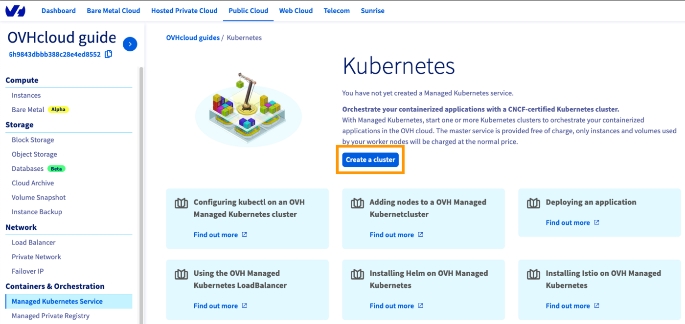

## Objective

This guide outlines the process of migrating your OVHcloud Managed Kubernetes Service (MKS) cluster from the Free plan to the Standard plan. It provides a step-by-step procedure to ensure a secure and efficient transition while minimizing downtime.

We will cover the essential phases of migration, including:

- **Plan comparison**: Understanding the differences between Free and Standard plans.
- **Backup and restore**: Using Trilio, CloudCasa, or Velero to safely migrate your data and workloads.
- **Cluster migration**: Moving your entire cluster or specific namespaces to the Standard plan.
- **Post-migration validation**: Ensuring your applications are fully functional and optimized on the Standard plan.

This guide is designed to provide you with the knowledge and best practices needed for a smooth and successful MKS plan migration.

## Requirements

To successfully update your Kubernetes cluster plan within OVHcloud, ensure you have the following prerequisites:

- A [Public Cloud project](/pages/public_cloud/public_cloud_cross_functional/create_a_public_cloud_project) in your OVHcloud account.
- **kubectl**: You'll need the kubectl command-line tool installed to interact with your Kubernetes clusters. Refer to the [official Kubernetes documentation](https://kubernetes.io/docs/tasks/tools/) for installation instructions.

## Comparing Free and Standard MKS Plans

While this guide focuses on your current plan, it can be helpful to understand the differences between the Free and Standard plans. The Standard plan offers additional features such as cross-AZ resilience, higher availability SLA, dedicated etcd, and larger maximum cluster size.

For a complete overview, including a detailed comparison table between Free and Standard, please refer to the **Free vs Standard comparison** part of our [MKS Standard Plan](/pages/public_cloud/containers_orchestration/managed_kubernetes/premium) guide. The table in that guide provides a clear side-by-side comparison of key features.

## Instructions

> [!warning]
>
> At the moment, **Floating IPs cannot be attached to MKS nodes**.
>
> This feature will be available in the coming weeks.
>
> In the meantime, plan your migration accordingly and consider alternatives such as reconfiguring DNS records or using load balancer services.
>

### 1. Install, configure Backup Tool and back up your cluster

Before migrating your cluster, ensure that a backup solution is installed and configured. You can use Trilio, CloudCasa, or Velero depending on your preference.

Choose your backup tool:

- Velero: Open-source, integrates with OVHcloud S3-compatible<sup>1</sup> storage.
- Trilio: Enterprise-ready solution, optimized for Kubernetes.
- CloudCasa: Managed backup service, simple setup for clusters.

**Install the selected tool** on your Free cluster following the official documentation and **back up your cluster**:

- For Velero, follow our guide [here](/pages/public_cloud/containers_orchestration/managed_kubernetes/backing-up-cluster-with-velero).
- For Trilio, follow our guide [here](/pages/public_cloud/containers_orchestration/managed_kubernetes/backup-and-restore-cluster-namespace-and-applications-with-trilio).
- For CloudCasa, follow our guide [here](/pages/public_cloud/containers_orchestration/managed_kubernetes/backup-and-restore-cluster-using-cloudcasa).

### 2. Create your target Kubernetes cluster on OVHcloud

Log in to the [OVHcloud Control Panel](/links/manager), go to the `Public Cloud`{.action} section and select the Public Cloud project concerned.

Access the administration UI for your OVHcloud Managed Kubernetes clusters by clicking on `Managed Kubernetes Service`{.action} in the left-hand menu and click on `Create a cluster`{.action}.

{.thumbnail}

### 3. Pick a flavor and node pool for your new OVHcloud cluster

- **Size your worker nodes**: Carefully assess your existing architecture's CPU and RAM requirements and select OVHcloud node flavors that match these specifications.
- **Replicate network setup**: Ensure your new cluster's network configuration mirrors your original cluster (e.g. private nodes on a private subnet, dedicated outbound gateway).
- **Choose deployment mode**: Select a deployment mode (e.g. 1AZ or 3AZ) based on your fault tolerance needs and high availability requirements.

> [!primary]
>
> The Standard plan is currently available only in 3AZ regions. Make sure your migration targets a compatible region to avoid deployment issues.
>

### 4. Restore your backups onto the new cluster

Before migrating your workloads, you need to deploy your chosen backup tool on the new Standard cluster. This ensures that your backups are properly restored and that the migration process can proceed smoothly.

Choose the documentation corresponding to the tool you are using:

> [!tabs]
> **Via Velero**
>> 1\. **Deploy Velero on the new cluster**
>>
>> Install the Velero Helm chart on your newly created OVHcloud Kubernetes cluster by following the **Installing Velero** part of [this guide](/pages/public_cloud/containers_orchestration/managed_kubernetes/backing-up-cluster-with-velero/).
>>
>> 2\. **Configure access to your backups**
>>
>> Make sure Velero on the new cluster points to the same OVHcloud S3-compatible<sup>1</sup> Object Storage bucket that was used for your backups. This will automatically make your existing backup metadata visible to the new cluster.
>>
>> Example of checking available backups:
>>
>> ```bash
>> velero backup get <backupName>
>> ```
>>
>> Replace <backupName> with the name of your backup.
>>
>> 3\. **Restore your backup**
>>
>> Use the Velero CLI to restore resources from a backup:
>>
>> ```bash
>> velero restore create --from-backup <backupName>
>> ```
>>
>> Replace <backupName> with the name of the backup you want to restore.
>>
>> You can add options such as --include-namespaces or --exclude-resources to fine-tune what is restored.
>>
>> 4\. **Validate the restore**
>>
>> Once the restore is complete, check that your workloads, services, and configurations are correctly running:
>>
>> ```bash
>> # List the restores
>> velero restore get
>>
>> # Check overall restore status
>> velero restore describe YOUR_RESTORE_NAME
>>
>> # Check workloads directly in the cluster
>> kubectl get pods --all-namespaces
>> ```
>>
>> Monitor events and logs if some workloads do not start as expected.
>>
> **Via Trilio**
>> Follow the **Restoring mysql-qa Helm Release Backup** part in step 4 of [our guide](/pages/public_cloud/containers_orchestration/managed_kubernetes/backup-and-restore-cluster-namespace-and-applications-with-trilio).
>>
> **Via CloudCasa**
>> Follow the **step 6 - Run a restore operation for the dummy application** of [this guide](/pages/public_cloud/containers_orchestration/managed_kubernetes/backup-and-restore-cluster-using-cloudcasa).
>>

### 5. Validate the Migration

After restoring your workloads, check that the cluster is fully functional:

- Verify deployments, services, and ingress controllers.
- Test application endpoints to confirm availability.
- Check logs and events for errors or misconfigurations.
- Execute all your application's integration tests on the new target cluster.

### 6. Adjust Cluster Resources

Some workloads may require fine-tuning after the migration:

- Re-create Load Balancers or reconfigure Ingresses if public IPs have changed.
- Ensure CRDs, Secrets, and ConfigMaps are properly restored.

### 7. Clean Up Old Resources

Once you’ve validated that everything is running correctly in the Standard cluster:

- You can repurpose the source cluster (Free plan) to host testing or staging environments.
- Alternatively, decommission it if it is no longer needed.

### 8. Set up Saving Plans (if needed)

Explore the option of [OVHcloud Saving Plans](/pages/public_cloud/public_cloud_cross_functional/savings_plans) to optimize your cloud costs. Learn more about the available Saving Plans to determine if they align with your financial strategy.

### 9. Post-Migration Best Practices

- Set up monitoring and alerting to track the health of the new cluster.
- Schedule regular backups with Velero, Trilio, or CloudCasa.
- Document any configuration changes for future reference.

## Tips and best practices

- Operational Best Practices:
    - **Test restores regularly**: Don’t just configure backups and perform periodic restoration tests to validate recovery procedures.
    - **Use staging environments**: Run your migration first on a non-production cluster to detect potential issues before moving production workloads.
    - **Check quotas and limits**: Make sure your Public Cloud project has sufficient quotas for nodes, storage, and load balancers.
- Security & Compliance:
    - **Revalidate RBAC policies**: Ensure that users and service accounts have only the permissions they need in the new cluster.
    - **Rotate secrets and credentials**: After migration, rotate API keys, tokens, and database passwords to reduce risks.
    - **Audit compliance requirements**: Verify that the new setup still complies with your organization’s security or regulatory requirements (e.g. GDPR, ISO).
- Performance & Cost:
    - **Enable autoscaling**: Configure cluster autoscaler and HPA (Horizontal Pod Autoscaler) to optimize resource usage.
    - **Right-size your nodes**: Review workloads and adjust node pool flavors to balance performance and cost.
    - **Monitor storage usage**: Keep an eye on PVC consumption and adjust storage classes if necessary.
- Reliability:
    - **Use 3AZ mode for production**: Ensure high availability by running workloads in a 3AZ cluster.
    - **Set up alerts**: Integrate with tools like Prometheus, Grafana, etc.
    - **Document rollback strategy**: Define how to roll back to the Free cluster or to a backup if issues arise during migration.

## Go further

To have an overview of the OVHcloud Managed Kubernetes service, visit the [OVHcloud Managed Kubernetes page](/links/public-cloud/kubernetes).

To deploy your first application on your Kubernetes cluster, we invite you to follow our guides to [configure default settings for kubectl](/pages/public_cloud/containers_orchestration/managed_kubernetes/configuring-kubectl-on-an-ovh-managed-kubernetes-cluster) and to [deploy a Hello World application](/pages/public_cloud/containers_orchestration/managed_kubernetes/deploying-hello-world).

If you need training or technical assistance to implement our solutions, contact your sales representative or click on [this link](/links/professional-services) to get a quote and ask our Professional Services experts for a custom analysis of your project.

Join our [community of users](/links/community).

<sup>1</sup>: S3 is a trademark of Amazon Technologies, Inc. OVHcloud’s service is not sponsored by, endorsed by, or otherwise affiliated with Amazon Technologies, Inc.