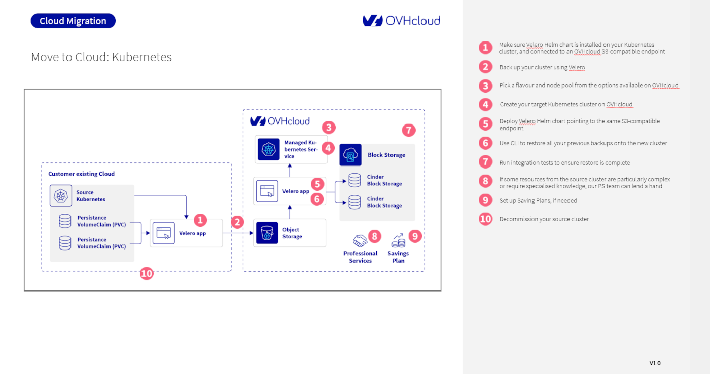

## Objective

This guide outlines the process of migrating your Kubernetes cluster from an external provider to OVHcloud Managed Kubernetes. It provides a step-by-step walkthrough to help you seamlessly transfer your applications and data, ensuring minimal downtime and a smooth transition.

We'll cover the essential phases of migration, including:

- Backup and Restore: Utilizing Velero for efficient data transfer.
- Cluster Provisioning: Selecting and deploying your new Kubernetes cluster on OVHcloud.
- Post-Migration Validation: Ensuring your applications are fully functional on the new environment.

This guide aims to equip you with the knowledge to manage your Kubernetes migration effectively. For complex scenarios or specialized assistance, the OVHcloud Professional Services team is available to provide expert support.

## Requirements

To successfully migrate your Kubernetes cluster to OVHcloud, ensure you have the following in place:

- **Velero Setup:** Velero, along with its Helm chart, should be installed and configured on your source Kubernetes cluster. It's crucial that Velero is connected to an OVHcloud S3-compatible Object Storage endpoint for backup storage. You can find detailed instructions for Velero installation and configuration in the official [Velero Helm chart documentation](https://github.com/vmware-tanzu/helm-charts/blob/main/charts/velero/README.md){.external}.
- **OVHcloud S3-compatible Endpoint:** Ensure your Velero setup correctly references the OVHcloud S3-compatible endpoints as the BackupStorageLocation. If you encounter any difficulties with these settings, don't hesitate to reach out to our [Professional Services experts](https://www.ovhcloud.com/en-gb/professional-services){.external} for assistance.
- **kubectl:** You'll need the kubectl command-line tool installed to interact with your Kubernetes clusters. Refer to the [official Kubernetes documentation](https://kubernetes.io/docs/tasks/tools/){.external} for installation instructions.

## Instructions

The following diagram illustrates the complete migration journey from your existing Kubernetes environment to OVHcloud. This visual roadmap provides a clear understanding of each phase involved in transferring your cluster.

Let's now dive into the detailed steps for migrating your Kubernetes cluster to OVHcloud:

1. **Install and Configure Velero with OVHcloud S3**

Ensure the Velero Helm chart is installed on your Kubernetes cluster and configured to use the OVHcloud S3-compatible storage.

2. **Back up your cluster using Velero**

- Refer to the [official Velero documentation on backup reference](https://velero.io/docs/v1.16/backup-reference/){.external} to back up your Kubernetes manifests and Persistent Volume Claims (PVCs).
- Ensure that all backups are successfully stored in your configured OVHcloud Object Storage.

3. **Create your target Kubernetes cluster on OVHcloud**

- Follow the instructions in the OVHcloud documentation for [creating a Kubernetes cluster](/pages/public_cloud/containers_orchestration/managed_kubernetes/creating-a-cluster).
- Choose your preferred deployment mode and proceed with the cluster creation.
- **Optional:** OVHcloud Professional Services can assist you in creating an Infrastructure-as-Code script for your new Kubernetes deployment using OpenTofu, streamlining the provisioning process.

4. **Pick a flavour and node pool for your new OVHcloud cluster**

- **Size your worker nodes:** Carefully assess your existing architecture's CPU and RAM requirements and select OVHcloud node flavors that match these specifications.
- **Replicate network setup:** Ensure your new cluster's network configuration mirrors your original cluster (e.g., private nodes on a private subnet, dedicated outbound gateway).
- **Choose deployment mode:** Select a deployment mode (e.g., 1AZ or 3AZ) based on your fault tolerance needs and high availability requirements.

5. **Deploy Velero Helm chart on the new cluster**

- On your newly created OVHcloud Kubernetes cluster, deploy the Velero Helm chart. To do this, you can follow this [guide](/pages/public_cloud/containers_orchestration/managed_kubernetes/backing-up-cluster-with-velero).
- Crucially, point Velero to the same OVHcloud S3-compatible endpoint that contains your existing backups. This action will automatically make your backup resources available to the new cluster.

6. **Restore your backups onto the new cluster**

- Utilize the Velero CLI to restore all your previous backups onto the new cluster. Refer to the Velero [documentation on file system backup](https://velero.io/docs/v1.16/file-system-backup/){.external} for detailed commands.
- Before restoring, set your application to maintenance mode on the source cluster to prevent data inconsistencies during the transition.
- After restoration, carefully update all your DNS records to point to the new cluster's services.
- Ensure your ingress controllers and Load Balancers are properly configured and ready on the new cluster.
- Map the source cluster's storage class to the target cluster's equivalent using [Velero configuration](https://velero.io/docs/v1.16/restore-reference/){.external} if your storage classes differ between environments.
- **Optional:** If the deployment process appears overly complex, or if you require assistance with migration and rollback strategies, reach out to the OVHcloud Professional Services team.

7. **Run integration tests to ensure restore is complete**

- Execute all your application's integration tests on the new target cluster.
- Thoroughly verify the health and functionality of your applications after the deployment.
- If any issues are detected, be prepared to roll back to your source cluster if necessary.

8. **Seek Professional Services assistance (if needed)**

If certain resources from your source cluster are particularly complex or require specialized knowledge for migration, the OVHcloud Professional Services team is available to provide expert assistance. You can find more information about their services [here](https://www.ovhcloud.com/en-gb/professional-services/){.external}.

9. **Set up Saving Plans (if needed)**

Explore the option of [OVHcloud Saving Plans](/pages/public_cloud/public_cloud_cross_functional/savings_plans) to optimize your cloud costs. Learn more about the available Saving Plans to determine if they align with your financial strategy.

10.  **Decommission your source cluster**

Once you have thoroughly validated that your applications are running correctly and stably on the new OVHcloud Kubernetes cluster, you can proceed to safely delete your source cluster.

## Go further

To have an overview of the OVHcloud Managed Kubernetes service, visit the [OVHcloud Managed Kubernetes page](/links/public-cloud/kubernetes).

To deploy your first application on your Kubernetes cluster, we invite you to follow our guides to [configure default settings for `kubectl`](/pages/public_cloud/containers_orchestration/managed_kubernetes/configuring-kubectl-on-an-ovh-managed-kubernetes-cluster) and to [deploy a Hello World application](/pages/public_cloud/containers_orchestration/managed_kubernetes/deploying-hello-world).

If you need training or technical assistance to implement our solutions, contact your sales representative or click on [this link](/links/professional-services) to get a quote and ask our Professional Services experts for a custom analysis of your project.

Join our [community of users](/links/community).
