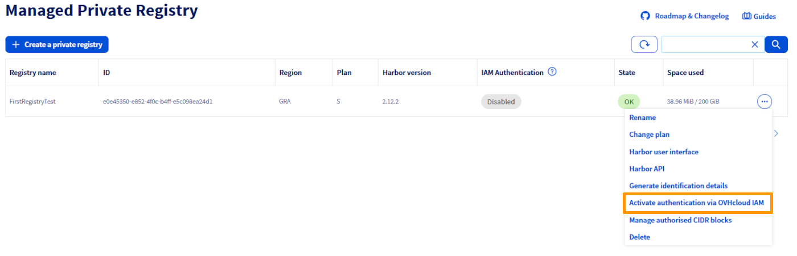
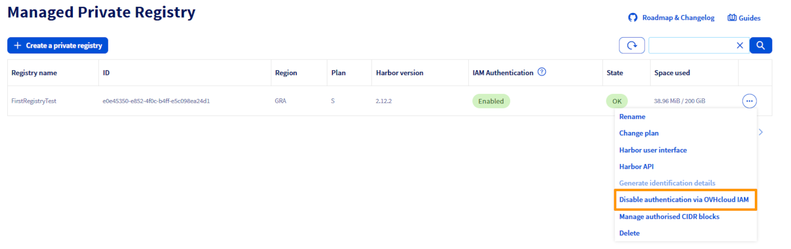
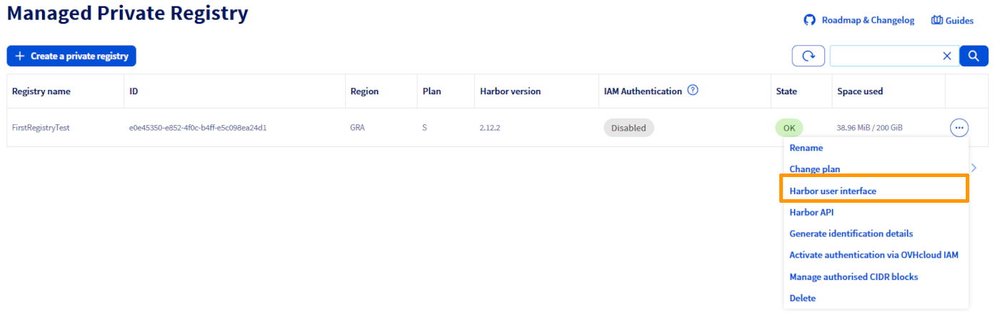
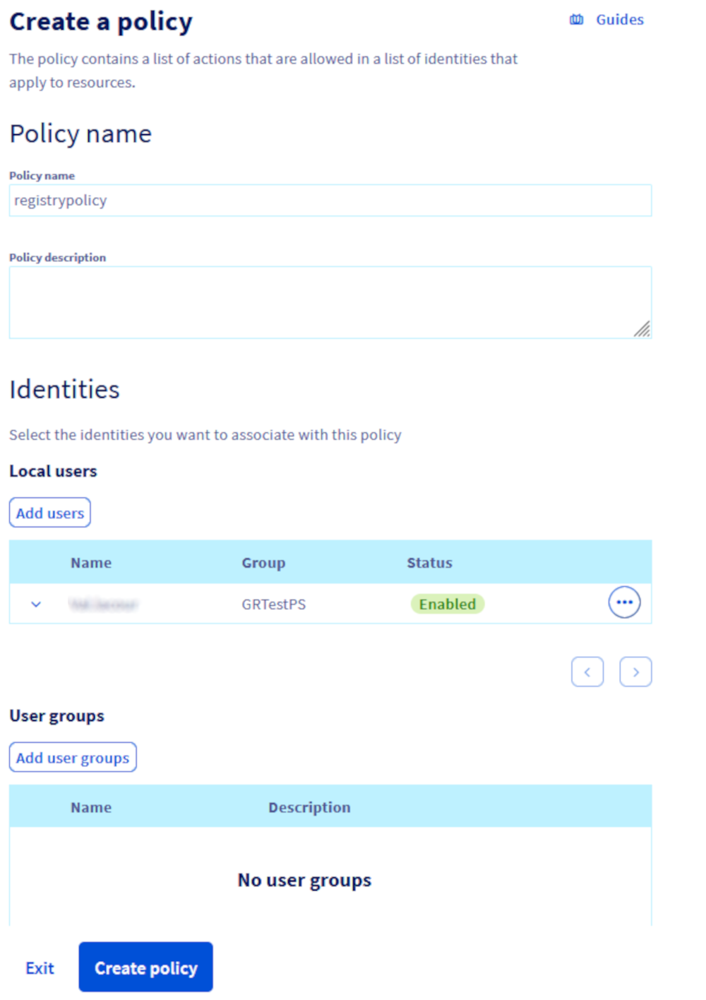
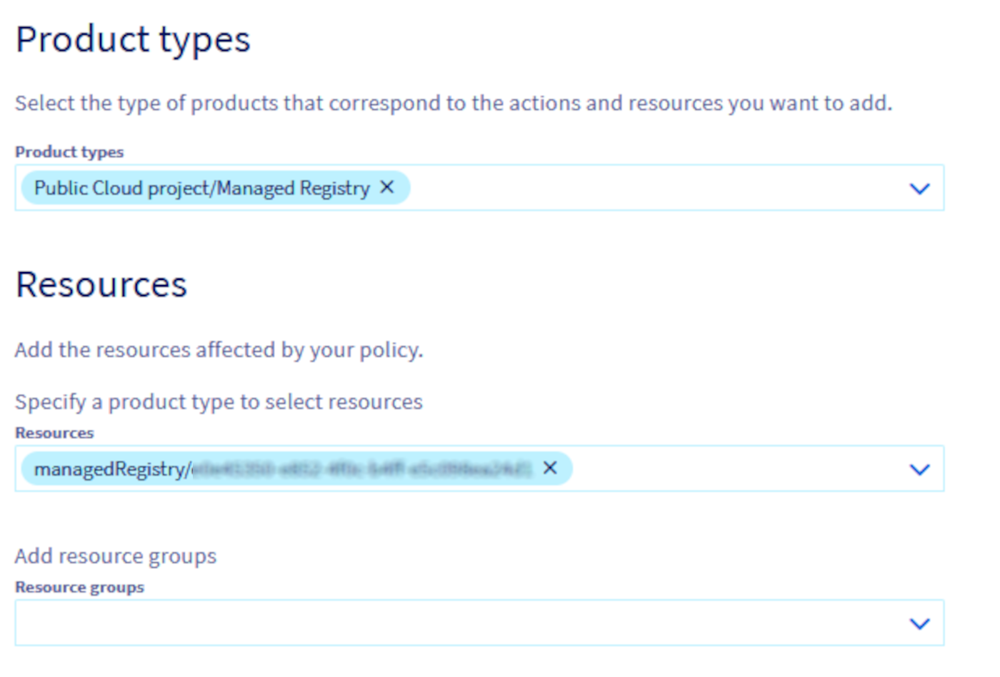

## Objective

OVHcloud Managed Private Registry (MPR) supports authentication through OVHcloud IAM, allowing you to manage access using centralized user identities and roles.

This guide explains how to enable IAM authentication and control user access to your registry using OVHcloud IAM users and roles.

## Requirements

- An OVHcloud Managed Private Registry (see the [creating a private registry](/pages/public_cloud/containers_orchestration/managed_private_registry/creating-a-private-registry) guide for more information).
- An access to the Harbor UI to operate the private registry (see the [connecting to the UI](/pages/public_cloud/containers_orchestration/managed_private_registry/connecting-to-the-ui) guide for more information).

## Instructions

### Introduction to OVHcloud IAM

OVHcloud IAM (Identity and Access Management) is a centralized system that lets you manage who can access your OVHcloud services and what they are allowed to do. It provides fine-grained access control through users, groups and roles.

When used with Managed Private Registry (MPR), OVHcloud IAM replaces Harbor’s local user database. This enables you to:

- use SSO (Single Sign-On) with your OVHcloud credentials to access Harbor.
- assign predefined IAM roles (admin, standard) to control access levels.
- manage permissions at scale using IAM groups and projects.

By integrating IAM with your registry, you ensure consistent access control across your OVHcloud services — reducing manual management and improving security.

### Activate/disable authentication via OVHcloud IAM

> [!warning]
>
> When you enable OVHcloud IAM authentication on your Managed Private Registry:
> 
> - all existing Harbor users will be removed.
> - existing robot accounts remain functional.
> - new robot accounts can still be created and managed.
> 
> From this point on, all users access are managed through OVHcloud IAM roles and policies.
>

> [!tabs]
> Via the OVHcloud Control Panel
>> Log in to the [OVHcloud Control Panel](/links/manager), navigate to the `Public Cloud`{.action} section, and select the relevant project. Then, in the left-hand menu under **Containers & Orchestration**, click on `Managed Private Registry`{.action}.
>>
>> In the list of registries, click the `...`{.action} button for the relevant registry, then select:
>>
>> - `Activate authentication via OVHcloud IAM`{.action} to enable it.
>>
>> {.thumbnail}
>>
>> - `Disable authentication via OVHcloud IAM`{.action} to disable it.
>>
>> {.thumbnail}
>>
> Via the OVHcloud API
>> /// details | Enable IAM authentication
>>
>> > [!api]
>> >
>> > @api {v1} /cloud POST /cloud/project/{serviceName}/containerRegistry/{registryID}/iam
>> >
>>
>> ///
>>
>> /// details | Disable IAM authentication
>>
>> > [!api]
>> >
>> > @api {v1} /cloud DELETE /cloud/project/{serviceName}/containerRegistry/{registryID}/iam
>> >
>>
>> ///
>>
>> Replace:
>>
>> - `serviceName` with the ID of your Public Cloud project.
>> - `registryID` with the ID of the Managed Private Registry.
>>
>> You can retrieve the `registryID` in two ways:
>>
>> - **Via API:**
>> 
>> > [!api]
>> >
>> > @api {v1} /cloud GET /cloud/project/{serviceName}/containerRegistry
>> >
>>
>> - **Via the OVHcloud Control Panel:**
>>
>> Log in to the [OVHcloud Control Panel](/links/manager), navigate to the `Public Cloud`{.action} section, and select the relevant project. Then, in the left-hand menu under **Containers & Orchestration**, click on `Managed Private Registry`{.action}.
>>

### Authentication using SSO with OVHcloud IAM users

Once IAM authentication is enabled, access to the Harbor UI is handled via OVHcloud Single Sign-On (SSO). Users no longer log in with Harbor-local credentials but authenticate directly using their OVHcloud IAM identity.

To log in via SSO:

- Open the `Harbor user interface`{.action} from the Control Panel.

{.thumbnail}

- You will be redirected to the OVHcloud authentication page, log in using your OVHcloud IAM credentials.

{.thumbnail}

- Access to Harbor is granted based on the IAM role associated with your user account.

> [!primary]
>
> Only users with the appropriate IAM role (admin or standard) can access the registry after IAM authentication is enabled.
>

### Managing access rights with OVHcloud IAM

OVHcloud IAM provides two predefined roles for managing access to your Managed Private Registry (MPR):

- Standard
- Admin

> [!primary]
>
> **Admin** role: Regardless of the user group defined in the Identities section, assigning the Admin role will grant full administrative privileges on the selected registry.
> 
> **Standard** role: Be aware that users belonging to the Default group in the Identities section automatically inherit admin privileges on the registry. Assigning them the Standard role will not override these inherited rights. To ensure proper separation of roles, we recommend:
> 
> - Organizing users into clearly defined groups.
> - After changing a user’s group and assigning the Standard role, fine-tune their permissions directly in Harbor for better control and consistency. See the different roles in Harbor [here](https://goharbor.io/docs/1.10/administration/managing-users/user-permissions-by-role/){.external}.
>

These roles are assigned through IAM policies. To create and configure a policy, log in to the [OVHcloud Control Panel](/links/manager) and navigate to the `Identity, Security & Operations`{.action} section. Then, in the left-hand menu under **Identity and Access management**, click on `Policies`{.action} and click the `Create a policy`{.action} button.

{.thumbnail}

Define users and groups, name your policy, add the users you want to include and optionally, add user groups if they have already been created.

{.thumbnail width="700"}

Set permissions for MPR: 

- In the `Product types` section, select `Public Cloud Project/Managed Registry`.
- In the `Resources` section, choose the specific MPR instance to which the policy will apply.

{.thumbnail}

Expand `Public Cloud Project/Managed Registry` and select the desired role for the users defined in the policy.

{.thumbnail width="700"}

### Go further

To go further you can look at our guides on:

- [Managing users and projects](/pages/public_cloud/containers_orchestration/managed_private_registry/managing-users-and-projects).
- [Creating and using a private image](/pages/public_cloud/containers_orchestration/managed_private_registry/creating-and-using-a-private-image).