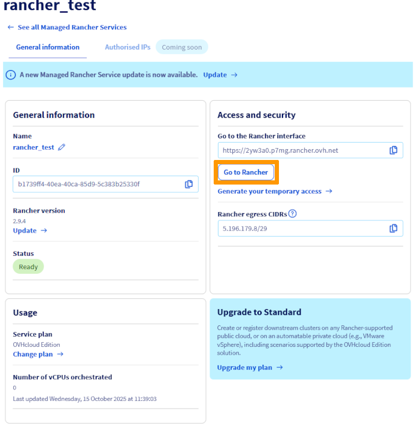
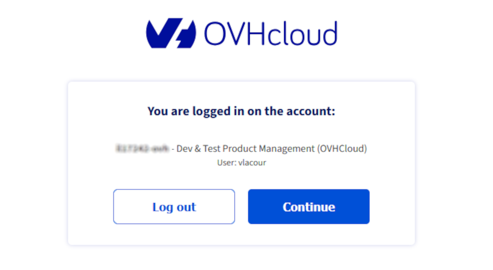
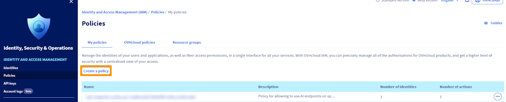
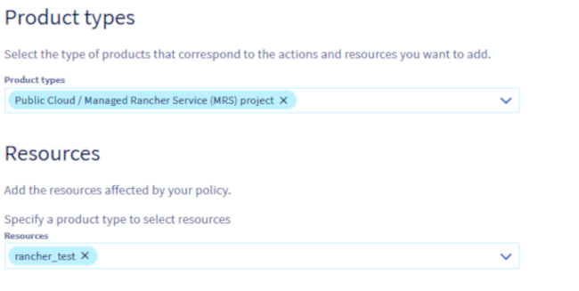
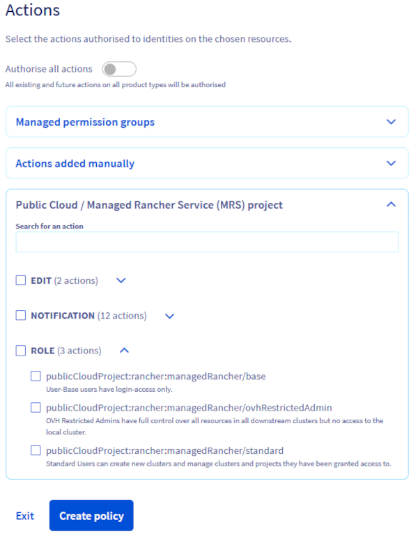

<style>
details>summary {
    color:rgb(33, 153, 232) !important;
    cursor: pointer;
}
details>summary::before {
    content:'\25B6';
    padding-right:1ch;
}
details[open]>summary::before {
    content:'\25BC';
}
</style>

## Objective

OVHcloud Managed Rancher Service (MRS) supports authentication through OVHcloud IAM, allowing you to manage access using centralized user identities and roles.

This guide explains how to enable IAM authentication and control user access to your registry using OVHcloud IAM users and roles.

## Requirements

- An OVHcloud Managed Rancher Service (see the [Creating, updating and accessing a Managed Rancher Service](/pages/public_cloud/containers_orchestration/managed_rancher_service/create-update-rancher) guide for more information).

## Instructions

### Introduction to OVHcloud IAM

OVHcloud IAM (Identity and Access Management) is a centralized system that lets you control who can access your OVHcloud services and what actions they can perform. It provides fine-grained access management through users, groups, and roles.

When integrated with the Managed Rancher Service (MRS), OVHcloud IAM replaces Rancher’s local authentication system. This allows you to:

- Use Single Sign-On (SSO) with your OVHcloud credentials to access Rancher.
- Assign predefined IAM roles (such as base, ovhRestrictedAdmin, standard) to define access levels.
- Manage permissions efficiently at scale using IAM groups and projects.

Integrating IAM with your Rancher service ensures consistent access control across all your OVHcloud resources, reducing manual management and improving overall security.

### Activate/disable authentication via OVHcloud IAM

> [!warning]
>
> When you enable OVHcloud IAM authentication on your Managed Rancher Service:
> 
> - Local users will remain functional, so you can continue logging in with your usual Rancher accounts.
> - If the "admin" password is regenerated while IAM authentication is enabled, or if no user has ever logged in locally, the ability to log in with the IAM root user will be temporarily disabled.
> - To restore access with the IAM root user, log in first with a local admin account.
> 
> From this point on, IAM roles and policies control access for users authenticated via OVHcloud IAM.
>

> [!tabs]
> Via the OVHcloud Control Panel (Comming soon)
>> > [!primary]
>> >
>> > Managing IAM from the OVHcloud Manager is not yet available and will be added in a future release.
>> >
>>
> Via the OVHcloud API
>> > [!api]
>> >
>> > @api {v2} /publicCloud PUT /publicCloud/project/{projectId}/rancher/{rancherId}
>> >
>>
>> With the request body:
>>
>> ```json
>> {
>>   "targetSpec": {
>>     "iamAuthEnabled": true, // true to enable IAM, false to disable
>>     "name": "my_rancher", // Name of the Managed Rancher Service
>>     "plan": "STANDARD", // Plan of the Managed Rancher Service
>>     "version": "1.0.0" // Version of the Managed Rancher Service
>>   }
>> }
>> ```
>>
>> > [!primary]
>> >
>> > Make sure all information in the JSON (service name, plan, version) is correct. Using incorrect values will result in an error when activating or disabling IAM.
>> >
>>
>> Replace:
>>
>> - `projectId` with the ID of your Public Cloud project.
>> - `rancherId` with the ID of the Managed Rancher Service.
>>
>> You can retrieve the `rancherId` in two ways:
>>
>> - **Via API:**
>> 
>> > [!api]
>> >
>> > @api {v2} /publicCloud GET /publicCloud/project/{projectId}/rancher
>> >
>>
>> - **Via the OVHcloud Control Panel:**
>>
>> Log in to the [OVHcloud Control Panel](/links/manager), navigate to the `Public Cloud`{.action} section, and select the relevant project. Then, in the left-hand menu under **Containers & Orchestration**, click on `Managed Rancher Service`{.action}.
>>


### Authentication using SSO with OVHcloud IAM users

Once IAM authentication is enabled on your Managed Rancher Service, access to the Rancher UI is managed via OVHcloud Single Sign-On (SSO). Users no longer log in with local Rancher credentials but authenticate directly using their OVHcloud IAM identity.

> [!primary]
>
> Local Rancher users remain functional even after enabling OVHcloud IAM, but their use is not recommended. Access and permissions should be managed through OVHcloud IAM roles and policies for consistency and security.
>

To log in via SSO:

- Open the `Rancher user interface`{.action} from the Control Panel.

{.thumbnail}

- You will be redirected to the Managed Rancher Service authentication page. 

/// details | No user has ever logged in locally

Click on `Use a local user`{.action} to go to the local login page.

To recover the admin password required for authentication, use the following API call:

> [!api]
>
> @api {v2} /publicCloud POST /publicCloud/project/{projectId}/rancher/{rancherId}/adminCredentials
>

Replace::

- `projectId` with the ID of your Public Cloud project.
- `rancherId` with the ID of the Managed Rancher Service.

Copy the returned password, then paste it on the authentication page.

Make sure to check the box to accept the `End User License Agreement & Terms & Conditions`{.action}, then click Continue.

You can now log out and proceed with your normal workflow.

///

Click on `Log in with OIDC`, which will take you to the OVHcloud authentication page. There, log in using your OVHcloud IAM credentials.

{.thumbnail}

- Access to Rancher is granted based on the IAM role associated with your user account.

> [!primary]
>
> Only users with the appropriate IAM role (base, standard and ovhRestrictedAdmin) can access the registry after IAM authentication is enabled.
>

### Managing access rights with OVHcloud IAM

OVHcloud IAM provides two predefined roles for managing access to your Managed Rancher Service (MRS):

- base
- standard
- ovhRestrictedAdmin

> [!primary]
>
> **base** role: Base users can only log in and have no additional permissions.
>
> **standard** role: Standard users can create new clusters and manage clusters and projects they have been granted access to.
>
> **ovhRestrictedAdmin** role: OVH Restricted Admins have full control over all resources in downstream clusters but no access to the local cluster.
>

These roles are assigned through IAM policies. To create and configure a policy, log in to the [OVHcloud Control Panel](/links/manager) and navigate to the `Identity, Security & Operations`{.action} section. Then, in the left-hand menu under **Identity and Access management**, click on `Policies`{.action} and click the `Create a policy`{.action} button.

{.thumbnail}

Define users and groups, name your policy, add the users you want to include and optionally, add user groups if they have already been created.

{.thumbnail width="700"}

Set permissions for MRS: 

- In the `Product types` section, select `Public Cloud / Managed Rancher Service (MRS) project`.
- In the `Resources` section, choose the specific MRS instance to which the policy will apply.

{.thumbnail}

Expand `Public Cloud / Managed Rancher Service (MRS) project` and select the desired role for the users defined in the policy.

{.thumbnail width="700"}

### Go further

To go further you can look at our guides on:

- [Managing users and projects](/pages/public_cloud/containers_orchestration/managed_private_registry/managing-users-and-projects).
- [Creating and using a private image](/pages/public_cloud/containers_orchestration/managed_private_registry/creating-and-using-a-private-image).