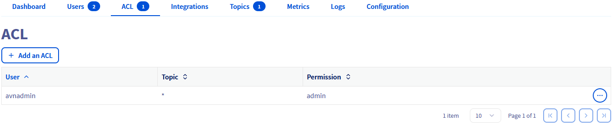
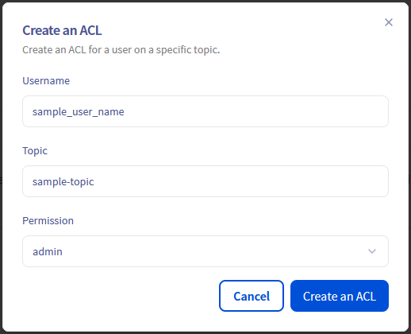

## Objective

Apache Kafka is an open-source, distributed event streaming platform designed for real-time, large-scale data processing with high scalability, durability, and low latency.

This guide explains how to configure Access Control Lists (ACLs) via the OVHcloud Control Panel.

## Requirements

- Access to the [OVHcloud Control Panel](/links/manager)
- A [Public Cloud project](/links/public-cloud/public-cloud) in your OVHcloud account
- A [Kafka cluster running](/pages/public_cloud/data_analytics/analytics/kafka_create_cluster) on OVHcloud Public Cloud [accepting incoming connections](/pages/public_cloud/data_analytics/analytics/kafka_incoming_connections) with at least one [topic](/pages/public_cloud/data_analytics/analytics/kafka_create_topics)

## Instructions

### Configure ACLs on topics

Kafka supports access control lists (ACLs) to manage permissions on topics. This approach allows you to limit the operations that are available to specific connections and to restrict access to certain data sets, which improves the security of your data.

By default the admin user has access to all topics with admin privileges. You can define some additional ACLs for all users / topics, by clicking on the `Add an ACL`{.action} button from the `ACL`{.action} tab:

{.thumbnail}

For a particular user, and one topic (or all with '*'), define the ACL with the following permissions:

- **admin**: full access to APIs and topic
- **read**: allow only searching and retrieving data from a topic
- **write**: allow updating, adding, and deleting data from a topic
- **readwrite**: full access to the topic

{.thumbnail}

*Note*: Write permission allows the service user to create new indexes that match the pattern, but it does not allow deletion of those indexes.

When multiple rules match, they are applied in the order listed above. If no rules match, access is denied.

## We want your feedback!

We would love to help answer questions and appreciate any feedback you may have.

If you need training or technical assistance to implement our solutions, contact your sales representative or click on [this link](/links/professional-services) to get a quote and ask our Professional Services experts for a custom analysis of your project.

Are you on Discord? Connect to our channel at <https://discord.gg/ovhcloud> and interact directly with the team that builds our Analytics service!

Join our [community of users](/links/community).