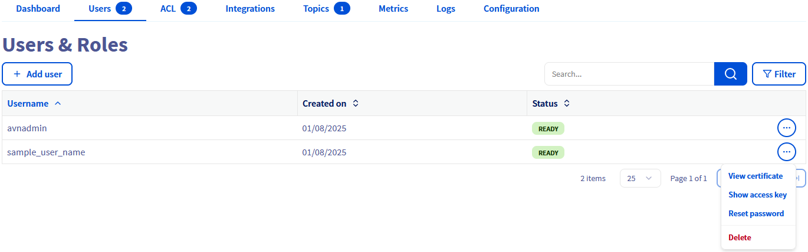

## Objective

Apache Kafka is an open-source, distributed event streaming platform designed for real-time, large-scale data processing with high scalability, durability, and low latency.

This guide explains how to connect to a Kafka cluster using the CLI.

## Requirements

- Access to the [OVHcloud Control Panel](/links/manager)
- A [Public Cloud project](/links/public-cloud/public-cloud) in your OVHcloud account
- A [Kafka cluster running](/pages/public_cloud/data_analytics/analytics/kafka_create_cluster) on OVHcloud Public Cloud [accepting incoming connections](/pages/public_cloud/data_analytics/analytics/kafka_incoming_connections)

## Instructions

### First CLI connection

> [!warning]
> Verify that the IP address visible from your browser application is part of the "Authorised IPs" defined for this Kafka service.
>
> Check also that the user has granted ACLs for the target topics.

#### Download server and user certificates

In order to connect to the Apache Kafka service, it is required to use server and user certificates.

##### Server certificate

The server CA (*Certificate Authority*) certificate can be downloaded from the `Dashboard`{.action} tab:

{.thumbnail}

##### User certificate and access key

The user certificate and the user access key can be downloaded from the `Users`{.action} tab:

{.thumbnail}

#### Install an Apache Kafka CLI

As part of the Apache Kafka official installation, you will get different scripts that will also allow you to connect to Kafka in a Java 8+ environment: [Apache Kafka Official Quickstart](https://kafka.apache.org/quickstart).

We propose to use a generic and more lightweight (does not require a JVM) producer and consumer client instead: `Kcat` (formerly known as `kafkacat`).

##### **Install Kcat**

For this client installation, please follow the instructions available at: [Kafkacat Official Github](https://github.com/edenhill/kcat).

##### **Kcat configuration file**

Let's create a configuration file to simplify the CLI commands to act as Kafka Producer and Consumer:

kafkacat.conf:

```text
bootstrap.servers=kafka-f411d2ae-f411d2ae.database.cloud.ovh.net:20186
enable.ssl.certificate.verification=false
ssl.ca.location=/home/user/kafkacat/ca.pem
security.protocol=ssl
ssl.key.location=/home/user/kafkacat/service.key
ssl.certificate.location=/home/user/kafkacat/service.cert
```

In our example, the cluster address and port are **kafka-f411d2ae-f411d2ae.database.cloud.ovh.net:20186** and the previously downloaded CA certificates are in the **/home/user/kafkacat/** folder.

Change theses values according to your own configuration.

##### **Kafka producer**

For this first example let's push the "test-message-key" and its "test-message-content" to the "my-topic" topic.

```bash
echo test-message-content | kcat -F kafkacat.conf -P -t my-topic -k test-message-key
```

*Note*: depending on the installed binary, the CLI command can be either **kcat** or **kafkacat**.

##### **Kafka consumer**

The data can be retrieved from "my-topic".

```bash
kcat -F kafkacat.conf -C -t my-topic -o -1 -e
```

*Note*: depending on the installed binary, the CLI command can be either **kcat** or **kafkacat**.

## We want your feedback!

We would love to help answer questions and appreciate any feedback you may have.

If you need training or technical assistance to implement our solutions, contact your sales representative or click on [this link](/links/professional-services) to get a quote and ask our Professional Services experts for a custom analysis of your project.

Are you on Discord? Connect to our channel at <https://discord.gg/ovhcloud> and interact directly with the team that builds our Analytics service!

Join our [community of users](/links/community).