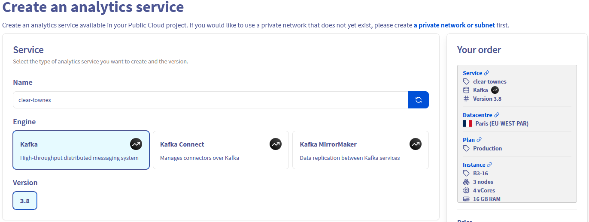
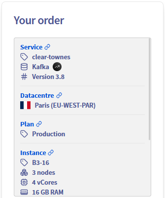

## Objective

Apache Kafka is an open-source, distributed event streaming platform designed for real-time, large-scale data processing with high scalability, durability, and low latency.

This guide explains how to create a Kafka cluster via the OVHcloud Control Panel. 

## Requirements

- Access to the [OVHcloud Control Panel](/links/manager)
- A [Public Cloud project](/links/public-cloud/public-cloud) in your OVHcloud account

## Instructions

### Subscribe to the service

Log in to your [OVHcloud Control Panel](/links/manager) and switch to `Public Cloud`{.action} in the top navigation bar. After selecting your Public Cloud project, click on `Data Streaming`{.action} in the left-hand navigation bar under **Databases & Analytics**.

Click the `Create a service`{.action} button.

#### Select your analytics service

Click on the type of analytics service you want to use and its version.
A random name is generated for your service that can change in this step or later. 

{.thumbnail}

#### Select a datacentre

Choose the geographical region of the datacentre where your service will be hosted and the deployment mode (1-AZ vs 3-AZ).

{.thumbnail}

#### Select a plan

In this step, choose an appropriate service plan. If needed, you will be able to upgrade or downgrade the plan after creation.

{.thumbnail}

Please visit the [capabilities page](/products/public-cloud-data-analytics) of your selected analytics service for detailed information on each plan's properties.

#### Select the instance

Choose the instance type for the nodes of your service, you will be able to change it afterward. The number of nodes depends on the plan previously chosen.

{.thumbnail}

#### Select the storage

Storage can be scaled up to 3 time the base storage.

{.thumbnail}

#### Configure your options

Choose the network options for your service and whitelist the IP addresses that will access the service. 

{.thumbnail}

#### Review and confirm

A summary of your order is display to help you review your service configuration.

{.thumbnail}

The components of the price is also summarized with a monthly estimation.

{.thumbnail}

Click the `API and Terraform equivalent`{.action} button to open the following window:

{.thumbnail}

The informations displayed in this window could help you automate your service creation with the [OVHcloud API](/pages/manage_and_operate/api/first-steps) or the OVHcloud Terraform Provider.

When you are ready click the `Order`{.action} button to create your service.
In a matter of minutes, your new Apache Kafka service will be deployed.
Messages in the OVHcloud Control Panel will inform you when the streaming tool is ready to use.

## We want your feedback!

We would love to help answer questions and appreciate any feedback you may have.

If you need training or technical assistance to implement our solutions, contact your sales representative or click on [this link](/links/professional-services) to get a quote and ask our Professional Services experts for a custom analysis of your project.

Are you on Discord? Connect to our channel at <https://discord.gg/ovhcloud> and interact directly with the team that builds our Analytics service!

Join our [community of users](/links/community).