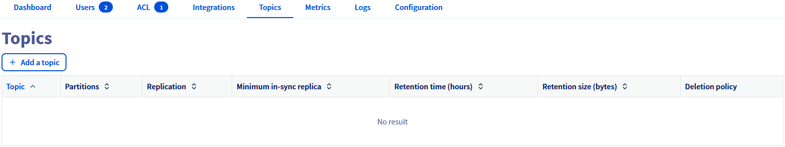

## Objective

Apache Kafka is an open-source, distributed event streaming platform designed for real-time, large-scale data processing with high scalability, durability, and low latency.

This guide explains how to create Kafka topics via the OVHcloud Control Panel.

## Requirements

- Access to the [OVHcloud Control Panel](/links/manager)
- A [Public Cloud project](/links/public-cloud/public-cloud) in your OVHcloud account
- A [Kafka cluster running](/pages/public_cloud/data_analytics/analytics/kafka_create_cluster) on OVHcloud Public Cloud [accepting incoming connections](/pages/public_cloud/data_analytics/analytics/kafka_incoming_connections)

## Instructions

### Create Kafka topics

Topics can be seen as categories, allowing you to organize your Kafka records. Producers write to topics, and consumers read from topics.

To create Kafka topics, first go to the `Topics`{.action} tab then click on the `Add a topic`{.action} button:

{.thumbnail}

In advanced configuration you can change the default value for the following parameters:

- Minimum in-sync replica (2 by default)
- Partitions (1 partition by default)
- Replication (3 brokers by default)
- Retention size in bytes (-1: no limitation by default)
- Retention time in hours (-1: no limitation by default)
- Deletion policy

{.thumbnail}

## We want your feedback!

We would love to help answer questions and appreciate any feedback you may have.

If you need training or technical assistance to implement our solutions, contact your sales representative or click on [this link](/links/professional-services) to get a quote and ask our Professional Services experts for a custom analysis of your project.

Are you on Discord? Connect to our channel at <https://discord.gg/ovhcloud> and interact directly with the team that builds our Analytics service!

Join our [community of users](/links/community).