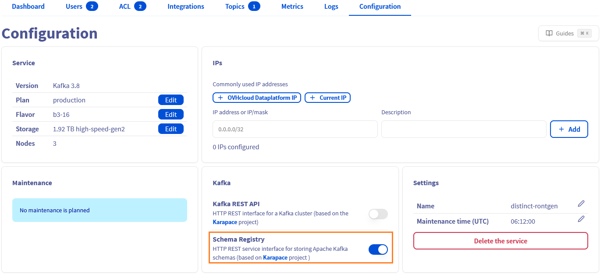

## Objective

Apache Kafka is an open-source, distributed event streaming platform designed for real-time, large-scale data processing with high scalability, durability, and low latency.

This guide explains how to enable the schema registry for your Kafka cluster via the OVHcloud Control Panel.

## Requirements

- Access to the [OVHcloud Control Panel](/links/manager)
- A [Public Cloud project](/links/public-cloud/public-cloud) in your OVHcloud account
- A [Kafka cluster running](/pages/public_cloud/data_analytics/analytics/kafka_create_cluster) on OVHcloud Public Cloud

## Instructions

### Enable schema registry

To enable schema registry, go to `Configuration`{.action} tab from your Kafka cluster. Then scroll to the Kafka specific section and click the schema registry toggle to enable it.

{.thumbnail}

The schema registry could be disabled with the same toggle.

## We want your feedback!

We would love to help answer questions and appreciate any feedback you may have.

If you need training or technical assistance to implement our solutions, contact your sales representative or click on [this link](/links/professional-services) to get a quote and ask our Professional Services experts for a custom analysis of your project.

Are you on Discord? Connect to our channel at <https://discord.gg/ovhcloud> and interact directly with the team that builds our Analytics service!

Join our [community of users](/links/community).