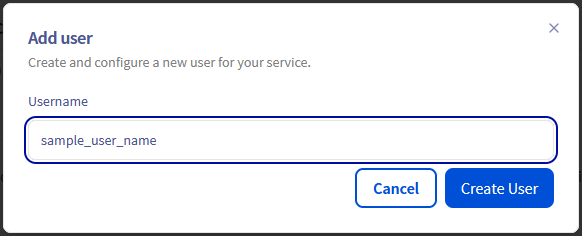
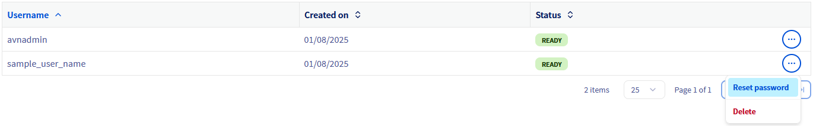
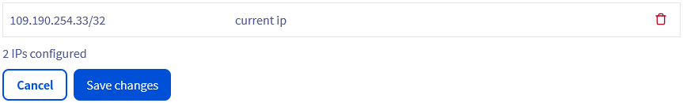

## Objective

Apache Kafka is an open-source, distributed event streaming platform designed for real-time, large-scale data processing with high scalability, durability, and low latency.

This guide explains how to configure your Kafka cluster to accept incoming connections via the OVHcloud Control Panel.

## Requirements

- Access to the [OVHcloud Control Panel](/links/manager)
- A [Public Cloud project](/links/public-cloud/public-cloud) in your OVHcloud account
- A [Kafka cluster running](/pages/public_cloud/data_analytics/analytics/kafka_create_cluster) on OVHcloud Public Cloud

## Instructions

### Configure the Apache Kafka service

Once your Kafka service is up and running, you will have to define at least one user and one authorised IP (if not already provided during the order) in order to fully connect to the service (as producer or consumer).

The `Dashboard`{.action} tab automatically updates when your service is ready.

{.thumbnail}

#### Set up a user

Switch to the `Users`{.action} tab. An admin user name `avnadmin` is preconfigured during the service installation. 

{.thumbnail}

You can add more users by clicking the `Add user`{.action} button.

{.thumbnail}

Enter a username, then click `Create User`{.action}.

Passwords need to be reset from the `Users`{.action} table.

{.thumbnail}

#### Configure authorised IPs

> [!warning]
> For security reasons the default network configuration doesn't allow any incoming connections. It is thus critical to authorize the suitable IP addresses in order to successfully access your Kafka cluster.

If you did not define the authorised IPs during the order you can do it in the `Configuration`{.action} tab. At least one IP address must be authorised here before you can connect to your database.

{.thumbnail}

Add the IP address of your computer by using the `Current IP`{.action} button.
You will be able to remove IPs from the table afterward.

{.thumbnail}

Your Apache Kafka service is now fully accessible!
Optionally, you can configure access control lists (ACL) for granular permissions and create topics, as shown below.

## We want your feedback!

We would love to help answer questions and appreciate any feedback you may have.

If you need training or technical assistance to implement our solutions, contact your sales representative or click on [this link](/links/professional-services) to get a quote and ask our Professional Services experts for a custom analysis of your project.

Are you on Discord? Connect to our channel at <https://discord.gg/ovhcloud> and interact directly with the team that builds our Analytics service!

Join our [community of users](/links/community).