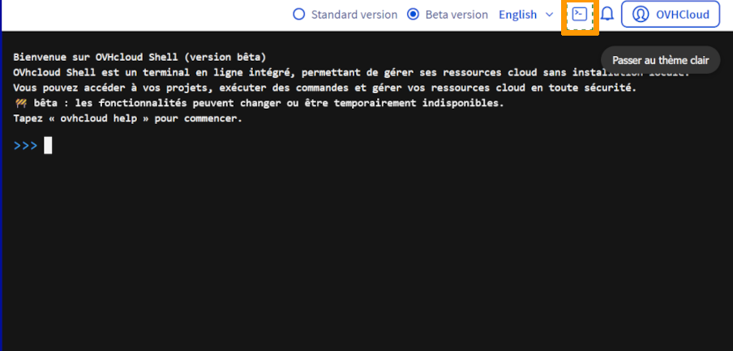

## Objective

This guide explains how to access and use OVHcloud Shell directly from the OVHcloud Manager. It provides an introduction to the environment, its main features, and the essential commands to help you start working efficiently with your OVHcloud resources. 

By the end of this guide, you will be able to launch CloudShell, manage your cloud projects from the command-line, and integrate it into your daily workflows.

### What is OVHcloud Shell?

OVHcloud Shell is a web-based command-line environment that you can access directly from your OVHcloud Manager. Think of it as a mini computer in your browser, ready to use without any installation.

With OVHcloud Shell, you can:

- Run commands to manage your OVHcloud resources.
- Access your servers, projects, and services securely.
- Automate tasks and scripts without leaving your browser.

It’s designed to make cloud management easier, faster, and accessible even if you’re not a command-line expert. You don’t need to install anything just open Shell and start working.

### Benefits of Using OVHcloud Shell

Using OVHcloud Shell directly from the OVHcloud Manager provides key advantages for managing your entire OVHcloud infrastructure, including Public Cloud, Private Cloud, Bare Metal, VPS, storage, networking, containers, and more:

1. **No Local Setup Required:** Start working immediately without installing SDKs, CLI tools, or other dependencies on your computer. Ideal for quick troubleshooting, demos, or temporary access.
2. **Secure & Managed Environment:** Access all your OVHcloud resources safely, with credentials managed automatically by OVHcloud. Provides a controlled and reliable environment for your operations.
3. **Unified Management:** Manage Public Cloud, Bare Metal servers, VPS, storage, networking, containers, and other OVHcloud services from a single, consistent command-line environment. Streamlines operations and ensures consistency across your infrastructure.
4. **Efficiency and Productivity:** Automate routine tasks, run scripts, and perform operations quickly without leaving the browser. Reduces operational complexity and accelerates your workflows.
5. **Accessible Anywhere:** Web-based access lets you log in from any device with an internet connection. Perfect for remote work or managing resources on the go.

**In short:** OVHcloud Shell centralizes management, boosts productivity, and provides fast, secure, and flexible access to your entire OVHcloud infrastructure, making cloud operations simpler and more efficient.

## Requirements

- A [Public Cloud project](/links/public-cloud/public-cloud) in your OVHcloud account
- Access to the [OVHcloud Control Panel](/links/manager)

## Instructions

### How to Access OVHcloud Shell

Log in to the [OVHcloud Control Panel](/links/manager) and click on the OVHcloud `Shell button`{.action} to launch the terminal.

{.thumbnail}

> [!primary]
>
> **Note:** Users are already authenticated with their Customer Panel credentials and get instant access to their resources, no additional login required.
>

### How to Use OVHcloud Shell

Once OVHcloud Shell is open, you can use the `help` command to view all available commands and options:

```bash
help
```

The `help` output lists commands to manage your OVHcloud infrastructure, including Public Cloud, Private Cloud, Bare Metal, VPS, storage, networking, containers, and more.

Example output:

```bash
+------------------------------------------------------------------------------------------------------------------------------------+
|                                                                help                                                                |
+------------------------------------------------------------------------------------------------------------------------------------+
| Usage:                                                                                                                             |
| ovhcloud [command]                                                                                                                 |
|                                                                                                                                    |
| Available Commands:                                                                                                                |
| account                          Manage your account                                                                               |
| alldom                           Retrieve information and manage your AllDom services                                              |
| baremetal                        Retrieve information and manage your Bare Metal services                                          |
| cdn-dedicated                    Retrieve information and manage your dedicated CDN services                                       |
| cloud                            Manage your projects and services in the Public Cloud universe (MKS, MPR, MRS, Object Storage...) |
| dedicated-ceph                   Retrieve information and manage your Dedicated Ceph services                                      |
| dedicated-cloud                  Retrieve information and manage your DedicatedCloud services                                      |
| dedicated-cluster                Retrieve information and manage your DedicatedCluster services                                    |
| dedicated-nasha                  Retrieve information and manage your Dedicated NasHA services                                     |
| domain-name                      Retrieve information and manage your domain names                                                 |
| domain-zone                      Retrieve information and manage your domain zones                                                 |
| email-domain                     Retrieve information and manage your Email Domain services                                        |
| email-mxplan                     Retrieve information and manage your Email MXPlan services                                        |
| email-pro                        Retrieve information and manage your EmailPro services                                            |
| help                             Help about any command                                                                            |
| hosting-private-database         Retrieve information and manage your HostingPrivateDatabase services                              |
| iam                              Manage IAM resources, permissions and policies                                                    |
| ip                               Retrieve information and manage your IP services                                                  |
| iploadbalancing                  Retrieve information and manage your IP LoadBalancing services                                    |
| ldp                              Retrieve information and manage your LDP (Logs Data Platform) services                            |
| location                         Retrieve information and manage your Location services                                            |
| nutanix                          Retrieve information and manage your Nutanix services                                             |
| okms                             Retrieve information and manage your OKMS (Key Management Services)                               |
| overthebox                       Retrieve information and manage your OverTheBox services                                          |
| ovhcloudconnect                  Retrieve information and manage your OVHcloud Connect services                                    |
| pack-xdsl                        Retrieve information and manage your PackXDSL services                                            |
| sms                              Retrieve information and manage your SMS services                                                 |
| ssl                              Retrieve information and manage your SSL services                                                 |
| ssl-gateway                      Retrieve information and manage your SSL Gateway services                                         |
| storage-netapp                   Retrieve information and manage your Storage NetApp services                                      |
| support-tickets                  Retrieve information and manage your support tickets                                              |
| telephony                        Retrieve information and manage your Telephony services                                           |
| veeamcloudconnect                Retrieve information and manage your VeeamCloudConnect services                                   |
| veeamenterprise                  Retrieve information and manage your VeeamEnterprise services                                     |
| version                          Get OVHcloud CLI version                                                                          |
| vmwareclouddirector-backup       Retrieve information and manage your VMware Cloud Director Backup services                        |
| vmwareclouddirector-organization Retrieve information and manage your VMware Cloud Director Organizations                          |
| vps                              Retrieve information and manage your VPS services                                                 |
| vrack                            Retrieve information and manage your vRack services                                               |
| vrackservices                    Retrieve information and manage your vRackServices services                                       |
| webhosting                       Retrieve information and manage your WebHosting services                                          |
| xdsl                             Retrieve information and manage your XDSL services                                                |
|                                                                                                                                    |
| Flags:                                                                                                                             |
| -h, --help            help for ovhcloud                                                                                            |
| -e, --ignore-errors   Ignore errors in API calls when it is not fatal to the execution                                             |
| -j, --json            Output in JSON                                                                                               |
| -y, --yaml            Output in YAML                                                                                               |
|                                                                                                                                    |
| Use "ovhcloud [command] --help" for more information about a command.                                                              |
|                                                                                                                                    |
+------------------------------------------------------------------------------------------------------------------------------------+
```

Use `ovhcloud [command] --help` for detailed guidance on any command.

**Key Tip:** OVHcloud Shell provides a ready-to-use, secure, and fully authenticated environment for managing all your OVHcloud resources without installing anything locally.

### First Commands Examples

To get started, you can list all your Public Cloud projects using:

```bash
ovhcloud cloud project list
```

This command gives you an overview of all your projects and their IDs, helping you identify which resources you can manage immediately.

Example output:

```bash
+----+-------------------------------------+------------------+----------------------------------+--------+
|    |             description             |   projectName    |            project_id            | status |
+----+-------------------------------------+------------------+----------------------------------+--------+
| 1  | test-project                        | 1212121212121212 | 036c************************6f4c | ok     |
+----+-------------------------------------+------------------+----------------------------------+--------+
```

Once you have your Project ID (from ovhcloud cloud project list), you can list all instances in that project:

```bash
ovhcloud cloud instance list --cloud-project <cloud-project>
```

Replace `<cloud-project>` with the actual ID of your project.

Example output:

```bash
ovhcloud cloud instance list --cloud-project fbbc9b79-****-****-****-************
+----+-------------+--------------------------------------+-----------------------------------+-------------+--------+
|    | flavor.name |                  id                  |               name                |   region    | status |
+----+-------------+--------------------------------------+-----------------------------------+-------------+--------+
| 1  | b3-512      | fbbc9b79-****-****-****-************ | instance-test                     | SBG5        | ACTIVE |
+----+-------------+--------------------------------------+-----------------------------------+-------------+--------+
```

## Go further

Join our [community of users](/links/community).
