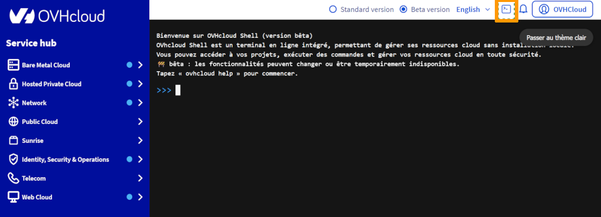

## Objectif

Ce guide explique comment accéder et utiliser OVHcloud CloudShell directement depuis l'espace client OVHcloud. Il présente un aperçu de l'environnement, ses principales fonctionnalités et les commandes essentielles pour vous aider à commencer à travailler efficacement avec vos ressources OVHcloud. À la fin de ce guide, vous serez en mesure de lancer CloudShell, de gérer vos projets cloud depuis la ligne de commande et de l'intégrer à vos workflows quotidiens.

## Qu'est-ce que OVHcloud CloudShell ?

OVHcloud CloudShell est un environnement en ligne de commande accessible directement depuis votre espace client OVHcloud. Pensez-y comme à un mini-ordinateur dans votre navigateur, prêt à l'emploi sans aucune installation.

Avec CloudShell, vous pouvez :

- Exécuter des commandes pour gérer vos ressources OVHcloud.
- Accéder à vos serveurs, projets et services en toute sécurité.
- Automatiser des tâches et des scripts sans quitter votre navigateur.

Il est conçu pour simplifier la gestion du cloud, l'accélérer et la rendre accessible même si vous n'êtes pas un expert en ligne de commande. Vous n'avez pas besoin d'installer quoi que ce soit : ouvrez simplement CloudShell et commencez à travailler.

## Avantages de l'utilisation de CloudShell

L'utilisation d'OVHcloud CloudShell directement depuis l'espace client OVHcloud offre des avantages clés pour la gestion de toute votre infrastructure OVHcloud, y compris le Public Cloud, Bare Metal, VPS, stockage, réseau, conteneurs, et plus encore :

1. **Aucune configuration locale requise :** Commencez immédiatement sans installer de SDK, d'outils CLI ou d'autres dépendances sur votre ordinateur. Idéal pour le dépannage rapide, les démonstrations ou l'accès temporaire.
2. **Environnement sécurisé et géré :** Accédez à toutes vos ressources OVHcloud en toute sécurité, avec des identifiants gérés automatiquement par OVHcloud. Fournit un environnement contrôlé et fiable pour vos opérations.
3. **Gestion unifiée :** Gérez le Public Cloud, les serveurs Bare Metal, les VPS, le stockage, le réseau, les conteneurs et d'autres services OVHcloud depuis un seul environnement en ligne de commande cohérent. Simplifie les opérations et garantit la cohérence sur toute votre infrastructure.
4. **Efficacité et productivité :** Automatisez les tâches courantes, exécutez des scripts et effectuez des opérations rapidement sans quitter le navigateur. Réduit la complexité opérationnelle et accélère vos workflows.
5. **Accessible depuis n'importe où :** L'accès en ligne vous permet de vous connecter depuis n'importe quel appareil disposant d'une connexion Internet. Idéal pour le travail à distance ou la gestion de ressources en déplacement.

**En résumé :** CloudShell centralise la gestion, améliore la productivité et offre un accès rapide, sécurisé et flexible à toute votre infrastructure OVHcloud, rendant les opérations cloud plus simples et plus efficaces.

## Prérequis

- Un [projet Public Cloud](/links/public-cloud/public-cloud) dans votre compte OVHcloud
- Accès au [OVHcloud Control Panel](/links/manager)

## En pratique

### Comment accéder à OVHcloud CloudShell

Connectez-vous au [OVHcloud Control Panel](/links/manager) et cliquez sur le bouton `Cloudshell`{.action} OVHcloud pour lancer le terminal.

{.thumbnail}

> [!primary]
>
> **Remarque :** Les utilisateurs sont déjà authentifiés avec leurs identifiants Customer Panel et ont un accès immédiat à leurs ressources, sans connexion supplémentaire requise.
>

### Comment utiliser OVHcloud CloudShell

Une fois OVHcloud CloudShell ouvert, vous pouvez utiliser la commande `help` pour afficher toutes les commandes et options disponibles :

```bash
help
```

La sortie `help` liste les commandes pour gérer votre infrastructure OVHcloud, y compris le Public Cloud, Bare Metal, VPS, stockage, réseau, conteneurs, et plus encore.

Exemple de sortie :

```bash
+------------------------------------------------------------------------------------------------------------------------------------+
|                                                                help                                                                |
+------------------------------------------------------------------------------------------------------------------------------------+
| Usage:                                                                                                                             |
| ovhcloud [command]                                                                                                                 |
|                                                                                                                                    |
| Available Commands:                                                                                                                |
| account                          Manage your account                                                                               |
| alldom                           Retrieve information and manage your AllDom services                                              |
| baremetal                        Retrieve information and manage your Bare Metal services                                          |
| cdn-dedicated                    Retrieve information and manage your dedicated CDN services                                       |
| cloud                            Manage your projects and services in the Public Cloud universe (MKS, MPR, MRS, Object Storage...) |
| dedicated-ceph                   Retrieve information and manage your Dedicated Ceph services                                      |
| dedicated-cloud                  Retrieve information and manage your DedicatedCloud services                                      |
| dedicated-cluster                Retrieve information and manage your DedicatedCluster services                                    |
| dedicated-nasha                  Retrieve information and manage your Dedicated NasHA services                                     |
| domain-name                      Retrieve information and manage your domain names                                                 |
| domain-zone                      Retrieve information and manage your domain zones                                                 |
| email-domain                     Retrieve information and manage your Email Domain services                                        |
| email-mxplan                     Retrieve information and manage your Email MXPlan services                                        |
| email-pro                        Retrieve information and manage your EmailPro services                                            |
| help                             Help about any command                                                                            |
| hosting-private-database         Retrieve information and manage your HostingPrivateDatabase services                              |
| iam                              Manage IAM resources, permissions and policies                                                    |
| ip                               Retrieve information and manage your IP services                                                  |
| iploadbalancing                  Retrieve information and manage your IP LoadBalancing services                                    |
| ldp                              Retrieve information and manage your LDP (Logs Data Platform) services                            |
| location                         Retrieve information and manage your Location services                                            |
| nutanix                          Retrieve information and manage your Nutanix services                                             |
| okms                             Retrieve information and manage your OKMS (Key Management Services)                               |
| overthebox                       Retrieve information and manage your OverTheBox services                                          |
| ovhcloudconnect                  Retrieve information and manage your OVHcloud Connect services                                    |
| pack-xdsl                        Retrieve information and manage your PackXDSL services                                            |
| sms                              Retrieve information and manage your SMS services                                                 |
| ssl                              Retrieve information and manage your SSL services                                                 |
| ssl-gateway                      Retrieve information and manage your SSL Gateway services                                         |
| storage-netapp                   Retrieve information and manage your Storage NetApp services                                      |
| support-tickets                  Retrieve information and manage your support tickets                                              |
| telephony                        Retrieve information and manage your Telephony services                                           |
| veeamcloudconnect                Retrieve information and manage your VeeamCloudConnect services                                   |
| veeamenterprise                  Retrieve information and manage your VeeamEnterprise services                                     |
| version                          Get OVHcloud CLI version                                                                          |
| vmwareclouddirector-backup       Retrieve information and manage your VMware Cloud Director Backup services                        |
| vmwareclouddirector-organization Retrieve information and manage your VMware Cloud Director Organizations                          |
| vps                              Retrieve information and manage your VPS services                                                 |
| vrack                            Retrieve information and manage your vRack services                                               |
| vrackservices                    Retrieve information and manage your vRackServices services                                       |
| webhosting                       Retrieve information and manage your WebHosting services                                          |
| xdsl                             Retrieve information and manage your XDSL services                                                |
|                                                                                                                                    |
| Flags:                                                                                                                             |
| -h, --help            help for ovhcloud                                                                                            |
| -e, --ignore-errors   Ignore errors in API calls when it is not fatal to the execution                                             |
| -j, --json            Output in JSON                                                                                               |
| -y, --yaml            Output in YAML                                                                                               |
|                                                                                                                                    |
| Use "ovhcloud [command] --help" for more information about a command.                                                              |
|                                                                                                                                    |
+------------------------------------------------------------------------------------------------------------------------------------+
```

Utilisez `ovhcloud [command] --help` pour obtenir des instructions détaillées sur n'importe quelle commande.

**Conseil clé :** CloudShell fournit un environnement prêt à l'emploi, sécurisé et entièrement authentifié pour gérer toutes vos ressources OVHcloud sans avoir à installer quoi que ce soit localement.

### Exemples de premières commandes

Pour commencer, vous pouvez lister tous vos projets Public Cloud en utilisant :

```bash
ovhcloud cloud project list
```

Cette commande vous donne un aperçu de tous vos projets et de leurs identifiants, vous aidant à identifier les ressources que vous pouvez gérer immédiatement.

Exemple de sortie :

```bash
+----+-------------------------------------+------------------+----------------------------------+--------+
|    |             description             |   projectName    |            project_id            | status |
+----+-------------------------------------+------------------+----------------------------------+--------+
| 1  | test-project                        | 1212121212121212 | 036c************************6f4c | ok     |
+----+-------------------------------------+------------------+----------------------------------+--------+
```

Une fois que vous avez votre ID de projet (obtenu via `ovhcloud cloud project list`), vous pouvez lister toutes les instances de ce projet :

```bash
ovhcloud cloud instance list --cloud-project <cloud-project>
```

Remplacez `<cloud-project>` par l'`project_id` réel de votre projet.

Exemple de sortie :

```bash
+----+-------------+--------------------------------------+-----------------------------------+-------------+--------+
|    | flavor.name |                  id                  |               name                |   region    | status |
+----+-------------+--------------------------------------+-----------------------------------+-------------+--------+
| 1  | b3-512      | fbbc9b79-****-****-****-************ | instance-test                     | SBG5        | ACTIVE |
+----+-------------+--------------------------------------+-----------------------------------+-------------+--------+
```

## Aller plus loin

Rejoignez notre [communauté d'utilisateurs](/links/community).

```