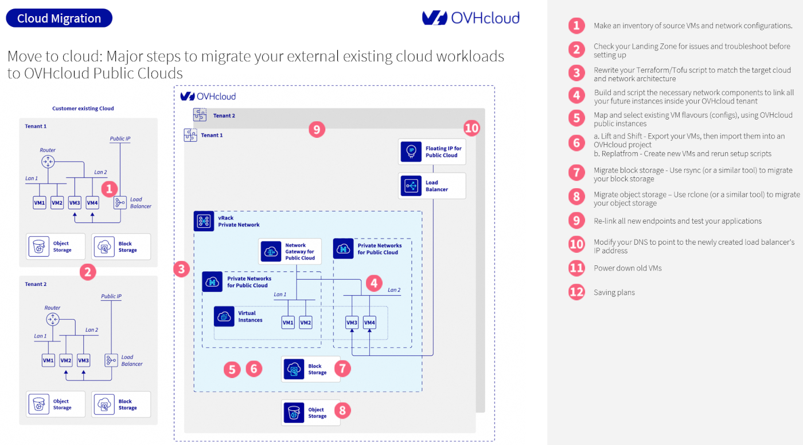

## Objective

This guide aims to educate and support customers in migrating their infrastructure to the OVHcloud Public Cloud using Infrastructure as a Service (IaaS).

It provides a step-by-step methodology for inventorying existing workloads, preparing a secure and scalable landing zone, and leveraging tools like Terraform/OpenTofu, Ansible, rclone, and rsync to automate deployment and data transfer.

The guide also outlines best practices for selecting compatible OVHcloud instance flavours, configuring networks, and ensuring service continuity during migration.

By following this guide, users can build a robust, cost-optimised, and cloud-native infrastructure aligned with OVHcloud’s IaaS ecosystem.

## Requirements

- Access to the [OVHcloud Control Panel](/links/manager).
- [Setting OpenStack environment variables](/pages/public_cloud/public_cloud_cross_functional/loading_openstack_environment_variables).
- Being familiar with [Terraform](/pages/public_cloud/public_cloud_cross_functional/how_to_use_terraform), if you intend using it.

## Instructions

Before going into detail on the major steps, the diagram below provides an overview of the main phases of a migration to OVHcloud Public Cloud.

{.thumbnail}

### 1. Inventory your source VMs, storage and network configuration

Before starting your cloud migration, it’s crucial to create a detailed inventory of all your current resources:

- **Virtual Machines (VMs)**: List all your VMs, grouping those that belong to the same application (for example: a web server, an application server, and a database). This approach helps you migrate applications one at a time, minimizing service disruptions.
- **Storage**: Identify your block storage volumes as well as your object storage buckets.
- **Network resources**: Map out your entire network topology, including Layer 2 (L2) and Layer 3 (L3) network layouts, routers, load balancers, and firewalls.

Also, list your subnets and associated VLAN IDs. This information will be essential to correctly set up your target network within the OVHcloud Public Cloud environment.

> [!primary]
>
> With OVHcloud’s vRack feature, you can create over 4000 VLANs and keep your existing IP addressing plan. This greatly simplifies network migration and avoids potential conflicts or the need to renumber IPs.
>

### 2. Check and prepare your Landing Zone

A Landing Zone is your foundational cloud environment where all your resources will run. Before migrating, it’s important to assess and configure this environment to ensure it meets best practices for scalability, security, and management.

This check involves reviewing key components such as:

- **Identity and Access Management (IAM)**: Ensure proper user roles and permissions are set up.
- **Network architecture**: Verify your network segmentation, subnets, VPNs, and load balancers are configured correctly.
- **Compliance and governance**: Confirm that policies are in place to meet your regulatory and organizational requirements.
- **Resource organization**: Design a clear structure with multiple accounts or projects to separate workloads effectively.

Use the inventory data from your VMs, storage, networks and security devices to fine-tune your cloud zoning and segmentation. Fixing any issues at this stage results in a Landing Zone that is secure, compliant, easy to manage and cost-efficient.

Finally, integrate monitoring, logging and security tools right from the start to build agile and future-proof operations.

For more detailed guidance on building an OVHcloud Landing Zone, please refer to this link: (LINK-TO-LZ-ArchRef).

### 3. Adapt your Terraform/OpenTofu configuration

Although OVHcloud’s Public Cloud is based on OpenStack, it also offers proprietary services like Managed Kubernetes and Managed Databases. Because of this, you will need to use specific OpenTofu or Terraform providers tailored for OVHcloud’s infrastructure.

You can build your Terraform/OpenTofu stacks using providers for [OpenStack](https://registry.terraform.io/providers/terraform-provider-openstack/openstack/latest/docs){.external}, OVHcloud, or S3-compatible services, depending on the resources you want to manage.

You will find our guide "[Using Terraform with OVHcloud](/pages/manage_and_operate/terraform/terraform-at-ovhcloud)" some examples to help you get started with creating your Terraform/OpenTofu configurations for your landing zone and cloud infrastructure.

### 4. Configure cloud network architecture in your Terraform stacks

Once your Terraform/OpenTofu setup is ready, you should script the core network components needed for your cloud environment. This includes defining:

- Networks and subnets.
- DHCP settings.
- Routers.
- Load balancers.

These components will connect and organize all your OVHcloud instances efficiently and securely. Proper network configuration is essential to ensure that your cloud resources communicate correctly and perform optimally.

### 5. Select corresponding OVHcloud instance flavours and services

Before deploying your workloads in the OVHcloud Public Cloud, you need to choose the instance types ("flavours") that best match your existing virtual machines (VMs). This ensures that your migrated applications will perform as expected.

To do this:

- Review your source VM configurations (CPU, RAM, storage, etc.).
- Choose the corresponding OVHcloud Public Cloud instances that meet those requirements.
- Select the availability type that suits your needs (1-AZ, 3-AZ, or Local Zone) depending on your desired level of resilience and latency

Once selected, note the technical identifiers of the instances (for example: b3-64, c3-128) so you can use them directly in your Terraform/OpenTofu configuration.

Don’t forget to do the same for:

- Gateways (for example: size M, L, XL).
- Load balancers, based on expected traffic and redundancy requirements.

This step ensures consistency between your existing environment and your future OVHcloud infrastructure.

### 6. Choose and execute your VM migration strategy

#### 6a. Perform a Lift and Shift migration

The Lift and Shift method allows you to migrate your existing virtual machines (VMs) without making significant changes to their configuration or architecture. It’s a fast way to move workloads to the OVHcloud Public Cloud with minimal reengineering.

To begin, export your source VMs from your current infrastructure. OVHcloud supports several image formats, including: ami, ari, aki, vhd, vmdk, raw, qcow2, vhdx, vdi, iso, and ploop.

Once exported, you need to upload the VM image to your OVHcloud project. To do this, make sure you have a local Python environment ready and install the OpenStack CLI (to do this, follow this [installation guide](https://docs.openstack.org/newton/user-guide/common/cli-install-openstack-command-line-clients.html){.external}). You’ll also need your API credentials to authenticate.

After uploading the image, you can deploy a new instance from it using the OVHcloud Control Panel, OpenStack CLI, or via Terraform/OpenTofu. You’ll find step-by-step instructions on how to import a VM image in our guide "[Uploading your own image](/pages/public_cloud/compute/upload_own_image)".

You can then connect the instance to your defined private network, attach block storage, and configure any required load balancers.

If you’re migrating several VMs, consider automating the process using scripts or infrastructure-as-code tools. You can also contact our [Professional Services team](/links/professional-services) to get support or delegate the migration process entirely.

#### 6b. Perform a replatforming with clean deployments

The replatform method involves creating new virtual machines in your OVHcloud Public Cloud environment and reinstalling your applications from scratch. This is ideal if you want a cleaner setup, or to take advantage of modern automation and infrastructure tools.

You can provision new instances using your Terraform/OpenTofu stacks or directly through the OVHcloud Control Panel, selecting the appropriate regions, availability zones and instance flavours.

Once your infrastructure is deployed, two possibilities:

- Use Ansible playbooks to automatically install and configure your applications.
- Set up your services manually on each instance.

Be sure to use the same applications versions as in your source environment to ensure compatibility with your existing data.

Once configuration is complete, migrate your data using tools like rsync, scp, or database utilities, and validate that everything is working as expected.

### 7. Migrate block storage using rsync (or a similar tool)

To move your block storage to OVHcloud, start by configuring your target storage volumes. You can do this either [manually on the instance](/pages/public_cloud/compute/create_and_configure_an_additional_disk_on_an_instance) or automatically using tools like Ansible.

Once your volumes are ready, use a tool such as [rsync](/pages/bare_metal_cloud/dedicated_servers/how-to-copy-data-from-one-dedicated-server-to-another-using-rsync) to copy data from your source infrastructure to the new OVHcloud environment. rsync ensures that files are transferred efficiently and can resume if interrupted.

This method allows you to migrate data progressively and validate it as you go.

If you need help setting up this process or automating it across multiple instances, you can contact the OVHcloud [Professional Services](/links/professional-services) team.

### 8. Migrate object storage using rclone (or a similar tool)

To transfer your object storage to OVHcloud, use a tool like rclone, which supports most S3-compatible services.

Start by ensuring you have the correct permissions to access both the source and destination buckets. Then:

- Install rclone on your local machine or a cloud instance.
- Configure access credentials for both environments (source and OVHcloud).
- Use rclone sync or rclone copy to migrate your data.

This method ensures reliable and resumable transfers for large datasets. Follow our guide [Object Storage - Use Object Storage with Rclone](/pages/storage_and_backup/object_storage/s3_rclone) for the necessary steps.

If your setup includes versioning, lifecycle rules, or other advanced features, or if you require automation, the OVHcloud [Professional Services](/links/professional-services) team can help you design a tailored migration process.

### 9. Re-link endpoints and validate applications

After migrating, update all your applications to use the new endpoints, including those for S3-compatible object storage.

Make sure every connection points to the correct OVHcloud resources.

Then, thoroughly test your entire workflow and run all integration tests to verify that your applications works correctly in the new environment.

### 10. Update DNS records

Once you have confirmed that your applications are running smoothly, update your DNS records to point to the IP address of your new OVHcloud load balancer.

After making the DNS change, rerun your tests to ensure all services are fully functional and accessible.

### 11. Decommission legacy infrastructure

After verifying that your new OVHcloud environment is fully operational, you can safely shut down and decommission your old infrastructure.

Ensure all data and services have been successfully migrated and backed up before powering off legacy systems.

### 12. Optimise with Savings Plans

To manage and reduce your cloud expenses, leverage FinOps best practices. OVHcloud offers various cost optimization solutions and [Savings Plans](/links/public-cloud/savings-plan) tailored to your usage patterns.

Explore our guide "[How do Savings Plans work?](/pages/public_cloud/public_cloud_cross_functional/savings_plans)" for detailed guidance on how to control and optimize your cloud spending effectively.

## Go Further

If you need training or technical assistance to implement our solutions, contact your sales representative or click on [this link](/links/professional-services) to get a quote and ask our Professional Services experts for assisting you on your specific use case.

Join our [community of users](/links/community) and visit our [Discord channel](https://discord.gg/ovhcloud).