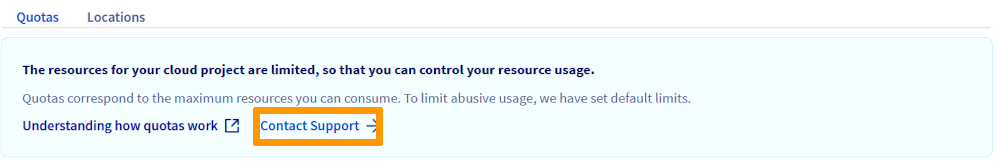
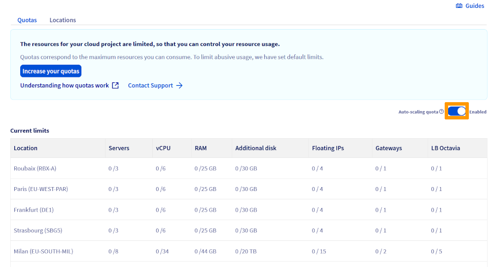
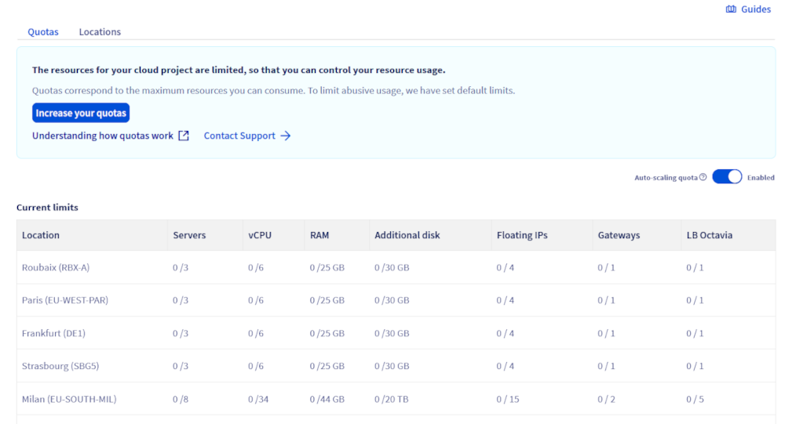
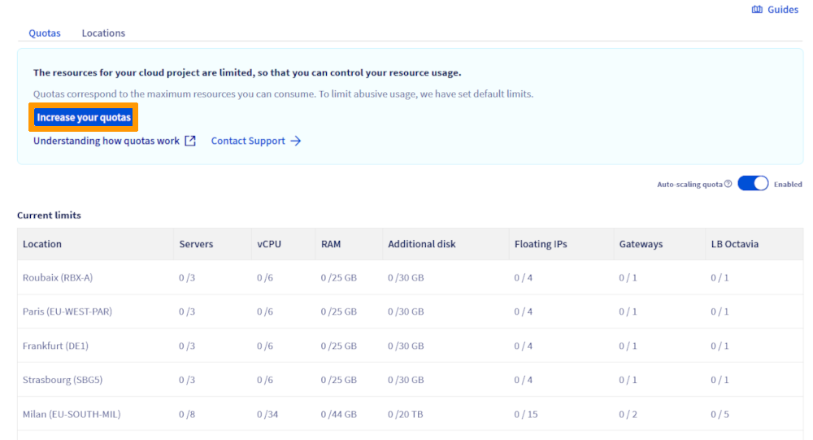
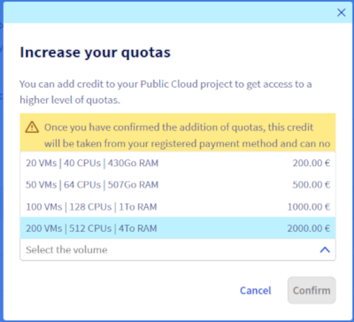

## Objective

By default, the Public Cloud projects as well as the resources total (RAM, CPU, disk space, number of instances, etc.) you can use are limited for security reasons.

To be able to use additional resources and projects, the quotas need to be increased.

**This guide explains how to request and increase a Public Cloud quota in the OVHcloud Control Panel.**

## Requirements

- Access to the [OVHcloud Control Panel](/links/manager)
- A [valid payment method](/pages/account_and_service_management/managing_billing_payments_and_services/manage-payment-methods) registered in your OVHcloud account

## Instructions

### Increasing your resources quota

In compliance with internal criteria (seniority, existence of paid invoices, etc.), you are now free to request quota increases for your Public Cloud projects resources directly from your OVHcloud Control Panel.

You can increase your resources quota manually or automatically.

> [!primary]
> If you need to increase your quota and the `Increase your quota!`{.action} button is not available in your Control Panel, click on the `Contact Support`{.action} button.
>

{.thumbnail}

#### Increasing your resources quota automatically with the "Auto-scaling quota" feature

This option allows you to request an automatic and gradual increase in your resource quota. The quota will be adjusted based on your actual usage (if you exceed 60% of your current quota for 30 consecutive days), as well as a set of internal and financial criteria.

> [!primary]
>
> **Note:** This process is not suitable for rapid quota increases.
>

Log in to the [OVHcloud Control Panel](/links/manager), go to the `Public Cloud`{.action} section and select the Public Cloud project concerned.

In the left-hand sidebar, click on `Quota & Regions`{.action} under **Settings**.

Click on the `?`{.action} button for more information on this feature, then click on the `toggle icon`{.action} to switch the status to "**Enabled**".

{.thumbnail}

Once activated, auto-scaling will gradually increase your project's quota based on your actual needs.

#### Increasing your resources quota manually

This procedure allows for a rapid and significant increase in your quotas (e.g., rapid scaling, GPU instances, etc.). This method is based on the immediate purchase of credit, from which all cloud consumption will be automatically deducted.

It is possible to purchase different amounts of credit, as shown in the table below:

<!-- array price -->

Log in to the [OVHcloud Control Panel](/links/manager), go to the `Public Cloud`{.action} section and select the Public Cloud project concerned.

In the left-hand sidebar, click on `Quota & Regions`{.action} under **Settings**.

{.thumbnail}

This page shows a summary of your project's current quotas by region. A warning appears as soon as a resource reaches 80% of its quota.

Click on the `Increase your quota!`{.action} button.

{.thumbnail}

Next, click on the drop down arrow next to "Select the volume" to view the list of quotas currently available to upgrade your resources to. This section also shows the amount to pay in order to benefit from these resources.

{.thumbnail}

The table below shows the resources obtained for each quota:

|Quota|Instances|CPU/Cores|RAM (Gb)|Volume Size (TB)|Volumes|Backup|Backup Size (TB)|Floating IPs|Octavia Load Balancer|Gateway (Routers)|
|---|---|---|---|---|---|---|---|---|---|---|
|20 VMs|20|40|430|20|200|1200|120|30|10|4|
|50 VMs|50|64|507|20|500|3000|300|75|25|10|
|100 VMs|100|128|1015|40|1000|6000|600|300|50|10|
|200 VMs|200|512|4063|80|2000|12000|1200|600|50|50|

Once you have selected your volume, click on `Confirm`{.action}. Your payment will be processed as soon as possible.

> [!warning]
>
> **Any manual quota increase will be billed immediately.**.
>
> Once you click the `Confirm`{.action} button, the order will be automatically created and charged to your payment method.
>

### Increasing the quota of your Public Cloud projects

There are two main situations where you may need a quota adjustment:

1. **Maximum number of projects reached:** If you have reached the maximum number of Public Cloud projects allowed in your customer account and want to create new ones, you must submit a request to our support team.

2. **Other types of quota requests:** For any other limits (CPU, RAM, storage, etc.) or specific needs related to your Public Cloud projects, you can also contact support to request an increase.

> [!primary]
>
> **Note:** Quota requests are processed manually by our team. Processing times may vary depending on the complexity of the request. We recommend that you submit your request as soon as possible to avoid any delays in your projects.

To speed up processing, please specify the following in your request:

- The type of quota to be increased (number of projects, resources, etc.)
- The intended use and justification for the increase
- The desired period or duration of the increase

### Specific quotas and special resources

For certain resources or services, specific quotas may apply. For more information:

**S3 quota:** see the official documentation [Object Storage - Technical Limitations](/pages/storage_and_backup/object_storage/s3_limitations)

**Managed Kubernetes Service (MKS) quota:** see the official documentation [ETCD Quotas, usage, troubleshooting and error](/pages/public_cloud/containers_orchestration/managed_kubernetes/etcd-quota-error)

## Go further

Join our [community of users](/links/community).
