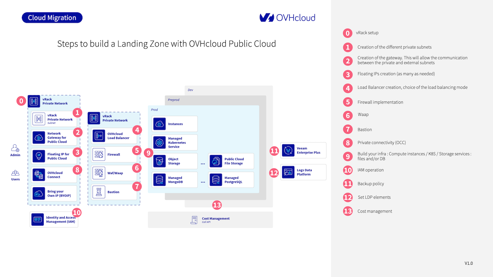

## Objective

This guide helps OVHcloud Public Cloud users design and deploy a secure, scalable Landing Zone by outlining key components and best practices.

It covers core networking setup (vRack, subnets, gateways, Floating IPs), traffic management (load balancer), and security layers (firewall, WAAP, Bastion).

It also includes guidance on infrastructure choices, IAM, backups, logging, private connectivity, and cost-control, offering a clear foundation for production-ready cloud environments.

## Requirements

- Access to the [OVHcloud Control Panel](/links/manager).
- [Setting OpenStack environment variables](/pages/public_cloud/public_cloud_cross_functional/loading_openstack_environment_variables).
- Being familiar with [Terraform](/pages/public_cloud/public_cloud_cross_functional/how_to_use_terraform), if you intend using it.
- Basic understanding of [cloud networking concepts](/links/public-cloud/network) (e.g., subnets, gateways, Floating IPs).

## Instructions

To help you design a secure, scalable, and production-ready cloud foundation, the following diagram illustrates the key steps in building a Landing Zone on the OVHcloud Public Cloud:

{.thumbnail}

Each numbered step corresponds to a component or action in the setup process. Below are detailed explanations for each:

### 0. vRack setup

A vRack (Virtual Rack) is the foundational component that allows private networking between resources.

When you create a Public Cloud project, OVHcloud automatically provisions a vRack for you. This virtual layer isolates your internal communication and enables secure interconnections between services (instances, databases, gateways, etc.) across regions and even between different OVHcloud services (Bare Metal, Hosted Private Cloud).

You will use the vRack to attach all private subnets and connect public and private-facing services securely.

### 1. Create a private subnet

Inside the vRack, define private subnets to segment your network. For example, you can have separate subnets for frontend, backend, databases, and bastions.

- Subnets can be created in different regions.
- Choose appropriate CIDR blocks to avoid overlap and ease future scaling.
- Subnets can be layer 2 (flat) or layer 3 (routed with gateway).

Subnet creation is done from the OVHcloud Control Panel, via the OpenStack API, or using Terraform.

### 2. Set up a Gateway

To enable outbound or cross-zone communication for your private subnet, set up a Network Gateway for Public Cloud. It acts as a NAT device to allow traffic from your private subnet to the internet or other public resources.

- Required for downloading packages, external API calls, etc.
- You can route traffic through the gateway to a firewall or WAAP if needed.
- Each gateway is regional and connects only subnets from that region.

Follow [this guide](/pages/public_cloud/public_cloud_network_services/getting-started-02-create-private-network-gateway) to set up a gateway.

### 3. Assign Floating IPs

A Floating IP is a public IP that you can attach to a resource (usually an instance or load balancer) within a private network.

Use cases include:

- Exposing a single VM for SSH access (e.g., for a bastion)
- Public-facing applications hosted inside a private subnet
- Failover and migration between zones

Use Floating IPs to expose selected private resources (e.g., instances, services) to the public internet securely. Follow [this guide](/pages/public_cloud/public_cloud_network_services/getting-started-03-attach-floating-ip-to-instance) to link a Floating IP.

### 4. Set up a Load Balancer

An OVHcloud Load Balancer lets you distribute traffic between multiple backend instances in different availability zones.

- Choose the load balancing mode: HTTP(S), TCP, or passthrough.
- Supports health checks, SSL termination, and sticky sessions.
- Integrated with Floating IPs for public exposure or stays private.

This is essential for creating highly available applications and distributing load intelligently.

Follow [this guide](/pages/public_cloud/public_cloud_network_services/getting-started-01-create-lb-service) to set up and use a Load Balancer.

### 5. Implement firewall rules

Although OVHcloud doesn’t provide a built-in firewall-as-a-service, you can:

- Use Security Groups on each instance (similar to AWS)
- Deploy a third-party virtual firewall like Stormshield in your vRack
- Firewall solutions should inspect north-south (ingress/egress) and east-west (internal) traffic where applicable.

Follow [this guide](/pages/public_cloud/public_cloud_network_services/tutorial-stormshield_network_security_vrack) to set up and use a Stormshield firewall.

### 6. Add WAAP protection

To protect your web and API applications, deploy a Web Application and API Protection (WAAP) service like Ubika.

- Shields against DDoS, SQL injection, XSS, and OWASP Top 10 threats
- Offers bot management, WAF, API gateway, and rate limiting
- Can be inserted transparently between your Load Balancer and backend services

Follow [this guide](/pages/public_cloud/public_cloud_network_services/tutorial-ubika_vrack) to deploy a WAAP protection with Ubika.

### 7. Configure a Bastion Host

A Bastion is a secure access point to manage instances located in private subnets. OVHcloud provides a hardened, audited open-source bastion tool for this purpose.

Use it to:

- Enforce secure, audited SSH access
- Define fine-grained user permissions (LDAP, AD, IAM)
- Monitor access logs and session replay

See [documentation about Bastion](https://ovh.github.io/the-bastion/index.html) on our GitHub account.

### 8. Enable private connectivity (OCC)

If you need to connect your on-premise infrastructure or other OVHcloud services securely to the Landing Zone, use OVHcloud Connect (OCC).

- Dedicated Layer 2 or Layer 3 link between your site and OVHcloud POPs
- Bypasses the public internet, ideal for compliance and latency-sensitive apps
- Integrated into the vRack

See [this documentation](/pages/network/ovhcloud_connect/occ-direct-control-panel).

### 9. Deploy your infrastructure

With networking and security in place, deploy your core services:

- Compute: Public Cloud Instances (GP/CPU/GPU)
- Containers: Managed Kubernetes Service
- Storage:
    - Block storage (via volumes)
    - Object Storage (S31-compatible)
    - Public Cloud File Storage (NFSv4)
- Databases: Managed MongoDB, PostgreSQL, MySQL, Kafka

These services can be managed using the Control Panel, OpenStack CLI, or Terraform.

### 10. Set up Identity and Access Management (IAM)

IAM is essential for defining who can access what and under which conditions. With OVHcloud IAM, you can:

- Create and assign roles and policies per user/group
- Integrate with SAML, OIDC, or use native IAM
- Isolate access by project, service, or region

See the [related documentation](/pages/public_cloud/public_cloud_cross_functional/securing_and_structuring_projects).

### 11. Define backup policies

Ensure business continuity by protecting critical data and workloads:

- Snapshots: Ideal for short-term recovery or pre-update backups
- Instance backups: Full images for rollback or cloning
- Veeam Enterprise: Available for advanced backup/restore workflows

Define a backup strategy aligned with your RPO (Recovery Point Objective) and RTO (Recovery Time Objective).

### 12. Centralize logging with Logs Data Platform

Logs Data Platform (LDP) allows you to:

- Aggregate logs from apps, systems, and network devices
- Create dashboards and alerts (Kibana, Grafana-compatible)
- Retain logs based on compliance needs (GDPR, ISO 27001, etc.)

This is key for observability, security audits, and troubleshooting. Follow [this documentation](/pages/manage_and_operate/observability/logs_data_platform/getting_started_quick_start).

### 13. Implement cost control and monitoring

Keep control of your cloud spending with:

- Budget alerts and consumption dashboards
- API access to cost usage reports
- Daily/hourly resource tracking

Use tagging, IAM roles, and alerts to link costs to teams, environments, or services. For more information, read [this documentation](/pages/public_cloud/public_cloud_cross_functional/analyze_billing).

## Go Further

If you need training or technical assistance to implement our solutions, contact your sales representative or click on [this link](/links/professional-services) to get a quote and ask our Professional Services experts for assisting you on your specific use case.

Join our [community of users](/links/community) and visit our [Discord channel](https://discord.gg/ovhcloud).

_1: S3 is a trademark of Amazon Technologies, Inc. OVHcloud’s service is not sponsored by, endorsed by, or otherwise affiliated with Amazon Technologies, Inc._