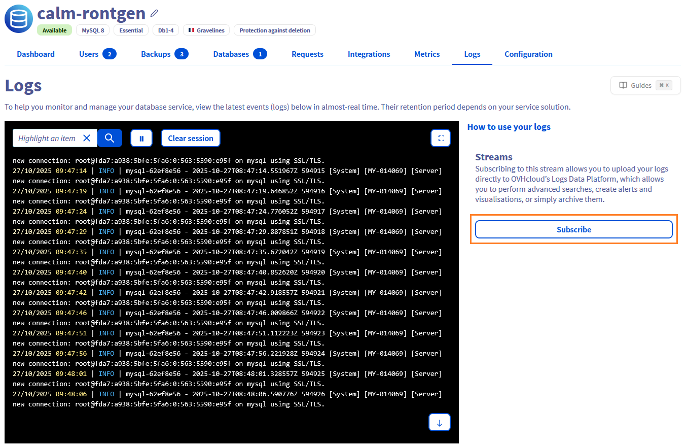
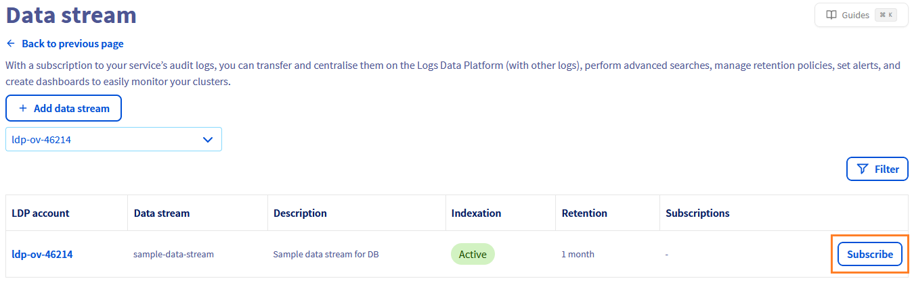
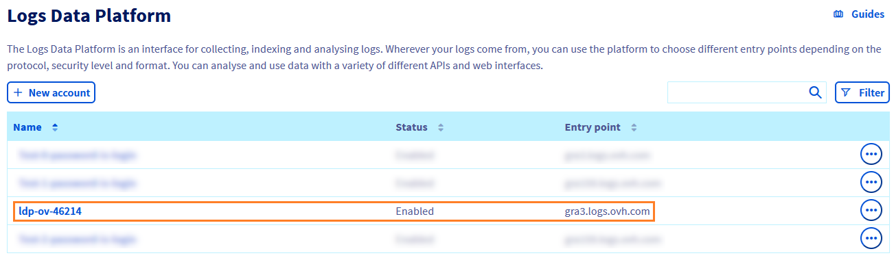
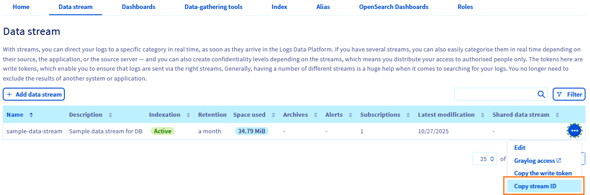
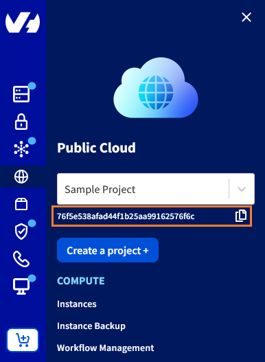
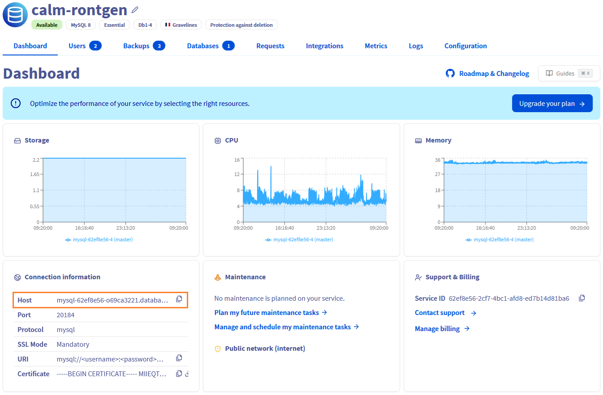
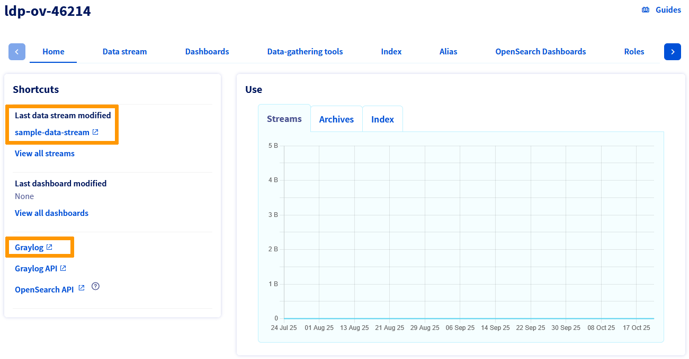
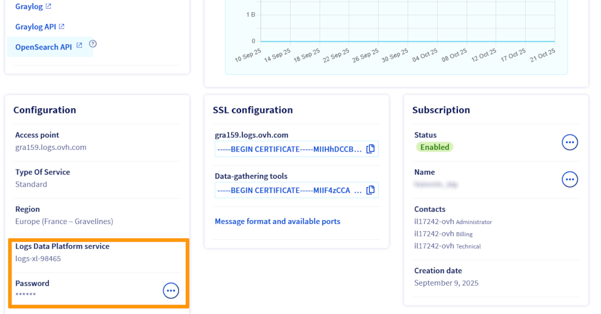
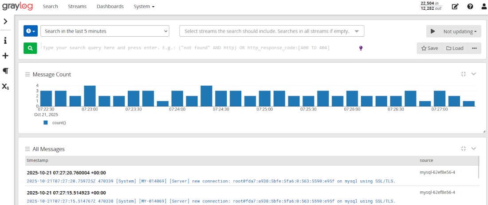
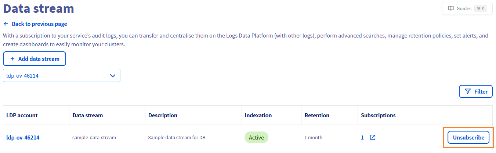

## Objective

Public Cloud managed databases allow you to send logs of your service to your own Logs Data Platform (LDP) data stream.

**This guide explains how to forward service logs to your own LDP stream with the OVHcloud API.**

## Requirements

- Access to the [OVHcloud Control Panel](/links/manager)
- A [Public Cloud database service](/links/public-cloud/databases) up and running
- Access to the [OVHcloud API](/links/console)
- A Logs Data Platform account within this OVHcloud account with at least one destination stream configured
    - If you are not familiar with all the LDP *Stream* configuration possibilities, simply create a new one with the default options (indexing & websocket enabled, long-term storage disabled) for the purpose of this guide.
- A running database service

## Instructions

### Create your subscription

> [!tabs]
> Via the OVHcloud Control Panel
>> On the database instance page, go to the `Logs`{.action} section and click the `Subscribe`{.action} button.
>>
>> {.thumbnail}
>>
>> Select the relevant LDP account by clicking the `Subscribe`{.action} button.
>>
>> {.thumbnail}
>>
>> The logs will then start to be forwarded to your LDP stream.
>>
> Via the OVHcloud API
>>
>> 1\. Retrieve the required information
>>
>> **Retrieve your LDP destination `streamId`:**
>>
>> Log in to the [OVHcloud Control Panel](/links/manager), go to the `Identity, Security & Operations`{.action} section. In the left-hand menu, select `Logs Data Platform`{.action} then click on the relevant LDP instance.
>>
>> {.thumbnail}
>>
>> Go to the `Data stream`{.action} tab.
>>
>> {.thumbnail}
>>
>> Choose your target stream and click on `Copy stream ID`{.action}.
>>
>> **Retrieve your LDP destination `serviceName`:**
>>
>> - This refers to your Public Cloud project ID. You can retrieve it in the Public Cloud section of your project.
>>
>> {.thumbnail}
>>
>> **Retrieve your `clusterId`:**
>>
>> Log in to the [OVHcloud Control Panel](/links/manager), open the `Public Cloud`{.action} section and select the Public Cloud project concerned. In the left-hand menu, click on `Databases`{.action}, then choose the database instance you want to manage.
>>
>> In the cluster details, you can find the `Service ID` field, which corresponds to the cluster ID.
>>
>> {.thumbnail}
>>
>> 2\. Start by retrieving the types of logs available for your database cluster with the following API call:
>>
>> > [!api]
>> >
>> > @api {v1} /cloud GET /cloud/project/{serviceName}/database/{engine}/{clusterId}/log/kind
>> >
>>
>> This will return the list of valid kind values you can use when subscribing to logs.
>>
>> 3\. Once you know the valid kind, use it to subscribe to a log stream with this API call:
>>
>> > [!api]
>> >
>> > @api {v1} /cloud POST /cloud/project/{serviceName}/database/{engine}/{clusterId}/log/subscription
>> >
>>
>> ```console
>> body : {
>>     kind: <log_type_from_previous_call>
>>     streamId: <your_stream_id>
>> }
>> ```
>>
>> The logs will then start to be forwarded to your LDP stream.
>>

### Find logs in Graylog

On the LDP page, click the `sample-data-stream`{.action} button (the last data stream modified when you previously subscribed to it), or click the `Graylog`{.action} button.

{.thumbnail}

You need to log in using your Graylog credentials. You can retrieve them from the LDP details page, in the `Configuration` section. The login corresponds to the value shown on the `Logs Data Platform service` line, and the password is displayed under `Password`.

{.thumbnail}

Once connected, you can view your service logs in your Graylog stream.

{.thumbnail}

You can also use the following Graylog queries for more granular filtering:

#### MongoDB

Query: `cluster: "<HostID>"`

You can find this `HostID` in your OVHcloud Control Panel:

- In `Login information` switch `Service` to `mongodb`
- Now you can see the `Host` field with the format `<HostID>.database.cloud.ovh.net`

#### Other Engines

Query: `clusterID: "<Engine>-<HostID>"`

You can find this `HostID` in your OVHcloud Control Panel:

- Find the Cluster ID formatted as a UUID (AAAAAAAA-BBBB-CCCC-DDDDDDDDDDDD)
- `HostID` is the first part of the UUID (AAAAAAAA)

### Delete subscription

You have 2 methods to delete a subscription:

> [!tabs]
> Via the OVHcloud Control Panel
>> In the subscription page of the database instance, click the `Unsubscribe`{.action} button.
>>
>> {.thumbnail}
>>
> Via the OVHcloud API
>>
>> - You can delete subscriptions using the `subscriptionId` concerned in this API call:
>>
>> > [!api]
>> >
>> > @api {v1} /cloud DELETE /cloud/project/{serviceName}/database/{engine}/{clusterId}/log/subscription/{subscriptionId}
>> >
>>

- If you delete your database service, all subscriptions of this service are deleted automatically.

## We want your feedback!

We would love to help answer questions and appreciate any feedback you may have.

If you need training or technical assistance to implement our solutions, contact your sales representative or click on [this link](/links/professional-services) to get a quote and ask our Professional Services experts for a custom analysis of your project.

Are you on Discord? Connect to our channel at <https://discord.gg/ovhcloud> and interact directly with the team that builds our databases service!
