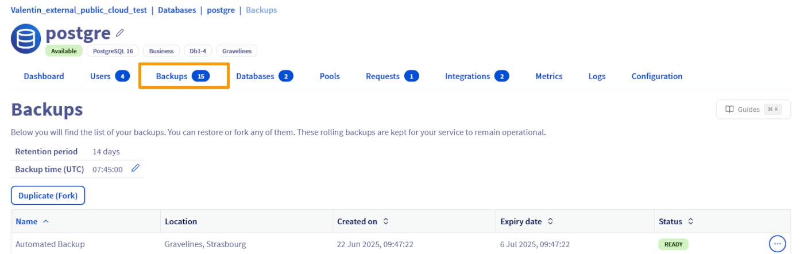
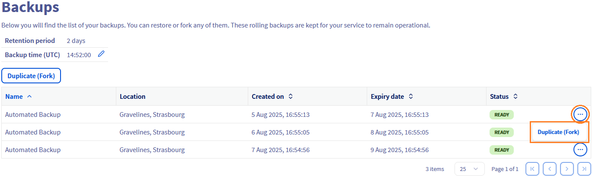
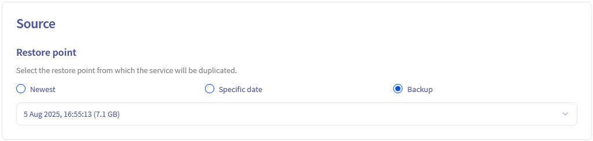
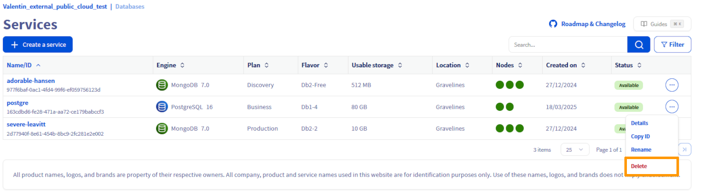

## Objective

OVHcloud Public Cloud Databases can be deployed with different architectures to meet varied needs for availability and resilience. This guide is specifically designed to walk you through the migration of your existing database service from a Single Availability Zone (1AZ) configuration to a Three Availability Zone (3AZ) architecture. You'll discover the detailed steps to perform this transfer, ensuring high availability and improved fault tolerance for your critical applications.

## Requirements

- A [Public Cloud project](/links/public-cloud/public-cloud) in your OVHcloud account
- Access to the [OVHcloud Control Panel](/links/manager) or to the [OVHcloud API](/links/api)
- Have an existing database service deployed in a Single Availability Zone (1AZ).
- Have a 3AZ region activated within your Public Cloud project.

## Why move to 3AZ ?

Migrating your database service to a Three Availability Zone (3AZ) deployment significantly enhances its resilience, high availability, and disaster recovery capabilities. In a 3AZ setup, your data is synchronously replicated across three distinct availability zones within the same region. This architecture ensures that in the event of an outage in one zone, your database service can automatically fail over to another operational zone with minimal downtime and no data loss.

For more detailed information on the deployment modes and their technical specifications, please refer to our dedicated guide: [Comparison of Public Cloud Databases Deployment Modes - Understanding 3-AZ / 1-AZ](/pages/public_cloud/public_cloud_databases/databases_18_regions_comparison).

## Instructions

### Move engine instance to 3AZ

> [!tabs]
> Via the OVHcloud Control Panel
>> To move a database service from a 1AZ to a 3AZ region, log in to the OVHcloud Control Panel and open your Public Cloud project. Click `Databases`{.action} in the left navigation bar, select your engine instance then click the `Backups`{.action} tab.
>>
>> 
>>
>> Choose the backup from which you wish to fork, , click on the `...`{.action} button and click on the `Duplicate(fork)`{.action} button.
>>
>> 
>>
>> Select the Restore point named `Backup`{.action}.
>>
>> 
>>
>> Select your `plan`{.action} for the engine instance.
>>
>> 
>>
>> Select a `3AZ region`{.action}.
>>
>> 
>>
>> Select the `node type`{.action} for the engine instance.
>>
>> 
>>
>> If you need, you can configure additional storage and connectivity settings, then verify the IP addresses to whitelist (the list is pre-filled by default with the origin service's configuration).
>>
>> 
>>
>> When you have completed your configuration, click on the `Order`{.action} button. 
>>
>> 
>>
> Via the OVHcloud API
>> > [!primary]
>> >
>> > To interact with your Public Cloud Databases services via the OVHcloud API, make sure you've mastered the basics first by consulting our guide: [Public CLoud Databases - Getting started with APIs](/pages/public_cloud/public_cloud_databases/databases_02_order_api).
>> >
>>
>> to find the backup id of an engine instance, use this following API call:
>>
>> > [!api]
>> >
>> > @api {v1} /cloud GET /cloud/project/{serviceName}/database/postgresql/{clusterId}/backup
>> >
>>
>> this call retrieves the backup list of the engine instance concerned. They are listed in order from the most recent backup to the oldest.
>>
>> If you want to check the information on a particular backup, you can use this API call:
>>
>> > [!api]
>> >
>> > @api {v1} /cloud GET /cloud/project/{serviceName}/database/postgresql/{clusterId}/backup/{backupId}
>> >
>>
>> To create your engine instance from one backup, use this following API call:
>>
>> > [!api]
>> >
>> > @api {v1} /cloud POST /cloud/project/{serviceName}/database/postgresql
>> >
>>
>> An example of a `body` for this API call:
>>
>> > [!warning]
>> >
>> > The old field named `backup` is deprecated and replaced by `forkFrom`.
>> >
>>
>> ```console
>> body : {
>>   "backups": {
>>     "regions": [
>>       "EU-WEST-PAR"                                        # Regions on which the backups are stored
>>     ],
>>     "time": "15:04:05"                                     # Time on which backups start every day
>>   },
>>   "disk": {
>>     "size": 80 # Service disk size 
>>   },
>>   "forkFrom": {
>>     "backupId": "********-****-****-****-3684de51065d",    # the previously recovered ID of the backup
>>     "serviceId": "********-****-****-****-ce179babccf3"    # the id of the engine instance to which this backup belongs
>>   },
>>   "maintenanceTime": "15:04:05",                           # Time on which maintenances can start every day
>>   "nodePattern": {                                         # Pattern definition of the nodes in the cluster, not compatible with nodesList
>>     "flavor": "db1-4",
>>     "number": 2,
>>     "region": "EU-WEST-PAR"
>>   },
>>   "plan": "business",
>>   "version": "16"
>> }
>> ```
>>

### Validate the deployment

After your new 3AZ database service has been successfully provisioned, it's crucial to validate its deployment and ensure your applications can connect to it.

1. Test the connection to your new service:

- Use a database client (e.g., psql for PostgreSQL, mysql for MySQL) or a simple script to verify that you can connect to the new 3AZ service's endpoint using its credentials.
- Confirm that your data has been successfully migrated and is accessible.

2. Configure your application to use the new service:

- Update your application's configuration files or environment variables to point to the new 3AZ database service's connection string (host, port, username, password).
- Restart your application to apply the changes.
- Thoroughly test your application's functionality to ensure it operates correctly with the new database endpoint.

### Clean up

Once you've fully validated that your application is working correctly with the new 3AZ database service, and you're confident all data has been transferred and is accessible, you can proceed with deleting the old 1AZ service.

This step is crucial to avoid unnecessary costs and maintain a clean infrastructure.

Follow this instructions to delete the old 1AZ service:

> [!tabs]
> Via the OVHcloud Control Panel
>> Navigate to your list of engine instances, click on the `...`{.action} button on the engine instance line and click on the `Delete`{.action} button to permanently delete the service.
>>
>> 
>>
> Via the OVHcloud API
>> To delete your engine instance, use the following API call:
>>
>> > [!api]
>> >
>> > @api {v1} /cloud DEL /cloud/project/{serviceName}/database/postgresql/{clusterId}
>> >
>>

cloud/project/{serviceName}/database/postgresql/{clusterId}

## We want your feedback!

We would love to help answer questions and appreciate any feedback you may have.

If you need training or technical assistance to implement our solutions, contact your sales representative or click on [this link](/links/professional-services) to get a quote and ask our Professional Services experts for a custom analysis of your project.

Are you on Discord? Connect to our channel at <https://discord.gg/PwPqWUpN8G> and interact directly with the team that builds our databases service!