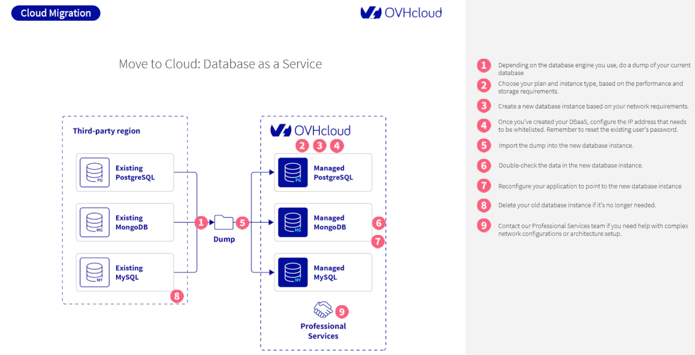

## Objectifs

Fournir des instructions étape par étape pour migrer vos bases de données vers le service Database as a Service (DBaaS) d’OVHcloud, en utilisant soit la méthode classique dump & restore, soit la réplication PostgreSQL en direct, selon vos contraintes de disponibilité et de performance.

## Prérequis

- Un projet [Public Cloud](/links/public-cloud/public-cloud) dans votre compte OVHcloud
- Être connecté à l'[espace client OVHcloud](/links/manager) ou à l'[API OVHcloud](/links/api)

## En pratique

### Via la méthode classique dump & restore

Cette méthode nécessite l’arrêt de votre application. Veuillez noter qu’une période d’indisponibilité surviendra pendant la migration.

1. Générez un dump de votre base de données selon les exigences spécifiques de votre moteur de base de données.

2. Déterminez le plan et le type d’instance appropriés en fonction des besoins de performance et de stockage de votre charge de travail.

3. Créez une nouvelle instance de base de données en fonction de vos besoins réseau, en suivant ce guide

4. Après la création de l’instance DBaaS, définissez les adresses IP à mettre sur liste blanche et réinitialisez le mot de passe des utilisateurs existants.

5. Importez le dump de la base de données dans la nouvelle instance. La procédure exacte dépend du moteur utilisé (PostgreSQL, MySQL, MongoDB, etc.). Référez-vous aux instructions spécifiques au moteur pour connaître les commandes et options correctes d’importation.

6. Vérifiez minutieusement le contenu de la nouvelle instance de base de données pour vous assurer que les données importées correspondent bien à la base source.

7. Modifiez la configuration de votre application afin qu’elle se connecte à la nouvelle instance de base de données.

8. Supprimez l’ancienne instance de base de données une fois que vous avez confirmé qu’elle n’est plus utilisée.

9. Contactez notre [Professional Services team](https://www.ovhcloud.com/en/professional-services/) pour obtenir de l’aide sur des configurations réseau complexes ou la mise en place de votre architecture.

### Via Live ou hot migration with PostgreSQL

Actuellement, la migration en live ou en hot migration est uniquement prise en charge pour les bases de données PostgreSQL d’OVHcloud. Cette méthode permet de s’abonner de manière asynchrone à une base de données externe existante et de créer une nouvelle instance qui en reproduit les données via la réplication logique.

> [!primary]
>
> Avant de lancer la réplication, assurez-vous que le schéma de la base de données existante a été créé dans la nouvelle instance.
>

Pour des instructions détaillées sur la configuration de la réplication logique, consultez le guide : [guide Aiven](https://aiven.io/docs/products/postgresql/howto/setup-logical-replication){.external}.

Si votre configuration est complexe ou implique des besoins spécifiques, contactez notre équipe [Professional Services team](https://www.ovhcloud.com/en/professional-services/) pour obtenir de l’aide.

## Nous attendons votre retour !

Nous serions ravis de répondre à vos questions et apprécions tout retour que vous pourriez nous faire.

Si vous avez besoin de formation ou d’assistance technique pour mettre en œuvre nos solutions, contactez votre responsable commercial ou cliquez sur ce lien [this link](/links/professional-services) pour obtenir un devis et demander à nos experts Professional Services une analyse personnalisée de votre projet.

Vous êtes sur Discord ? Rejoignez notre chaîne via <https://discord.gg/ovhcloud> et interagissez directement avec l’équipe qui développe notre service de bases de données !