## Objectives

Apache Kafka is an open-source and highly resilient event streaming platform based on 3 main capabilities:

- write or read data to/from stream events;
- store streams of events;
- process streams of events.

You can get more information on Kafka from the [official Kafka website](https://kafka.apache.org/intro){.external}.

This guide explains how to successfully configure Public Cloud Databases for Kafka via the OVHcloud Control Panel. 

## Requirements

- access to the [OVHcloud Control Panel](/links/manager)
- a [Public Cloud project](/links/public-cloud/public-cloud) in your OVHcloud account

## Instructions

### Subscribe to the service

Log in to your [OVHcloud Control Panel](/links/manager) and switch to `Public Cloud`{.action} in the top navigation bar. After selecting your Public Cloud project, click on `Data Streaming`{.action} in the left-hand navigation bar under **Databases & Analytics**.

Click the `Create a service`{.action} button.

#### Select your analytics service

Click on the type of analytics service you want to use and its version.
A random name is generated for your service that can change in this step or later. 

{.thumbnail}

#### Select a datacentre

Choose the geographical region of the datacentre where your service will be hosted and the deployment mode (1-AZ vs 3-AZ).

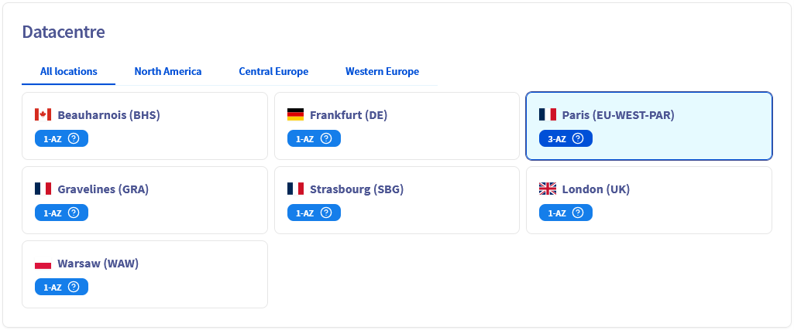{.thumbnail}

#### Select a plan

In this step, choose an appropriate service plan. If needed, you will be able to upgrade or downgrade the plan after creation.

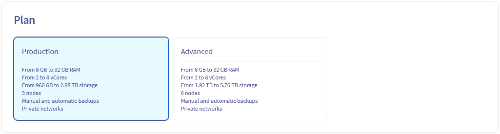{.thumbnail}

Please visit the [capabilities page](/products/public-cloud-data-analytics) of your selected analytics service for detailed information on each plan's properties.

#### Select the instance

Choose the instance type for the nodes of your service, you will be able to change it afterward. The number of nodes depends on the plan previously chosen.

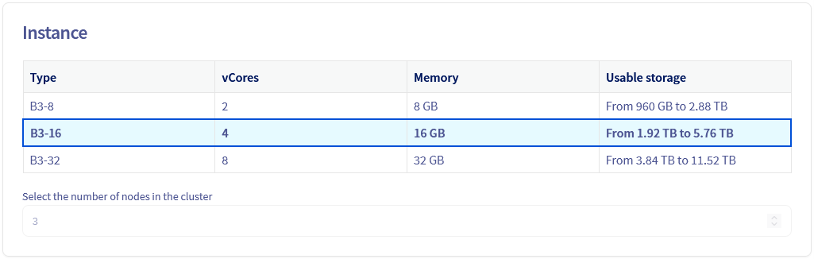{.thumbnail}

#### Select the storage

Storage could be scaled up to 3 time the base storage.

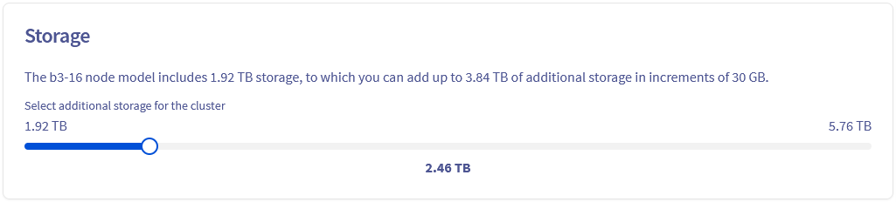{.thumbnail}

#### Configure your options

Choose the network options for your service and whitelist the IP addresses that will access the service. 

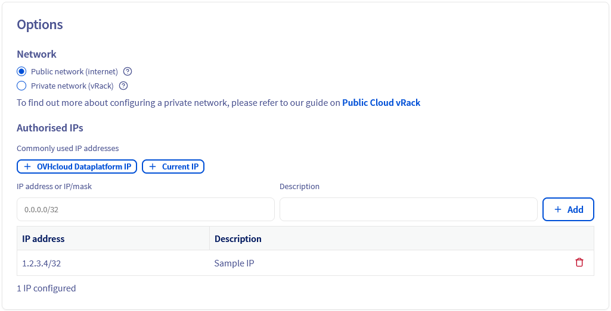{.thumbnail}

#### Review and confirm

A summary of your order is display to help you review your service configuration.

{.thumbnail}

The components of the price is also summarized with a monthly estimation.

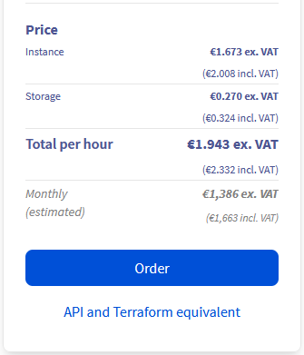{.thumbnail}

Click the `API and Terraform equivalent`{.action} button to open the following window:

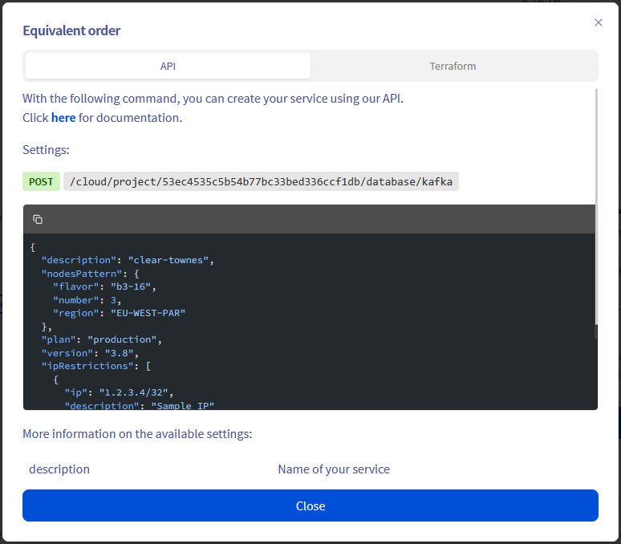{.thumbnail}

The informations displayed in this window could help you automate your service creation with the [OVHcloud API](/pages/manage_and_operate/api/first-steps) or the OVHcloud Terraform Provider.

When you are ready click the `Order`{.action} button to create your service.
In a matter of minutes, your new Apache Kafka service will be deployed.
Messages in the OVHcloud Control Panel will inform you when the streaming tool is ready to use.

### Configure the Apache Kafka service

Once the Public Cloud Databases for Kafka service is up and running, you will have to define at least one user and one authorised IP (if not already provided during the order) in order to fully connect to the service (as producer or consumer).

{.thumbnail}

The `Dashboard`{.action} tab automatically updates when your service is ready.

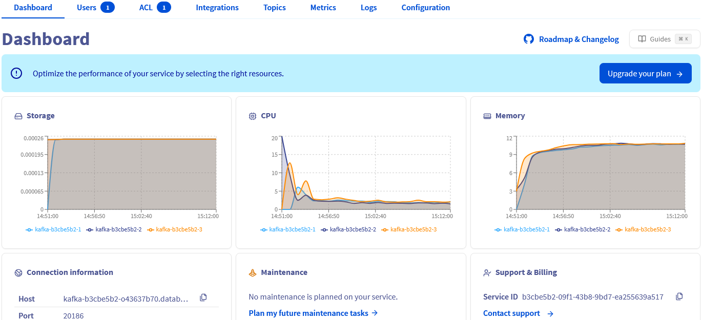{.thumbnail}

#### Mandatory: Set up a user

Switch to the `Users`{.action} tab. An admin user name `avnadmin` is preconfigured during the service installation. 

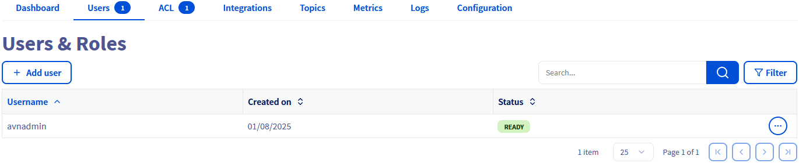{.thumbnail}

You can add more users by clicking the `Add user`{.action} button.

{.thumbnail}

Enter a username, then click `Create User`{.action}.

Passwords need to be reset from the `Users`{.action} table.

{.thumbnail}

#### Mandatory: Configure authorised IPs

> [!warning]
> For security reasons the default network configuration doesn't allow any incoming connections. It is thus critical to authorize the suitable IP addresses in order to successfully access your Kafka cluster.

If you did not define the authorised IPs during the order you could do it in the `Configuration`{.action} tab. At least one IP address must be authorised here before you can connect to your database.

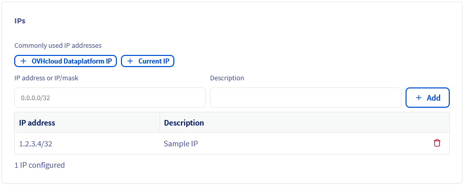{.thumbnail}

Add the IP address of your computer by using the `Current IP`{.action} button.
You will be able to remove IPs from the table afterward.

{.thumbnail}

Your Apache Kafka service is now fully accessible!
Optionally, you can configure access control lists (ACL) for granular permissions and create something called topics, as shown below.

#### Optional: Create Kafka topics

Topics can be seen as categories, allowing you to organize your Kafka records. Producers write to topics, and consumers read from topics.

To create Kafka topics, first go to the `Topics`{.action} tab then click on the `Add a topic`{.action} button:

{.thumbnail}

In advanced configuration you can change the default value for the following parameters:

- Minimum in-sync replica (2 by default)
- Partitions (1 partition by default)
- Replication (3 brokers by default)
- Retention size in bytes (-1: no limitation by default)
- Retention time in hours (-1: no limitation by default)
- Deletion policy

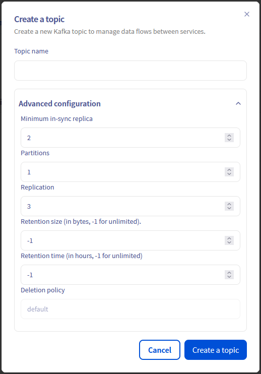{.thumbnail}

#### Optional: Configure ACLs on topics

Kafka supports access control lists (ACLs) to manage permissions on topics. This approach allows you to limit the operations that are available to specific connections and to restrict access to certain data sets, which improves the security of your data.

By default the admin user has access to all topics with admin privileges. You can define some additional ACLs for all users / topics, by clicking on the `Add an ACL`{.action} button from the `ACL`{.action} tab:

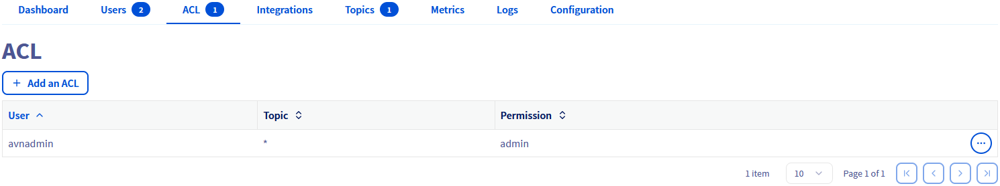{.thumbnail}

For a particular user, and one topic (or all with '*'), define the ACL with the following permissions:

- **admin**: full access to APIs and topic
- **read**: allow only searching and retrieving data from a topic
- **write**: allow updating, adding, and deleting data from a topic
- **readwrite**: full access to the topic

{.thumbnail}

*Note*: Write permission allows the service user to create new indexes that match the pattern, but it does not allow deletion of those indexes.

When multiple rules match, they are applied in the order listed above. If no rules match, access is denied.

### First CLI connection

> [!warning]
> Verify that the IP address visible from your browser application is part of the "Authorised IPs" defined for this Kafka service.
>
> Check also that the user has granted ACLs for the target topics.

#### Download server and user certificates

In order to connect to the Apache Kafka service, it is required to use server and user certificates.

##### Server certificate

The server CA (*Certificate Authority*) certificate can be downloaded from the `Dashboard`{.action} tab:

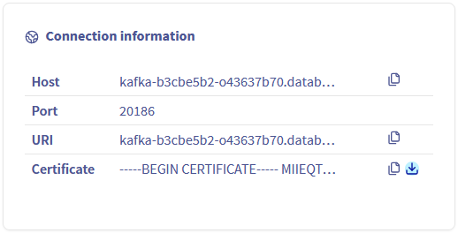{.thumbnail}

##### User certificate and access key

The user certificate and the user access key can be downloaded from the `Users`{.action} tab:

{.thumbnail}

#### Install an Apache Kafka CLI

As part of the Apache Kafka official installation, you will get different scripts that will also allow you to connect to Kafka in a Java 8+ environment: [Apache Kafka Official Quickstart](https://kafka.apache.org/quickstart){.external}.

We propose to use a generic and more lightweight (does not require a JVM) producer and consumer client instead: `Kcat` (formerly known as `kafkacat`).

##### **Install Kcat**

For this client installation, please follow the instructions available at: [Kafkacat Official Github](https://github.com/edenhill/kcat){.external}.

##### **Kcat configuration file**

Let's create a configuration file to simplify the CLI commands to act as Kafka Producer and Consumer:

kafkacat.conf :

```text
bootstrap.servers=kafka-f411d2ae-f411d2ae.database.cloud.ovh.net:20186
enable.ssl.certificate.verification=false
ssl.ca.location=/home/user/kafkacat/ca.pem
security.protocol=ssl
ssl.key.location=/home/user/kafkacat/service.key
ssl.certificate.location=/home/user/kafkacat/service.cert
```

In our example, the cluster address and port are **kafka-f411d2ae-f411d2ae.database.cloud.ovh.net:20186** and the previously downloaded CA certificates are in the **/home/user/kafkacat/** folder.

Change theses values according to your own configuration.

##### **Kafka producer**

For this first example let's push the "test-message-key" and its "test-message-content" to the "my-topic" topic.

```bash
echo test-message-content | kcat -F kafkacat.conf -P -t my-topic -k test-message-key
```

*Note*: depending on the installed binary, the CLI command can be either **kcat** or **kafkacat**.

##### **Kafka consumer**

The data can be retrieved from "my-topic".

```bash
kcat -F kafkacat.conf -C -t my-topic -o -1 -e
```

*Note*: depending on the installed binary, the CLI command can be either **kcat** or **kafkacat**.

## Conclusion

Congratulations, you now have an up and running Apache Kafka cluster, fully managed and secured. You are able to push and retrieve data easily via CLI.

## Go further

[Kafka capabilities](/pages/public_cloud/public_cloud_databases/kafka_01_capabilities)

[Kafka Official documentation](https://kafka.apache.org/documentation/){.external}

[Kafka clients](https://cwiki.apache.org/confluence/display/KAFKA/Clients){.external}

Some UI tools for Kafka are also available:

- [Lenses](https://lenses.io){.external}
- [Xeotek](https://www.xeotek.com/){.external}
- [Conduktor](https://www.conduktor.io/){.external}

Visit the [Github examples repository](https://github.com/ovh/public-cloud-databases-examples/tree/main/databases/kafka) to find how to connect to your database with several languages.

Visit our dedicated Discord channel: <https://discord.gg/ovhcloud>. Ask questions, provide feedback and interact directly with the team that builds our databases services.

If you need training or technical assistance to implement our solutions, contact your sales representative or click on [this link](/links/professional-services) to get a quote and ask our Professional Services experts for a custom analysis of your project.
