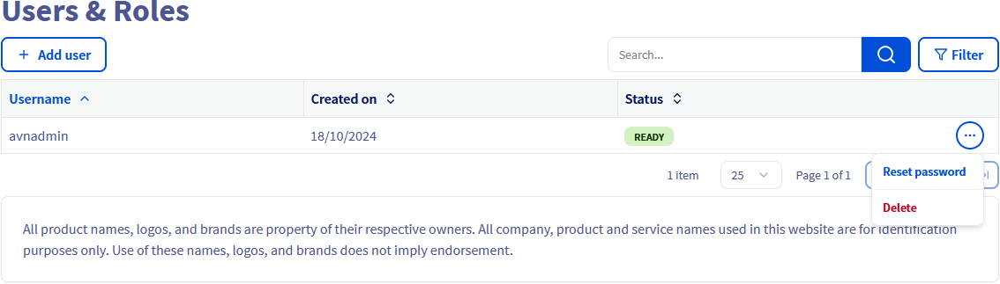
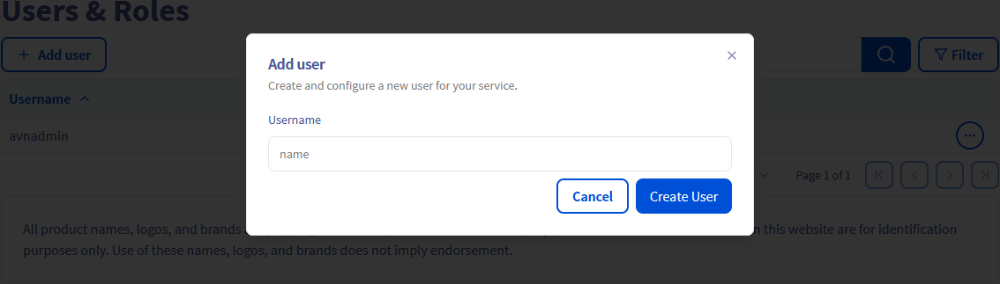
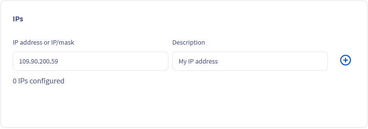
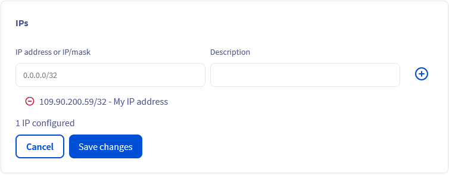
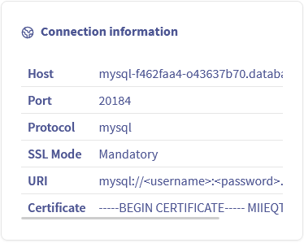
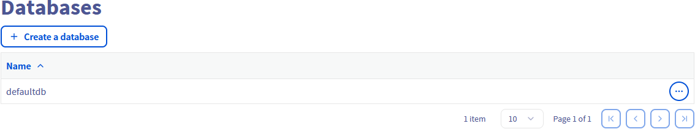
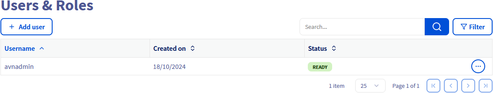

## Objective

Public Cloud Databases allow you to focus on building and deploying cloud applications while OVHcloud takes care of the database infrastructure and maintenance in operational conditions.

**This guide explains how to configure your MySQL instance to accept incoming connections.**

## Requirements

- A [Public Cloud project](/links/public-cloud/public-cloud) in your OVHcloud account
- Access to the [OVHcloud Control Panel](/links/manager)
- A MySQL database running on your OVHcloud Public Cloud Databases ([this guide](/pages/public_cloud/public_cloud_databases/databases_01_order_control_panel) can help you to meet this requirement)

## Instructions

### Configure your MySQL instance to accept incoming connections

Before making a connection, we need to verify that our MySQL instance is correctly configured.

Log in to your [OVHcloud Control Panel](/links/manager) and open your `Public Cloud`{.action} project. Click on `Databases`{.action} in the left-hand navigation bar and select your MySQL instance.

#### Step 1: Verify your user roles and password

Select the `Users`{.action} tab. Verify that you have a user with sufficient rights and a configured password. If you don't remember the user's password, you can either create a new user or regenerate the password of an existing user.

> [!warning]
> Be careful! By doing so you will need to update all the places where you already use this user/password pair.
>

This first user **avnadmin** is pre-configured during the service installation and comes with the following grants:

```sql
GRANT SELECT, INSERT, UPDATE, DELETE, CREATE, DROP, RELOAD, PROCESS, REFERENCES, INDEX, ALTER, SHOW DATABASES, CREATE TEMPORARY TABLES, LOCK TABLES, EXECUTE, REPLICATION SLAVE, REPLICATION CLIENT, CREATE VIEW, SHOW VIEW, CREATE ROUTINE, ALTER ROUTINE, CREATE USER, EVENT, TRIGGER ON *.* TO "avnadmin"@"%" WITH GRANT OPTION

GRANT REPLICATION_APPLIER,ROLE_ADMIN ON *.* TO "avnadmin"@"%" WITH GRANT OPTION
```

{.thumbnail}

You can add more users by clicking on the button `Add user`{.action}.

{.thumbnail}

Enter a username then click `Create User`{.action}.

> [!primary]
> You can delete a user or regenerate a password via the `...`{.action} button in the `Users & Roles` table.

#### Step 2: Authorise incoming connections from the MySQL client

> [!warning]
> For security reasons the default network configuration doesn't allow any incoming connections. It is thus critical you authorise the suitable IP addresses in order to successfully access your database.

Fill in the IP address or CIDR block to whitelist and click the `+`{.action} button.


{.thumbnail}

Validate the changes by clicking the `Save changes`{.action} button.

{.thumbnail}


> [!primary]
>
> If you want to allow connections from the outside, you can enter the IP 0.0.0.0/0. Please use it carefully.
>

#### Collect required information

Select the `Dashboard`{.action} tab to find the required login credentials in the `Connection information` section.

{.thumbnail}

Select the `Databases`{.action} tab to get the database name.

{.thumbnail}

Select the `Users`{.action} tab to get the username.

{.thumbnail}

## Go further

Visit the [Github examples repository](https://github.com/ovh/public-cloud-databases-examples/tree/main/databases/mysql) to find how to connect to your database with several languages.

Visit our dedicated Discord channel: <https://discord.gg/ovhcloud>. Ask questions, provide feedback and interact directly with the team that builds our databases services.

If you need training or technical assistance to implement our solutions, contact your sales representative or click on [this link](/links/professional-services) to get a quote and ask our Professional Services experts for a custom analysis of your project.

Join our community of users on <https://community.ovh.com/en/>.
