## Objectif

L'objectif de ce guide est d'aider les utilisateurs OVHcloud à configurer et à étendre un réseau privé à travers plusieurs régions Public Cloud, tout en évitant les conflits d'IP et en assurant la stabilité du réseau. Il couvre les bonnes pratiques pour :

- Attribuer des pools d'IP distincts par région.
- Gérer les VLAN à travers les régions ou d'autres produits OVHcloud.
- Utiliser le DHCP en tant que service pour d'autres infrastructures, comme les serveurs Bare Metal.
- Fournir des instructions détaillées en utilisant l'espace client OVHcloud, Horizon, l'OpenStack CLI et Terraform.

**En suivant ce guide, les utilisateurs seront capables de déployer un réseau privé multi-régions sécurisé et fiable avec OVHcloud.**

## Contexte et aperçu de la solution

### Défis

Lorsqu'un réseau privé est étendu à travers plusieurs régions Public Cloud OVHcloud ou connecté à d'autres produits OVHcloud via un vRack, un défi majeur surgit en raison de la manière dont l'adressage IP est géré.

Les instances Public Cloud reçoivent automatiquement leurs adresses IP privées via le DHCP OpenStack ou cloud-init, et ce mécanisme ne peut pas être désactivé. En même temps, tous les réseaux privés utilisant le même VLAN à l'intérieur d'un vRack doivent partager un espace d'adressage commun. Cela signifie qu'en l'absence d'une planification appropriée, le même VLAN peut finir par attribuer des adresses IP chevauchantes ou identiques à travers les régions ou entre différents services OVHcloud.

Pour illustrer ce problème, le diagramme suivant montre un exemple de ce qu'il faut éviter :

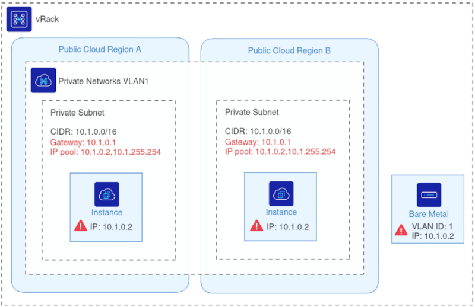{.thumbnail}

Dans cet exemple, deux instances Public Cloud situées dans des régions différentes et un serveur Bare Metal partagent le même ID VLAN et la même adresse IP leur a été attribuée.

Lorsque plusieurs machines partagent la même IP sur le même VLAN, le réseau devient instable. Les paquets ne peuvent pas déterminer de manière fiable vers quelle machine ils doivent aller. Par exemple, tout trafic envoyé à 10.1.0.2 peut atterrir sur un hôte imprévisible, entraînant une connectivité irrégulière, des erreurs de routage et une interruption de service.

Ce problème devient plus grave lorsque les environnements s'étendent à travers plusieurs régions ou produits. Par conséquent, une approche structurée de l'allocation d'IP, telle que la division du sous-réseau en pools dédiés par région, est essentielle pour maintenir un réseau vRack stable, prévisible et sans conflit.

### Aperçu de la solution

Pour éviter les conflits d'IP et assurer une communication stable à travers un réseau vRack étiré, chaque région Public Cloud doit utiliser un pool d'IP dédié au sein du même sous-réseau privé. En segmentant le sous-réseau en plages d'allocation non chevauchantes, OVHcloud garantit que les services DHCP OpenStack dans différentes régions n'attribuent jamais des adresses IP en double, même lorsque tous les réseaux partagent le même VLAN ID.

Le diagramme ci-dessous illustre la configuration corrigée :

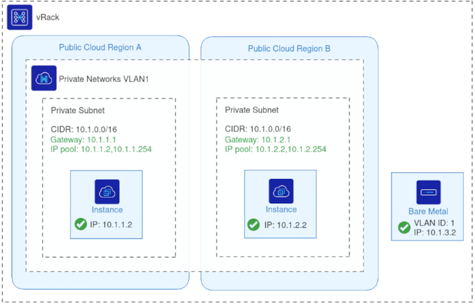{.thumbnail}

Chaque région utilise le même VLAN ID mais tire les IPs d'une plage d'allocation distincte au sein du sous-réseau partagé, éliminant ainsi tout risque de chevauchement.

Avec cette approche :

- Toutes les régions restent parties intégrantes du même réseau privé L2 via le vRack.
- Le DHCP continue à fonctionner normalement dans chaque région, car OpenStack attribue des IPs uniquement depuis sa plage désignée.
- D'autres produits OVHcloud (tels que Bare Metal, Serveurs Dédiés ou Private Cloud) peuvent rejoindre le même VLAN sans créer de conflits d'adresses.
- Les charges de travail multi-régions, les migrations et les déploiements hybrides fonctionnent de manière fiable sur un réseau privé unifié.

Cette solution préserve la flexibilité d'un seul VLAN étiré tout en imposant une gestion d'IP prévisible et sans conflit. La section suivante explique comment configurer ce déploiement en utilisant l'espace client OVHcloud, Horizon, l'OpenStack CLI ou Terraform.

## Exemples d'utilisation

Voici quelques scénarios pratiques où l'extension d'un réseau privé OVHcloud à travers des régions ou son intégration à d'autres produits OVHcloud peut résoudre des défis pratiques.

- **Base de données sur Bare Metal & Application sur Public Cloud :** Connecter un serveur de base de données Bare Metal avec des applications exécutées dans des régions Public Cloud en utilisant le même VLAN sans conflits d'IP.
- **DHCP as a Service pour les serveurs Bare Metal :** Attribuer des IPs depuis les réseaux Public Cloud aux serveurs Bare Metal via le DHCP pour une intégration transparente.
- **Migration entre les régions Public Cloud :** Déplacer des charges de travail d'une région à une autre tout en maintenant le réseau privé cohérent et en évitant les conflits d'IP.
- **Services multi-régions :** Exécuter des services distribués à travers plusieurs régions Public Cloud avec un réseau privé unifié pour une communication sécurisée.
- **Intégration avec d'autres produits OVHcloud :** Connecter des instances Public Cloud avec Private Cloud, Serveurs Dédiés ou d'autres services OVHcloud via vRack.

## Prérequis

- Un [projet Public Cloud](/pages/public_cloud/public_cloud_cross_functional/create_a_public_cloud_project) dans votre compte OVHcloud
- Connaissances de base en réseau
- Être connecté à l'[espace client OVHcloud](/links/manager)
- Être connecté à l'[interface Horizon](/pages/public_cloud/public_cloud_cross_functional/introducing_horizon)

## En pratique

Cette section fournit des instructions pas à pas pour configurer un réseau privé étiré à travers plusieurs régions Public Cloud OVHcloud. Vous pouvez utiliser l'espace client OVHcloud & Horizon, l'OpenStack CLI ou Terraform.

### Configuration pour Public Cloud

Ajoutez le projet Public Cloud à un vRack :

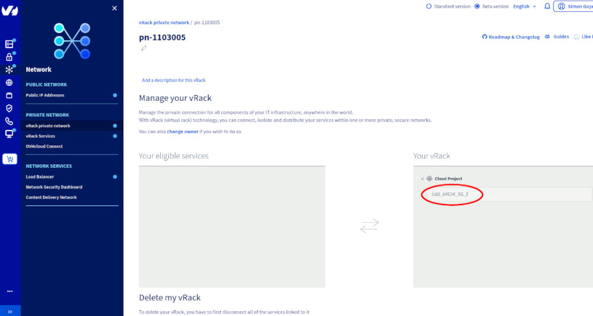{.thumbnail}

> [!tabs]
> Via l'espace client OVHcloud et Horizon
>> **1\. Créez des réseaux privés dans chaque région**
>>
>> Créez un réseau privé dans chaque région souhaitée en utilisant le même VLAN ID.
>>
>> {.thumbnail}
>>
>> > [!tabs]
>> >
>> > **Note :** À ce stade, l'utilisation du même VLAN ID à travers les régions sans pools d'IP distincts est exactement ce qu'il faut éviter.
>> >
>>
>> **2\. Configurez les sous-réseaux et les pools d'IP**
>>
>> Modifiez chaque sous-réseau dans Horizon, configurez l'IP de gateway réservée et le pool d'IP.
>>
>> **- Première région :**
>>
>> 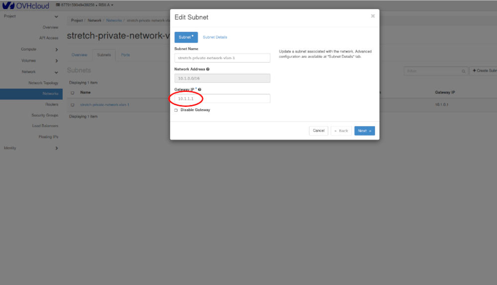{.thumbnail}
>>
>> 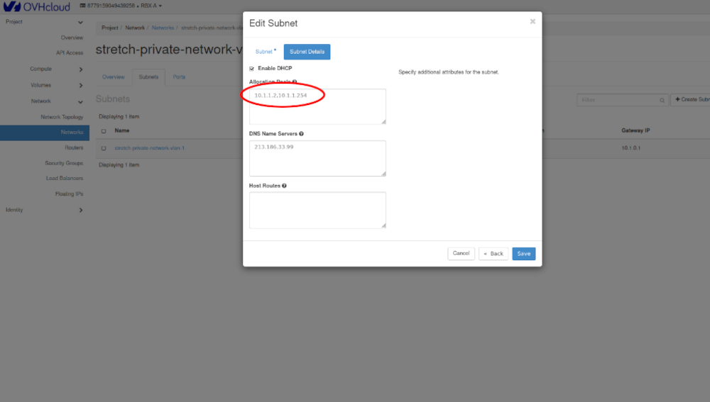{.thumbnail}
>>
>> **- Deuxième région :**
>>
>> 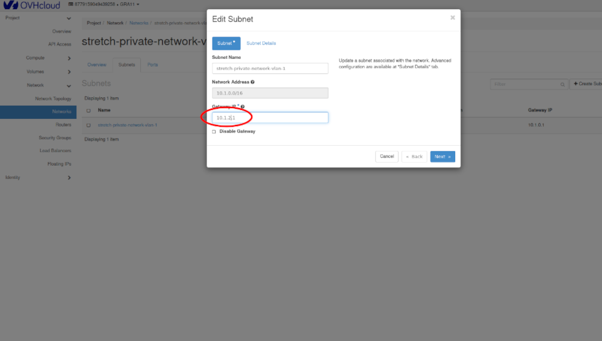{.thumbnail}
>>
>> 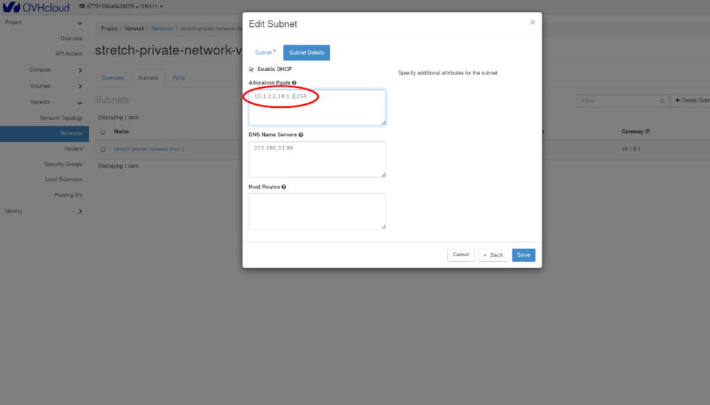{.thumbnail}
>>
>> **3\. Actualisez l'état du réseau**
>>
>> Retournez dans l'espace client OVHcloud et actualisez la page du réseau.
>>
>> 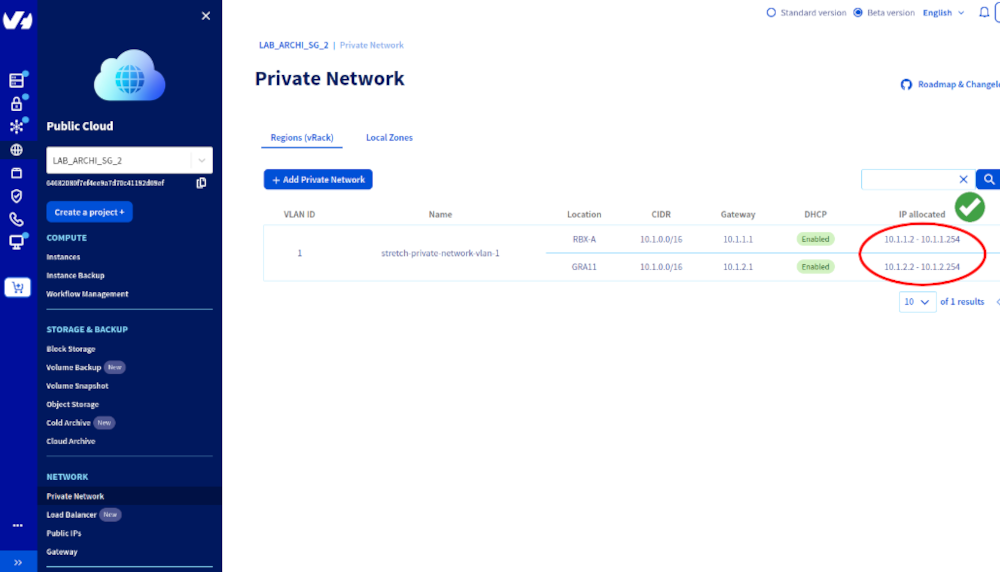{.thumbnail}
>>
>> Vous devriez maintenant voir un seul VLAN étiré à travers plusieurs régions, chacune avec son propre pool d'IP.
>>
> Via l'OpenStack CLI
>> > [!primary]
>> >
>> > **Prérequis :** l'authentification OpenStack doit être configurée dans les variables d'environnement.
>> >
>>
>> **1\. Chargez les informations d'identification OpenStack :**
>>
>> ```bash
>> source openrc.sh
>> ```
>>
>> **2\. Sélectionnez la première région**
>>
>> ```bash
>> export OS_REGION_NAME=RBX-A
>> openstack network create --provider-network-type vrack --provider-segment 1 stretch-private-network-vlan-1
>> openstack subnet create --network stretch-private-network-vlan-1 --subnet-range 10.1.0.0/16 --dhcp \
>> --allocation-pool start=10.1.1.2,end=10.1.1.254 --dns-nameserver 213.186.33.99 --gateway 10.1.1.1 stretch-private-subnet
>> ```
>>
>> **3\. Sélectionnez la deuxième région**
>>
>> ```bash
>> export OS_REGION_NAME=GRA11
>> openstack network create --provider-network-type vrack --provider-segment 1 stretch-private-network-vlan-1
>> openstack subnet create --network stretch-private-network-vlan-1 --subnet-range 10.1.0.0/16 --dhcp \
>> --allocation-pool start=10.1.2.2,end=10.1.2.254 --dns-nameserver 213.186.33.99 --gateway 10.1.2.1 stretch-private-subnet
>> ```
>>
> Via Terraform
>> > [!primary]
>> >
>> > **Prérequis :** la clé d'application OVHcloud doit être configurée dans les variables d'environnement.
>> >
>>
>> **1\. Créez un fichier de configuration principal Terraform (par exemple, `main.tf`) avec le contenu suivant :**
>>
>> ```hcl
>> resource "ovh_cloud_project_network_private" "private-net" {
>>  name    = "stretch-private-network-vlan-${var.private_network_vlan_id}"
>>  vlan_id = var.private_network_vlan_id
>>  regions = var.regions
>> }
>>
>> resource "ovh_cloud_project_network_private_subnet_v2" "private-subnet" {
>>   count             = length(var.regions)
>>   name              = "stretch-private-subnet-vlan-${var.private_network_vlan_id}"
>>   network_id        = tolist(ovh_cloud_project_network_private.private-net.regions_attributes[*].openstackid)[count.index]
>>   region            = element(var.regions, count.index)
>>   gateway_ip        = "10.${var.private_network_vlan_id}.${count.index + 1}.1"
>>   cidr              = "10.${var.private_network_vlan_id}.0.0/16"
>>   dns_nameservers   = ["213.186.33.99"]
>>   dhcp              = true
>>   enable_gateway_ip = true
>>
>>   allocation_pools {
>>     start = "10.${var.private_network_vlan_id}.${count.index + 1}.2"
>>     end   = "10.${var.private_network_vlan_id}.${count.index + 1}.254"
>>   }
>> }
>> ```
>>
>> **2\. Créez un fichier de variables (par exemple, `variables.tf`) avec le contenu suivant :**
>>
>> ```hcl
>> variable regions {
>>   type    = list
>>   default = ["RBX-A", "GRA11"]
>> }
>>
>> variable private_network_vlan_id {
>>   type    = string
>>   default = "1"
>> }
>> ```
>>
>> **3. Appliquez la configuration :**
>>
>> ```bash
>> terraform apply
>> ```
>>
>> Terraform créera le réseau privé, les sous-réseaux et les pools d'allocation d'IP dans chaque région, tel que défini.
>> 

### DHCP pour les serveurs Bare Metal (DHCP as a Service)

Cette section explique comment fournir des adresses IP DHCP Public Cloud aux serveurs Bare Metal en les intégrant à un réseau privé étiré.

Le projet Public Cloud et le serveur Bare Metal doivent être ajoutés au même vRack :

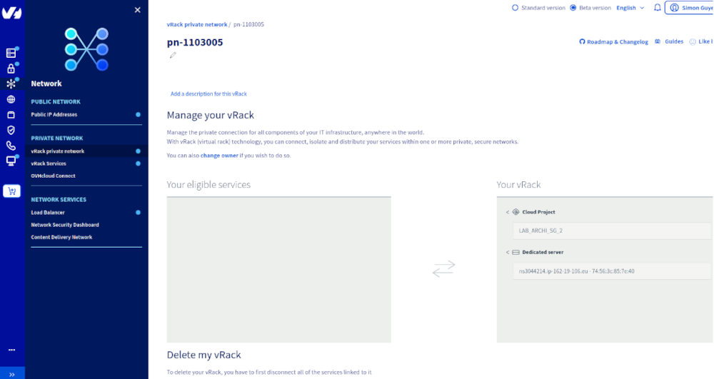{.thumbnail}

> [!tabs]
> Via l'espace client OVHcloud et Horizon
>> **1\. Créez un réseau privé Public Cloud**
>>
>> 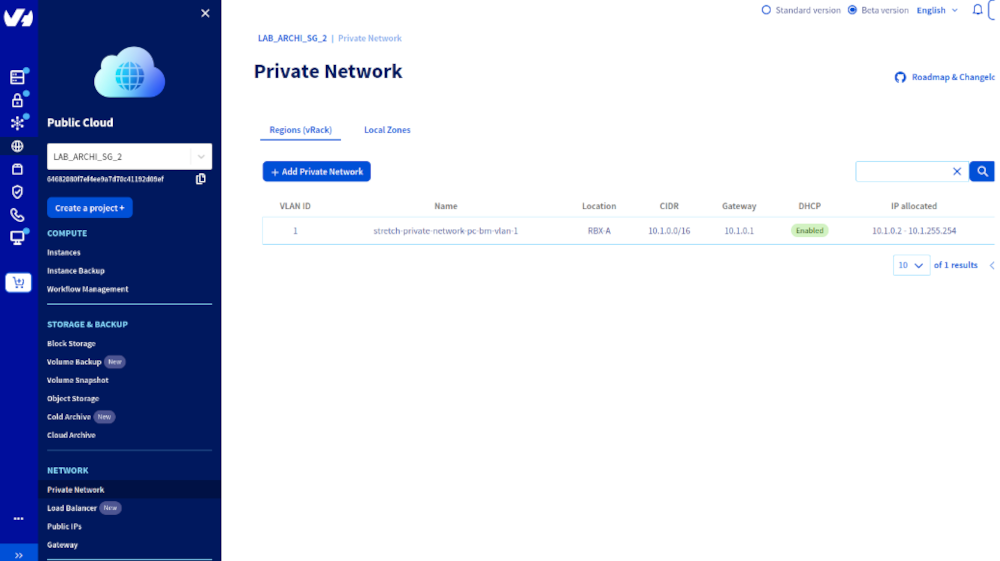{.thumbnail}
>>
>> > [!primary]
>> >
>> > **Note :** Utilisez le même VLAN ID qui sera utilisé pour le serveur Bare Metal.
>> >
>>
>> **2\. Récupérez l'adresse MAC de l'interface privée du serveur Bare Metal.**
>>
>> 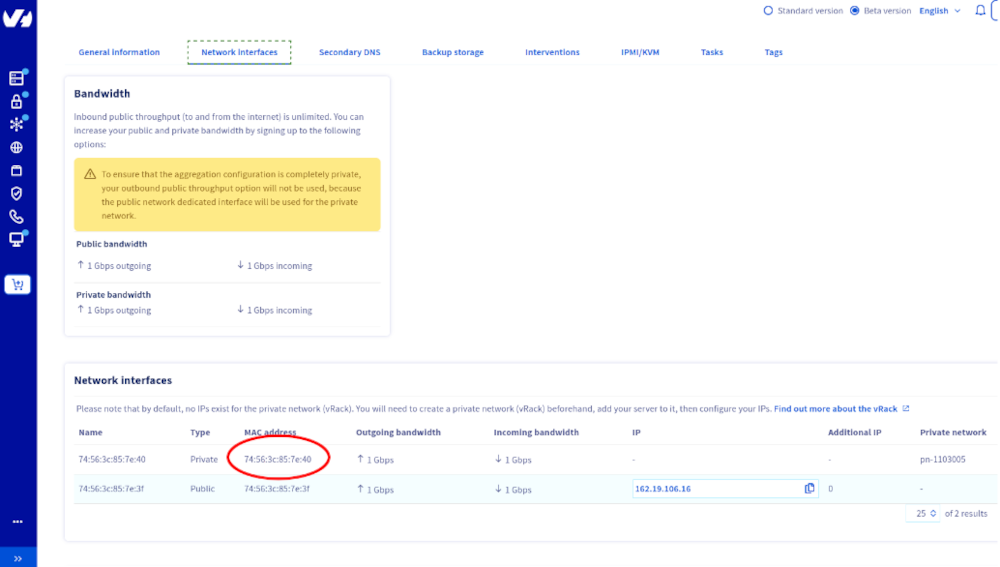{.thumbnail}
>>
>> **3\. Créez un port virtuel sur le réseau privé Public Cloud en utilisant l'adresse MAC du serveur Bare Metal.**
>>
>> 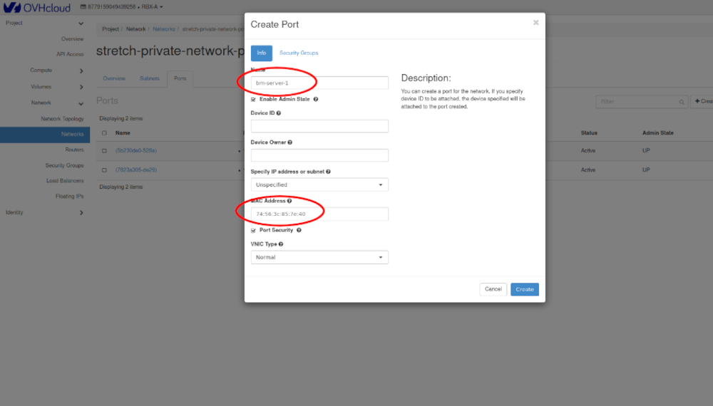{.thumbnail}
>>
>> **4\. Installez un système d'exploitation sur le serveur Bare Metal (par exemple, Ubuntu 24.04).**
>>
>> ```bash
>> cat <<EOF | sudo tee /etc/netplan/90-private-interface.yaml
>> network:
>>   version: 2
>>   ethernets:
>>     privint:
>>       match:
>>         macaddress: "74:56:3c:85:7e:40"
>>       dhcp4: false
>>       dhcp6: false
>>   vlans:
>>     vlan1:
>>       id: 1
>>       link: privint
>>       dhcp4: true
>> EOF
>>
>> sudo chmod 600 /etc/netplan/90-private-interface.yaml
>> sudo netplan apply
>> ```
>>
>> > [!warning]
>> >
>> > **Note :** Les scripts post-installation peuvent avoir besoin d'être mis à jour avec l'adresse MAC correcte ainsi que le VLAN ID correct.
>> >
>>
> Via l'OpenStack CLI
>> > [!primary]
>> >
>> > **Prérequis :** l'authentification OpenStack doit être configurée dans les variables d'environnement.
>> >
>>
>> **1\. Chargez les informations d'identification OpenStack.**
>>
>> ```bash
>> source openrc.sh
>> ```
>>
>> **2\. Sélectionnez la région :**
>>
>> ```bash
>> export OS_REGION_NAME=RBX-A
>> ```
>>
>> **3\. Créer le réseau privé et le sous-réseau :**
>>
>> ```bash
>> openstack network create --provider-network-type vrack --provider-segment 1 stretch-private-network-vlan-1
>>
>> openstack subnet create --network stretch-private-network-vlan-1 --subnet-range 10.1.0.0/16 --dhcp \
>> --allocation-pool start=10.1.0.2,end=10.1.254.254 --dns-nameserver 213.186.33.99 --gateway 10.1.0.1 stretch-private-subnet
>> ```
>>
>> **4\. Créez un port virtuel pour le serveur Bare Metal :**
>>
>> ```bash
>> openstack port create --network stretch-private-network-vlan-1 <BARE_METAL_MAC_ADDRESS> bare_metal_port
>> ```
>>
>> **5. Installez le système d'exploitation sur le serveur Bare Metal (Ubuntu 24.04 utilisé dans cet exemple).**
>>
>> ```bash
>> cat <<EOF | sudo tee /etc/netplan/90-private-interface.yaml
>> network:
>>   version: 2
>>   ethernets:
>>     privint:
>>       match:
>>         macaddress: "74:56:3c:85:7e:40"
>>       dhcp4: false
>>       dhcp6: false
>>   vlans:
>>     vlan1:
>>       id: 1
>>       link: privint
>>       dhcp4: true
>> EOF
>>
>> sudo chmod 600 /etc/netplan/90-private-interface.yaml
>> sudo netplan apply
>> ```
>>
>> > [!warning]
>> >
>> > **Note :** Les scripts de post-installation peuvent avoir besoin d'être mis à jour avec l'adresse MAC correcte ainsi que le VLAN ID correct.
>> >
>>
> Via Terraform
>> > [!primary]
>> >
>> > **Prérequis :** la clé d'application OVHcloud doit être configurée dans vos variables d'environnement.
>> >
>>
>> **1\. Créez le fichier de variables Terraform `variables.tf`**
>>
>> Définissez toutes les variables nécessaires au déploiement :
>>
>> ```hcl
>> variable "region" {
>>   type    = string
>>   default = "RBX-A"
>> }
>>
>> variable "private_network_vlan_id" {
>>   type    = string
>>   default = "1"
>> }
>>
>> variable "bare_metal_server_name" {
>>   type    = string
>>   default = "ns3044214.ip-162-19-106.eu"
>> }
>>
>> variable "ssh_public_key" {
>>   type = string
>> }
>> ```
>>
>> **2\. Créez le fichier de réseau privé `private-network.tf`**
>>
>> ```hcl
>> resource "ovh_cloud_project_network_private" "private-net" {
>>   name    = "stretch-private-network-vlan-${var.private_network_vlan_id}"
>>   vlan_id = var.private_network_vlan_id
>>   regions = [var.region]
>> }
>>
>> resource "ovh_cloud_project_network_private_subnet_v2" "private-subnet" {
>>   name              = "stretch-private-subnet-vlan-${var.private_network_vlan_id}"
>>   network_id        = tolist(ovh_cloud_project_network_private.private-net.regions_attributes[*].openstackid)[0]
>>   region            = var.region
>>   gateway_ip        = "10.${var.private_network_vlan_id}.0.1"
>>   cidr              = "10.${var.private_network_vlan_id}.0.0/16"
>>   dns_nameservers   = ["213.186.33.99"]
>>   dhcp              = true
>>   enable_gateway_ip = true
>>
>>   allocation_pools {
>>     start = "10.${var.private_network_vlan_id}.0.2"
>>     end   = "10.${var.private_network_vlan_id}.254.254"
>>   }
>> }
>> ```
>>
>> > [!primary]
>> >
>> > Ce fichier assure la création d'un réseau privé et d'un sous-réseau dans la région spécifiée, avec le DHCP activé et une plage d'adresses dédiée.
>> >
>>
>> **3\. Créez le fichier Bare Metal `bare-metal.tf`**
>>
>> ```hcl
>> data "ovh_dedicated_server" "server" {
>>   service_name = var.bare_metal_server_name
>> }
>>
>> resource "openstack_networking_port_v2" "bare_metal_port" {
>>   name           = "bare-metal-${var.bare_metal_server_name}-port"
>>   region         = var.region
>>   network_id     = tolist(ovh_cloud_project_network_private.private-net.regions_attributes[*].openstackid)[0]
>>   mac_address    = data.ovh_dedicated_server.server.vnis[index(data.ovh_dedicated_server.server.vnis.*.mode, "vrack")].name
>>   admin_state_up = "true"
>>
>>   depends_on = [ovh_cloud_project_network_private_subnet_v2.private-subnet]
>> }
>>
>> data "ovh_dedicated_installation_template" "template" {
>>   template_name = "ubuntu2404-server_64"
>> }
>>
>> resource "ovh_dedicated_server_reinstall_task" "server_reinstall" {
>>   service_name = data.ovh_dedicated_server.server.service_name
>>   os           = data.ovh_dedicated_installation_template.template.template_name
>>
>>   customizations {
>>     hostname                 = data.ovh_dedicated_server.server.name
>>     post_installation_script = base64encode(templatefile("templates/custom-bare-metal.tftpl", {
>>       mac_address = data.ovh_dedicated_server.server.vnis[index(data.ovh_dedicated_server.server.vnis.*.mode, "vrack")].name
>>       vlan_id     = var.private_network_vlan_id
>>     }))
>>     ssh_key                  = var.ssh_public_key
>>   }
>> }
>> ```
>>
>> > [!primary]
>> >
>> > Cette configuration connecte le serveur Bare Metal au réseau privé via un port virtuel et exécute un script post-installation pour configurer le réseau.
>> >
>>
>> **4\. Créez le modèle post-installation `templates/custom-bare-metal.tftpl`**
>>
>> ```bash
>> cat <<EOF | sudo tee /etc/netplan/90-private-interface.yaml
>> network:
>>   version: 2
>>   ethernets:
>>     privint:
>>       match:
>>         macaddress: "${mac_address}"
>>       dhcp4: false
>>       dhcp6: false
>>   vlans:
>>     vlan${vlan_id}:
>>       id: ${vlan_id}
>>       link: privint
>>       dhcp4: true
>> EOF
>>
>> sudo chmod 600 /etc/netplan/90-private-interface.yaml
>> sudo netplan apply
>> ```
>>
>> > [!primary]
>> >
>> > Ce script crée une configuration netplan pour l'interface VLAN privée, activant le DHCP pour attribuer une IP provenant du réseau Public Cloud.
>> >
>>
>> **5\. Appliquez la configuration**
>>
>> ```bash
>> terraform apply
>> ```
>>
>> > [!warning]
>> >
>> > L'exécution du script Terraform peut réinstaller votre serveur Bare Metal, assurez-vous donc d'avoir des sauvegardes ou d'être prêt à effectuer une réinstallation.
>> >
>>

## Notes / Bonnes pratiques

- Vérifiez que le VLAN ID correspond entre le réseau Public Cloud et le serveur Bare Metal.
- Confirmez que le serveur Bare Metal reçoit une IP du service DHCP Public Cloud après l'installation.
- Chaque serveur devrait utiliser une plage d'adresses IP dédiée pour éviter les conflits.

## Aller plus loin

Rejoignez notre [communauté d'utilisateurs](/links/community).