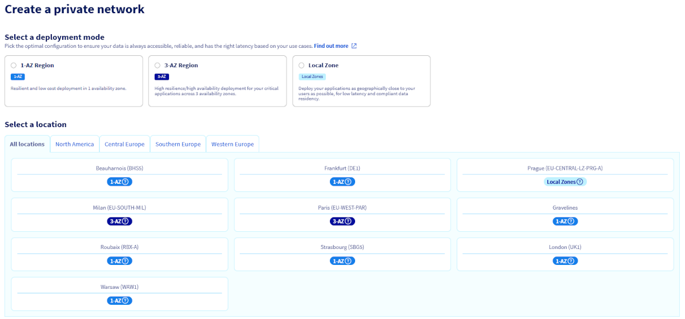
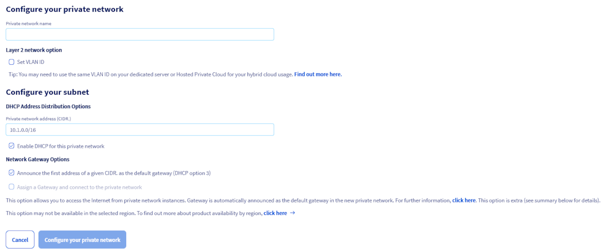
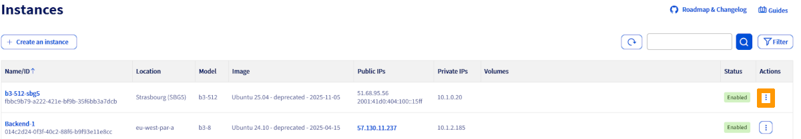
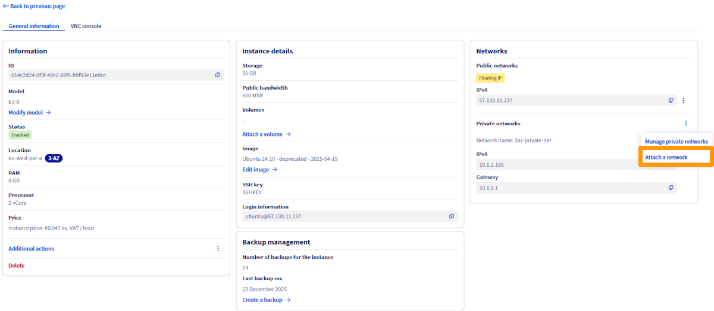

<style>
details>summary {
    color:rgb(33, 153, 232) !important;
    cursor: pointer;
}
details>summary::before {
    content:'\25B6';
    padding-right:1ch;
}
details[open]>summary::before {
    content:'\25BC';
}
</style>

## Objective

The OVHcloud [vRack](/links/network/vrack) is a private network solution that enables our customers to route traffic between OVHcloud dedicated servers as well as other OVHcloud services. At the same time, it allows you to add [Public Cloud instances](/links/public-cloud/compute) to your private network to create an infrastructure of physical and virtual resources.

**This guide explains how to configure Public Cloud instances within your vRack.**

## Requirements

- A [Public Cloud project](/pages/public_cloud/public_cloud_cross_functional/create_a_public_cloud_project) in your OVHcloud account
- Access to the [OVHcloud Control Panel](/links/manager)
- An [OpenStack user](/pages/public_cloud/public_cloud_cross_functional/create_and_delete_a_user) (optional)
- Basic networking knowledge

## Interfaces

Creating a vRack or adding an instance into the network can be done using the OVHcloud Control Panel, the OVHcloud APIv6, the OpenStack API, the Horizon interface or Terraform.

Depending on your technical profile and needs, it is mostly up to you which interface or method to use. For each option, the guide instructions below describe the necessary steps.

**To begin with, the following provides a brief description of the possible actions according to the chosen method/interface.**

/// details | OVHcloud Control Panel

The [OVHcloud Control Panel](/links/manager) is a fully visual interface, ideally suited for managing multiple VLANs. You will also have the possibility to customise the private IP range, which by default is in 10.1.0.0/16.

The VLAN will be deployed to the selected Region. You will also have the option of activating the gateways or not, enabling DHCP distributions, etc.

You can also manage billing for your services in the OVHcloud Control Panel.

///

<a name="horizon"></a>

/// details | Horizon

The [Horizon](https://horizon.cloud.ovh.net/auth/login/) interface (independent from OVHcloud) is the original implementation of the OpenStack dashboard, which provides a web user interface to OpenStack services, including Nova, Swift, Keystone, etc.

This multifunctional, technical interface allows you to manage almost all OpenStack actions. It is one of the necessary interfaces if you need to manage more than two VLANS, add private network interfaces to your instances, manage custom images, etc.

Please refer to [this guide](/pages/public_cloud/public_cloud_cross_functional/introducing_horizon) to familiarise yourself with Horizon.

> [!primary]
> Horizon functions zone-specific, therefore you need to remember to choose your logical (geographic) work zone at the top left of your interface (GRA5, SBG3, BHS1, etc.).
>

///

/// details | OVHcloud APIv6

Every action you take in your OVHcloud Control Panel can be called with the [OVHcloud APIv6](/links/api).
It even offers more possibilities than the graphical interface.

The API interface is less visual than the OVHcloud Control Panel but will allow you to perform a large number of actions. You can manage and customise your VLAN, add interfaces to your instances, or create highly customised servers.

You can simply access it from [our web page](/links/api) but also use it to create your PHP or Python scripts.

This way, you can freely automate basic tasks with scripts, optimise your own functions and much more.

You may need to retrieve various information before using some API calls because a specific input is required.

Please refer to [this guide](/pages/manage_and_operate/api/first-steps) to get started with the OVHcloud APIv6.

///

/// details | OpenStack API

Public Cloud services can be administrated using Linux or Windows command lines after downloading and installing OpenStack tools.

This method requires a good knowledge of Linux or Windows to take advantage of it, but it allows you to leverage all the power of OpenStack.

Depending on the layer you want to manage, you will need to use the Nova (compute), Neutron (network), Glance (image) or Swift (Object Storage) client. The latest addition to this assortment, the OpenStack client, makes it possible to manage almost all OpenStack layers directly.

With the OpenStack API, you can also easily automate this management through your scripts.

To know more about the usage of the OpenStack API, please consult these guides:

- [Preparing an environment for using the OpenStack API](/pages/public_cloud/public_cloud_cross_functional/prepare_the_environment_for_using_the_openstack_api)
- [Setting OpenStack environment variables](/pages/public_cloud/public_cloud_cross_functional/loading_openstack_environment_variables)

You will then be able to use the APIs dedicated to OpenStack as needed:

- Nova (compute)
- Glance (image)
- Cinder (image)
- Neutron (network)

> [!primary]
> In some cases, it will be easier to use the OpenStack APIs and in others, Nova, Neutron, etc.
>
> Moreover, some features may be missing from the OpenStack API depending on the version of your client and operating system.
> For the purpose of making this guide more accessible, it presents the simplest and most intuitive options.
> You may consult the [official OpenStack documentation](https://docs.openstack.org/) if you wish to go further in learning about its use.
>

///

/// details | OpenStack CLI

You can manage your OVHcloud Public Cloud services and vRacks directly from your Linux or Windows terminal using the OpenStack CLI.

This interface allows you to manage all OpenStack layers:

- Nova: instances (compute)
- Neutron: networks
- Glance: images
- Cinder: volumes

The CLI centralizes these features and can be integrated into your scripts to automate your tasks.

Before you begin, please consult the following guides:

- [Prepare the environment for using the OpenStack API](/pages/public_cloud/public_cloud_cross_functional/prepare_the_environment_for_using_the_openstack_api)
- [Load OpenStack environment variables](/pages/public_cloud/public_cloud_cross_functional/loading_openstack_environment_variables)

> [!primary]
>
> The OpenStack CLI is useful for managing your vRack, but some functions may vary depending on the version of the client or operating system. Please refer to the [official OpenStack documentation](https://docs.openstack.org/).
>

///

/// details | Terraform

Terraform can also be used to manage OVHcloud infrastructures.

For that you need to cherry-pick the correct terraform provider & resource. Find more information in our guide on [using Terraform with OVHcloud](/pages/manage_and_operate/terraform/terraform-at-ovhcloud).

///

## Instructions

### Step 1: Activating and managing a vRack <a name="activation"></a>

> [!warning]
>
> The vRack is managed at the OVHcloud infrastructure level, which means that you can only administer it in your OVHcloud Control Panel and the OVHcloud APIv6.
>

> [!tabs]
> Via the OVHcloud Control Panel
>> > [!primary]
>> >
>> > This does not apply to newly created projects which are now automatically delivered with a vRack. To view the vRack once the project has been created, go the `Network`{.action} section and click on `vRack private network`{.action} to view the vRack(s).
>> >
>>
>> If you have an older project and don't have a vRack, you need to order one. Using the vRack itself is free of charge and it can be delivered within a few minutes.
>>
>> In the left-hand menu, click the button `Add a service`{.action} (shopping cart icon). Use the filter at the top of the page or scroll down to find the service `vRack`{.action}.
>>
>> {.thumbnail}
>>
>> You will be redirected to another page to validate the order, it will take a few minutes for the vRack to be setup in your account.
>>
>> Once the service is active, you will find it in your Control Panel in the `Network`{.action} section > `vRack private network`{.action}, labelled "pn-xxxxxx".
>>
>> Click on your vRack, then select the project you want to add to the vRack from the list of eligible services and click the `Add`{.action} button.
>>
>> {.thumbnail}
>>
>> To continue configuring your vRack from the OVHcloud Control Panel, continue reading this guide from [Step 2: Create a private network in the vRack](#create-pn-in-vrack), under the **From the OVHcloud Control Panel** tab.
>>
> Via the OVHcloud APIv6
>>
>> **Step 1: Activating and managing a vRack**
>>
>> Log in to the OVHcloud APIv6 interface according to the relevant guide ([First steps with the OVHcloud API](/pages/manage_and_operate/api/first-steps)) and follow these steps:
>>
>> **Creating the cart**
>>
>> > [!api]
>> >
>> > @api {v1} /order POST /order/cart
>> >
>>
>> > [!primary]
>> >
>> > This call will create an ID for your 'shopping cart'. You can add as many articles as you want before you validate it.
>> >
>> > In this case, the order of a vRack alone is free. Remember your cart number (cartId), it will be required for the rest.
>> >
>>
>> **Retrieving the necessary information for the vRack order**
>>
>> > [!api]
>> >
>> > @api {v1} /order GET /order/cart/{cartId}/vrack
>> >
>>
>> > [!primary]
>> >
>> > This call will allow you to retrieve all the information needed to order the vRack. Copy the following:
>> >
>> > *cartId*, *duration*, *planCode*, and *pricingMode*.
>> >
>>
>> **Adding the vRack to the cart**
>>
>> > [!api]
>> >
>> > @api {v1} /order POST /order/cart/{cartId}/vrack
>> >
>>
>> > [!primary]
>> >
>> > This call allows you to add the vRack to the cart by adding all the necessary information to the order.
>> >
>> > For a vRack, this would be, for example:
>> >
>> > cartId: [your cart identifier]
>> >
>> > duration: "P1M"
>> >
>> > planCode: "vrack"
>> >
>> > pricingMode: "default"
>> >
>> > quantity: 1
>> >
>>
>> Once you have validated the order, you will receive an item number ("itemId"). Keep this information, it will be useful if you wish to make changes before the validation of the cart.
>>
>> **Validating the cart**
>>
>> Once you have put all the items in your cart, you will need to validate it:
>>
>> > [!api]
>> >
>> > @api {v1} /order POST /order/cart/{cartId}/checkout
>> >
>>
>> > [!primary]
>> >
>> > This call will validate the cart and create a purchase order ("orderId"). Keep this information, it will be necessary to validate the order.
>> >
>>
>> **Validating the final order**
>>
>> To validate the order, you have two possibilities:
>>
>> - Pass through the visible URL when the cart is validated.
>> URL example: https://www.ovh.com/cgi-bin/order/displayOrder.cgi?orderId=12345678&orderPassword=xxxxxxxxxx
>>
>> - Validate using this call:
>>
>> > [!api]
>> >
>> > @api {v1} /me POST /me/order/{orderId}/payWithRegisteredPaymentMean
>> >
>>
>> > [!primary]
>> >
>> > Even if it is a €0 purchase order, it is necessary to simulate a purchase order payment (orderId). Your order form will then be validated and processing will begin.
>> >
>>
>> Once the free order has been validated, it may take a few minutes for the vRack to be activated.
>>
>> **Step 2: Adding your Public Cloud project to the vRack**
>>
>> Once the vRack is active, you will need to integrate your Public Cloud project(s) into the vRack.
>>
>> Log in to the OVHcloud APIv6 interface according to the relevant guide: [First steps with the OVHcloud API](/pages/manage_and_operate/api/first-steps).
>>
>> In case the project ID is unknown, the calls below allow you to retrieve it.
>>
>> **Identifying the project**
>>
>> > [!api]
>> >
>> > @api {v1} /cloud GET /cloud/project
>> >
>>
>> > [!primary]
>> >
>> > This call retrieves the list of projects.
>> >
>>
>> > [!api]
>> >
>> > @api {v1} /cloud GET /cloud/project/{serviceName}
>> >
>>
>> > [!primary]
>> >
>> > This call identifies the project via the "description" field.
>> >
>>
>> **Adding the project to the vRack**
>>
>> Once the project ID and the vRack name are known, their association is made through the following call:
>>
>> > [!api]
>> >
>> > @api {v1} /vrack POST /vrack/{serviceName}/cloudProject
>> >
>>
>> Fill in the fields with the information previously retrieved:
>>
>> - **serviceName**: vRack name in the form "pn-xxxxxx".
>> - **project**: The Public Cloud project ID in the form of a 32-character string.
>>
>> > [!primary]
>> >
>> > This call initializes the association of the project and the vRack. The task ID must then be retrieved to check the progress.
>> >
>>
>> **Checking the progress of the task**
>>
>> You can view the progress of the task with this call:
>>
>> > [!api]
>> >
>> > @api {v1} /vrack GET /vrack/{serviceName}/cloudProject/{project}
>> >
>>
>> > [!primary]
>> >
>> > This call is optional and only allows you to check the status of the task. Once it is complete, you can proceed to the next step.
>> >
>>

### Step 2: Creating a private network in the vRack <a name="create-pn-in-vrack"></a>

It is necessary to create a private network with a virtual local area network (VLAN) so that the connected instances can communicate with each other.

With the Public Cloud service, you can create up to 4 000 VLANs within one vRack. This means that you can use each private IP address up to 4 000 times.
Thus, for example, 192.168.0.10 of VLAN 2 is different from IP 192.168.0.10 of VLAN 42.

This can be useful in order to segment your vRack between multiple virtual networks.

From the OVHcloud Control Panel and OVHcloud APIv6, you can customise all settings: deployment mode and region, VLAN name and ID, private IP address range (e.g. 10.0.0.0/16), DHCP, and gateway.

> [!primary]
> On dedicated servers, you are using VLAN 0 by default. The OpenStack infrastructure requires to specify your VLAN ID directly at the infrastructure level.
>
> Unlike dedicated servers, there is no need to tag a VLAN directly on a Public Cloud instance.
>
> To learn more about this topic, please refer to the guide "[Creating multiple vLANs in a vRack](/pages/bare_metal_cloud/dedicated_servers/creating-multiple-vlans-in-a-vrack)".

> [!warning]
> vRack is managed at the OVHcloud infrastructure level, meaning you can only administrate it in the OVHcloud Control Panel and the OVHcloud APIv6.
>
> Because OpenStack is not located at the same level, you will not be able to customise VLANs through the Horizon interface or OpenStack APIs.
>

> [!tabs]
> Via the OVHcloud Control Panel
>> Once you have your vRack set, the next step is to create a private network.
>>
>> In the `Public Cloud`{.action} tab, click on `Private Network`{.action} in the left-hand menu under **Network**.
>>
>> {.thumbnail}
>>
>> Click on the button `Add Private Network`{.action}. The following page allows you to customise multiple settings.
>>
>> To begin, select a deployment mode and the region in which you want to create the private network.
>>
>> {.thumbnail}
>>
>> In the next step, a number of options are presented to you:
>>
>> {.thumbnail}
>>
>> In the **Private Network Name** field, set a name for your private network.
>>
>> **Layer 2 network option**
>>
>> If you tick the `Set VLAN ID`{.action} box, you will be able to manually choose a VLAN ID number between 0 and 4 000.
>>
>> If you do not tick the box, the system will assign a random VLAN ID number to your private network.
>>
>> If you want to be able to communicate with dedicated servers in this VLAN, please consult the guide: [Creating multiple vLANs in a vRack](/pages/bare_metal_cloud/dedicated_servers/creating-multiple-vlans-in-a-vrack).
>>
>> **DHCP address distribution options**
>>
>> The default DHCP range is 10.1.0.0/16. You can use a different private range of your choice, or disable DHCP for this private network.
>>
>> **Network Gateway Options**
>>
>> - **Announce the first address of a given CIDR. as the default gateway (DHCP option 3)**: When this option is enabled, the DHCP server advertises the first address in the CIDR as the default gateway to machines connected to the network.
>> - **Assign a Gateway and connect to the private network**:Select this option if you intend to create instances with a private network only. For more information, please consult the following guides: [Creating a private network with Gateway](/pages/public_cloud/public_cloud_network_services/getting-started-02-create-private-network-gateway) and [Creating and connecting to your first Public Cloud instance](/pages/public_cloud/compute/public-cloud-first-steps).
>>
>> > [!warning]
>> >
>> > If the second option is greyed out, it means the region selected does not support it. For more information, please refer to our [regions availability](/links/public-cloud/regions-pci) page. 
>> > 
>>
>> Once done, click on `Configure your private network`{.action} to start the process.
>>
>> > [!primary]
>> >
>> > Creating the private network may take several minutes.
>> >
>>
> Via the OVHcloud APIv6 <a name="vlansetup"></a>
>>
>> Once logged in to the [OVHcloud APIv6 interface](/links/api), follow these steps:
>>
>> **Step 1: Retrieving the required information**
>>
>> **Public Cloud project**
>>
>> > [!api]
>> >
>> > @api {v1} /cloud GET /cloud/project
>> >
>>
>> > [!primary]
>> >
>> > This call retrieves the list of projects.
>> >
>>
>> > [!api]
>> >
>> > @api {v1} /cloud GET /cloud/project/{serviceName}
>> >
>>
>> > [!primary]
>> >
>> > This call identifies the project via the "description" field.
>> >
>>
>> **vRack**
>>
>> > [!api]
>> >
>> > @api {v1} /cloud GET /cloud/project/{serviceName}/vrack
>> >
>>
>> > [!primary]
>> >
>> > In the field "serviceName", specify the ID of your project. Save the vRack ID information in the form "pn-xxxxx".
>> >
>>
>> **Step 2: Creating the private network**
>>
>> > [!api]
>> >
>> > @api {v1} /cloud POST /cloud/project/{serviceName}/network/private
>> >
>>
>> > [!primary]
>> >
>> > Fill in the fields with the information previously obtained:
>> >
>> > - **serviceName**: project ID.
>> > - **name**: name of your VLAN.
>> >
>> > You can leave the "Region" field blank in order to enable it for all regions.
>> >
>> > The VLAN identifier (vlanId) is required if you want to create a specific VLAN.
>> >
>>
>> The creation will take a few moments.
>>
>> You can check your VLAN information with the following call:
>>
>> > [!api]
>> >
>> > @api {v1} /cloud GET /cloud/project/{serviceName}/network/private
>> >
>>
>> > [!primary]
>> >
>> > This call retrieves the "networkId" in this form: name-vrack_vlanId.
>> >
>> > For example, VLAN 42: pn-xxxxxx_42.
>> >
>>
>> **Step 3: Creating a subnet**
>>
>> By default, if you do not add a subnet, the IP range used is:
>>
>> ```
>> 10.1.0.0/16
>> ```
>>
>> If you want to manage IP assignments yourself, you will need to create a subnet.
>>
>> To do this, once the VLAN is created, you will need to create the subnet for each affected area by the following call:
>>
>> > [!api]
>> >
>> > @api {v1} /cloud POST /cloud/project/{serviceName}/network/private/{networkId}/subnet
>> >
>>
>> Fill in the fields according the following table.
>>
>> |Field|Description| 
>> |---|---| 
>> |serviceName|ID of the project.|
>> |networkId|Your network ID, retrieved with previous steps. Example: pn-xxxxxx_42 for VLAN 42.|
>> |dhcp|Check box for enabling / uncheck for disabling DHCP in the VLAN.|
>> |end|Last address of the subnet in this region. Example: 192.168.1.50.|
>> |network|Subnet IP block. Example: 192.168.1.0/24.|
>> |region|Example: SBG3.|
>> |start|First address of the subnet in this region. Example: 192.168.1.15.|
>>
>> > [!primary]
>> > This is the stage of creating the subnet by region. You can enable or disable private IP address assignment dynamically through DHCP.
>> >
>> > You will need to do the same for each region where your instances are present.
>> >
>>
>> > [!warning]
>> >
>> > Be careful to separate your IP address pools for different regions. For example:
>> >
>> > - From 192.168.0.2 to 192.168.0.254 for SBG1.
>> > - From 192.168.1.2 to 192.168.1.254 for GRA1.
>> >
>>
> Via Terraform
>> In Terraform, you will need to use the OpenStack provider. You can download an example of a complete terraform script in [this GitHub repository](https://github.com/yomovh/tf-at-ovhcloud/tree/main/private_network).
>>
>> The OVHcloud specific part for vRack integration is the `value_specs` parameter.
>>
>> ```python
>> resource "openstack_networking_network_v2" "tf_network" {
>>   name = "tf_network"
>>   admin_state_up = "true"
>>   value_specs = {
>>     "provider:network_type"    = "vrack"
>>     "provider:segmentation_id" = var.vlan_id
>>   }
>> }
>> resource "openstack_networking_subnet_v2" "tf_subnet"{
>>   name       = "tf_subnet"
>>   network_id = openstack_networking_network_v2.tf_network.id
>>   cidr       = "10.1.0.0/16"
>>   enable_dhcp       = true
>> }
>> ```
>>
> Via the OpenStack CLI
>> In the following example we specify the `VLAN_ID` to which we want the network to be part of through `--provider-network-type` and `--provider-segment`.
>>
>> You can remove those parameters. In that case, an available `VLAN_ID` will be used.
>>
>> ```bash 
>> openstack network create --provider-network-type vrack --provider-segment 42 OS_CLI_private_network
>> openstack subnet create --dhcp --network OS_CLI_private_network OS_CLI_subnet --subnet-range 10.1.0.0/16
>> ```
>>

### Step 3: Integrating an instance into vRack <a name="instance-integration"></a>

There are two possible scenarios:

- The instance to be integrated does not exist yet.
- An existing instance needs to be added to the vRack.

/// details | **In case of a new instance**

> [!tabs]
> Via the OVHcloud Control Panel
>> If you need assistance, follow this guide first: [Creating an instance in the OVHcloud Control Panel](/pages/public_cloud/compute/public-cloud-first-steps). When creating an instance, you can choose, in Step 5, a network mode, followed by a private network to integrate your instance into. 
>>
>> {.thumbnail}
>>
>> > [!warning]
>> >
>> > You will be able to connect your instance to **only one** vRack from the OVHcloud Control Panel.
>> >
>> > To add multiple interfaces, you will need to go through the OpenStack or Horizon APIs.
>> >
>>
> Via the OVHcloud APIv6
>> Once logged in to the [OVHcloud APIv6 interface](/links/api), follow these steps:
>>
>> **Step 1: Retrieving the required information**
>>
>> **Retrieving the project ID**
>>
>> > [!api]
>> >
>> > @api {v1} /cloud GET /cloud/project
>> >
>>
>> **Retrieving the networkID of the public network (Ext-Net)**
>>
>> > [!api]
>> >
>> > @api {v1} /cloud GET /cloud/project/{serviceName}/network/public
>> >
>>
>> **Retrieving the networkID of the private network (vRack interface previously created)**
>>
>> > [!api]
>> >
>> > @api {v1} /cloud GET /cloud/project/{serviceName}/network/private
>> >
>>
>> > [!primary]
>> >
>> > The identifier will have the form: "pn-xxxxx_yy" in which yy is the VLAN number.
>> >
>>
>> **Retrieving the ID of the chosen instance type (flavorId)**
>>
>> > [!api]
>> >
>> > @api {v1} /cloud GET /cloud/project/{serviceName}/flavor
>> >
>>
>> > [!primary]
>> >
>> > You can limit the list by specifying the creation region of your instance.
>> >
>>
>> **Retrieving the ID of the chosen image (imageId)**
>>
>> > [!api]
>> >
>> > @api {v1} /cloud GET /cloud/project/{serviceName}/image
>> >
>>
>> > [!primary]
>> >
>> > You can limit the list by specifying the creation region of your instance.
>> >
>>
>> **Retrieving your OpenStack SSH key ID (sshKeyId)**
>>
>> > [!api]
>> >
>> > @api {v1} /cloud GET /cloud/project/{serviceName}/sshkey
>> >
>>
>> If you have not added an SSH key to your OVHcloud Control Panel yet, you can do so using the following call:
>>
>> > [!api]
>> >
>> > @api {v1} /cloud POST /cloud/project/{serviceName}/sshkey
>> >
>>
>> ***Deploying the instance**
>>
>> Once all the elements necessary for the deployment are gathered, you can use the following call:
>>
>> > [!api]
>> >
>> > @api {v1} /cloud POST /cloud/project/{serviceName}/instance
>> >
>>
>> You will need to fill in at least the following fields:
>>
>> |Field|Description| 
>> |---|---| 
>> |serviceName|ID of the Public Cloud project.|
>> |flavorId|ID of the instance type (example: D2-2, B2-7, WIN-R2-15, etc.).|
>> |imageId|ID of the image for the deployment (example: Debian 9, Centos 7, etc.).|
>> |name|Name for your instance.|
>> |networks|In the "networkId" section, indicate the public network identifier (Ext-Net) or your VLAN (pn-xxxxxx_yy). You can click the "+" button to add more networks.|
>> |region|Region for your instance deployment (example: GRA5).|
>> |sshKeyId|ID of your OpenStack SSH key.|
>>
>> Once the call is complete, if all information is correctly filled in, the instance will be created with one or more network interfaces.
>>
>> > [!warning]
>> >
>> > Depending on operating systems, you will need to manually configure your private network interfaces to be considered.<br>
>> > Because OpenStack is unable to prioritise the public interface of the vRack interface, the vRack interface may sometimes pass as the default route.<br>
>> > The direct consequence is that the instance is unreachable from a public IP.<br>
>> > One or more reboots of the instance from the Control Panel can resolve this situation.<br>
>> > The other solution is to connect to the instance via another server in the same private network. You can also correct the network configuration of the instance through Rescue mode.
>> >
>>
> Via the OpenStack CLI
>> The following steps are necessary to create an instance directly in the vRack.
>>
>> **Retrieving the required information**
>>
>> Public and private networks:
>>
>> ```bash
>> openstack network list
>> 
>> +--------------------------------------+------------+-------------------------------------+
>> | ID                                   | Name       | Subnets                             |
>> +--------------------------------------+------------+-------------------------------------+
>> | 12345678-90ab-cdef-xxxx-xxxxxxxxxxxx | MyVLAN-42  | xxxxxxxx-yyyy-xxxx-yyyy-xxxxxxxxxxxx|
>> | 34567890-12ab-cdef-xxxx-xxxxxxxxxxxx | Ext-Net    | zzzzzzzz-yyyy-xxxx-yyyy-xxxxxxxxxxxx|
>> | 67890123-4abc-ef12-xxxx-xxxxxxxxxxxx | MyVLAN_0   | yyyyyyyy-xxxx-xxxx-yyyy-xxxxxxxxxxxx|
>> +--------------------------------------+------------+-------------------------------------+
>> ```
>>
>> or
>>
>> ```bash
>> nova net-list
>> 
>> +--------------------------------------+------------+------+
>> | ID                                   | Label      | CIDR |
>> +--------------------------------------+------------+------+
>> | 12345678-90ab-cdef-xxxx-xxxxxxxxxxxx | MyVLAN-42  | None |
>> | 34567890-12ab-cdef-xxxx-xxxxxxxxxxxx | Ext-Net    | None |
>> | 67890123-4abc-ef12-xxxx-xxxxxxxxxxxx | MyVLAN_0   | None |
>> +--------------------------------------+------------+------+
>> ```
>>
>> > [!primary]
>> >
>> > You will need to note the network IDs of interest:
>> >
>> > - Ext-Net for a public IP address.
>> > - The VLAN(s) required for your configuration.
>> >
>>
>> Also note the information detailed in the [Nova API user guide](/pages/public_cloud/compute/starting_with_nova):
>>
>> - ID or name of the OpenStack SSH key.
>> - ID of the instance type (flavor).
>> - ID of the desired image (operating system, snapshot, etc.).
>>
>> **Deploying the instance**
>>
>> With the previously retrieved items, an instance can be created, including it directly in the vRack:
>>
>> ```bash
>> nova boot --key-name SSHKEY --flavor [ID-flavor] --image [ID-Image] --nic net-id=[ID-Network 1] --nic net-id=[ID-Network 2] [instance name]
>> ```
>>
>> Example:
>>
>> ```bash
>> nova boot --key-name my-ssh-key --flavor xxxxxx-xxxx-xxxx-xxxx-xxxxxxxxxxxx --image yyyy-yyyy-yyyy-yyyy-yyyyyyyyyyyy --nic net-id=[id_Ext-Net] --nic net-id=[id_VLAN] NameOfInstance
>>
>> +--------------------------------------+------------------------------------------------------+
>> | Property                             | Value                                                |
>> +--------------------------------------+------------------------------------------------------+
>> | OS-DCF:diskConfig                    | MANUAL                                               |
>> | OS-EXT-AZ:availability_zone          |                                                      |
>> | OS-EXT-STS:power_state               | 0                                                    |
>> | OS-EXT-STS:task_state                | scheduling                                           |
>> | OS-EXT-STS:vm_state                  | building                                             |
>> | OS-SRV-USG:launched_at               | -                                                    |
>> | OS-SRV-USG:terminated_at             | -                                                    |
>> | accessIPv4                           |                                                      |
>> | accessIPv6                           |                                                      |
>> | adminPass                            | xxxxxxxxxxxx                                         |
>> | config_drive                         |                                                      |
>> | created                              | YYYY-MM-DDTHH:MM:SSZ                                 |
>> | flavor                               | [Flavor type] (xxxxxx-xxxx-xxxx-xxxx-xxxxxxxxxxxx)   |
>> | hostId                               |                                                      |
>> | id                                   | xxxxxx-xxxx-xxxx-xxxx-xxxxxxxxxxxx                   |
>> | image                                | [Image type] (xxxxxx-xxxx-xxxx-xxxx-xxxxxxxxxxxx)    |
>> | key_name                             | [Name of key]                                        |
>> | metadata                             | {}                                                   |
>> | name                                 | [Name of instance]                                   |
>> | os-extended-volumes:volumes_attached | []                                                   |
>> | progress                             | 0                                                    |
>> | security_groups                      | default                                              |
>> | status                               | BUILD                                                |
>> | tenant_id                            | zzzzzzzzzzzzzzzzzzzzzzzzzzzzzzzz                     |
>> | updated                              | YYYY-MM-DDTHH:MM:SSZ                                 |
>> | user_id                              | zzzzzzzzzzzzzzzzzzzzzzzzzzzzzzzz                     |
>> +--------------------------------------+------------------------------------------------------+
>> ```
>>
>> or
>>
>> ```bash
>> openstack server create --key-name SSHKEY --flavor [ID-flavor] --image [ID-Image] --nic net-id=[ID-Network 1] --nic net-id=[ID-Network 2] [instance name]
>> ```
>>
>> Example:
>>
>> ```bash
>> openstack server create --key-name my-ssh-key --flavor xxxxxx-xxxx-xxxx-xxxx-xxxxxxxxxxxx --image yyyy-yyyy-yyyy-yyyy-yyyyyyyyyyyy --nic net-id=[id_Ext-Net] --nic net-id=[id_VLAN] NameOfInstance
>>
>> +--------------------------------------+------------------------------------------------------+
>> | Property                             | Value                                                |
>> +--------------------------------------+------------------------------------------------------+
>> | OS-DCF:diskConfig                    | MANUAL                                               |
>> | OS-EXT-AZ:availability_zone          |                                                      |
>> | OS-EXT-STS:power_state               | 0                                                    |
>> | OS-EXT-STS:task_state                | scheduling                                           |
>> | OS-EXT-STS:vm_state                  | building                                             |
>> | OS-SRV-USG:launched_at               | -                                                    |
>> | OS-SRV-USG:terminated_at             | -                                                    |
>> | accessIPv4                           |                                                      |
>> | accessIPv6                           |                                                      |
>> | adminPass                            | xxxxxxxxxxxx                                         |
>> | config_drive                         |                                                      |
>> | created                              | YYYY-MM-DDTHH:MM:SSZ                                 |
>> | flavor                               | [Flavor type] (xxxxxx-xxxx-xxxx-xxxx-xxxxxxxxxxxx)   |
>> | hostId                               |                                                      |
>> | id                                   | xxxxxx-xxxx-xxxx-xxxx-xxxxxxxxxxxx                   |
>> | image                                | [Image type] (xxxxxx-xxxx-xxxx-xxxx-xxxxxxxxxxxx)    |
>> | key_name                             | [Name of key]                                        |
>> | metadata                             | {}                                                   |
>> | name                                 | [Name of instance]                                   |
>> | os-extended-volumes:volumes_attached | []                                                   |
>> | progress                             | 0                                                    |
>> | security_groups                      | default                                              |
>> | status                               | BUILD                                                |
>> | tenant_id                            | zzzzzzzzzzzzzzzzzzzzzzzzzzzzzzzz                     |
>> | updated                              | YYYY-MM-DDTHH:MM:SSZ                                 |
>> | user_id                              | zzzzzzzzzzzzzzzzzzzzzzzzzzzzzzzz                     |
>> +--------------------------------------+------------------------------------------------------+
>> ```
>>
>> You can set the IP address of the instance of your vRack interface at the OpenStack level.
>>
>> To do this, you can add a single argument to the function "--nic":
>>
>> `--nic net-id=[ID-Network],v4-fixed-ip=[IP_static_vRack]`
>>
>> Example:
>>
>> `--nic net-id=[ID-vRack],v4-fixed-ip=192.168.0.42`
>>
>> **Verifying the instance**
>>
>> After a few moments you can check the list of existing instances to find the server you created:
>>
>> ```bash
>> openstack server list
>> +--------------------------------------+---------------------+--------+--------------------------------------------------+--------------------+
>> | ID                                   |       Name          | Status | Networks                                         |     Image Name     |
>> +--------------------------------------+---------------------+--------+--------------------------------------------------+--------------------+
>> | xxxxxx-xxxx-xxxx-xxxx-xxxxxxxxxxxxxx | [Name of instance]  | ACTIVE | Ext-Net=[IP_V4], [IP_V6]; MyVrack=[IP_V4_vRack]  | [Name-of-instance] |
>> +--------------------------------------+---------------------+--------+--------------------------------------------------+--------------------+
>> ```
>>
>> ```bash
>> nova list
>> +--------------------------------------+--------------------+--------+------------+-------------+--------------------------------------------------+
>> | ID                                   | Name               | Status | Task State | Power State | Networks                                         |
>> +--------------------------------------+--------------------+--------+------------+-------------+--------------------------------------------------+
>> | xxxxxx-xxxx-xxxx-xxxx-xxxxxxxxxxxx   | [Name of instance] | ACTIVE | -          | Running     | Ext-Net=[IP_V4], [IP_V6]; MyVrack=[IP_V4_vRack]  |
>> +--------------------------------------+--------------------+--------+------------+-------------+--------------------------------------------------+
>> ```
>>

///

/// details | **In case of an existing instance**

The OVHcloud Control Panel allows you to attach an instance to one or more private networks but does not offer advanced network interface configuration. If you want to customise further, you will need to manage them either through the OVHcloud APIv6, through the OpenStack APIs or via Horizon.

The required action is simply to add a new network interface to your server, in addition to the existing one.

For example, if you have a public interface *eth0*, you will add the interface *eth1*.

> [!warning]
> The configuration of this new interface is rarely automatic.
> You will therefore need to set a static IP or configure DHCP, depending on your infrastructure.
>

> [!tabs]
> Via the OVHcloud Control Panel
>> Log in to the [OVHcloud Control Panel](/links/manager), go to the `Public Cloud`{.action} section and select the Public Cloud project concerned.
>>
>> Click on `Instances`{.action} in the left-hand navigation bar and then on `⁝`{.action} to the right of the instance. Select `Instance details`{.action}.
>>
>> {.thumbnail}
>>
>> This will open the instance dashboard. Click on the `⁝`{.action} button in the box "Networks", next to "Private networks", and select `Attach a network`{.action}.
>>
>> {.thumbnail}
>>
>> In the popup window that appears, select the private network(s) to attach to your instance and click `Confirm`{.action}.
>>
>> {.thumbnail}
>>
> Via the OVHcloud APIv6
>>
>> If you need to integrate an existing instance into the vRack, it is not possible to do so from your OVHcloud Control Panel. You will need to use Horizon, the OpenStack API or the OVHcloud APIv6.
>>
>> The required action is simply to add a new network interface to your server, in addition to the existing one.
>>
>> For example, if you have a public interface *eth0*, you will add the interface *eth1*.
>>
>> > [!warning]
>> >
>> > The configuration of this new interface is rarely automatic.
>> > You will therefore need to set a static IP or configure DHCP, depending on your infrastructure.
>> >
>>
>> **The steps below describe how to manage the network interfaces of your instances.**
>>
>> **Step 1: Retrieving the required information**
>>
>> **Retrieving the project ID**
>>
>> > [!api]
>> >
>> > @api {v1} /cloud GET /cloud/project
>> >
>>
>> **Retrieving the instance ID**
>>
>> > [!api]
>> >
>> > @api {v1} /cloud GET /cloud/project/{serviceName}/instance
>> >
>>
>> **Retrieving the networkID of the public network (Ext-Net)**
>>
>> > [!api]
>> >
>> > @api {v1} /cloud GET /cloud/project/{serviceName}/network/public
>> >
>>
>> **Retrieving the networkID of the private network (vRack interface previously created)**
>>
>> > [!api]
>> >
>> > @api {v1} /cloud GET /cloud/project/{serviceName}/network/private
>> >
>>
>> > [!primary]
>> >
>> > The identifier will have the form: "pn-xxxxx_yy" in which yy is the VLAN number.
>> >
>>
>> **Step 2: Adding an interface to your instance**
>>
>> Once all the elements necessary are gathered, you can use the following call:
>>
>> > [!api]
>> >
>> > @api {v1} /cloud POST /cloud/project/{serviceName}/instance/{instanceId}/interface
>> >
>>
>> You will need to fill in at least the following fields:
>>
>> |Field|Description| 
>> |---|---| 
>> |serviceName|ID of the Public Cloud project.|
>> |instanceId|ID of the instance.|
>> |networkId|Enter the public network identifier (Ext-Net) or your VLAN (pn-xxxxxx_yy).|
>> |ip|Define a specific IP (only works for private interfaces).|
>>
>> Once the call is complete, if all information is correctly filled in, a new interface will be added to your instance.
>>
>> > [!primary]
>> >
>> > Your OVHcloud instance will have a new network interface in addition to the public interface (Ext-Net).<br>
>> > In the instance summary, you can see the private IP address that is automatically assigned to your interface.<br>
>> > It is your responsibility to correctly configure the interface through DHCP or by using the proper IP addresses through a static IP configuration.
>> >
>>
>> **Step 3: Removing an interface from your instance**
>>
>> > [!warning]
>> >
>> > Detaching a network interface is permanent.
>> >
>> > However, it is important to note that if you detach the "Ext-Net" interface (public IP), this address will be released and put back into circulation. It is not possible to just reassign it.<br>
>> > This action is only required if you wish to isolate your server in the vRack (private network), or if you wish to remove it from one or more VLANs.
>> >
>>
>> Once all the necessary information is retrieved, you can use the following call to remove an interface:
>>
>> > [!api]
>> >
>> > @api {v1} /cloud DELETE /cloud/project/{serviceName}/instance/{instanceId}/interface/{interfaceId}
>> >
>>
>> You will need to fill in at least the following fields:
>>
>> |Field|Description| 
>> |---|---| 
>> |serviceName|ID of the Public Cloud project.|
>> |instanceId|ID of the instance.|
>> |networkId|Enter the public network identifier (Ext-Net) or your VLAN (pn-xxxxxx_yy).|
>>
> Via Horizon
>> Log in to the [Horizon interface](https://horizon.cloud.ovh.net/auth/login/) as mentioned [above](#horizon).
>>
>> Choose the proper work zone.
>>
>> {.thumbnail}
>>
>> Select `Compute` and then `Instances` from the menu.
>>
>> {.thumbnail}
>>
>> **Adding a private interface**
>>
>> To add an interface, click on the arrow in the `Actions` column to access the possible actions on the instance. Select `Attach Interface`{.action}.
>>
>> {.thumbnail}
>>
>> Select your interface and confirm.
>>
>> {.thumbnail}
>>
>> > [!primary]
>> >
>> > Your OVHcloud instance will have a new network interface in addition to the public interface (Ext-Net).<br>
>> > In the instance summary, you can see the private IP address that is automatically assigned to your interface.<br>
>> > It is your responsibility to correctly configure the interface through DHCP or by using the proper IP addresses through a static IP configuration.
>> >
>>
>> **Detaching a network private interface**
>>
>> > [!warning]
>> >
>> > Detaching a network interface is permanent.
>> >
>> > However, it is important to note that if you detach the "Ext-Net" interface (public IP), this address will be released and put back into circulation. It is not possible to just reassign it.<br>
>> > This action is only required if you wish to isolate your server in the vRack (private network), or if you wish to remove it from one or more VLANs.
>> >
>>
>> To detach a private interface, click on the arrow in the `Actions` column to access the possible actions on the instance. Select `Detach Interface`{.action}.
>>
>> {.thumbnail}
>>
>> Select your interface and confirm.
>>
>> {.thumbnail}
>>
> Via the OpenStack CLI
>> The following steps are necessary to integrate an existing instance into the vRack.
>>
>> **Retrieving the required information**
>>
>> Identify your instances:
>>
>> ```bash
>> openstack server list
>> 
>> +--------------------------------------+--------------+--------+------------------------------------------------------------------------+------------+
>> | ID                                   | Name         | Status | Networks                                                               | Image Name |
>> +--------------------------------------+--------------+--------+------------------------------------------------------------------------+------------+
>> | 12345678-90ab-cdef-xxxx-xxxxxxxxxxxx | My-Instance  | ACTIVE | Ext-Net=xx.xx.xx.xx, 2001:41d0:yyyy:yyyy::yyyy; MyVrack=192.168.0.124  | Debian 9   |
>> +--------------------------------------+--------------+--------+------------------------------------------------------------------------+------------+
>> ```
>>
>> or
>>
>> ```bash
>> nova list
>> 
>> +--------------------------------------+--------------+--------+------------+-------------+----------------------------------------------------------------------+
>> | ID                                   | Name         | Status | Task State | Power State | Networks                                                             |
>> +--------------------------------------+--------------+--------+------------+-------------+----------------------------------------------------------------------+
>> | 12345678-90ab-cdef-xxxx-xxxxxxxxxxxx | My-Instance  | ACTIVE | -          | Running     | Ext-Net=xx.xx.xx.xx,2001:41d0:yyyy:yyyy::yyyy;MyVrack=192.168.0.124  |
>> +--------------------------------------+--------------+--------+------------+-------------+----------------------------------------------------------------------+
>> ```
>>
>> Public and private networks:
>>
>> ```bash
>> openstack network list
>> 
>> +--------------------------------------+------------+-------------------------------------+
>> | ID                                   | Name       | Subnets                             |
>> +--------------------------------------+------------+-------------------------------------+
>> | 12345678-90ab-cdef-xxxx-xxxxxxxxxxxx | MyVLAN-42  | xxxxxxxx-yyyy-xxxx-yyyy-xxxxxxxxxxxx|
>> | 34567890-12ab-cdef-xxxx-xxxxxxxxxxxx | Ext-Net    | zzzzzzzz-yyyy-xxxx-yyyy-xxxxxxxxxxxx|
>> | 67890123-4abc-ef12-xxxx-xxxxxxxxxxxx | MyVLAN-0   | yyyyyyyy-xxxx-xxxx-yyyy-xxxxxxxxxxxx|
>> +--------------------------------------+------------+-------------------------------------+
>> ```
>>
>> or
>>
>> ```bash
>> nova net-list
>> 
>> +--------------------------------------+------------+------+
>> | ID                                   | Label      | CIDR |
>> +--------------------------------------+------------+------+
>> | 12345678-90ab-cdef-xxxx-xxxxxxxxxxxx | MyVLAN-42  | None |
>> | 34567890-12ab-cdef-xxxx-xxxxxxxxxxxx | Ext-Net    | None |
>> | 67890123-4abc-ef12-xxxx-xxxxxxxxxxxx | MyVLAN-0   | None |
>> +--------------------------------------+------------+------+
>> ```
>>
>> > [!primary]
>> >
>> > You will need to note the network IDs of interest:
>> >
>> > - Ext-Net for a public IP address
>> > - The VLAN(s) required for your configuration
>> >
>>
>> **Adding a private network interface**
>>
>> In order to attach a new interface, execute the following command:
>>
>> ```bash
>> nova interface-attach --net-id <ID-VLAN> <ID-instance>
>> ```
>>
>> Example:
>>
>> ```bash
>> nova interface-attach --net-id 12345678-90ab-cdef-xxxx-xxxxxxxxxxxx 12345678-90ab-cdef-xxxx-xxxxxxxxxxxx
>> ```
>>
>> You can verify that the action has been performed:
>>
>> ```bash
>> nova show <ID-instance>
>> 
>> +--------------------------------------+----------------------------------------------------------+
>> | Property                             | Value                                                    |
>> +--------------------------------------+----------------------------------------------------------+
>> | Ext-Net network                      | xx.xx.xx.xx, 2001:41d0:xxx:xxxx::xxxx                    | => your public IP
>> | MyVLAN-42 network                    | 192.168.0.x                                              | => your private IP
>> [...]
>> ```
>>
>> or
>>
>> ```bash
>> openstack server show <ID-instance>
>> +--------------------------------------+-------------------------------------------------------------------------+
>> | Field                                | Value                                                                   |
>> +--------------------------------------+-------------------------------------------------------------------------+
>> [...]
>> | addresses                            | Ext-Net=xx.xx.xx.xx, 2001:41d0:xxx:xxxx::xxxx ; MyVLAN-42=192.168.0.x  | => your public IP ; your private IP                                                                     
>> [...]
>> ```
>>

### Removing a network interface

> [!warning]
>
> Detaching a network interface is permanent.
>
> However, it is important to note that if you detach the "Ext-Net" interface (public IP), this address will be released and put back into circulation. It is not possible to just reassign it.<br>
> This action is only required if you wish to isolate your server in the vRack (private network), or if you wish to remove it from one or more VLANs.
>

In order to detach an interface, you will first need to identify the Neutron port that has been created.
You can do this by using the following commands:

```bash
neutron port-list
+--------------------------------------+------+-------------------+---------------------------------------------------------------------------------------------------+
| id                                   | name | mac_address       | fixed_ips                                                                                         |
+--------------------------------------+------+-------------------+---------------------------------------------------------------------------------------------------+
| 12345678-abcd-ef01-2345-678910abcdef |      | fa:xx:xx:xx:xx:xx | {"subnet_id": "01234567-8901-abscdef12345678910abcd", "ip_address": "192.168.0.x"}                |
| 09876543-210a-bcde-f098-76543210abcd |      | fa:yy:yy:yy:yy:yy | {"subnet_id": "65432109-abcd-ef09-8765-43210abcdef1", "ip_address": "2001:41d0:xxx:xxxx::xxxx"}   |
|                                      |      |                   | {"subnet_id": "abcdef12-3456-7890-abcd-ef1234567890", "ip_address": "YY.YY.YY.YY"}                |
+--------------------------------------+------+-------------------+---------------------------------------------------------------------------------------------------+
```

or

```bash
openstack port list
+--------------------------------------+------+-------------------+-------------------------------------------------------------------------------------------+
| ID                                   | Name | MAC Address       | Fixed IP Addresses                                                                        |
+--------------------------------------+------+-------------------+-------------------------------------------------------------------------------------------+
| 12345678-abcd-ef01-2345-678910abcdef |      | fa:xx:xx:xx:xx:xx | ip_address='192.168.0.xx', subnet_id='301234567-8901-abscdef12345678910abcd'              |
| 09876543-210a-bcde-f098-76543210abcd |      | fa:yy:yy:yy:yy:yy | ip_address='2001:41d0:xxx:xxxx::xxxx', subnet_id='65432109-abcd-ef09-8765-43210abcdef1'   |
|                                      |      |                   | ip_address='YY.YY.YY.YY', subnet_id='abcdef12-3456-7890-abcd-ef1234567890'                |
+--------------------------------------+------+-------------------+-------------------------------------------------------------------------------------------+
```

Once you have identified the port to remove, you can execute the following command:

```bash
nova interface-detach <ID_instance> <port_id>
```

Example:

```bash
nova interface-detach 12345678-90ab-cdef-xxxx-xxxxxxxxxxxx 12345678-abcd-ef01-2345-678910abcdef
```

///

## Go further

[Creating multiple vLANs in a vRack](/pages/bare_metal_cloud/dedicated_servers/creating-multiple-vlans-in-a-vrack)

If you need training or technical assistance to implement our solutions, contact your sales representative or click on [this link](/links/professional-services) to get a quote and ask our Professional Services experts for assisting you on your specific use case of your project.

Join our [community of users](/links/community).