## Ziel

Da Unternehmen zunehmend auf Cloud-Lösungen angewiesen sind, hat die Absicherung von Cloud-Infrastrukturen oberste Priorität beim Schutz sensibler Daten und der Aufrechterhaltung der Netzwerkintegrität. Stormshield SNS EVA (Elastic Virtual Appliance) ist eine umfassende Sicherheitslösung, die Cloud-Umgebungen vor einer Vielzahl von Bedrohungen schützt.

In dieser Anleitung erhalten Sie Schritt-für-Schritt-Anweisungen zum Deployment und zur Konfiguration von SNS EVA auf der OVHcloud Public Cloud mit vRack und öffentlichem IP-Routing. Sie decken die wichtigsten Funktionen wie Netzwerk-Firewalls, IPsec-VPNs und SSL/TLS-VPNs ab. Indem Sie dieses Tutorial anwenden, erhöhen Sie die Sicherheit Ihrer OVHcloud Public Cloud Infrastruktur und gewährleisten die Sicherheit Ihrer Operationen.

**Diese Anleitung erklärt, wie Sie Ihre OVHcloud Infrastruktur mit Stormshield Network Security in der Public Cloud absichern.**

> [!warning]
> In diesem Tutorial erläutern wir die Verwendung von OVHcloud Lösungen mit externen Tools. Die durchgeführten Aktionen werden in einem bestimmten Kontext beschrieben. Möglicherweise müssen Sie bestimmte Anweisungen an Ihre Umgebung oder individuelle Bedürfnisse anpassen.
>
> Wir empfehlen, bei Schwierigkeiten bezüglich der Umsetzung einen [spezialisierten Dienstleister](/links/partner) zu kontaktieren oder Ihre Fragen an die [OVHcloud Community](/links/community) zu richten. Weitere Informationen finden Sie am [Ende dieser Anleitung](#gofurther).
>

## Voraussetzungen

- Sie haben ein [Public Cloud Projekt](/pages/public_cloud/public_cloud_cross_functional/create_a_public_cloud_project) in Ihrem OVHcloud Kunden-Account.
- Sie haben Zugriff auf Ihr [OVHcloud Kundencenter](/links/manager).
- Sie haben einen [OpenStack User erstellt](/pages/public_cloud/compute/create_and_delete_a_user) (optional).
- Sie haben Grundkenntnisse in Networking.
- Sie haben auf der [Stormshield-Website](https://documentation.stormshield.eu/SNS/v4/en/Content/Installation_and_first_time_configuration/Firewall_license_installation.htm){.external} einen Stormshield-Account erstellt.
- Sie haben vRack aktiviert und konfiguriert, um eine sichere Kommunikation zwischen den Komponenten der Infrastruktur zu ermöglichen.
- Sie haben eine [Additional IP-Adresse](/links/network/additional-ip), um Failover und die Konfiguration von Hochverfügbarkeit zu ermöglichen.
- Sie haben eine Stormshield Elastic Virtual Appliance Lizenz (**B**ring **Y**our **O**wn **L**icence) von [Partnern oder Drittanbietern](https://www.stormshield.com/partner/partner-finder/){.external} erworben. Diese ist zur Installation und Konfiguration erforderlich.

## In der praktischen Anwendung

Zusätzlich zur Installation und Konfiguration von Stormshield Network Security werden in diesem Tutorial verschiedene Anwendungsbeispiele vorgestellt:

- [Installieren und Konfigurieren von Stormshield Network Security in Ihrer Public Cloud-Umgebung](#step1)
- [Anwendungsfall 1: Konfigurieren von Stormshield Network Security zur Verwendung als Gateway](#step2)
- [Anwendungsfall 2: Konfigurieren von NAT (**N**etwork **A**ddress **T**ranslation) für den Zugriff auf einen externen privaten HTTP-Dienst](#step3)
- [Anwendungsfall 3: IPsec-Tunnel (Site-to-Site)](#step4)
- [Anwendungsfall 4: SSL/TLS VPN (Client-to-Site)](#step5)

<a name="step1"></a>

### Installieren und konfigurieren Sie Stormshield Network Security auf Ihrer Public Cloud Umgebung

> [!primary]
> In dieser Anleitung erfolgt die Installation und Konfiguration von Stormshield SNS EVA hauptsächlich über die Befehlszeile. Öffnen Sie ein Terminal, um die Anweisungen auszuführen.
>
> Beachten Sie, dass alle Abschnitte zu "High Availability" oder "Stormshield-2" optional sind und die Verwendung des vRack Netzwerks mit Additional IP ebenfalls optional ist. Es wird veranschaulicht, wie das System mit zwei Instanzen im Aktiv/Passiv Modus für hohe Verfügbarkeit eingerichtet wird. In einer minimalen Version kann es auch mit einer einzigen Instanz arbeiten, wenn dies Ihren Bedürfnissen genügt.

> [!primary]
> In diesem Szenario verwenden wir zwei virtuelle Maschinen, die für die Sicherheitsanwendung konfiguriert sind, um hohe Verfügbarkeit (HA) zu erreichen, sowie einen zusätzliche virtuelle Maschine für die Verwaltung der Sicherheitsanwendung. Diese Konfiguration gewährleistet den Schutz vor Ausfällen und die kontinuierliche Verfügbarkeit des Dienstes. Weitere Beispiele und ausführliche Hilfe zu den Skalierungsoptionen finden Sie in der [Stormshield-Dokumentation](https://documentation.stormshield.eu/HOME/Content/Website_Topics/Root-HomePage-EN.htm){.external}.

#### vRack konfigurieren

In diesem Schritt konfigurieren wir das vRack, ein privates virtuelles Netzwerk, das von OVHcloud bereitgestellt wird. Mit dem vRack können Sie mehrere Instanzen oder Server in einer Public Cloud Umgebung untereinander verbinden, was die Isolierung des Netzwerks und gleichzeitig eine sichere Kommunikation gewährleistet.

Indem Sie Ihr Public Cloud Projekt und Ihren Additional IP Block zum selben vRack hinzufügen und Routing für öffentliche IP-Adressen einrichten, erlauben Sie Ihren EVA SNS Instanzen Instanzen eine sichere Kommunikation, während Sie gleichzeitig die volle Kontrolle über die Verwaltung der IP-Adressen behalten. Das private Netzwerk vRack erlaubt Ihnen auch die Absicherung von Bare Metal Servern oder Private Cloud VMs mit in der Public Cloud bereitgestellten Sicherheitsanwendungen.

**Public Cloud Projekt und Additional IP Block zum selben vRack hinzufügen.**

Für dieses Beispiel ist der IP-Block `147.135.161.152/29`.  
Wir verwenden die erste verwendbare IP `147.135.161.153` für die erste Instanz von SNS EVA und vorübergehend die zweite verwendbare IP `147.135.161.154` für die zweite SNS EVA.  
Die Gateway-Adresse lautet `147.135.161.158`.

Weitere Informationen finden Sie in der Anleitung "[IP-Block in einem vRack konfigurieren](/pages/bare_metal_cloud/dedicated_servers/configuring-an-ip-block-in-a-vrack)".

Hier sehen Sie die Architektur, die wir implementieren werden.

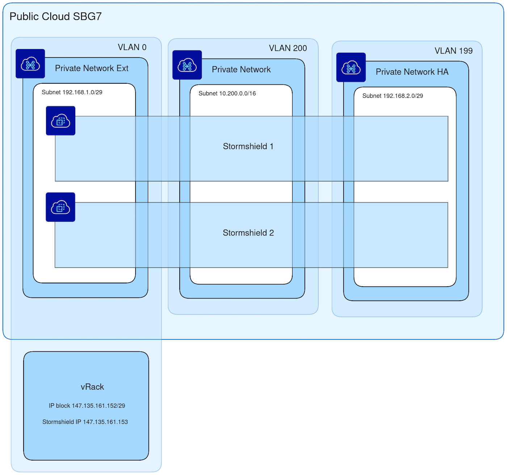{.thumbnail}

### Netzwerk OpenStack konfigurieren

Erstellen Sie das private Netzwerk für externe SNS EVA Interfaces:

```bash
openstack network create --provider-network-type vrack --provider-segment 0 --disable-port-security stormshield-ext
```

```bash
openstack subnet create --network stormshield-ext --subnet-range 192.168.1.0/29 --dhcp stormshield-ext
```

Erstellen Sie das private Netzwerk für die internen Interfaces des EVA SNS:

```bash
openstack network create --provider-network-type vrack --provider-segment 200 --disable-port-security stormshield-vlan200
```

```bash
openstack subnet create --network stormshield-vlan200 --subnet-range 10.200.0.0/16 --dhcp --dns-nameserver <dns_address_ip> stormshield-vlan200
```

Erstellen Sie das private Netzwerk für die SNS HA Interfaces (**H**igh **A**vailability):

```bash
openstack network create --provider-network-type vrack --provider-segment 199 --disable-port-security stormshield-ha
```

```bash
openstack subnet create --network stormshield-ha --subnet-range 192.168.2.0/29 --dhcp --gateway none stormshield-ha
```

#### EVA SNS Instanzen deployen

Gehen Sie in den Bereich `Download` auf der [offiziellen Website von Stormshield](https://documentation.stormshield.eu/SNS/v4/en/Content/PAYG_Deployment_Guide/Downloading_installation_file.htm){.external}. Melden Sie sich mit Ihrem Stormshield-Account an, und folgen Sie den Anweisungen zum Herunterladen des Stormshield OpenStack Images.

Gehen Sie in den Ordner, in den Sie Ihr OpenStack EVA SNS Image hochgeladen haben, und importieren Sie das Image (für diese Anleitung verwenden wir das Image `utm-SNS-EVA-4.8.3-openstack.qcow2`):

```bash
openstack image create --disk-format raw --container-format bare --file ./utm-SNS-EVA-4.8.3-openstack.qcow2 stormshield-SNS-EVA-4.8.3
```

Erstellen Sie die EVA SNS Instanzen (in diesem Beispiel haben wir sie `stormshield-1` und `stormshield-2` genannt):

```bash
openstack server create --flavor b3-32 --image stormshield-SNS-EVA-4.8.3 --network stormshield-ext --network stormshield-vlan200 --network stormshield-ha stormshield-1
```

```bash
openstack server create --flavor b3-32 --image stormshield-SNS-EVA-4.8.3 --network stormshield-ext --network stormshield-vlan200 --network stormshield-ha stormshield-2
```

> [!primary]
> Zur Optimierung der Performance empfehlen wir die folgenden EVA SNS-Lizenztypen für unsere VM-Versionen:
>
> - EVA1: B3-8 / B3-16
> - EVA2: B3-16 / B3-32
> - EVA3: B3-32 / B3-64
> - EVA4: B3-64 / B3-128
> - EVAU: B3-128 / B3-256
>

### SNS EVA Instanzen konfigurieren

Loggen Sie sich in Ihr [OVHcloud Kundencenter](/links/manager) ein, gehen Sie in den Bereich `Public Cloud`{.action} und wählen Sie das betreffende Public Cloud Projekt aus.  Klicken Sie im linken Menü auf `Instanzen`{.action} unter **Compute** und finden Sie Ihre beiden SNS EVA Instanzen.

Greifen Sie für beide EVA SNS-Instanzen auf die VNC-Konsole zu, und konfigurieren Sie das Tastaturlayout und das Kennwort.

Konfigurieren Sie das Standard-Gateway auf der ersten EVA SNS mit unserem IP-Block-Gateway:

```bash
vi /usr/Firewall/ConfigFiles/object
```

```console
[Host]
Firewall_out_router=147.135.161.158,resolve=static
...
```

Konfigurieren Sie das externe Netzwerk-Interface auf dem ersten EVA SNS mit der ersten verwendbaren IP-Adresse unseres IP-Blocks und das interne Netzwerk-Interface mit der IP-Adresse `10.200.0.1`:

```bash
vi /usr/Firewall/ConfigFiles/network
```

```console
...
[ethernet0]
...
Address=147.135.161.153
Mask=255.255.255.248

[ethernet1]
...
Address=10.200.0.1
Mask=255.255.0.0
...
```

Neue Netzwerkkonfiguration anwenden:

```bash
ennetwork
```

Führen Sie dieselbe Konfiguration für das zweite EVA SNS aus, jedoch mit der zweiten IP-Adresse `147.135.161.154` unseres IP-Blocks für die externe Schnittstelle anstelle von `147.135.161.153`.

Fügen Sie eine andere Lizenz für die beiden EVA SNS Instanzen hinzu, indem Sie die [offizielle Dokumentation](https://documentation.stormshield.eu/SNS/v4/en/Content/Installation_and_first_time_configuration/Firewall_license_installation.htm){.external} befolgen.

Erstellen Sie eine Firewall-Regel auf beiden EVA SNS in der Web-GUI:

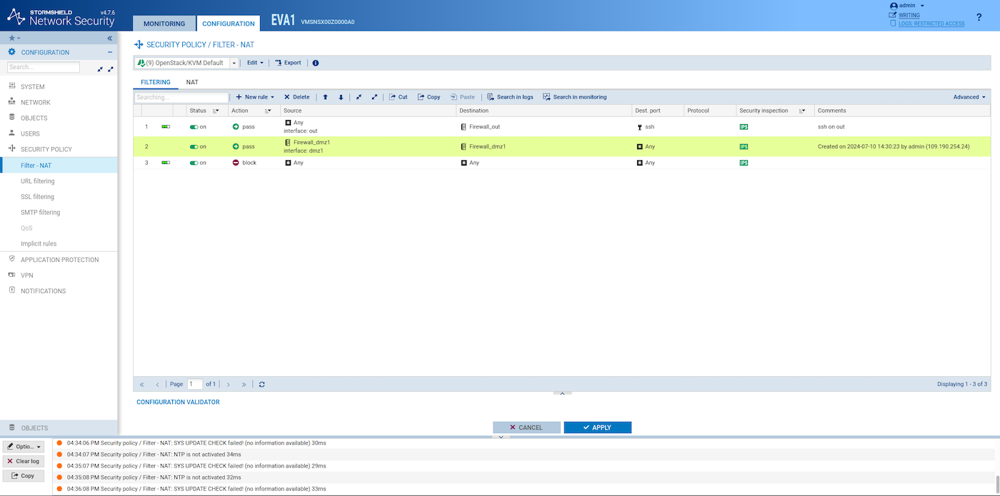{.thumbnail}

Erstellen Sie auf dem ersten EVA SNS eine Firewall-Gruppe (`Configuration` > `System` > `High Availability`). Überprüfen Sie bezüglich der IP-Adresse, welche IP vom OpenStack DHCP dem HA Interface zugewiesen wurde.

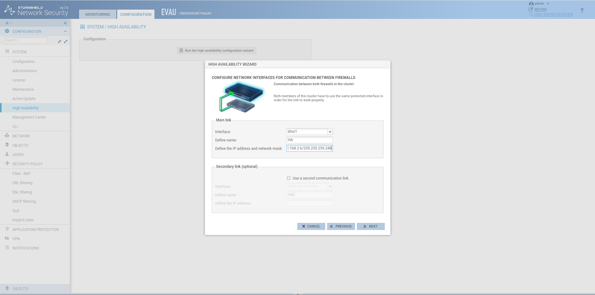{.thumbnail}

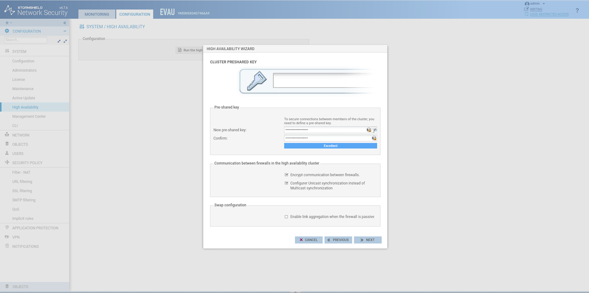{.thumbnail}

Wenn die HA Konfiguration auf dem ersten EVA SNS abgeschlossen ist, treten Sie der Firewall-Gruppe auf dem zweiten SNS EVA bei:

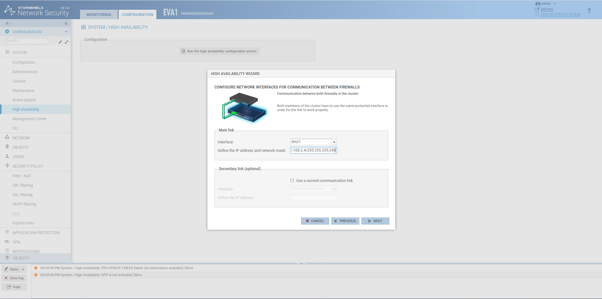{.thumbnail}

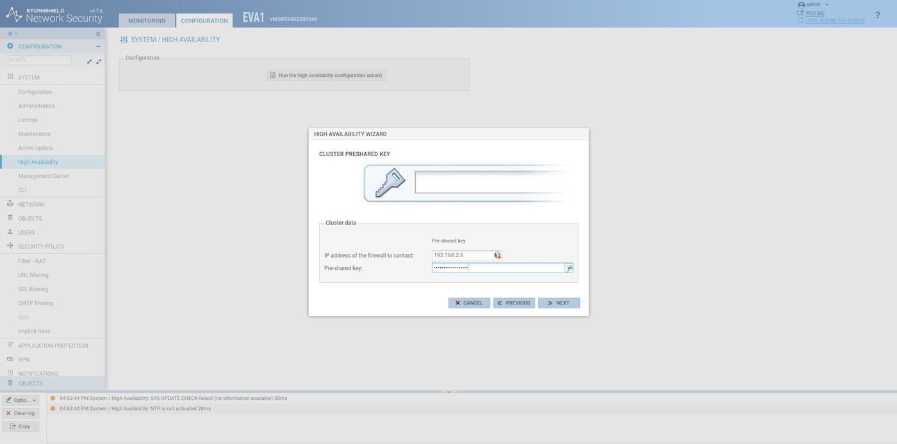{.thumbnail}

Die zweite externe Schnittstelle des EVA SNS verwendet nun dieselbe IP-Adresse wie die erste. Daher kann die IP-Adresse `147.135.161.154` nun für andere Zwecke verwendet werden.

Wenn alles korrekt konfiguriert ist, sollten Sie nach dem Neustart des zweiten EVA SNS in den Health Indicators des HA Links beispielhaft Folgendes sehen:

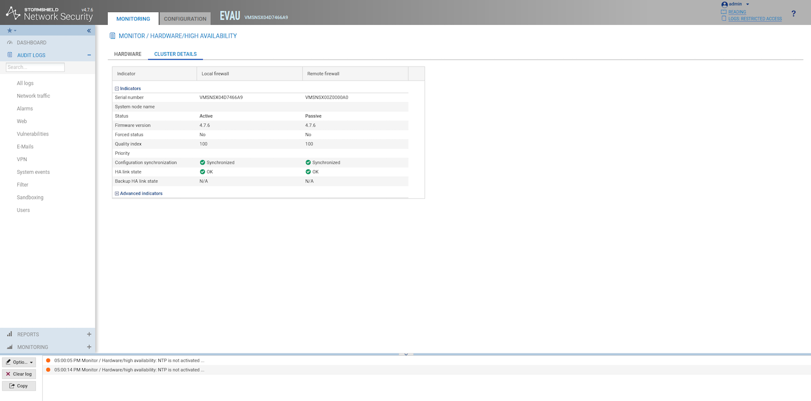{.thumbnail}

### Konfiguration und Absicherung der Verwaltung des EVA SNS

> [!tabs]
> **Schritt 1**
>>
>> Rufen Sie Ihre öffentliche IP-Adresse ab:
>>
>> ```console
>> curl ipinfo.io/ip
>> <ip_address>
>> ```
>>
> **Schritt 2**
>>
>> Erstellen Sie ein Host-Objekt für Ihre öffentliche IP-Adresse:
>>
>>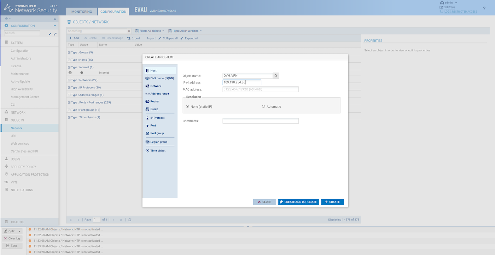{.thumbnail}
>>
> **Schritt 3**
>>
>> Beschränken Sie den Zugriff auf die GUI auf Ihre öffentliche IP-Adresse und aktivieren Sie SSH:
>>
>> 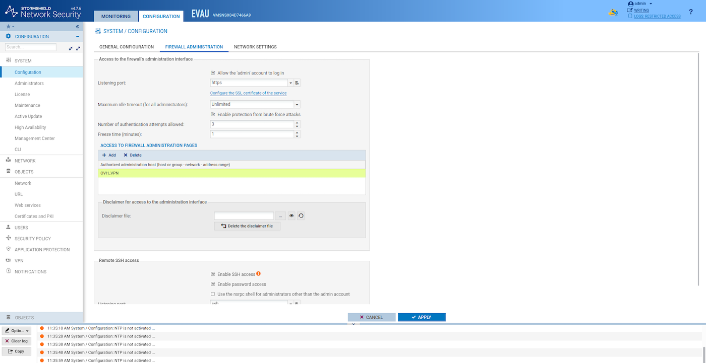{.thumbnail}
>>
> **Schritt 4**
>>
>> Schränken Sie den SSH-Zugriff auf Ihre öffentliche IP-Adresse ein:
>>
>> 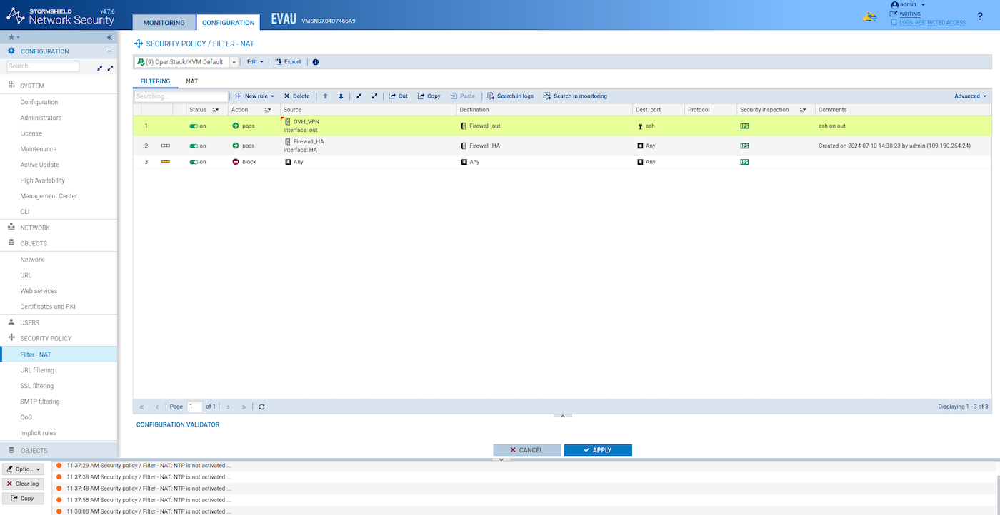{.thumbnail}

### HA-Konfiguration neu synchronisieren

Die Synchronisierung zwischen den beiden EVA SNS Instanzen ist entscheidend, um sicherzustellen, dass beide Firewalls immer auf dem neuesten Stand der Konfiguration sind. Dies kann über die SSH-Befehlszeile oder direkt über die grafische Benutzeroberfläche (GUI) erfolgen.

> [!primary]
> In diesem Beispiel verwenden wir die Befehlszeilenlösung über SSH. Wenn Sie die GUI zur Synchronisierung bevorzugen, finden Sie in der [Stormshield SNS EVA-Dokumentation](https://documentation.stormshield.eu/SNS/v4/en/Content/User_Configuration_Manual_SNS_v4/High_Availability/High_availability_screen.htm){.external} ausführliche Schritte.

Zu diesem Zeitpunkt sind die beiden SNS EVA Instanzen nicht mehr synchron, da wir eine große Anzahl von Parametern auf der ersten Instanz konfiguriert haben, die der zweiten Instanz nicht bekannt ist.

Verbinden Sie sich via SSH mit der aktiven SNS EVA Instanz:

```bash
ssh admin@<ip_address>
```

Synchronisieren Sie die beiden EVA SNS:


```bash
hasync
```

Dieser Vorgang ist bei jeder Aktualisierung der Konfiguration erforderlich.

### Anwendungsfall-Konfigurationen

Nach der Bereitstellung der EVA SNS-Firewall kann sie in mehreren erweiterten Sicherheitsszenarien wie IPsec VPN, SSL/TLS VPN, Netzwerk-Gateways (IN oder OUT) verwendet werden, wie unten beschrieben.  
Dank des privaten vRack Netzwerks können die aufgeführten VLANs auch außerhalb der Public Cloud Umgebung verwendet werden: bei Bare Metal oder Private Cloud Produkten.

<a name="step2"></a>

#### Anwendungsfall 1: Konfigurieren von Stormshield Network Security zur Verwendung als Gateway

In diesem Beispiel fungiert die virtuelle Firewall als sicheres Gateway für private Instanzen (oder andere Server) innerhalb des VLAN200 des jeweiligen vRack-Netzwerks. Für diese Art von Datenverkehr kann eine URL-Filterung in der Firewall durchgeführt werden.

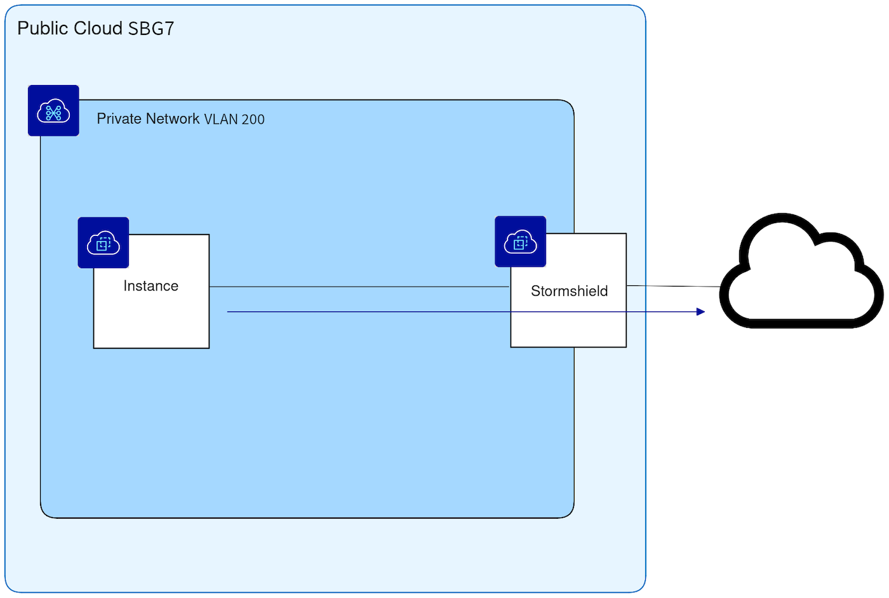{.thumbnail}

- Erstellen Sie ein Netzwerkobjekt für das VLAN200 gemäß [diesem Teil der offiziellen Stormshield-Dokumentation](https://documentation.stormshield.eu/SNS/v4/en/Content/Stormshield_Network_SSO_Agent_Linux/Configure_Firewall_Objects.htm){.external}.

- [Erstellen Sie eine neue Filterregel](https://documentation.stormshield.com/SNS/v4/en/Content/HowTo_-_IPSec_VPN_-_Authentication_by_certificate/Setup-Main-Site-30-Creating-Filtering-policy.htm){.external}, die es ermöglicht, dass der Datenverkehr vom VLAN200 ausgeht:

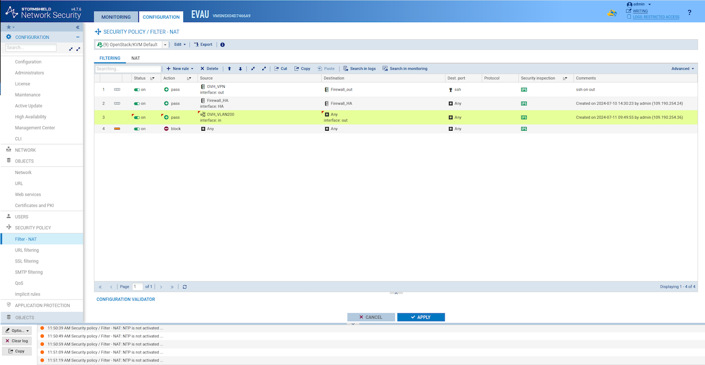{.thumbnail}

- [Erstellen Sie eine NAT-Regel](https://documentation.stormshield.eu/SNS/v4/en/Content/User_Configuration_Manual_SNS_v4/Filtering_and_NAT/NAT_tab.htm){.external} ähnlich dieser:

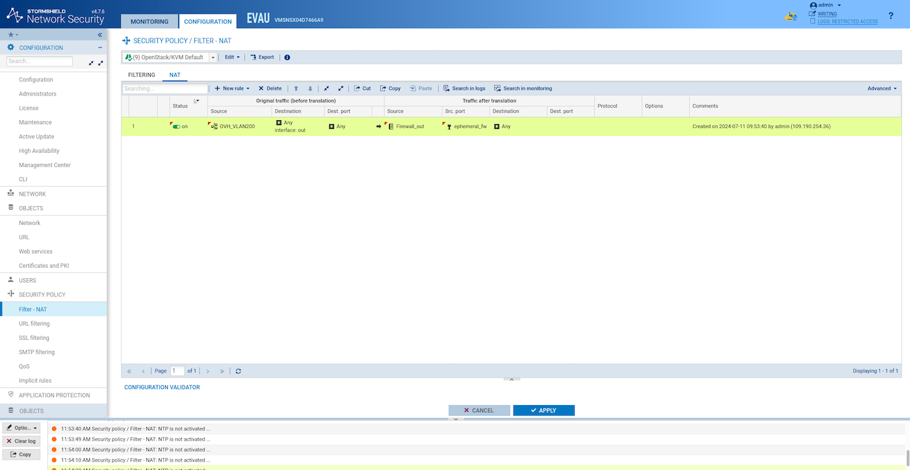{.thumbnail}

Synchronisieren Sie die beiden HA SNS EVA Instanzen:

```bash
ssh admin@<ip_address>
hasyn
```

##### Überprüfen, ob eine Instanz vom VLAN200 aus das Internet erreichen kann

[Importieren Sie Ihren öffentlichen SSH-Schlüssel](https://docs.openstack.org/python-openstackclient/pike/cli/command-objects/keypair.html){.external}:

```bash
openstack keypair create --public-key ~/.ssh/id_rsa.pub <name>
```

Erstellen Sie eine Instanz im VLAN200:

```bash
openstack server create --flavor b2-7 --image "Ubuntu 22.04" --network stormshield-vlan200 --key-name <name> ubuntu-webserver
```

Verbinden Sie sich via SSH mit der SNS EVA Instanz:

```bash
ssh -A admin@<instance_ip>
```

Verbinden Sie sich via SSH mit dem Ubuntu Webserver. Überprüfen Sie, welche IP-Adresse Ihrer Ubuntu Webserver-Instanz vom OpenStack DHCP zugewiesen wurde:

```bash
ssh ubuntu@<ip_address>
```

Testen Sie, ob Sie eine öffentliche Website erreichen können:

```bash
curl -I https://www.ovh.de/
HTTP/2 200
```

<a name="step3"></a>

#### Anwendungsfall 2: Konfigurieren Sie NAT, um von außen auf einen privaten HTTP-Dienst zuzugreifen

In diesem Beispiel sollte das Internet den privaten Webserver erreichen können, der auf VLAN200 installiert ist. Zweck dieser Konfiguration ist es, den Webserver mit einer Netzwerk-Firewall zu schützen.

{.thumbnail}

> [!tabs]
> **Schritt 1**
>>
>> Installieren Sie Nginx auf der Ubuntu Webserver-Instanz:
>>
>> ```bash
>> sudo apt-get update
>> sudo apt-get install -y nginx
>> ```
>>
> **Schritt 2**
>>
>> Erstellen Sie ein Host-Objekt für die Ubuntu Webserver-Instanz:
>>
>>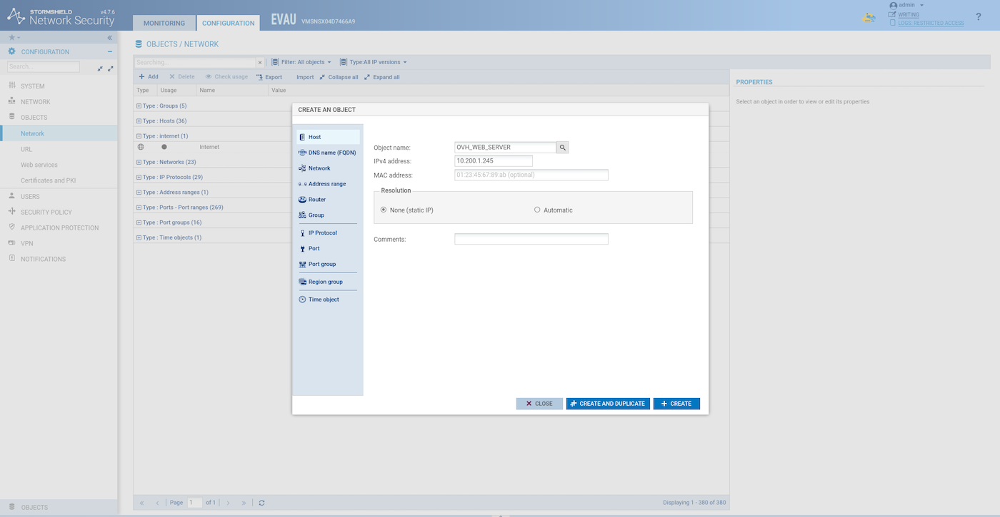{.thumbnail}
>>
> **Schritt 3**
>>
>> Erstellen Sie eine NAT-Regel nach diesem Beispiel:
>>
>> 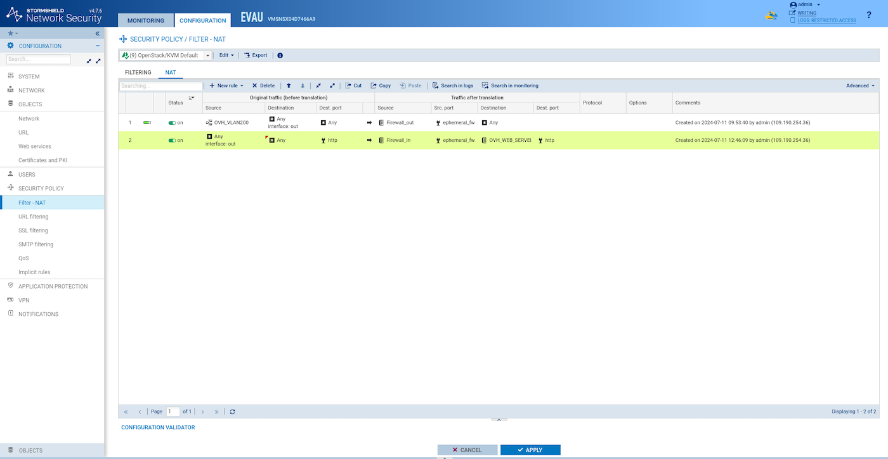{.thumbnail}
>>
> **Schritt 4**
>>
>> Erstellen Sie eine Filterregel nach diesem Beispiel:
>>
>> 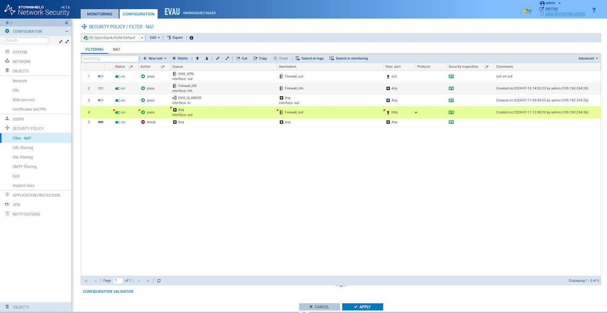{.thumbnail}
>>

Testen Sie den externen Zugriff auf die Website:

```bash
curl -I http://<ip_address>
HTTP/1.1 200 OK
```

Synchronisieren Sie die beiden HA SNS EVA Instanzen:

```bash
ssh admin@<ip_address>
hasyn
```

<a name="step4"></a>

#### Anwendungsfall 3: IPsec-Tunnel (Site-to-Site)

In diesem Beispiel ist der IPsec-Tunnel so konfiguriert, dass zwei verschiedene PCI-Regionen miteinander verbunden werden: SBG7 (VLAN200 Netzwerk) und GRA11 (VLAN201 Netzwerk), aber jeder dieser Standorte kann ein Remote-Standort wie ein Desktop oder ein Rechenzentrum sein.

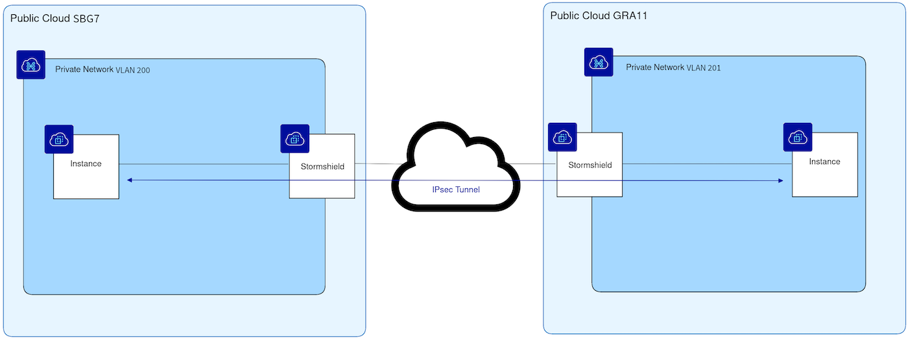{.thumbnail}

Wiederholen Sie alle Schritte in einer anderen Region mit VLAN 201 anstelle von VLAN 200 und mit verschiedenen IP-Adressbereichen für die Subnetze stormshield-ext und stormshield-ha.

##### **Ersten Standort konfigurieren**

- [Host-Objekt hinzufügen](https://documentation.stormshield.eu/SNS/v4/en/Content/Stormshield_Network_SSO_Agent_Linux/Configure_Firewall_Objects.htm){.external} für Remote-EVA-SNS und ein Netzwerk-Objekt für das private VLAN201-Remote-Netzwerk hinzufügen.

- [Standortübergreifenden Standorttunnel erstellen](https://documentation.stormshield.eu/SNS/v4/en/Content/User_Configuration_Manual_SNS_v4/IPSec_VPN/Encryption_policy-Tunnels_tab-Site_to_Site-Creating.htm){.external}.

> [!tabs]
> **Schritt 1**
>>
>> Fügen Sie das private LAN und das private Remote-Netzwerk hinzu:
>>
>>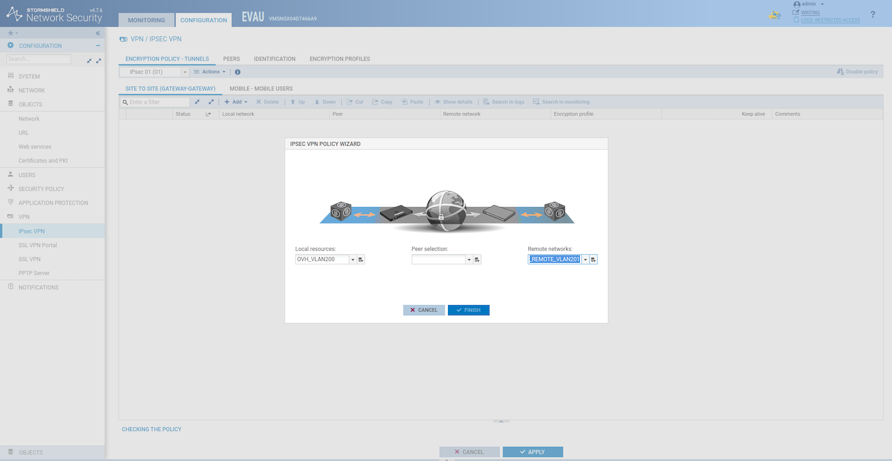{.thumbnail}
>>
> **Schritt 2**
>>
>> Remote-Gateway erstellen:
>>
>>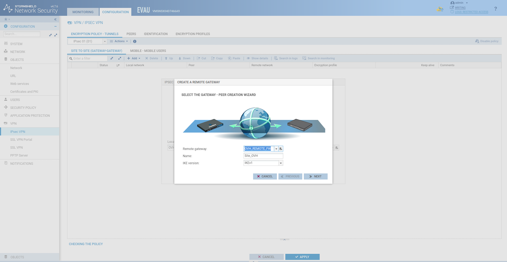{.thumbnail}
>>
> **Schritt 3**
>>
>> Wählen Sie einen vorinstallierten Schlüssel aus:
>>
>>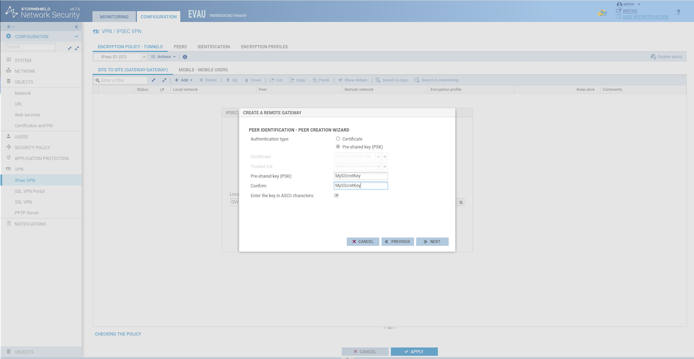{.thumbnail}
>>
> **Schritt 4**
>>
>> rstellen und aktivieren Sie den Tunnel:
>>
>>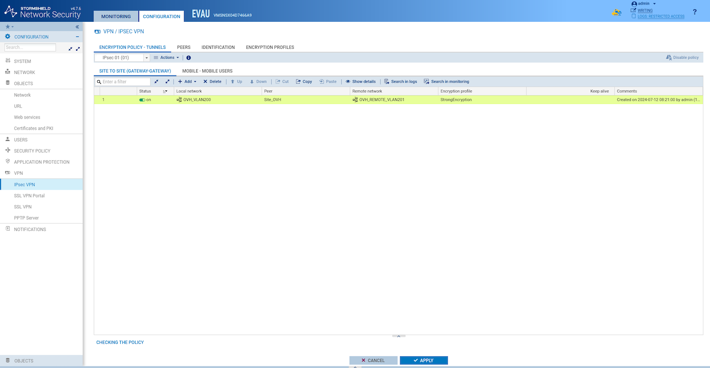{.thumbnail}
>>
> **Schritt 5**
>>
>> Fügen Sie eine Filterregel wie diese hinzu, um den Datenverkehr durch den Tunnel zuzulassen:
>>
>>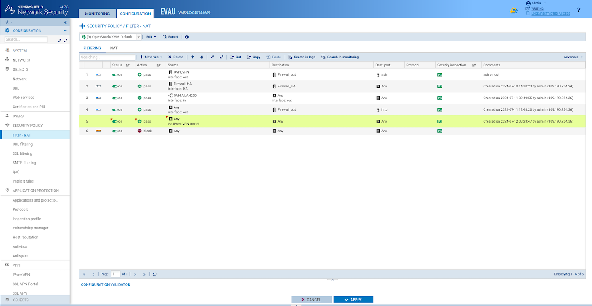{.thumbnail}
>>

Synchronisieren Sie die beiden HA SNS EVA Instanzen:


```bash
ssh admin@<ip_address>
hasync
```

##### **Zweiten Standort konfigurieren**

Gehen Sie genauso vor wie beim ersten Standort, aber verwenden Sie VLAN200 für das private Remote-Netzwerk und die entsprechende IP-Adresse für OVH_REMOTE_FW.

##### **Testen Sie den IPsec-VPN-Tunnel**

Von der ersten Instanz des privaten Webservers der Seite:

```console
ssh -A admin@<ip_address>
ssh ubuntu@<ip_address>
ping <ip_address>
PING <ip_address>(<ip_address>) 56(84) bytes of data.
64 bytes from <ip_address>: icmp_seq=1 ttl=64 time=15.2 ms
64 bytes from <ip_address>: icmp_seq=2 ttl=64 time=14.0 ms
```

Von der zweiten Instanz des privaten Webservers der Seite:

```console
ssh -A admin@<ip_address>
ssh ubuntu@<ip_address>
ping <ip_address>
PING <ip_address> (<ip_address>) 56(84) bytes of data.
64 bytes from <ip_address>: icmp_seq=2 ttl=64 time=16.9 ms
64 bytes from <ip_address>: icmp_seq=3 ttl=64 time=16.4 ms
```

<a name="step5"></a>

#### Anwendungsfall 4: SSL/TLS VPN (Client-to-Site)

In diesem Beispiel stellt ein Remote OpenVPN Client eine Verbindung mit dem privaten Netzwerk innerhalb von VLAN200 her.

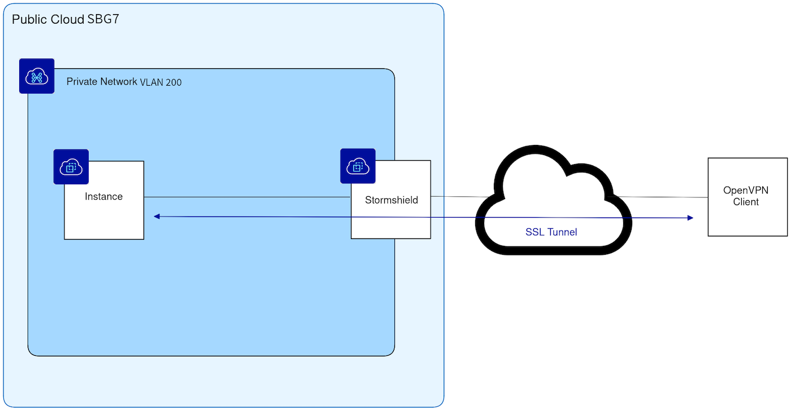{.thumbnail}

##### **Konfigurieren des LDAP Directory**

- [Erstellen Sie ein internes LDAP-Verzeichnis](https://documentation.stormshield.eu/SNS/v4/en/Content/User_Configuration_Manual_SNS_v4/Directory_configuration/Creating_an_internal_LDAP.htm){.external}, um VPN-Benutzer zu verwalten.

In einem Produktionsszenario muss dieses LDAP/AD *remote* und nicht lokal sein.

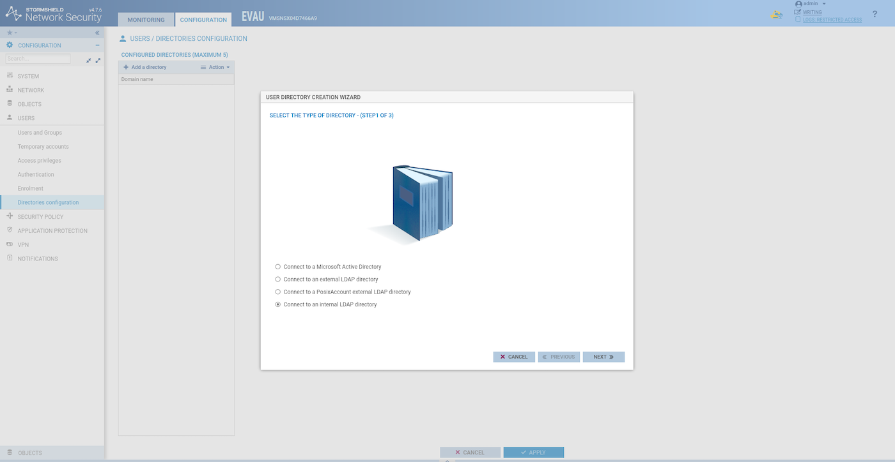{.thumbnail}

- Benutzerverzeichnis erstellen:

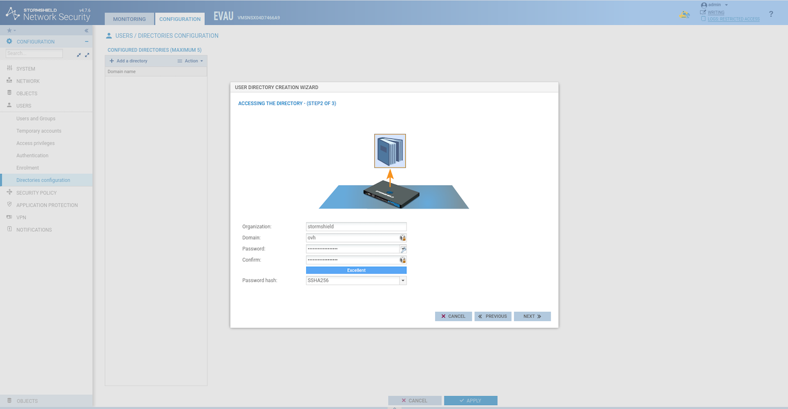{.thumbnail}

- Fügen Sie einen Benutzer zu unserem lokalen Verzeichnis hinzu:

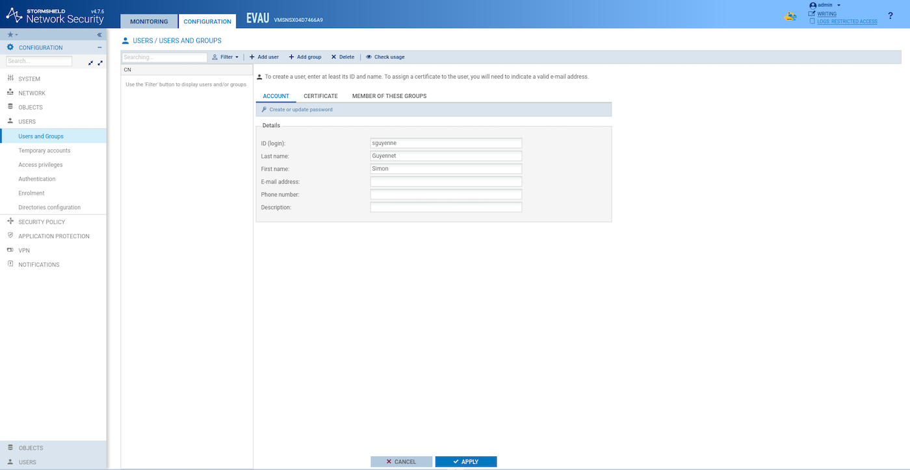{.thumbnail}

- Wählen Sie ein Passwort für den neuen Benutzer aus:

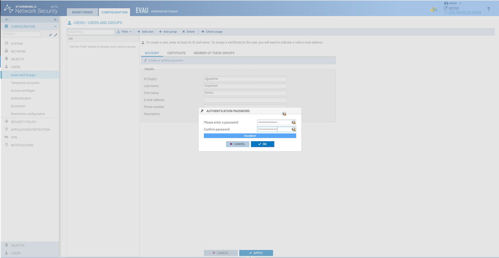{.thumbnail}

##### **VPN-Netzwerk-Oobjekte konfigurieren**

Erstellen Sie zwei Netzwerk-Objekte für den SSL VPN Client.

UDP Client-Netzwerk:

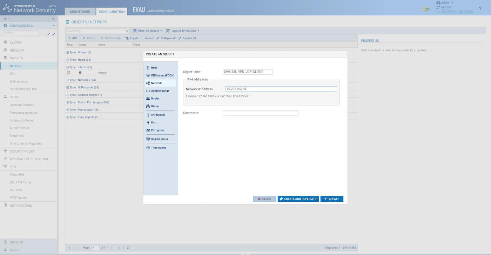{.thumbnail}

TCP Client-Netzwerk:

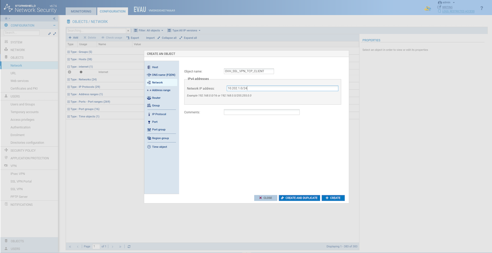{.thumbnail}

##### **Konfiguration des SSL VPN Servers**

Konfigurieren Sie den SSL VPN Server:

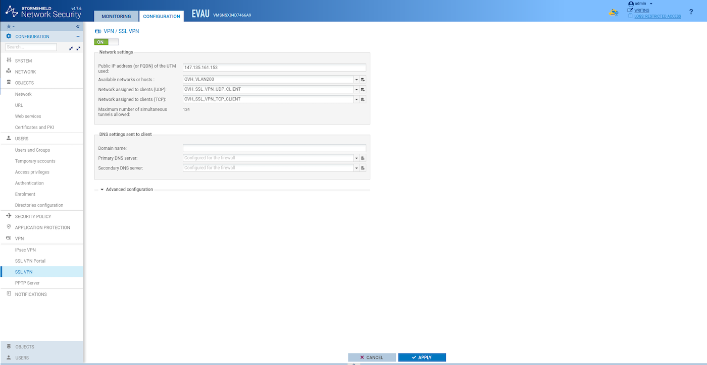{.thumbnail}

##### **Verwaltung der Benutzerrechte**

Fügen Sie Ihrem Benutzer die Berechtigung zur Verwendung des SSL VPN Servers hinzu (`Configuration` > `Users` > `Access privileges` > `Detailed Access` > `Add`).

Suchen Sie nach Ihrem Benutzer:

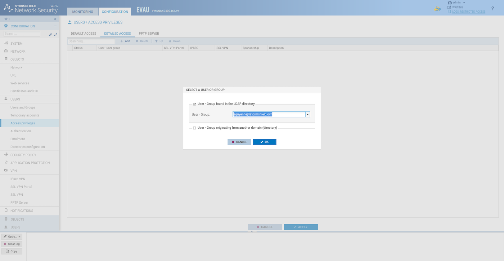{.thumbnail}

SSL VPN erlauben:

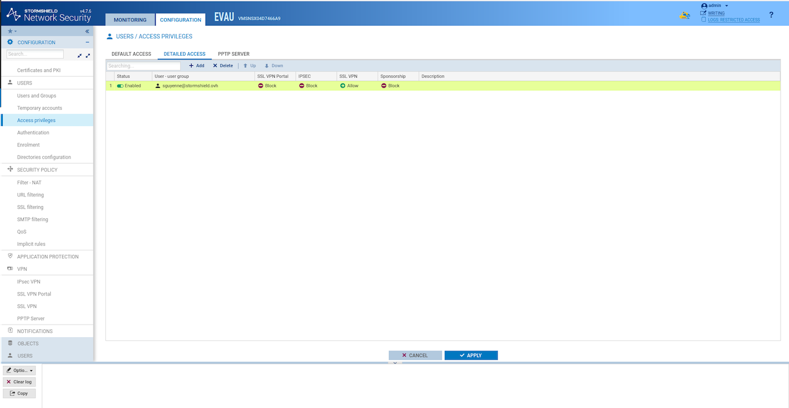{.thumbnail}

##### **Filterregeln konfigurieren**

Fügen Sie eine Filterregel wie diese hinzu, um dem VPN-Client den Zugriff auf das VLAN200 zu ermöglichen:

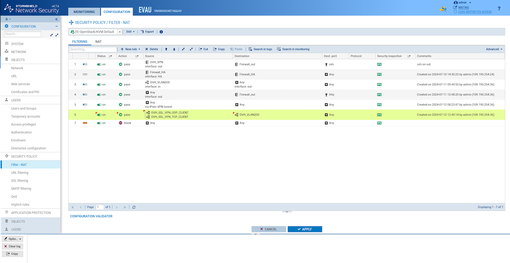{.thumbnail}

##### **Synchronisierung der SNS Instanzen**

Synchronisieren Sie die beiden HA SNS EVA Instanzen:

```bash
ssh admin@<ip_address>
hasync
```

##### **SSL/TLS VPN testen**

> [!primary]
> Um die SSL/TLS Konnektivität zu testen, verwenden Sie ein Gerät, auf dem OpenVPN installiert ist. In diesem Beispiel wird ein OpenVPN-Client über einer OpenStack Instanz in einer anderen Region getestet.
>
> In diesem Beispiel verwenden wir den OpenVPN Client. Sie können auch die [Stormshield Paketversion](https://vpn.stormshield.eu/){.external} verwenden.

Laden Sie die VPN-Konfigurationsdatei herunter (`Configuration` > `VPN` > `SSL VPN` > `Advanced configuration` > `Export the configuration file`).

Erstellen Sie eine öffentliche OpenVPN Client Instanz in der Region Ihrer Wahl:

```bash
openstack server create --flavor b2-7 --image "Ubuntu 22.04" --network Ext-Net --key-name sguyenne ubuntu-vpn-client
```

Überprüfen Sie die der Instanz zugewiesene IP-Adresse und übertragen Sie die Konfigurationsdatei:

```bash
scp ~/Download/openvpn_mobile_client.ovpn ubuntu@<ip_address>:~
```

Verbinden Sie sich mit der Instanz:

```bash
ssh ubuntu@<ip_address>
```

Installieren Sie den OpenVPN Client:

```bash
sudo apt-get update
sudo apt-get install -y openvpn
```

Verbindung zum VPN herstellen:

```bash
sudo openvpn --config openvpn_mobile_client.ovpn 
Enter Auth Username: address@stormshield.ovh
🔐 Enter Auth Password: ******************
```

Test mit Ping zur privaten Webserver-Instanz:

```bash
ssh ubuntu@<ip_address>
ping <ip_address>
```

```console
PING <ip_address> (<ip_address>) 56(84) bytes of data.
64 bytes from <ip_address>: icmp_seq=1 ttl=64 time=14.1 ms
64 bytes from <ip_address>: icmp_seq=2 ttl=64 time=13.1 ms
```

<a name="gofurther"></a>

## Weiterführende Informationen

Wenn Sie Schulungen oder technische Unterstützung bei der Implementierung unserer Lösungen benötigen, wenden Sie sich an Ihren Vertriebsmitarbeiter oder klicken Sie auf [diesen Link](/links/professional-services), um einen Kostenvoranschlag zu erhalten und eine persönliche Analyse Ihres Projekts durch unsere Experten des Professional Services Teams anzufordern.

Treten Sie unserer [User Community](/links/community) bei.
