## Ziel

Da Unternehmen zunehmend auf Cloud-Lösungen umsteigen, ist die Sicherheit von Cloud-Anwendungen und APIs von entscheidender Bedeutung, um die Datenintegrität aufrechtzuerhalten und Angriffe zu verhindern.  
**U**bika **W**AAP **G**ateway (UWG) bietet erweiterte Funktionen für Web-Applikations- und API-Schutz (WAAP), einschließlich leistungsstarker Tools wie Web Application Firewalls (WAF), Bot-Verwaltung und DDoS-Schutz. Diese Tools helfen Ihnen, Ihre Cloud-Umgebung vor einer Vielzahl von Bedrohungen auf Anwendungsebene zu schützen.

Diese Anleitung enthält detaillierte Anweisungen zur Inbetriebnahme und Konfiguration von Ubika WAAP Gateway in der OVHcloud Public Cloud. Sie erfahren, wie Sie private Netzwerke für die Verwaltung und den Workload konfigurieren, Ubika WAAP Gateway Instanzen einrichten, mithilfe von Additional IP, vRack und Routing für öffentliche IPs eine hohe Verfügbarkeit (HA) einrichten und eine sichere und zuverlässige Architektur für Ihre Cloud-Infrastruktur ermöglichen.

**Diese Anleitung erklärt, wie Sie Ihre OVHcloud Infrastruktur mit Ubika WAAP Gateway in der Public Cloud absichern.**

> [!warning]
> In diesem Tutorial erläutern wir die Verwendung von OVHcloud Lösungen mit externen Tools. Die durchgeführten Aktionen werden in einem bestimmten Kontext beschrieben. Möglicherweise müssen Sie bestimmte Anweisungen an Ihre Umgebung oder individuelle Bedürfnisse anpassen.
>
> Wir empfehlen, bei Schwierigkeiten bezüglich der Umsetzung einen [spezialisierten Dienstleister](/links/partner) zu kontaktieren oder Ihre Fragen an die [OVHcloud Community](/links/community) zu richten. Weitere Informationen finden Sie am [Ende dieser Anleitung](#gofurther).
>

## Voraussetzungen

- Sie haben ein [Public Cloud Projekt](/pages/public_cloud/public_cloud_cross_functional/create_a_public_cloud_project) in Ihrem OVHcloud Kunden-Account.
- Sie haben Zugriff auf Ihr [OVHcloud Kundencenter](/links/manager).
- Sie haben einen [OpenStack User erstellt](/pages/public_cloud/compute/create_and_delete_a_user) (optional).
- Sie haben Grundkenntnisse in Networking.
- Sie haben auf der [Ubika-Website](https://my.ubikasec.com/){.external} einen Ubika-Account erstellt.
- Sie haben einen ausreichenden Block von Additional IP-Adressen verfügbar.
- Sie haben vRack aktiviert und konfiguriert, um eine sichere Kommunikation zwischen den Komponenten der Infrastruktur zu ermöglichen.
- Sie haben eine [Additional IP-Adresse](/links/network/additional-ip), um Failover und die Konfiguration von Hochverfügbarkeit zu ermöglichen.
- Sie haben eine Ubika WAAP Gateway Lizenz (**B**ring **Y**our **O**wn **L**icence), die über die [offizielle Website von Ubika](https://my.ubikasec.com/){.external} erworben wurde. Diese ist zur Installation und Konfiguration erforderlich.

## In der praktischen Anwendung

Neben der Installation und Konfiguration von UWG bietet dieses Tutorial einen Anwendungsfall, in dem Sie zum Testen von UWG eine Web-Anwendung auf Ihrer Public Cloud Infrastruktur deployen und ausführen:

- [Konfigurieren von vRack](#step1)
- [Ubika WAAP Gateway auf einer Public Cloud Umgebung installieren und konfigurieren](#step2)
- [Lizenzen konfigurieren](#step3)
- [Webserver-Umgebung erstellen](#step4)

<a name="step1"></a>

### Konfigurieren des vRack

In diesem Schritt konfigurieren wir das vRack, ein privates virtuelles Netzwerk, das von OVHcloud bereitgestellt wird. Mit dem vRack können Sie mehrere Instanzen oder Server in einer Public Cloud Umgebung untereinander verbinden, was die Isolierung des Netzwerks und gleichzeitig eine sichere Kommunikation gewährleistet.

Indem Sie Ihr Public Cloud Projekt und Ihren Additional IP Block zum selben vRack hinzufügen und Routing für öffentliche IP-Adressen einrichten, erlauben Sie Ihren UWG Instanzen eine sichere Kommunikation, während Sie gleichzeitig die volle Kontrolle über die Verwaltung der IP-Adressen behalten. Das private Netzwerk vRack erlaubt Ihnen auch die Absicherung von Bare Metal Servern oder Private Cloud VMs mit in der Public Cloud bereitgestellten Sicherheitsanwendungen.

**Fügen Sie Ihr Public Cloud Projekt und Ihren Additional IP Block zum selben vRack hinzu**

Weitere Informationen finden Sie in der Anleitung „[IP-Block in einem vRack konfigurieren](/pages/bare_metal_cloud/dedicated_servers/configuring-an-ip-block-in-a-vrack)“.

Hier die Architektur, die wir implementieren werden:

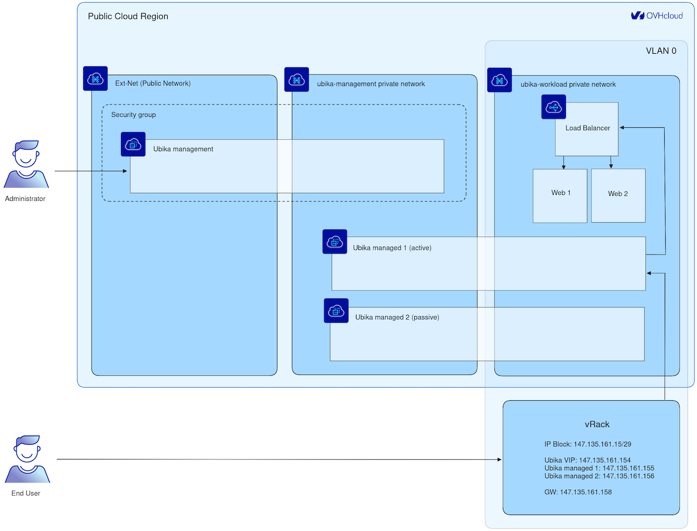{.thumbnail}

<a name="step2"></a>

### Installieren und konfigurieren von Ubika WAAP Gateway auf Ihrer Public Cloud Umgebung

> [!primary]
> In dieser Anleitung erfolgt die Installation und Konfiguration von UWG hauptsächlich über die Befehlszeile. Öffnen Sie ein Terminal, um die Anweisungen auszuführen.
>
> Beachten Sie, dass alle Abschnitte zu "High Availability" optional sind und die Verwendung des vRack Netzwerks mit Additional IP ebenfalls optional ist. Es wird veranschaulicht, wie das System mit zwei Instanzen im im Aktiv/Passiv Modus für hohe Verfügbarkeit eingerichtet wird. In einer minimalen Version kann es auch mit einer einzigen Instanz arbeiten, wenn dies Ihren Bedürfnissen genügt.

### Konfigurieren des Ubika WAAP Gateway Verwaltungsnetzwerk

> [!primary]
> In diesem Szenario verwenden wir zwei virtuelle Maschinen, die für die Sicherheitsanwendung konfiguriert sind, um hohe Verfügbarkeit (HA) zu erreichen, sowie einen zusätzliche virtuelle Maschine für die Verwaltung der Sicherheitsanwendung. Diese Konfiguration gewährleistet den Schutz vor Ausfällen und die kontinuierliche Verfügbarkeit des Dienstes. Weitere Beispiele und ausführliche Hilfe zu den Skalierungsoptionen finden Sie in der [Ubika-Dokumentation](https://www.ubikasec.com/resources/){.external}.

Erstellen Sie ein privates Netzwerk für die Verwaltung der Infrastruktur:

```bash
openstack network create --provider-network-type vrack --provider-segment 1000 ubika-management
```

Mit diesem Befehl wird ein privates Netzwerk für die Verwaltung der UWG-Instanzen mithilfe des von OVHcloud bereitgestellten Netzwerks (vRack) erstellt. Dieses isolierte Netzwerk dient der internen Kommunikation zwischen den Ubika-Komponenten.

```bash
openstack subnet create --network ubika-management --subnet-range 192.168.1.0/24 --dhcp --gateway none --dns-nameserver 213.186.33.99 ubika-management
```

Konfigurieren Sie hier ein Subnetz für das Verwaltungsnetzwerk, indem Sie einen IP-Adressbereich und einen DNS-Server für die interne Kommunikation angeben.

### Workload Network Ubika WAAP Gateway konfigurieren

Erstellen Sie ein privates Netzwerk für den Workload:

```bash
openstack network create --provider-network-type vrack --provider-segment 0 --disable-port-security ubika-workload
```

Mit diesem Befehl wird ein privates Netzwerk für den Workload erstellt, das zum Hosten von durch UWG gesicherten Anwendungen konzipiert ist.

```bash
openstack subnet create --network ubika-workload --subnet-range 192.168.2.0/24 --dhcp --dns-nameserver 213.186.33.99 ubika-workload
```

Definieren Sie hier ein Subnetz für das Workload-Netzwerk, das eine effiziente Verwaltung des Netzwerkverkehrs ermöglicht.

Erstellen Sie ein Gateway:

> [!primary]
> Für den Zugriff auf das Internet von Webservern aus kann ein Gateway erforderlich sein, etwa für die Installation von Software (z.B. Nginx) oder die Remote-Verwaltung. Für eingehenden Datenverkehr wird diese Komponente jedoch nicht verwendet.
>

```bash
openstack router create --external-gateway Ext-Net ubika-workload
```

```bash
openstack router add subnet 2481bcaf-efa2-419a-ad92-d6d27737dfd1 ubika-workload
```

#### Ubika WAAP Gateway Instanzen deployen

UWG Image auf OpenStack hochladen:

Gehen Sie in den Bereich `Download`{.action} auf der [offiziellen Website von Ubika](https://my.ubikasec.com/){.external}. Melden Sie sich bei Ihrem Ubika-Konto an und folgen Sie den Anweisungen zum Herunterladen des UWG OpenStack-Images.

Gehen Sie in den Ordner, in den Sie Ihr UWG OpenStack Image hochgeladen haben, und importieren Sie das UWG OpenStack Image (für diese Anleitung verwenden wir das Image `UBIKA_WAAP_Gateway-generic-cloud-6.11.10+51a56f6201.b56855.qcow2`):

```bash
openstack image create --disk-format raw --container-format bare --file ~/Downloads/UBIKA_WAAP_Gateway-generic-cloud-6.11.10+51a56f6201.b56855.qcow2 Ubika-WAAP-Gateway-6.11.10
```

[Importieren Sie Ihren öffentlichen SSH-Schlüssel](https://docs.openstack.org/python-openstackclient/pike/cli/command-objects/keypair.html){.external}:

```bash
openstack keypair create --public-key ~/.ssh/id_rsa.pub <username>
```

Erstellen Sie eine Sicherheitsgruppe für die verwalteten Instanzen:

```bash
openstack security group create ubika-management
```

```bash
openstack security group rule create --ingress --remote-ip 192.168.1.0/24 ubika-management
```

```bash
openstack security group rule create --ingress --remote-ip 109.190.254.24/32 --dst-port 22 --protocol tcp ubika-management
```

```bash
openstack security group rule create --ingress --remote-ip 109.190.254.24/32 --dst-port 3001 --protocol tcp ubika-management
```

Erstellen der verwalteten Instanzen:

Erstellen Sie vor dem Ausführen des folgenden OpenStack-Befehls zunächst eine Datei `management.json`, und fügen Sie den folgenden Inhalt hinzu, wobei Sie die Einstellungen an Ihre Umgebung anpassen:

```console
{
    "instance_name": "management",
    "admin_user": "admin",
    "admin_password": "adminpassword"
}
```

Führen Sie den folgenden Befehl aus, nachdem Sie die Datei `management.json` erstellt haben:

```bash
openstack server create --flavor r3-64 --image Ubika-WAAP-Gateway-6.11.10 --network Ext-Net --network ubika-management ubika-management --key-name <username> --security-group ubika-management --user-data ./management.json
```

Erstellen Sie die verwalteten UWG Instanzen:

Bevor Sie den folgenden OpenStack-Befehl ausführen, erstellen Sie zunächst eine Datei `managed-1.json` und fügen Sie den folgenden Inhalt hinzu, wobei Sie die Einstellungen an Ihre Umgebung anpassen.

```console
{
    "instance_role": "managed",
    "instance_name": "managed-1"
}
```

Führen Sie den folgenden Befehl aus, nachdem Sie die Datei `managed-1.json` erstellt haben:

```bash
openstack server create --flavor c3-16 --image Ubika-WAAP-Gateway-6.11.10 --network ubika-management --network ubika-workload ubika-managed-1 --key-name <username> --user-data ./managed-1.json
```

Wiederholen Sie diese Schritte, um eine zweite Instanz zu erstellen, verwenden Sie jedoch die Datei `managed-2.json`. Erstellen Sie den folgenden Inhalt, und fügen Sie ihn der Datei `managed-2.json` hinzu:

```console
{
    "instance_role": "managed",
    "instance_name": "managed-2"
}
```

### HA auf von UWG verwalteten Instanzen konfigurieren

Rufen Sie die öffentliche IP-Adresse der verwalteten Instanz ab:

```bash
openstack port list --server ubika-management --network Ext-Net
```

Melden Sie sich bei der grafischen Ubika Java-Benutzeroberfläche an und fügen Sie die beiden UWG Instanzen hinzu:

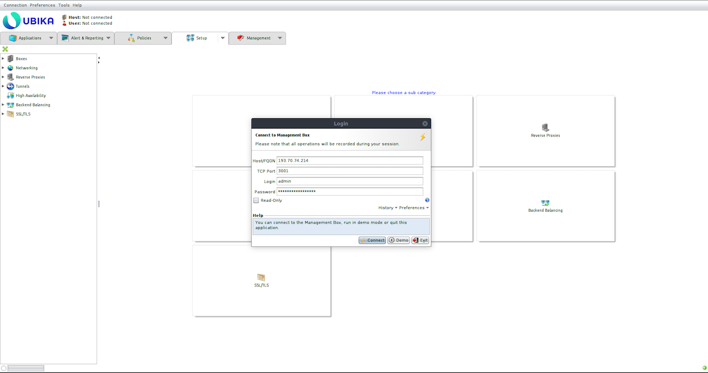{.thumbnail}

Rufen Sie die IP der verwalteten Instanzen ab:

```bash
openstack port list --server ubika-managed-1 --network ubika-management
```

```bash
openstack port list --server ubika-managed-2 --network ubika-management
```

Fügen Sie die erste verwaltete UWG-Instanz zur UWG-Verwaltung hinzu (`Setup` > `Boxes` > `Add`):

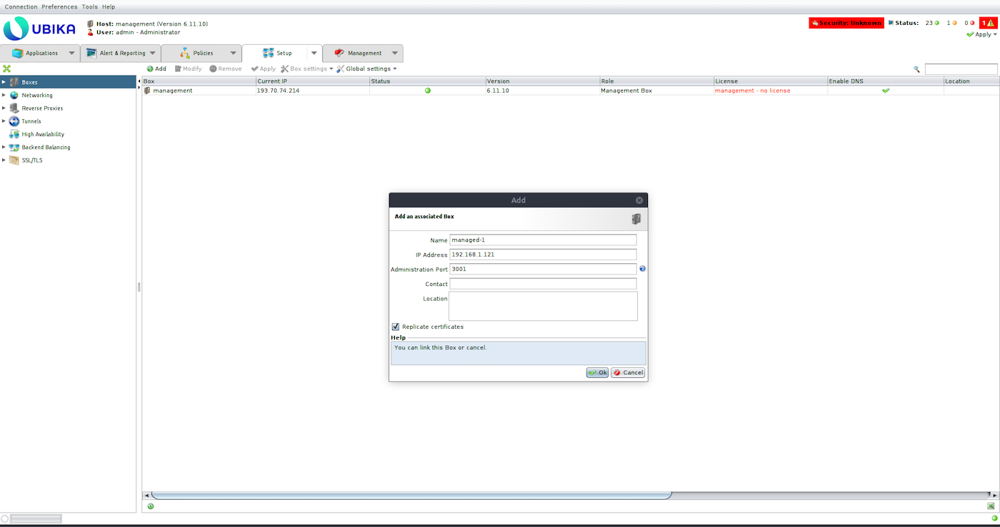{.thumbnail}

Zweite Instanz hinzufügen:

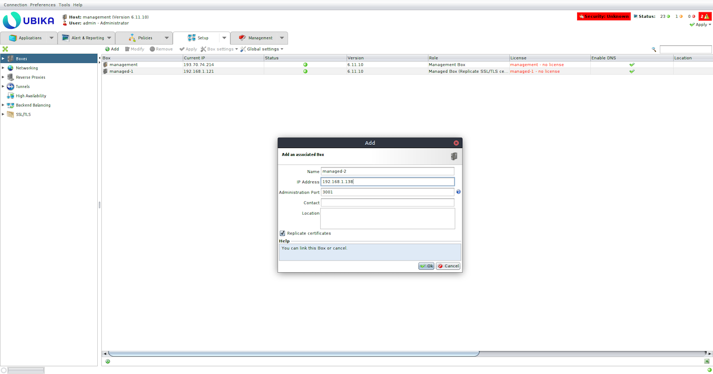{.thumbnail}

Fügen Sie dem `eth1` Interface jeder verwalteten UWG Instanz ein virtuelles Interface hinzu und konfigurieren Sie es mit einer IP Ihres IP-Blocks anstelle der privaten IP (`Setup` > `Networking` > `IP Addresses`).

Managed-1 UWG

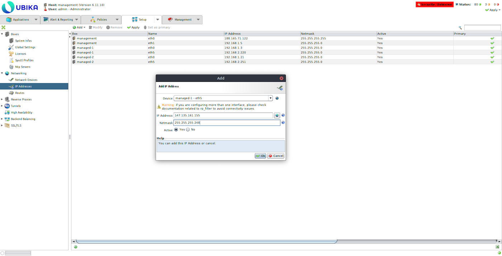{.thumbnail}

Managed-2 UWG

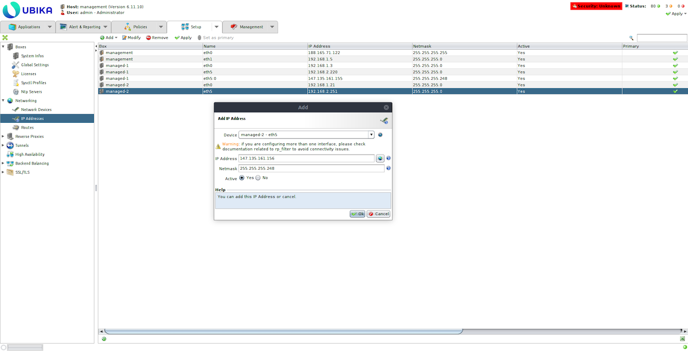{.thumbnail}

Entfernen Sie das Standard-Gateway und fügen Sie das vRack Gateway für jedes verwaltete Ubika hinzu (`Setup` > `Networking` > `Routes`).

Managed-1 UWG

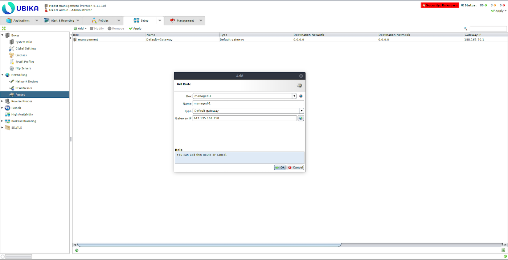{.thumbnail}

Managed-2 UWG

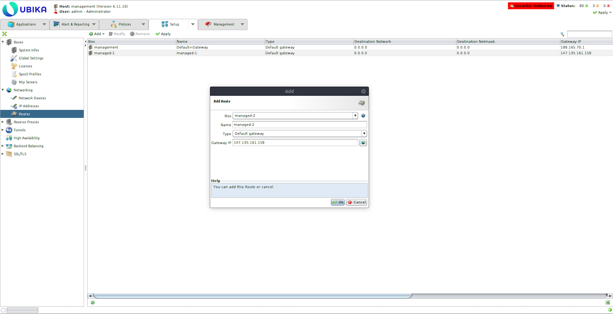{.thumbnail}

Erstellen Sie eine hoch verfügbare Aktive/Passiv Konfiguration (`Setup` > `High Availability` > `Add`):

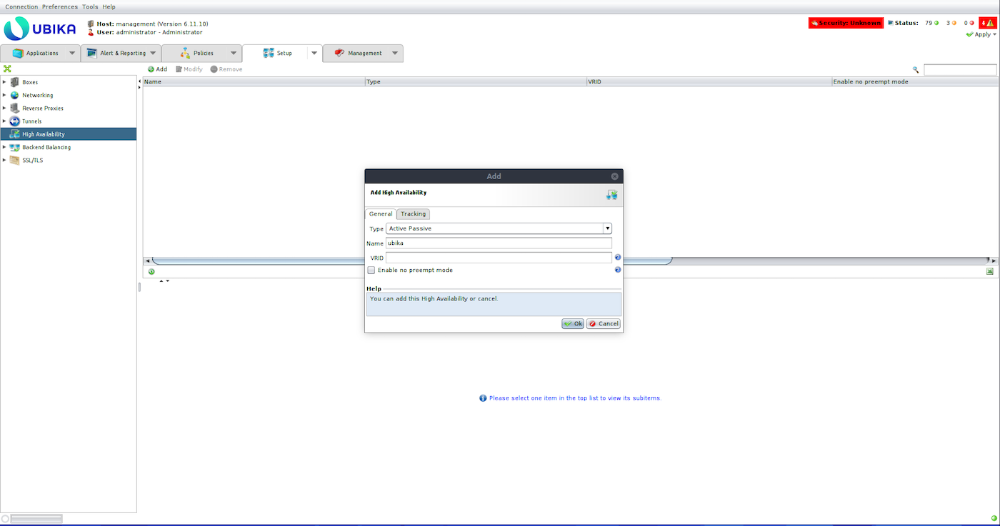{.thumbnail}

Fügen Sie eine IP-Adresse des IP-Blocks als virtuelle IP hinzu:

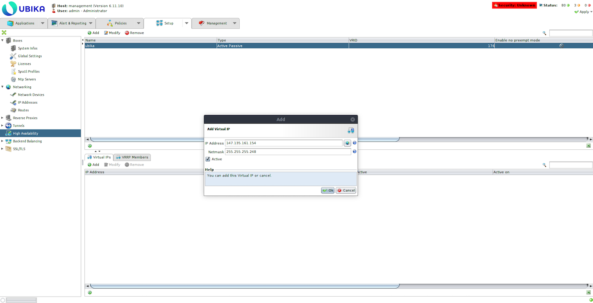{.thumbnail}

Fügen Sie die beiden verwalteten UWG-Instanzen als VRRP-Member mithilfe der Workload Interfaces (eth1) hinzu:

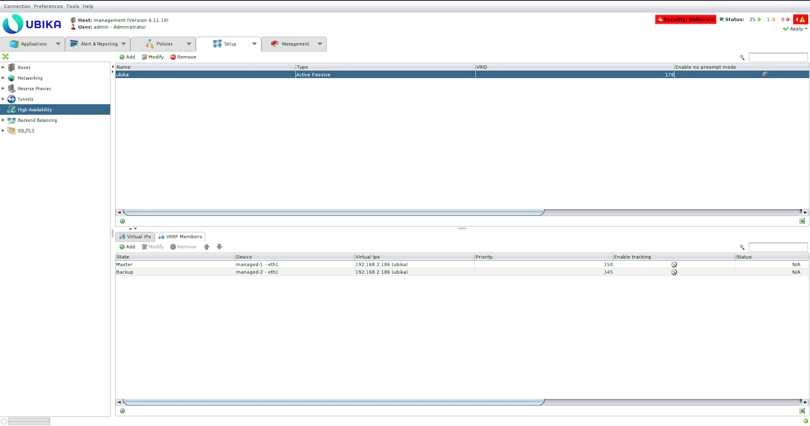{.thumbnail}

Konfiguration anwenden (Button oben rechts im Interface):

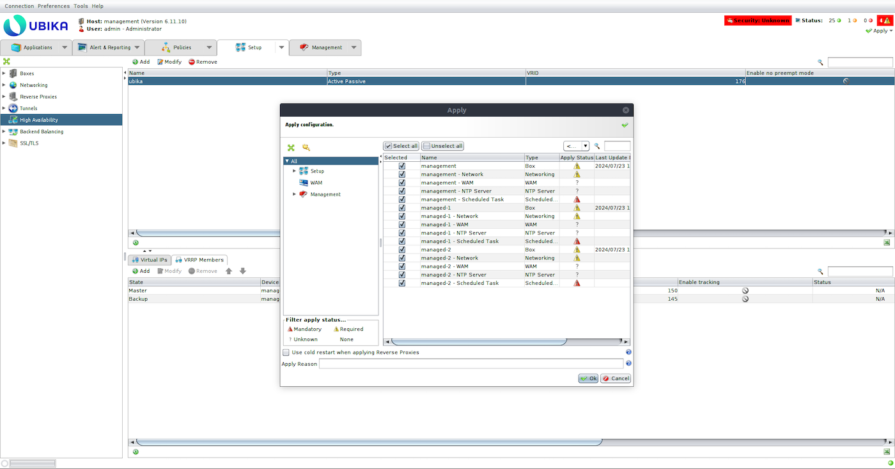{.thumbnail}

<a name="step3"></a>

### Lizenzen konfigurieren

Die Ubika WAAP Gateway Lizenzen sind über die [offizielle Website von Ubika](https://my.ubikasec.com/){.external} verfügbar. Abhängig von Ihren Bereitstellungsanforderungen können Sie zwischen einer einzelnen VM-Lizenz oder einer High Availability-Lizenz wählen, die eine Active Backup-Konfiguration mit zwei Data-Plane-Instanzen und einer oder mehreren Control-Plane-Instanzen unterstützt.  
Die Lizenzen variieren auch abhängig vom TPS SSL (Transaktionen pro Sekunde), wobei mehrere SSL-Zertifikate oder Failover-Funktionen unterstützt werden.

Es wird dringend empfohlen, die neuesten Generationen von Compute-Instanzen für Appliance-Bereitstellungen zu verwenden. Beispiel:

- C3-8 für grundlegende Anforderungen und VMcloud Lizenzen.
- C3-16, C3-32, C3-64 bzw. C3-128 für die Lizenzen Ubika Enterprise Edition 1500, 2450, 4450, 5450 und 6450.
- C3-16 für die kleine MGMT-Konsole oder C3-128 für die große MGMT-Konsole (abhängig von den aktivierten Beobachtungsoptionen).

Um die Lizenzen anzuwenden, müssen Sie UWG die folgenden Informationen bereitstellen:

- UWG Bereitstellungstyp (Single Instance oder HA)
- Seriennummer der UWG-Instanz
- Anzahl der vCPUs und der jeder Instanz zugewiesenen RAM

Sobald Sie die Lizenzen von Ubika erhalten haben, wenden Sie diese auf die entsprechenden Instanzen an, um die Installation abzuschließen.

<a name="step4"></a>

### Erstellen Sie Ihre Webserver-Umgebung

In diesem Abschnitt erstellen wir eine Webserver-Umgebung und richten einen Load Balancer ein, um den Traffic auf mehrere Webserver zu verteilen. Dieser Schritt ist entscheidend, um den korrekten Netzwerkbetrieb, die Sicherheit und die Hochverfügbarkeitseinstellungen Ihrer UWG-Konfiguration zu validieren. Mit einem Load Balancer stellen wir das Gleichgewicht des Traffics auf Ihren Webservern sicher. Dies ermöglicht Schutz und Redundanz im Falle eines Failovers, was für die Aufrechterhaltung der Verfügbarkeit des Dienstes unerlässlich ist.

Erstellen Sie zwei Webserver im Workload-Netzwerk.

Bevor Sie den OpenStack-Befehl ausführen, erstellen Sie zunächst eine `webserver.cloud-init`-Datei und fügen Sie den folgenden Inhalt hinzu, wobei Sie die Einstellungen an Ihre Umgebung anpassen:

```console
{
    #cloud-config
    users:
    - default

    package_update: true

    packages:
    - nginx

    runcmd:
    - hostname > /var/www/html/index.html
    - systemctl enable nginx
    - systemctl start nginx
}
```

Führen Sie nach dem Erstellen der Datei `webserver.cloud-init` die folgenden Befehle aus:

```bash
openstack server create --flavor b3-8 --image "Ubuntu 22.04" --network ubika-workload ubika-test-webserver-1 --key-name <username> --user-data ./webserver.cloud-init
```

```bash
openstack server create --flavor b3-8 --image "Ubuntu 22.04" --network ubika-workload ubika-test-webserver-2 --key-name <username> --user-data ./webserver.cloud-init
```

Erstellen Sie einen privaten Octavia Load Balancer:

```bash
openstack loadbalancer show 367ecaef-28f6-4866-9af2-7ce519ba688f
```

Überprüfen Sie den Status des Load Balancers auf `ACTIVE`:

```bash
OpenStack LoadBalancer Show 367eCAEF-28f6-4866-9af2-7ce519ba688f
```

Erstellen Sie einen HTTP-Listener für den Load Balancer:

```bash
openstack loadbalancer listener create --name ubika-test-webserver --protocol HTTP --protocol-port 80 29590860-2852-44c3-9514-dfb271bd9371
```

```bash
openstack loadbalancer pool create --name ubika-test-webserver --listener 3e77b59f-0abb-4861-b0a5-7de442ee6d1b --protocol HTTP --lb-algorithm ROUND_ROBIN
```

Erstellen Sie eine Integritätsprüfung (*health check*) für den Load Balancer Backend Pool:

```bash
openstack loadbalancer healthmonitor create --type HTTP --delay 5 --timeout 5 --max-retries 3 212ff492-6935-4810-973f-83b7346e72ac
```

Rufen Sie die IP-Adressen der beiden Webserver ab:

```bash
openstack port list --server ubika-test-webserver-1 --network ubika-workload
```

```bash
openstack port list --server ubika-test-webserver-2 --network ubika-workload
```

Fügen Sie die Webserver dem Backend Pool des Load Balancers hinzu:

```bash
openstack loadbalancer member create --address 192.168.2.164 --protocol-port 80 212ff492-6935-4810-973f-83b7346e72ac
```

```bash
openstack loadbalancer member create --address 192.168.2.237 --protocol-port 80 212ff492-6935-4810-973f-83b7346e72ac
```

Erstellen Sie einen Reverse Proxy (`Setup` -> `Reverse Proxy` -> `Add`) auf einem der von Ubika verwalteten Boxen:

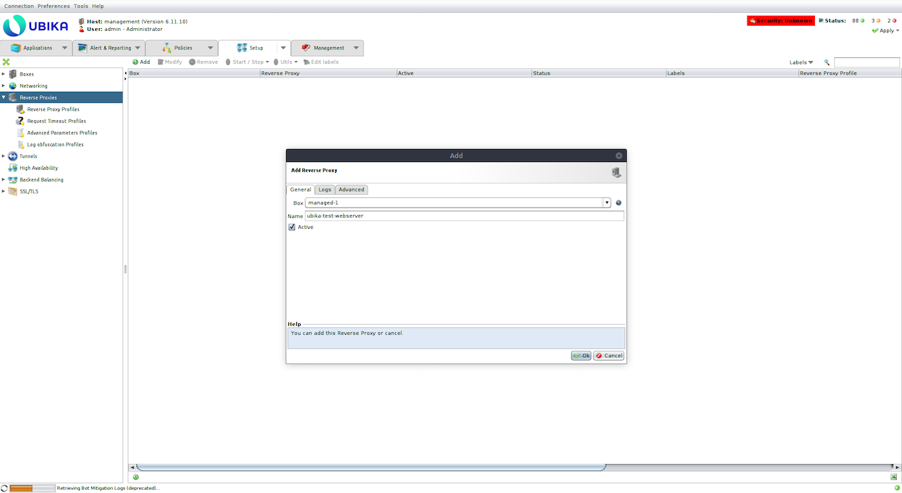{.thumbnail}

Erstellen Sie einen DNS A-Eintrag für den Webserver, der auf die virtuelle IP-Adresse von Ubika zeigt:

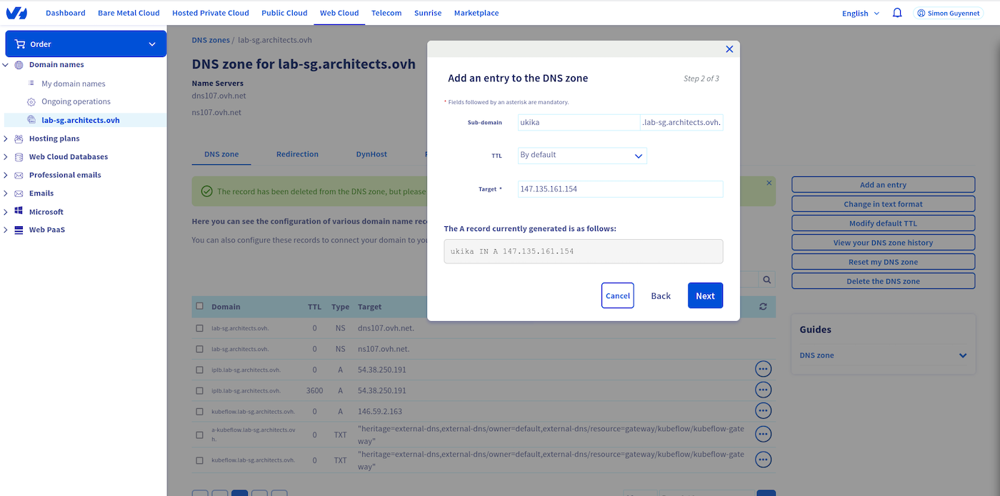{.thumbnail}

Rufen Sie die virtuelle IP-Adresse des Load Balancers ab:

```bash
openstack loadbalancer show 29590860-2852-44c3-9514-dfb271bd9371
```

Erstellen Sie einen Tunnel (`Setup` > `Tunnels` > `Add`):

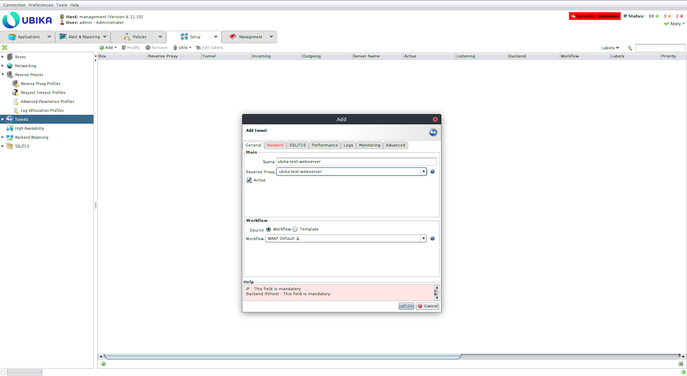{.thumbnail}

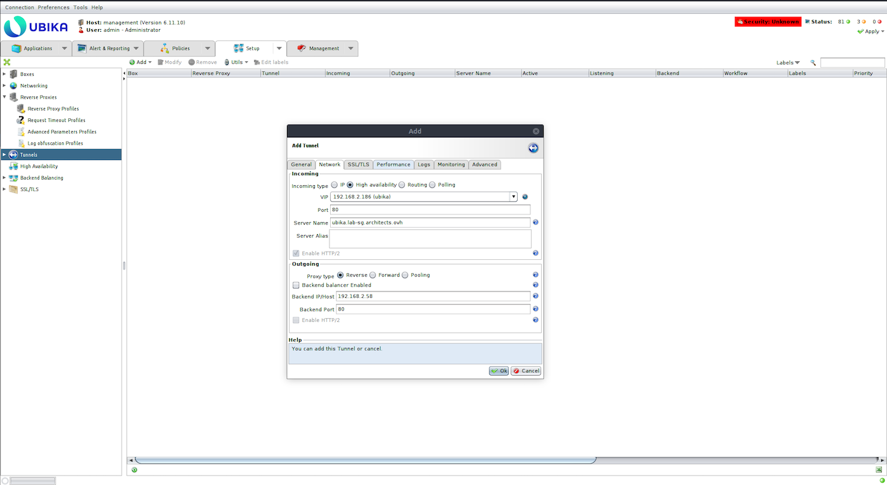{.thumbnail}

Konfiguration anwenden:

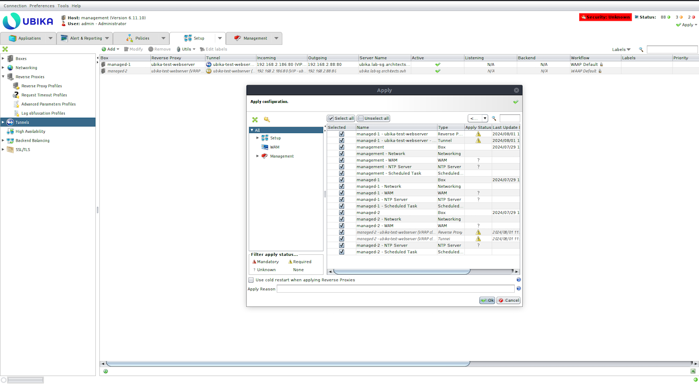{.thumbnail}

Versuchen Sie, auf den Webserver zuzugreifen:

```bash
curl http://ubika.lab-sg.architects.ovh

ubika-test-webserver-1
```

<a name="gofurther"></a>

## Weiterführende Informationen

Wenn Sie Schulungen oder technische Unterstützung bei der Implementierung unserer Lösungen benötigen, wenden Sie sich an Ihren Vertriebsmitarbeiter oder klicken Sie auf [diesen Link](/links/professional-services), um einen Kostenvoranschlag zu erhalten und eine persönliche Analyse Ihres Projekts durch unsere Experten des Professional Services Teams anzufordern.

Treten Sie unserer [User Community](/links/community) bei.