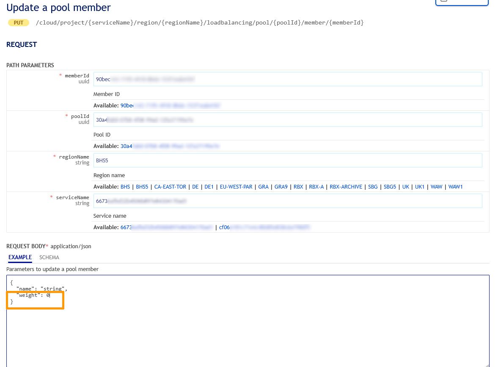
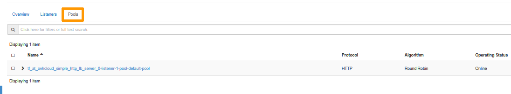
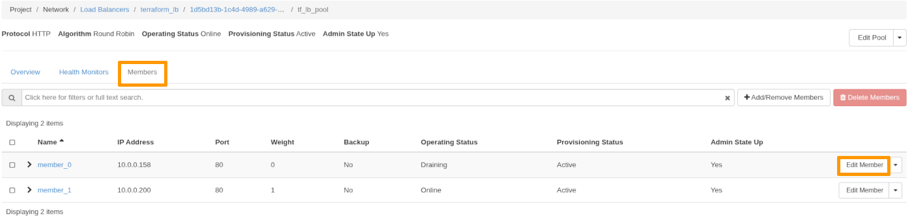
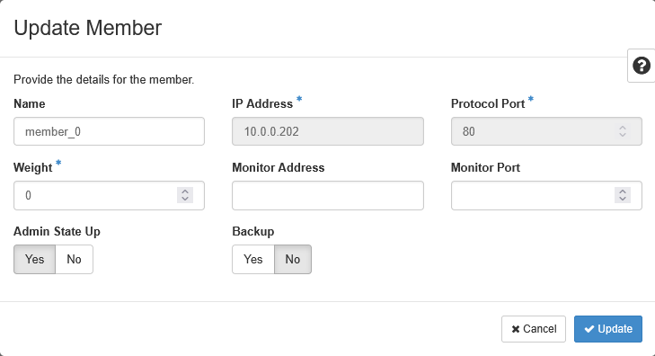
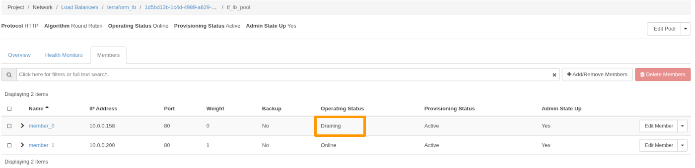
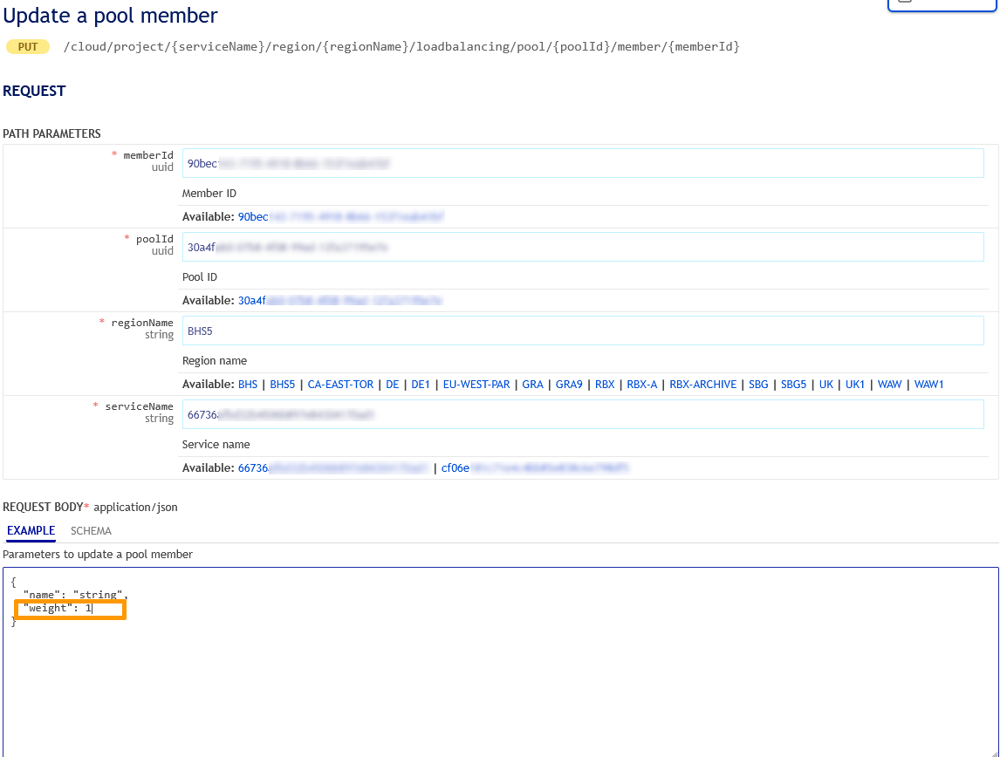
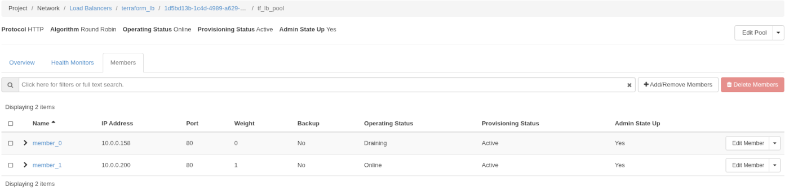
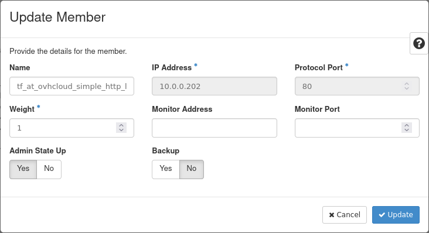

## Objective

This guide explains how to use the weight feature to temporarily remove a Load Balancer member from receiving traffic for maintenance purposes.

### Using the weight feature

Octavia supports setting the weight of members from 0 to 256.

> [!info]
>
> The weight of a member determines the portion of requests or connections it services compared to the other members of the pool. A higher weight means it will receive more traffic.  
> For example, a member with a weight of 10 receives five times as much traffic as a member with a weight of 2.

The weight must be a number from 1 to 256. A value of 0 means the member does not receive new connections but continues to service existing connections.

By setting the weight to 0, the member is effectively removed from the traffic pool, allowing you to perform upgrades or maintenance without service disruption.

## Prerequisites

- An [active OVHcloud account](/links/manager).
- An active [Public Cloud project](/pages/public_cloud/public_cloud_cross_functional/create_a_public_cloud_project).
- A [Load Balancer set up with multiple members](/pages/network/load_balancer/create_http_https).
- [OpenStack CLI installed and configured](/pages/public_cloud/compute/prepare_the_environment_for_using_the_openstack_api).

## Instructions

### Step 1: Create a Load Balancer with Two Members

Use the following repository to create a Load Balancer with two members:

- [simple_http_lb](https://github.com/yomovh/tf-at-ovhcloud/tree/main/simple_http_lb)

Verify that both members are receiving traffic by running this script:

```bash
#!/bin/sh

while true; do
  curl http://<FIP>/
  sleep 1
done
```

You should see alternating responses from the two members:

```html
<html><head><title>Load Balanced Member 1</title></head><body><h1>You hit your OVHCloud load balancer member #1 !</h1></body></html>
<html><head><title>Load Balanced Member 0</title></head><body><h1>You hit your OVHCloud load balancer member #0 !</h1></body></html>
```

### Step 2: Set the Weight of a Member to 0

> [!tabs]
> **OVHcloud API**
>> Log in to the OVHcloud APIv6 interface according to the relevant guide ([First steps with the OVHcloud API](/pages/manage_and_operate/api/first-steps)).
>> 
>> In case the project ID is unknown, the API calls below allow you to retrieve it.
>>
>> > [!api]
>> >
>> > @api {v1} /cloud GET /cloud/project
>>
>> This call retrieves the list of projects.
>>
>> > [!api]
>> >
>> > @api {v1} /cloud GET /cloud/project/{serviceName}
>>
>> This call identifies the project via the "description" field.
>>
>> > [!api]
>> >
>> > @api {v1} /cloud GET  /cloud/project/{serviceName}/region/{regionName}/loadbalancing/pool
>> >
>> This call retrieves the pool id. Fill in the fields with the previously obtained information:
>> 
>> **serviceName**: The Public Cloud project ID in the form of a 32-character string.
>>
>> **regionName**: The name of your region.
>>
>> You can leave the “loadbalancerId” field blank in order to obtain all the pools created in the region specified.
>>
>> > [!api]
>> >
>> > @api {v1} /cloud GET  /cloud/project/{serviceName}/region/{regionName}/loadbalancing/pool/{poolId}/member
>> >
>> This call retrieves the member id. Fill in the fields with the previously obtained information:
>>
>> **serviceName**: The Public Cloud project ID in the form of a 32-character string.
>>
>> **regionName**: The name of your region.
>>
>> **poolId**: The Pool ID in the form of a 32-character string.
>>
>> You can update a pool member with the following API call:
>>
>> > [!api]
>> >
>> > @api {v1} /cloud PUT /cloud/project/{serviceName}/region/{regionName}/loadbalancing/pool/{poolId}/member/{memberId}
>>
>> Fill in the fields with the previously obtained information:
>>
>> **serviceName**: The Public Cloud project ID in the form of a 32-character string.
>>
>> **regionName**: The name of your region.
>>
>> **poolId**: The Pool ID in the form of a 32-character string.
>>
>> **memberId**: The Member ID in the form of a 32-character string.
>>
>> **weight**: Set the weight to 0. Click on `Execute`{.action}.
>>
>> {.thumbnail width="800"}
>>
> **Horizon**
>>
>> There are two ways to access the Horizon interface:
>>
>> - Log in with OVHcloud Single Sign-On: use the `Horizon`{.action} link in the left-hand menu under "Management Interfaces" after opening your `Public Cloud`{.action} project in the [OVHcloud Control Panel](/links/manager).
>> - To log in with a specific OpenStack user: Open the [Horizon login page](https://horizon.cloud.ovh.net/auth/login/) and enter the [OpenStack user credentials](/pages/public_cloud/public_cloud_cross_functional/create_and_delete_a_user) previously created, then click on `Connect`{.action}.
>>
>> Select the appropriate region from the drop down menu at the top left.
>>
>> In the left tab, click on `Network`{.action} tab then on `Load Balancers`{.action}.
>>
>> Click on the load balancer concerned.
>>
>> In the tab, click on `Pools`{.action} and then on the `pool`{.action} in which the member is.
>>
>> {.thumbnail}
>> 
>> In the tab, click on `Members`{.action} and then on `Edit Member`{.action}.
>>
>> {.thumbnail}
>> 
>> Edit the `Weight` to 0, then click on `Update`{.action}.
>>
>> {.thumbnail}
>>
> **CLI**
>> To set the weight of a member to 0, run the following commmand:
>>
>> ```bash
>> $ openstack loadbalancer member set --weight 0 <pool> <member_0>
>> ```

### Step 3: Verify Member Status

After setting the member’s weight to 0, its status will change from **ONLINE** to **DRAINING**.

> [!primary]
>
> It is important to note that in the current system, the member will remain in the **DRAINING** state even after all traffic has been drained.

This can be confusing because some users expect a final status of **DRAINED** once all traffic has been redirected. However, the system does not automatically transition to **DRAINED**.  

- **DRAINING** simply means that the member is no longer receiving traffic, not that it is still actively draining traffic.
- The **DRAINED** status is not yet supported in the current OpenStack API.

If having a final **DRAINED** status is critical for your operations, it is recommended to submit a feature request to OVHcloud for this functionality in a future update. However, this will only be possible once this feature is supported by OpenStack.

> [!tabs]
> **OVHcloud API**
>> Use the following API call:
>>
>> > [!api]
>> >
>> > @api {v1} /cloud GET  /cloud/project/{serviceName}/region/{regionName}/loadbalancing/pool/{poolId}/member
>>
> **Horizon**
>> To check the member's status, click on `Network`{.action} in the left tab then on `Load Balancers`{.action}.
>>
>> Click on the load balancer concerned.
>>
>> In the tab, click on `Pools`{.action} and then on the `pool`{.action} in which the member is.
>> 
>> Click on the `Members`{.action} tab:
>>
>> {.thumbnail}
>>
> **CLI**
>> You can check the member’s status using the following command:
>>
>> ```bash
>> $ openstack loadbalancer member list <pool_name>
>> ```
>>
>> You should see:
>>
>> ```bash
>> ---------------------------------------------------------------------------------------------------
>> id                                   name       provisioning_status  operating_status   weight
>> ---------------------------------------------------------------------------------------------------
>> 27cfe834-7fef-4548-b71b-fa0ce67222f8 member_1   ACTIVE               ONLINE             1
>> 118756ba-2cae-4141-b9c2-8b18b120c8dc member_0   ACTIVE               DRAINING           0
>> ---------------------------------------------------------------------------------------------------
>> ```
> **Terraform**
>>
>> Create a `.tf` file to manages a V2 members resource within OpenStack. For example:
>>
>> ```python
>> resource "openstack_lb_monitor_v2" "monitor_1" {
>>  pool_id     = "<POOL_ID>"
>>  member {
>>  address       = "10.0.0.158"
>>  protocol_port = 8080
>>  weight = 0
>>  }
>>  
>>  member {
>>  address       = "10.0.0.200"
>>  protocol_port = 8080
>>  weight = 1
>>  }
>>}
>> ```
>>
>> Replace `<POOL_ID>` with the ID of your Pool. For more details on the available options for this resource, refer to the [official documentation](https://registry.terraform.io/providers/terraform-provider-openstack/openstack/latest/docs/resources/lb_monitor_v2) for the `openstack_lb_monitor_v2` resource on the Terraform Registry.
>>
>> **Applying the Configuration**
>>
>> To apply your Terraform configuration:
>>
>> - Run `terraform init` to initialize the Terraform working directory.
>> - Run `terraform apply` to apply the changes defined in your configuration.
>>
>> **Verification**
>>
>> After running `terraform apply`, Terraform will provide you with a summary of the resources created, modified, or deleted. This confirms the creation or update of your Health Monitor.

### Step 4: Confirm Traffic is Directed to the Active Member

The member whose weight is 0 will have an	Operating Status `Draining`. Run the test script again:

```bash
#!/bin/sh

while true; do
  curl http://<FIP>/
  sleep 1
done
```

You should now only see responses from `member_1`:

```html
<html><head><title>Load Balanced Member 1</title></head><body><h1>You hit your OVHCloud load balancer member #1 !</h1></body></html>
```

### Step 5: Perform Maintenance

Now that `member_0` is no longer receiving traffic, you can safely perform maintenance or upgrade tasks.

### Step 6: Restore Traffic to the Member

Once the maintenance is complete, set the weight of `member_0` back to its original value (e.g., 1):

> [!tabs]
> **OVHcloud API**
>> Log in to the OVHcloud APIv6 interface according to the relevant guide ([First steps with the OVHcloud API](/pages/manage_and_operate/api/first-steps)).
>> 
>> In case the project ID is unknown, the API calls below allow you to retrieve it.
>>
>> > [!api]
>> >
>> > @api {v1} /cloud GET /cloud/project
>>
>> This call retrieves the list of projects.
>>
>> > [!api]
>> >
>> > @api {v1} /cloud GET /cloud/project/{serviceName}
>>
>> This call identifies the project via the "description" field.
>>
>> > [!api]
>> >
>> > @api {v1} /cloud GET  /cloud/project/{serviceName}/region/{regionName}/loadbalancing/pool
>> >
>> This call retrieves the pool id. Fill in the fields with the previously obtained information:
>> 
>> **serviceName**: The Public Cloud project ID in the form of a 32-character string.
>>
>> **regionName**: The name of your region.
>>
>> You can leave the 'loadbalancerId' field blank in order to obtain all the pools created inthe region specified.
>>
>> > [!api]
>> >
>> > @api {v1} /cloud GET  /cloud/project/{serviceName}/region/{regionName}/loadbalancing/pool/{poolId}/member
>> >
>> This call retrieves the member id. Fill in the fields with the previously obtained information:
>>
>> **serviceName**: The Public Cloud project ID in the form of a 32-character string.
>>
>> **regionName**: The name of your region.
>>
>> **poolId**: The Pool ID in the form of a 32-character string.
>>
>> To update the weight, use the following API call:
>>
>> > [!api]
>> >
>> > @api {v1} /cloud PUT /cloud/project/{serviceName}/region/{regionName}/loadbalancing/pool/{poolId}/member/{memberId}
>>
>> Fill in the fields with the previously obtained information:
>>
>> **serviceName**: The Public Cloud project ID in the form of a 32-character string.
>>
>> **regionName**: The name of your region.
>>
>> **poolId**: The Pool ID in the form of a 32-character string.
>>
>> **memberId**: The Member ID in the form of a 32-character string.
>>
>> **weight**: Set the weight to 1. Click on `Execute`{.action}.
>>
>> {.thumbnail width="800"}
>>
> **Horizon**
>>
>> Log in to the [Horizon interface](https://horizon.cloud.ovh.net/auth/login/).
>>
>> Select the appropriate region from the drop down menu at the top left.
>>
>> In the left tab, click on `Network`{.action} then on click `Load Balancers`{.action}.
>>
>> Click on the load balancer concerned.
>>
>> In the tab, click on `Pools`{.action} and then on the `pool`{.action} in which the member is.
>>
>> {.thumbnail}
>>
>> Click on the `Members`{.action} tab, and then on `Edit Member`{.action} next to the corresponding member.
>>
>> {.thumbnail}
>>
>> You can edit the Weight to 1 then click on `Update`{.action}
>>
>> {.thumbnail width="800"}
>>
> **CLI**
>>
>> To restore traffic from being routed to a specific member, set its weight to 1:
>>
>> ```bash
>> $ openstack loadbalancer member set --weight 1 <pool> <member_0>
>> ```
> **Terraform**
>>
>> Create a `.tf` file to manages a V2 members resource within OpenStack. For example:
>>
>> ```python
>> resource "openstack_lb_monitor_v2" "monitor_1" {
>>  pool_id     = "<POOL_ID>"
>>  member {
>>  address       = "10.0.0.158"
>>  protocol_port = 8080
>>  weight = 1
>>  }
>>  
>>  member {
>>  address       = "10.0.0.200"
>>  protocol_port = 8080
>>  weight = 1
>>  }
>>}
>> ```
>> Replace `<POOL_ID>` with the ID of your Pool. For more details on the available options for this resource, refer to the [official documentation](https://registry.terraform.io/providers/terraform-provider-openstack/openstack/latest/docs/resources/lb_monitor_v2) for the `openstack_lb_monitor_v2` resource on the Terraform Registry.
>>
>> **Applying the Configuration**
>>
>> To apply your Terraform configuration:
>>
>> - Run `terraform init` to initialize the Terraform working directory.
>> - Run `terraform apply` to apply the changes defined in your configuration.
>>
>> **Verification**
>>
>> After running `terraform apply`, Terraform will provide you with a summary of the resources created, modified, or deleted. This confirms the creation or update of your Health Monitor.

### Step 7: Verify that both members are now receiving traffic

Re-use the script:

```bash
#!/bin/sh
while true; do
curl http://<FIP>/
sleep 1
done
```

You should see alternating responses from the two members:

```html
<html><head><title>Load Balanced Member 1</title></head><body><h1>You hit your OVHCloud load balancer member #1 !</h1></body></html>
<html><head><title>Load Balanced Member 0</title></head><body><h1>You hit your OVHCloud load balancer member #0 !</h1></body></html>
```

## Go further

Join our [community of users](/links/community).
