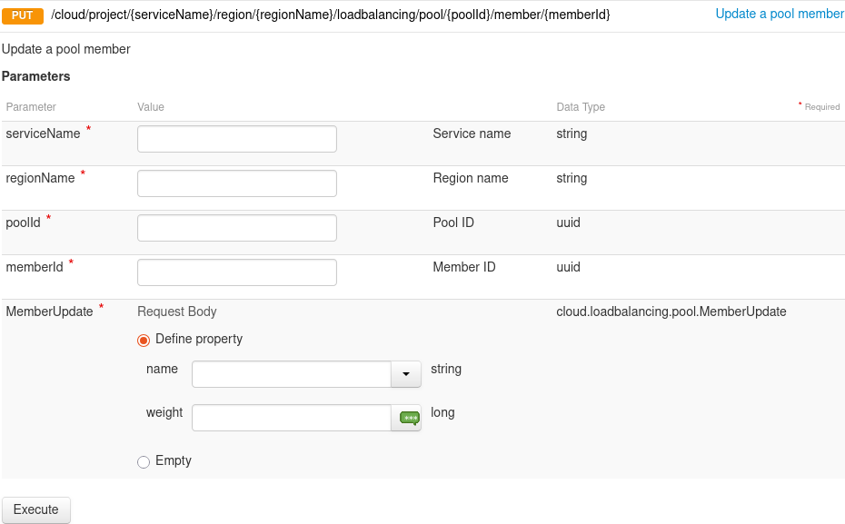

## Objectif

Ce guide explique comment utiliser la fonctionnalité de poids pour supprimer temporairement un membre du Load Balancer de la réception du trafic à des fins de maintenance.

### Utilisation de la fonction de pondération

Octavia prend en charge la configuration du poids des membres de 0 à 256.

> [!info]
>
> Le poids d'un membre détermine la portion des requêtes ou des connexions qu'il traite par rapport aux autres membres du pool. Un poids plus élevé signifie qu'il recevra plus de trafic.
> Par exemple, un membre avec un poids de 10 reçoit cinq fois plus de trafic qu'un membre avec un poids de 2.

Le poids doit être un nombre compris entre 1 et 256. Une valeur de 0 signifie que le membre ne reçoit pas de nouvelles connexions mais continue à traiter les connexions existantes.

En définissant le poids sur 0, le membre est effectivement retiré du pool de trafic, ce qui vous permet d'effectuer des mises à niveau ou des opérations de maintenance sans interruption de service.

## Prérequis

- Un [compte OVHcloud actif](/links/manager).
- Un [projet Public Cloud OVHcloud](/pages/public_cloud/public_cloud_cross_functional/create_a_public_cloud_project).
- Un [Load Balancer configuré avec plusieurs membres](/pages/network/load_balancer/create_http_https).
- [CLI OpenStack installé et configuré](/pages/public_cloud/compute/prepare_the_environment_for_using_the_openstack_api).

## Instructions

### Étape 1 : Créer un Load Balancer avec deux membres

Utilisez le référentiel suivant pour créer un Load Balancer avec deux membres :

- [simple_http_lb](https://github.com/yomovh/tf-at-ovhcloud/tree/main/simple_http_lb)

Vérifiez que les deux membres reçoivent du trafic en exécutant ce script :

```bash
#!/bin/sh

while true; do
  curl http://<FIP>/
  sleep 1
done
```

Les réponses des deux membres doivent être alternées :

```html
<html><head><title>Load Balanced Member 1</title></head><body><h1>You hit your OVHCloud load balancer member #1 !</h1></body></html>
<html><head><title>Load Balanced Member 0</title></head><body><h1>You hit your OVHCloud load balancer member #0 !</h1></body></html>
```

### Étape 2 : Définir le poids d'un membre sur 0

> [!tabs]
> **API OVHcloud**
>> Connectez-vous à l’interface APIv6 d’OVHcloud selon le guide correspondant ([Premiers pas avec l’API OVHcloud](/pages/manage_and_operating/api/first-steps)).
>>
>> Si l'identifiant du projet est inconnu, les appels d'API ci-dessous permettent de le récupérer.
>>
>> > [!api]
>> >
>> > @api {v1} /cloud GET /cloud/project
>>
>> > [!primary]
>> > Cet appel permet de récupérer la liste des projets.
>>
>> > [!api]
>> >
>> > @api {v1} /cloud GET /cloud/project/{serviceName}
>>
>> > [!primary]
>> > Cet appel identifie le projet via le champ « description ».
>>
>> > [!api]
>> >
>> > @api {v1} /cloud GET /cloud/project/{serviceName}/region/{regionName}/loadbalancing/pool
>> >
>> > Remplissez le champ avec les informations précédemment obtenues :
>> >
>> > **serviceName** : ID du projet Public Cloud sous la forme d'une chaîne de 32 caractères.
>> >
>> > **regionName** : nom de votre région.
>> >
>> > Vous pouvez laisser le champ « loadbalancerId » vide afin d'obtenir tous les pools créés dans la région spécifiée.
>> >
>> > Vous pouvez mettre à jour un membre du pool à l'aide de l'appel API suivant :
>> >
>> > [!api]
>> >
>> > @api {v1} /cloud PUT /cloud/project/{serviceName}/region/{regionName}/loadbalancing/pool/{poolId}/member/{memberId}
>>
>> > Remplissez les champs avec les informations précédemment obtenues :
>> >
>> > **serviceName** : ID du projet Public Cloud sous la forme d'une chaîne de 32 caractères.
>> >
>> > **regionName** : nom de votre région.
>> >
>> > **poolId** : ID du pool sous la forme d'une chaîne de 32 caractères.
>> >
>> > **memberId** : ID de membre sous forme de chaîne de 32 caractères.
>>>
> **Horizon**
>> Connectez-vous à l'[Horizon interface](https://horizon.cloud.ovh.net/auth/login/).
>>
>> Sélectionnez la région appropriée dans le menu déroulant en haut à gauche.
>>
>> Dans l'onglet de gauche, cliquez sur l'onglet `Network`{.action}, puis sur `Load Balancers`{.action}.
>>
>> Cliquez sur le load balancer concerné.
>>
>> Dans l'onglet, cliquez sur `Pools`{.action} puis sur `pool`{.action} dans lequel se trouve le membre.
>>
>> {.thumbnail}
>>
>> Dans l'onglet, cliquez sur `Membres`{.action} puis sur `Edit Member`{.action}.
>>
>> {.thumbnail}
>>
>> Vous pouvez éditer le `Poids` (`Weight`), puis cliquer sur `Update`{.action}.
>>
>> {.thumbnail}
>>
> **CLI**
>> Pour empêcher le trafic d'être routé vers un membre spécifique, définissez son poids sur 0 :
>>
>> ```bash
>> $ openstack loadbalancer member set --weight 0 <pool> <member_0>
>> ```

### Étape 3 : Vérifier le statut du membre

Après avoir défini le poids du membre sur 0, son statut passe de **ONLINE** à **DRAINING**.

{.thumbnail}

> [!primary]
>
> Il est important de noter que dans le système actuel, le membre restera dans l'état **DRAINING** même après que tout le trafic ait été vidé.

Cela peut être déroutant car certains utilisateurs s'attendent à un statut final de **DRAINED** une fois que tout le trafic a été redirigé. Cependant, le système ne passe pas automatiquement à **DRAINED**.

- **DRAINING** signifie simplement que le membre ne reçoit plus de trafic, et non pas qu'il draine toujours activement le trafic.
- L'état **DRAINED** n'est pas encore pris en charge par l'API OpenStack actuelle.

Si avoir un statut final **DRAINED** est critique pour vos opérations, il est recommandé de soumettre une demande de fonctionnalité à OVHcloud pour cette fonctionnalité lors d'une prochaine mise à jour.

> [!tabs]
> **API OVHcloud**
>> Vous pouvez mettre à jour un membre du pool avec l'appel API suivant :
>> > [!api]
>> >
>> > @api {v1} /cloudPUT /cloud/project/{serviceName}/region/{regionName}/loadbalancing/pool/{poolId}/member/{memberId}
>>
>> {.thumbnail width="800"}
>>
> **Horizon**
>>
>> Il existe deux façons d'accéder à l'interface Horizon :
>>
>> - Pour vous connecter avec l'authentification unique OVHcloud : utilisez le lien `Horizon`{.action} dans le menu de gauche sous « Management Interfaces » après avoir ouvert votre projet `Public Cloud`{.action} dans votre [espace client OVHcloud](/links/manager).
>>  Pour vous connecter avec un utilisateur OpenStack spécifique : ouvrez la page de connexion à [Horizon](https://horizon.cloud.ovh.net/auth/login/) et renseignez les [identifiants OpenStack](/pages/public_cloud/public_cloud_cross_functional/create_and_delete_a_user) préalablement créés, puis cliquez sur `Connect`{.action}.
>>
>> Sélectionnez la région appropriée dans le menu déroulant en haut à gauche.
>>
>> Dans le menu de gauche, cliquez sur `Network`{.action} et sélectionnez `Load Balancers`{.action}.
>>
>> Choisissez le Load Balancer que vous souhaitez configurer et cliquez sur l'onglet `Members`{.action} . Cliquez ensuite sur `Edit Member`{.action}.
>>
>> {.thumbnail}
>>
>> Vous pouvez modifier le Poids (*Weight*) à 0 puis cliquer sur `Update`{.action}.
>>
>> {.thumbnail}
>>
> **CLI**
>> Vous pouvez vérifier l'état du membre à l'aide de la commande suivante :
>>
>> ```bash
>> $ openstack loadbalancer member list <pool_name>
>> ```
>>
>> Vous devriez voir :
>> ```bash
>> ---------------------------------------------------------------------------------------------------
>> id                                   name       provisioning_status  operating_status   weight
>> ---------------------------------------------------------------------------------------------------
>> 27cfe834-7fef-4548-b71b-fa0ce67222f8 member_1   ACTIVE               ONLINE             1
>> 118756ba-2cae-4141-b9c2-8b18b120c8dc member_0   ACTIVE               DRAINING           0
>> ---------------------------------------------------------------------------------------------------
>> ```
> **Terraform**
>>
>> Créez un fichier `.tf` pour gérer une ressource de membres V2 dans OpenStack. Par exemple :
>>
>> ```python
>> resource "openstack_lb_monitor_v2" "monitor_1" {
>>  pool_id     = "<POOL_ID>"
>>  member {
>>  address       = "192.168.199.23"
>>  protocol_port = 8080
>>  weight = 0
>>  }
>>  
>>  member {
>>  address       = "192.168.199.24"
>>  protocol_port = 8080
>>  weight = 1
>>  }
>>}
>> ```
>>
>> Remplacez `<POOL_ID>` par l'ID de votre Pool. Pour plus de détails sur les options disponibles pour cette ressource, référez-vous à la [documentation officielle](https://registry.terraform.io/providers/terraform-provider-openstack/openstack/latest/docs/resources/lb_monitor_v2) pour la ressource `openstack_lb_monitor_v2` sur le registre Terraform.
>>
>> **Application de la configuration**
>>
>> To apply your Terraform configuration:
>>
>> - Run `terraform init` to initialize the Terraform working directory.
>> - Run `terraform apply` to apply the changes defined in your configuration.
>>
>> **Vérification**
>>
>> Après avoir exécuté `terraform apply`, Terraform vous fournira un résumé des ressources créées, modifiées ou supprimées. Ceci confirme la création ou la mise à jour de votre moniteur d'intégrité.

### Étape 4 : Confirmer que le trafic est dirigé vers le membre actif

Le membre dont le poids est égal à 0 aura un État de fonctionnement (*Operating Status*) `Draining`. Réexécutez le script de test :

```bash
#!/bin/sh

while true; do
  curl http://<FIP>/
  sleep 1
done
```

Vous ne devriez maintenant voir que les réponses de `member_1` :

```html
<html><head><title>Load Balanced Member 1</title></head><body><h1>You hit your OVHCloud load balancer member #1 !</h1></body></html>
```

### Étape 5 : Fffectuer la maintenance

Maintenant que `member_0` ne reçoit plus de trafic, vous pouvez effectuer en toute sécurité des tâches de maintenance ou de mise à niveau.

### Étape 6 : Restaurer le trafic vers le membre

Une fois la maintenance terminée, réglez le poids de `member_0` sur sa valeur d'origine (par exemple, 1) :

> [!tabs]
> **API OVHcloud**
>> Connectez-vous à l’interface APIv6 d’OVHcloud selon le guide correspondant ([Premiers pas avec l’API OVHcloud](/pages/manage_and_operating/api/first-steps)).
>>
>> Si l'identifiant du projet est inconnu, les appels API ci-dessous permettent de le récupérer :
>>
>> > [!api]
>> >
>> > @api {v1} /cloud GET /cloud/project
>>
>> > [!primary]
>> > Cet appel permet de récupérer la liste des projets.
>>
>> > [!api]
>> >
>> > @api {v1} /cloud GET /cloud/project/{serviceName}
>>
>> > [!primary]
>> > Cet appel identifie le projet via le champ « description ».
>>
>> > [!api]
>> >
>> > @api {v1} /cloud GET /cloud/project/{serviceName}/region/{regionName}/loadbalancing/pool
>> >
>> > Remplissez le champ avec les informations précédemment obtenues :
>> >
>> > **serviceName** : ID du projet Public Cloud sous la forme d'une chaîne de 32 caractères.
>> >
>> > **regionName** : nom de votre région.
>>
>> > Vous pouvez laisser le champ « loadbalancerId » vide afin d'obtenir tous les pools créés dans la région spécifiée.
>> >
>> > You can update a pool member:
>> >
>> > [!api]
>> >
>> > @api {v1} /cloud PUT /cloud/project/{serviceName}/region/{regionName}/loadbalancing/pool/{poolId}/member/{memberId}
>>
>> {.thumbnail width="800"}
>>
>> >
>> > Remplissez le champ avec les informations précédemment obtenues :
>> >
>> > **serviceName** : ID du projet Public Cloud sous la forme d'une chaîne de 32 caractères.
>> >
>> > **regionName** : nom de votre région.
>> >
>> > **poolId** : ID du pool sous la forme d'une chaîne de 32 caractères.
>> >
>> > **memberId** : ID de membre sous forme de chaîne de 32 caractères.
>> >
>>
> **Horizon**
>>
>> Connectez-vous à l'[interface Horizon](https://horizon.cloud.ovh.net/auth/login/).
>>
>> Sélectionnez la région appropriée dans le menu déroulant en haut à gauche.
>>
>> Dans l'onglet de gauche, cliquez sur `Network` {.action}, puis sur `Load Balancers`{.action}.
>>
>> Cliquez sur le load balancer concerné.
>>
>> Dans l'onglet, cliquez sur `Pools`{.action} puis sur `pool`{.action} dans lequel se trouve le membre.
>>
>> {.thumbnail}
>>
>> Cliquez sur l'onglet `Members`{.action}, puis sur `Edit Member`{.action} à côté du membre correspondant.
>>
>> {.thumbnail}
>>
>> Vous pouvez modifier le Poids (*Weight*) à 1 puis cliquer sur `Update`{.action}
>>
>> {.thumbnail width="800"}
>>
>>
> **CLI**
>>
>> Pour restaurer le trafic routé vers un membre spécifique, définissez son poids sur 1 :
>>
>> ```bash
>> $ openstack loadbalancer member set --weight 1 <pool> <member_0>
>> ```
> **Terraform**
>>
>> Créez un fichier `.tf` pour gérer une ressource de membres V2 dans OpenStack. Par exemple :
>>
>> ```python
>> resource "openstack_lb_monitor_v2" "monitor_1" {
>>  pool_id     = "<POOL_ID>"
>>  member {
>>  address       = "192.168.199.23"
>>  protocol_port = 8080
>>  weight = 1
>>  }
>>  
>>  member {
>>  address       = "192.168.199.24"
>>  protocol_port = 8080
>>  weight = 1
>>  }
>>}
>> ```
>> Remplacez `<POOL_ID>` par l'ID de votre Pool. Pour plus de détails sur les options disponibles pour cette ressource, référez-vous à la [documentation officielle](https://registry.terraform.io/providers/terraform-provider-openstack/openstack/latest/docs/resources/lb_monitor_v2) pour la ressource `openstack_lb_monitor_v2` sur le registre Terraform.
>>
>> **Application de la configuration**
>>
>> Pour appliquer votre configuration Terraform :
>>
>> - Exécutez `terraform init` pour initialiser le répertoire de travail Terraform.
>> - Exécutez `terraform apply` pour appliquer les modifications définies dans votre configuration.
>>
>> **Vérification**
>>
>> Après avoir exécuté `terraform apply`, Terraform vous fournira un résumé des ressources créées, modifiées ou supprimées. Cela confirme la création ou la mise à jour de votre Health Monitor.

### Étape 7 : Vérifier que les deux membres reçoivent bien le trafic

Réutiliser le script :

```bash
#!/bin/sh
while true; do
curl http://<FIP>/
sleep 1
done
```

Vous devriez voir des réponses alternées provenant des deux membres :

```html
<html><head><title>Load Balanced Member 1</title></head><body><h1>You hit your OVHCloud load balancer member #1 !</h1></body></html>
<html><head><title>Load Balanced Member 0</title></head><body><h1>You hit your OVHCloud load balancer member #0 !</h1></body></html>
```

## Aller plus loin

Rejoignez notre [communauté d'utilisateurs](/links/community).


