> [!warning]
>
> Some links on this documentation refer to the AI and Machine Learning solution. Quantum computing shares the same infrastructure as a service so you might be redirected to another section of this documentation.
>

## Introduction

A **Notebook** is a document that integrates code, rich text elements, and multimedia, making it a convenient tool for quantum analysis and visualization.

**OVHcloud Quantum Emulators** is our managed solution for Jupyter and VS Code Notebooks. You can easily launch Notebooks with the required CPU and GPU resources while enjoying benefits like pre-installed dependencies and Quantum frameworks, secure user access, and simplified data management.

## Objective

This guide demonstrates how to create, configure, access, stop, restart, and delete a Quantum Emulators Notebook from the **OVHcloud Control Panel (UI)**. This method is user-friendly and ideal for beginners.

Alternatively, you can use one of the following methods:

- The **ovhai** command-line interface (CLI)
- The **Quantum API**
- The **ovhai** Python SDK

Each method offers its distinct advantages, depending on your expertise and preferred workflow.

## Requirements

- A [Public Cloud project](/links/public-cloud/public-cloud) in your OVHcloud account.
- Access to the [OVHcloud Control Panel](/links/manager).
- A Public Cloud user with the **Administrator** or **Quantum Operator & Objectstore Operator** roles.

## Instructions

### OVHcloud Quantum Solutions authorization process

If you're using the CLI, API, or SDK, you will need to complete an authorization process before creating a Quantum Emulators Notebook. To do so, follow these steps:

1. Log in to the [OVHcloud Control Panel](/links/manager) and navigate to the `Public Cloud`{.action} section.
2. Select the Public Cloud project you want to use and click the `Quantum QPUs`{.action} category.
3. Click the `Create a Notebook`{.action} button. The authorization process will take place silently in the background.

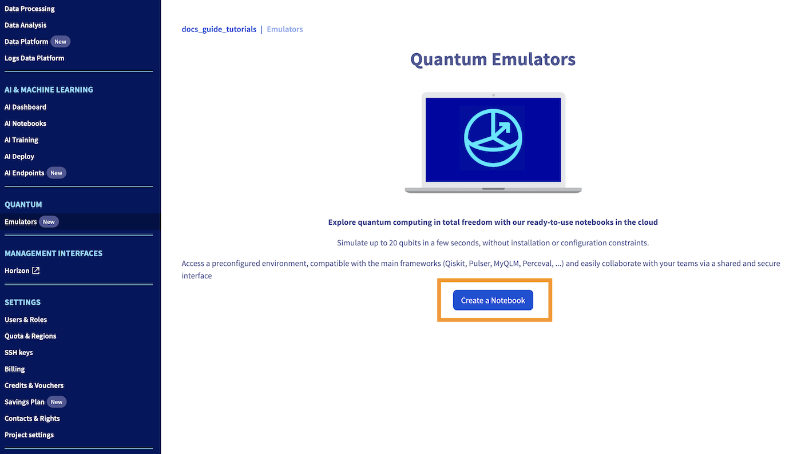{.thumbnail}

### Launch your first Quantum Notebook

To create a Quantum Notebook, follow these steps:

> [!tabs]
> **Using the Control Panel (UI)**
>> 
>> Navigate to the `Public Cloud`{.action} section of the [OVHcloud Control Panel](/links/manager) and click the `Quantum computing`{.action} category.
>> Click the `Create a Notebook`{.action} button and follow the prompts to specify the configuration of your Quantum Notebook.
>>
>> {.thumbnail}
>> 
>> **1\. Notebook name**
>> 
>> Give a name to your notebook. This will make it easier to manage when you have multiple Quantum Notebooks created.
>> 
>> **2\. Notebook location**
>> 
>> Next, select a location.
>> 
>> 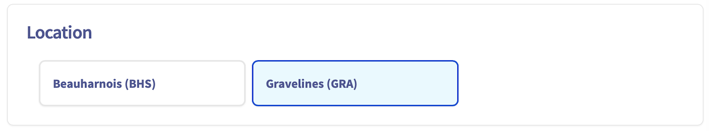{.thumbnail}
>> 
>> **3\. Compute resources**
>> 
>> Specify and adjust the type and amount of computing resources (CPU / GPU) for your Quantum Notebook. Use the `+`{.action} and `-`{.action} buttons to increase or decrease the number of CPUs and GPUs, depending on your needs.
>> 
>> Click `Next`{.action}.
>> 
>> 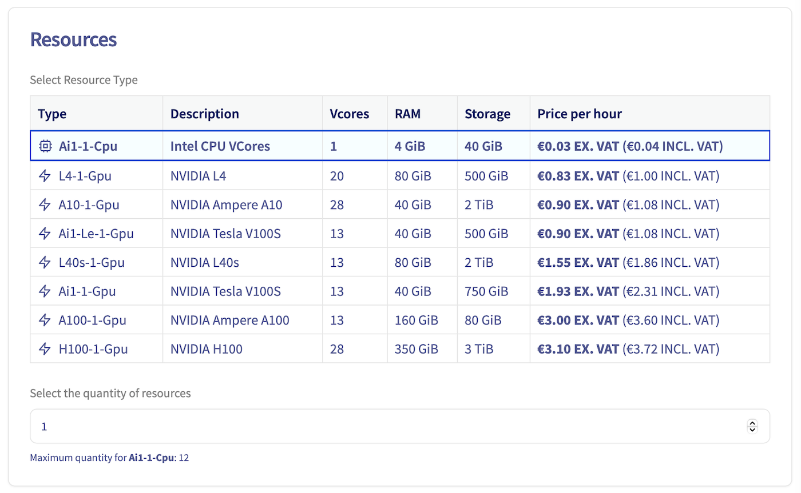{.thumbnail}
>> 
>> **4\. Pre-configured frameworks**
>> 
>> Choose the Quantum Python framework you want to use, which will be pre-installed and ready to use when your notebook is launched. A wide range of Quantum frameworks are available in different versions. Select the version that suits your needs. Then, click `Next`{.action} to continue.
>> 
>> 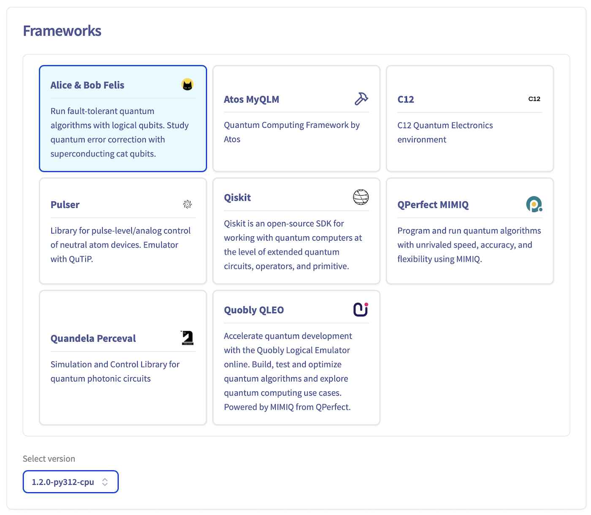{.thumbnail}
>> 
>> **5\. Live-code editor**
>> 
>> Choose the code editor you want.
>> 
>> 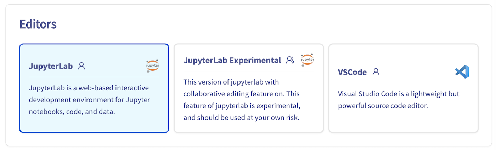{.thumbnail}
>> 
>> **6\. Privacy settings**
>> 
>> Then, select your privacy settings and click `Next`{.action}.
>> 
>> > [!warning]
>> >
>> > *Public access* will expose your data and code to anyone getting the Quantum Notebook link. Be careful not to use it with sensitive data. On the other hand, *Restricted access* will require a user and password combination or a Quantum token to access the Notebook content to ensure a secure environment.
>> 
>> 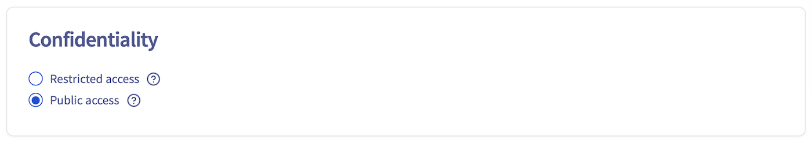{.thumbnail}
>> 
>> **7\. Advanced configuration**
>> 
>> By default, your Quantum Notebook comes with **ephemeral storage** (local storage). But in this step, you can also link Object Storage containers and Git repositories to your notebook to easily access your remote data.
>> 
>> If you want to learn more about configuring containers and Git repositories in the Notebook, you can refer to this [AI & Machine learning documentation](/pages/public_cloud/ai_machine_learning/notebook_guide_data_ui). For now, we will launch a classic Notebook without any external volumes added to it.
>> 
>> Click `Next`{.action}.
>>
>> 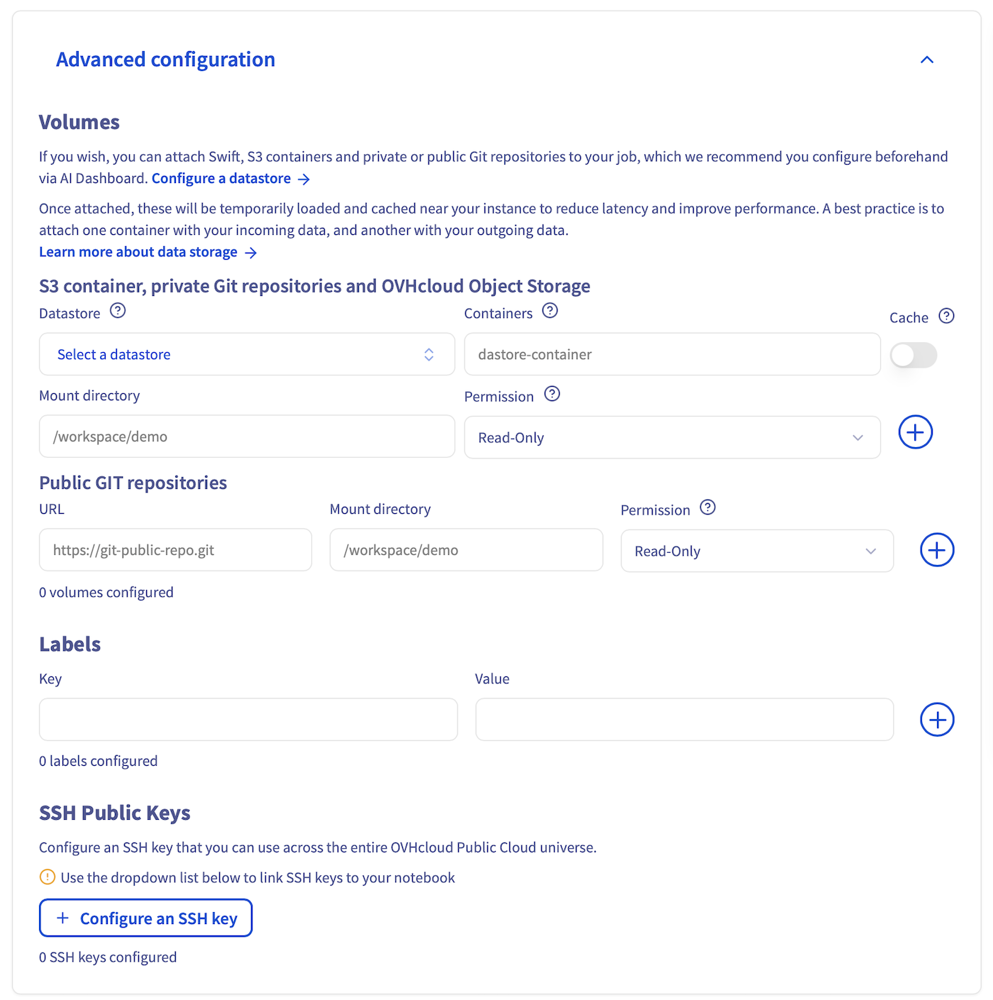{.thumbnail}
>> 
>> **SSH public keys** allow you to access your Notebook remotely. This section is optional, click `Next`{.action}.
>> 
>> **9\. Launch the Quantum Notebook**
>> 
>> At the end of the process, review your settings and click the `Order now`{.action} button to confirm and launch the creation of your Notebook. You will be redirected to your notebook dashboard:
>> 
>> 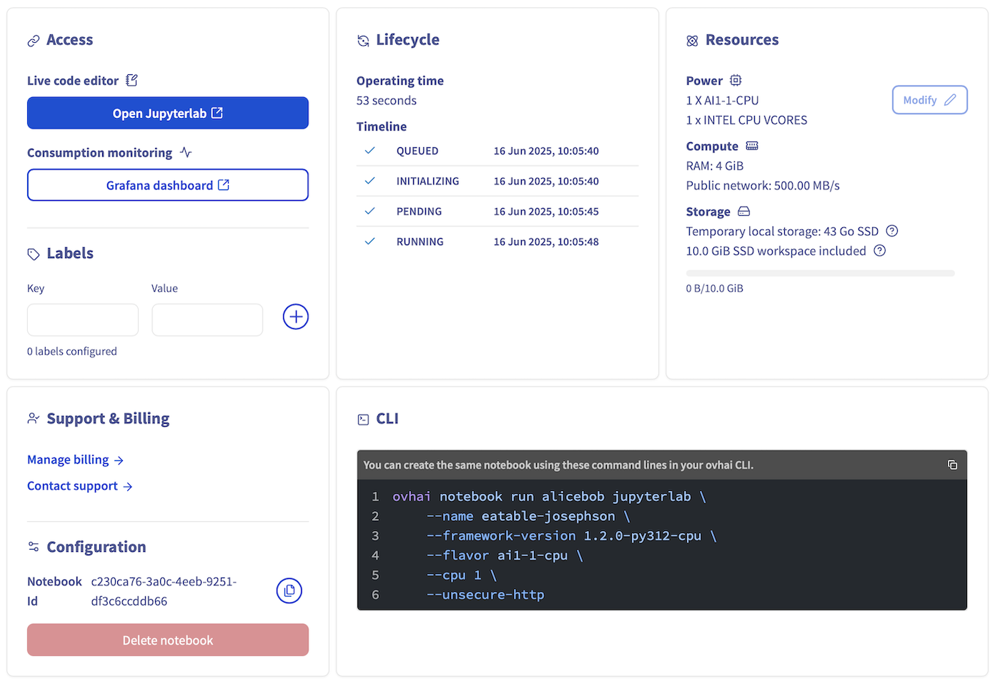{.thumbnail}
>> 
>> > [!primary]
>> >
>> > Note at the bottom of the screen the equivalent *ovhai* CLI command. This command allows you to run the exact same Notebook using the CLI.
>> >
>>
>> When your Notebook is created, it will appear on your Quantum Emulators tab:
>>
>> 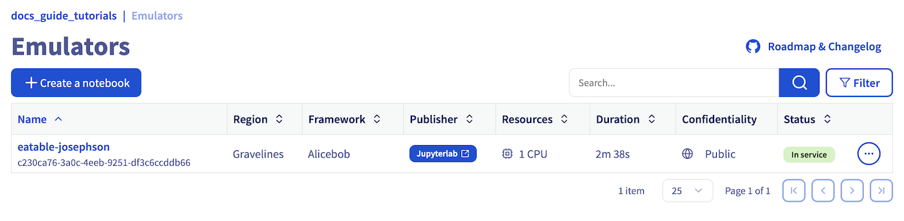{.thumbnail}
>>
> **Using ovhai CLI**
>>
>> If you prefer to use the command line interface to launch your Quantum Notebook, please follow these steps:
>>
>> 1. Follow this [AI & Machine learning](/pages/public_cloud/ai_machine_learning/cli_10_howto_install_cli) documentation to install the `ovhai` CLI and log in. 
>> 2. Visit this second documentation to learn [how to create your Quantum Notebook using commands](/pages/public_cloud/ai_machine_learning/cli_11_howto_run_notebook_cli).
>>
>> 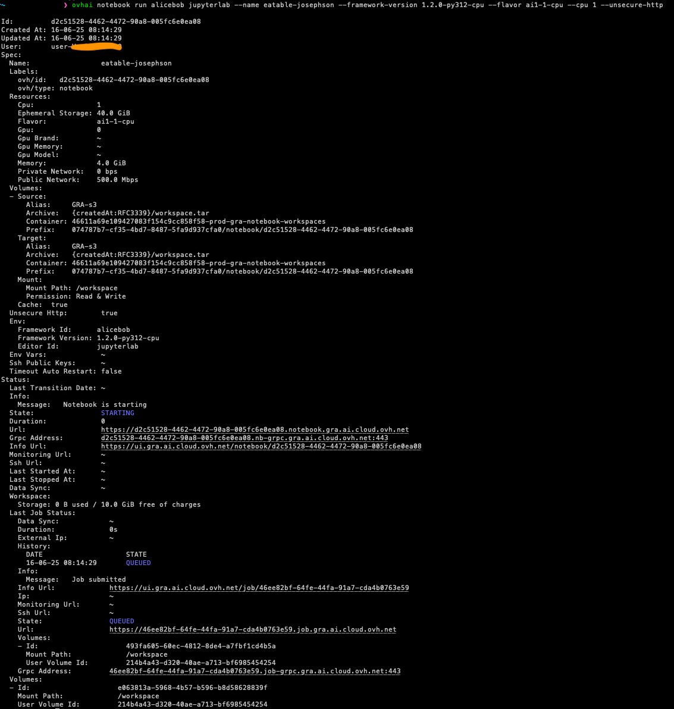{.thumbnail}
>>
> **Using the AI Solution API**
>>
>> 1. Create a bearer token from the *ovhai* CLI. For more detailed instructions on creating a token, check the [manage access tokens](/pages/public_cloud/ai_machine_learning/cli_13_howto_app_token_cli) documentation.
>> 2. Navigate to the desired region and follow the instructions to create a Quantum Notebook.
>>     - [GRA AI Solution API](https://gra.ai.cloud.ovh.net/#/), for Gravelines, France.
>>     - [BHS AI Solution API](https://bhs.ai.cloud.ovh.net/#/), for Beauharnois, Canada.
>> 3. `Submit a new notebook`{.action} POST method
>>
>> > [!warning]
>> > 
>> > Make sure to select `Bearer Auth` instead of `OAuth 2.0`, which is selected by default.
>> >
>>
>> 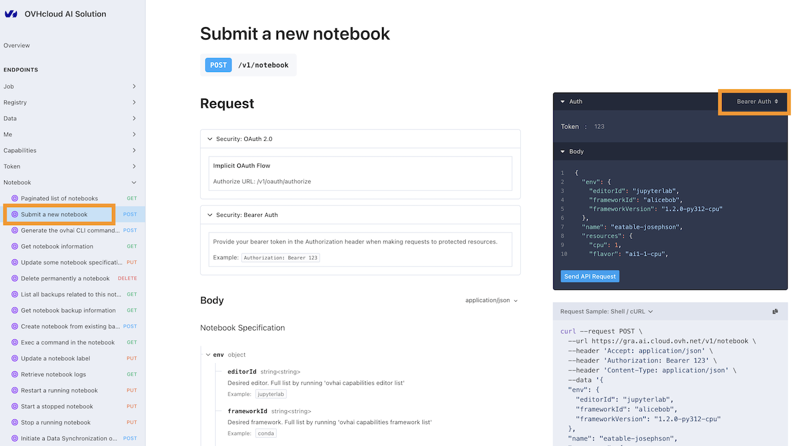{.thumbnail}
>>
> **Using the Python SDK**
>>
>> > [!warning]
>> > 
>> > **Alpha version warning**: This package is currently in the **alpha phase** of development. The APIs and functionalities of the package may not be fully tested.
>>
>> 1. Create a bearer token from the *ovhai* CLI. For more detailed instructions on creating a token, check the [manage access tokens](/pages/public_cloud/ai_machine_learning/cli_13_howto_app_token_cli) documentation.
>> 2. Install the `ovhai` Python SDK and follow the instructions in the [ovhai PyPI](https://pypi.org/project/ovhai/) page to create a Quantum Notebook.
>> 3. Finally, open your terminal and run `pip install ovhai`.
>>
>> Here is a basic example of how to do it, making it easy for you to get started:
>>
>> ```python
>> from ovhai import AuthenticatedClient
>> from ovhai.api.notebook import notebook_new
>> from ovhai.models import NotebookSpec, Notebook
>> from ovhai.ovhai_types import Response
>>
>> client = AuthenticatedClient(
>>     base_url="https://gra.ai.cloud.ovh.net",
>>     token="YOUR_QUANTUM_TOKEN",
>> )
>> 
>> # Define notebook parameters
>> editor_id = "jupyterlab"
>> framework_id = "alicebob"
>> framework_version = "1.2.0-py312-cpu"
>> nb_cpu = 1
>> 
>> # Create the notebook creation request
>> notebook_specs = {
>>     "env": {"editorId": editor_id, "frameworkId": framework_id, "frameworkVersion": framework_version},
>>     "resources": {"cpu": nb_cpu},
>> }
>> 
>> with client as client:
>>     response: Response[Notebook] = notebook_new.sync_detailed(
>>         client=client, body=NotebookSpec.from_dict(notebook_specs)
>>     )
>>     
>>     import json
>>     response_content = response.content.decode('utf-8')  # Decode bytes to a string
>>     response_dict = json.loads(response_content)
>>
>>     status_code = response.status_code
>>     id_ = response_dict['id']
>>     spec = response_dict['spec']
>>     status = response_dict['status']
>>     state = status['state']
>>     info = status['info']
>>     url = response_dict['status']['url']
>>
>>     print(f"Status code: {status_code}")
>>     print(f"ID: {id_}")
>>     print(f"Spec: {spec}")
>>     print(f"State: {state}")
>>     print(f"Info: {info}")
>>     print(f"URL: {url}")
>> ```
>>

### Accessing your Quantum Notebook

Once your Quantum Notebook is created and running, you can access it using the `JupyterLab` link in the Quantum Notebooks board or through the `ovhai` CLI, Quantum API, or Python SDK.

> [!tabs]
> **Using the Control Panel (UI)**
>> 
>> Click the `JupyterLab`{.action} link in the `Access` column:
>> 
>> 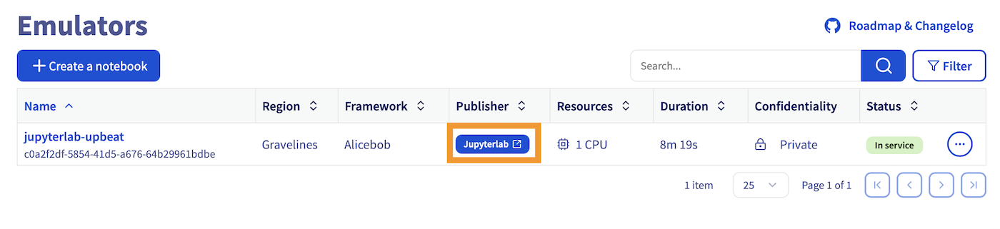{.thumbnail}
>> 
>> You can also access the Notebook from its dedicated page:
>> 
>> 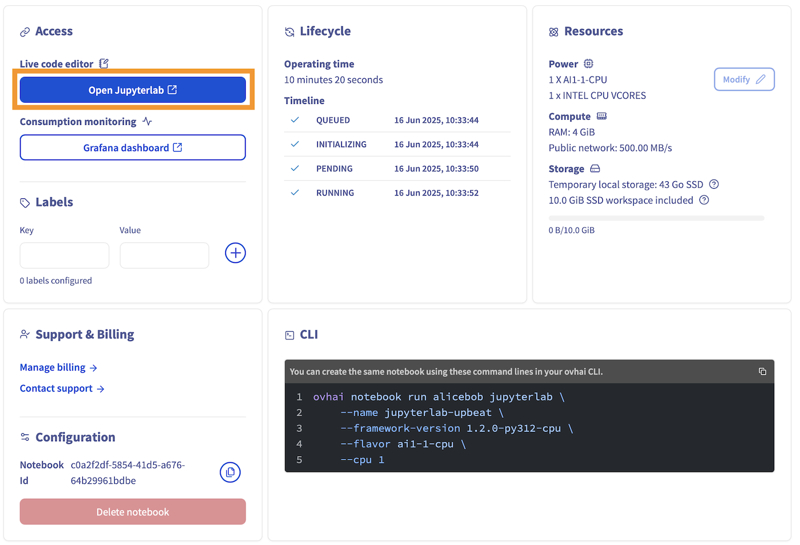{.thumbnail}
>> 
>> On the Notebook page, you will find information about the Notebook, including specifications, billing, and attached data, as well as a monitoring URL for real-time metrics.
>> 
> **Using ovhai CLI**
>>
>> The `URL` of your Notebook should be displayed in your terminal and you can display it by running `ovhai notebook list` to retrieve the `URL`.
>>
>> 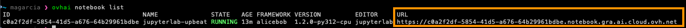{.thumbnail}
>>
>> You can also get Notebook information using `ovhai notebook get <NOTEBOOK_UUID>`.
>>
> **Using the Quantum API**
>>
>> The `URL` of your Notebook should appear in the `Response` panel:
>>
>> 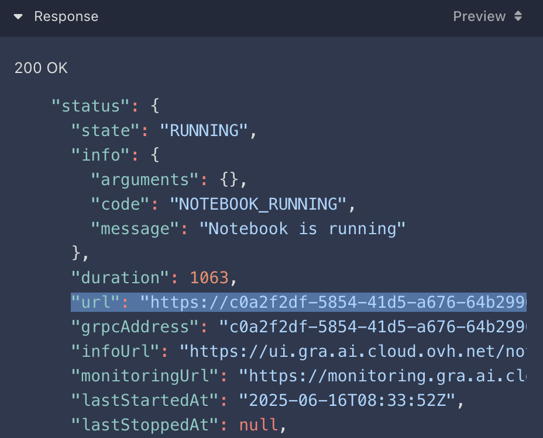{.thumbnail}
>>
>> If not, use the `Paginated list of notebooks`{.action} GET endpoint method:
>>
>> You can also get Notebook information using the `Get notebook information`{.action} GET endpoint method.
>>
> **Using the Python SDK**
>>
>> Run the following code to list all Quantum Notebooks:
>>
>> ```python
>> from ovhai.api.notebook import notebook_get_all
>> from ovhai.models import NotebookList
>> from ovhai.ovhai_types import Response
>>
>> from ovhai import AuthenticatedClient
>>
>> client = AuthenticatedClient(
>>     base_url="https://gra.ai.cloud.ovh.net",
>>     token="YOUR_QUANTUM_TOKEN",
>> )
>>
>> with client as client:
>>     response: Response[NotebookList] = notebook_get_all.sync_detailed(client=client)
>>     import json
>>     response = json.loads(response.content.decode())
>>     for notebook_info in response["items"]:
>>         print(f"ID: {notebook_info['id']}")
>>         print(f"Name: {notebook_info['spec']['name']}")
>>         print(f"Status: {notebook_info['status']['state']}")
>>         print(f"Framework: {notebook_info['spec']['env']['frameworkId']}")
>>         print(f"Framework version: {notebook_info['spec']['env']['frameworkVersion']}")
>>         print(f"Editor: {notebook_info['spec']['env']['editorId']}")
>>         print(f"Access link: {notebook_info['status']['url']}")
>>         print("---------------")
>> ```
>>
>> You can also get Notebook information with this code sample:
>>
>> ```python
>> from ovhai.api.notebook import notebook_get
>> from ovhai import AuthenticatedClient
>> import json
>> 
>> client = AuthenticatedClient(
>>     base_url="https://gra.ai.cloud.ovh.net",
>>     token="YOUR_QUANTUM_TOKEN",
>> )
>> id = "YOUR_NOTEBOOK_UUID"
>> 
>> with client as client:
>>     response = notebook_get.sync_detailed(
>>         id=id, client=client
>>     )
>>
>> print(json.loads(response.content.decode()))
>> ```
>>

### Connecting to your Quantum Notebook

To connect to your Quantum Notebook, you'll need to authenticate using a username and password combination or an access token.

**Using a Username and Password**

Enter your Public Cloud project user's credentials to log in to your Quantum Notebook.

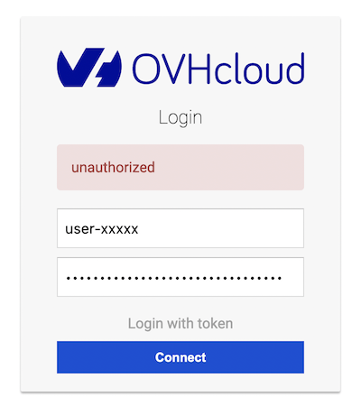{.thumbnail}

**Using an Access Token**

Click the `Login with token` button and enter your access token to log in to your Quantum Notebook.

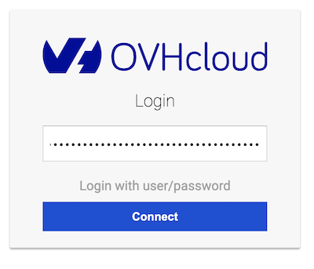{.thumbnail}

### Stopping a Quantum Notebook

You can stop your Quantum Notebook at any time to release its compute resources. This will release its compute resources but will keep your Notebook data and installed libraries. Therefore, you will not incur any further charges for compute unless you restart the Notebook. However, attached storage will be billed at the price of OVHcloud Object Storage (consult the [Quantum Notebooks Billing documentation](/pages/public_cloud/quantum_computing/billing) for more information). To do so, follow these steps:

> [!tabs]
> **Using the Control Panel (UI)**
>> 
>> Go to the Quantum Notebooks board and click on the `...`{.action} button next to the Notebook you want to stop.
Click the `Stop`{.action} button to stop the Notebook. Or, on the notebook board, you can click on the `red button`{.action} at the top of the page.
>> 
>> 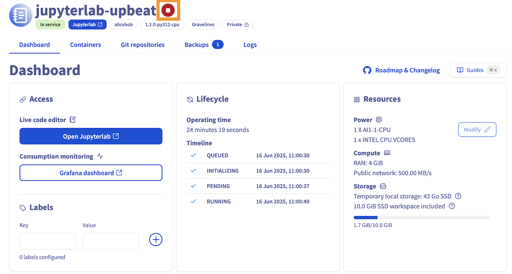{.thumbnail}
>> 
> **Using ovhai CLI**
>>
>> Run the command `ovhai notebook stop <NOTEBOOK_UUID>` to stop the Notebook.
>>
>> If you do not know its UUID, remember that you can easily list all your existing Quantum Notebooks by running `ovhai notebook list`.
>>
> **Using the Quantum API**
>>
>> Select the `Stop a running notebook` endpoint and provide the UUID of the Notebook you want to stop.
>>
>> 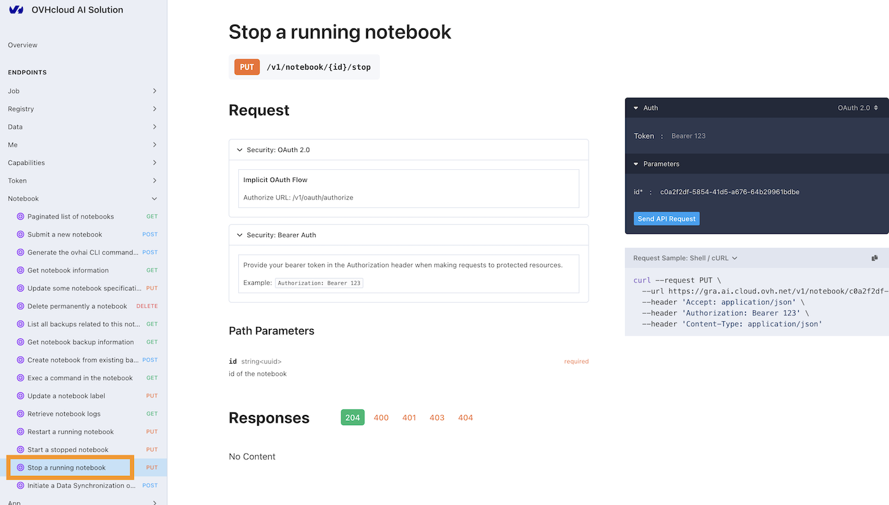{.thumbnail}
>>
> **Using the Python SDK**
>>
>> Use the `notebook_stop` method to stop the Notebook.
>>
>> ```python
>> from ovhai.api.notebook import notebook_stop
>> from ovhai import AuthenticatedClient
>> client = AuthenticatedClient(
>>     base_url="https://gra.ai.cloud.ovh.net",
>>     token="YOUR_QUANTUM_TOKEN",
>> )
>> id = "YOUR_NOTEBOOK_UUID"
>> 
>> with client as client:
>>     response = notebook_stop.sync_detailed(client=client, id=id)
>> ```
>>

### Restarting a stopped Notebook

To restart a stopped Notebook, follow these steps:

> [!tabs]
> **Using the Control Panel (UI)**
>> 
>> Go to the Quantum Notebooks board and click on the `...`{.action} button next to the Notebook you want to restart.
Click the `Start` button to restart the Notebook. Or, on the notebook board, you can click on the `blue button`{.action} at the top of the page.
>> 
>> 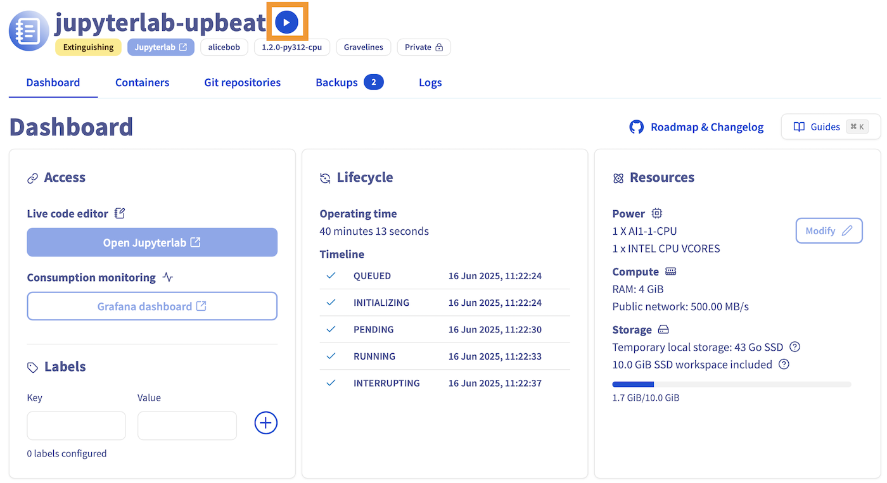{.thumbnail}
>> 
> **Using ovhai CLI**
>>
>> Run the command `ovhai notebook start <NOTEBOOK_UUID>` to restart the Notebook.
>>
> **Using the Quantum API**
>>
>> Select the `Start a stopped notebook` endpoint and provide the UUID of the Notebook you want to restart.
>>
>> 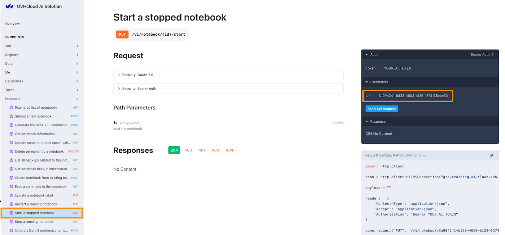{.thumbnail}
>>
> **Using the Python SDK**
>>
>> Use the `notebook_start` method to restart the Notebook.
>>
>> ```python
>> from ovhai.api.notebook import notebook_start
>> from ovhai import AuthenticatedClient
>> client = AuthenticatedClient(
>>     base_url="https://gra.ai.cloud.ovh.net",
>>     token="YOUR_QUANTUM_TOKEN",
>> )
>> id = "YOUR_NOTEBOOK_UUID"
>>
>> with client as client:
>>     response = notebook_start.sync_detailed(
>>         id=id, client=client
>>     )
>> ```
>>

### Deleting a Notebook

The notebook must be stopped before deleting it. To delete a Notebook, follow these steps:

> [!tabs]
> **Using the Control Panel (UI)**
>> 
>> Go to the Quantum Notebooks board and click on the `...`{.action} button next to the Notebook you want to delete.
>> Click the `Delete`{.action} button to stop the Notebook. Or, on the notebook board, you can click on the `Delete notebook`{.action} button at the bottom of the page.
>> 
>> 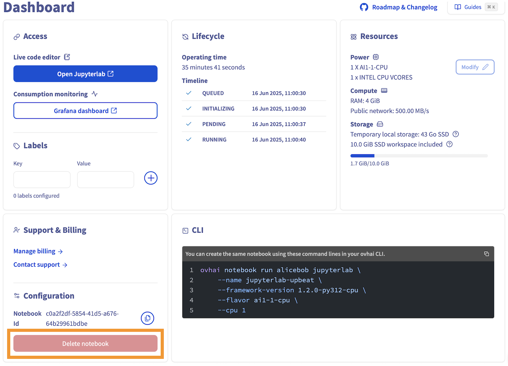{.thumbnail}
>> 
> **Using ovhai CLI**
>>
>> Run the command `ovhai notebook delete <NOTEBOOK_UUID>` to delete the Notebook.
>>
> **Using the Quantum API**
>>
>> Select the `Delete permanently a notebook` endpoint and provide the UUID of the Notebook you want to delete.
>>
>> 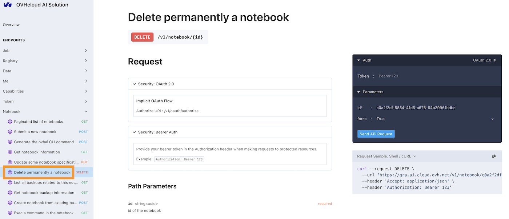{.thumbnail}
>>
> **Using the Python SDK**
>>
>> Use the `notebook_delete` method to delete the Notebook.
>> ```python
>> from ovhai.api.notebook import notebook_delete
>> from ovhai import AuthenticatedClient
>>
>> client = AuthenticatedClient(
>>     base_url="https://gra.ai.cloud.ovh.net",
>>     token="YOUR_QUANTUM_TOKEN",
>> )
>> id = "YOUR_NOTEBOOK_UUID"
>>
>> with client as client:
>>     response = notebook_delete.sync_detailed(
>>         id=id, client=client, force=False
>>     )
>>
>>     print(response.content.decode())
>> ```
>>

## Go further

- Discover how to access your Object Storage data and Git repositories from your Notebooks using the UI [here](/pages/public_cloud/ai_machine_learning/notebook_guide_data_ui).
- Learn about the technical features, capabilities, and limitations of the Public Cloud Quantum Notebooks offering [here](/pages/public_cloud/quantum_computing/capabilities).
- Get some hints on how to debug your Notebooks if things go wrong [here](/pages/public_cloud/quantum_computing/troubleshooting).

If you need training or technical assistance to implement our solutions, contact your sales representative or click on [this link](/links/professional-services) to get a quote and ask our Professional Services experts for a custom analysis of your project.

## Feedback

We would love to help answer questions and appreciate any feedback you may have.

Please send us your questions, feedback, and suggestions regarding Quantum Notebooks:

- In the #quantum-computing channel of the OVHcloud [Discord server](https://discord.gg/ovhcloud).