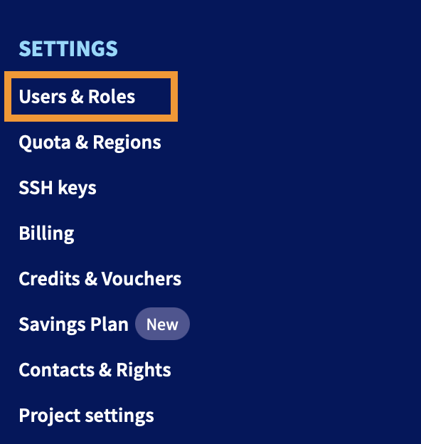
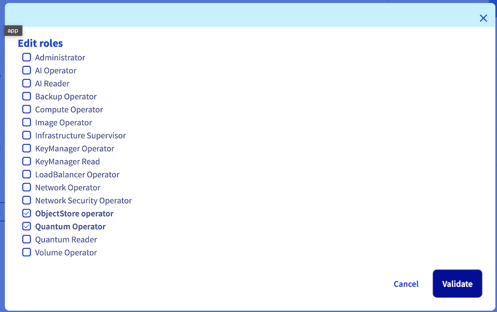

> [!warning]
>
> Some links on this documentation refer to the AI and Machine Learning solution. Quantum computing shares the same infrastructure as a service so you might be redirected to another section of this documentation.

## Objective

The **users** of **OVHcloud Quantum computing** are the same as those in your [Public Cloud project](/links/public-cloud/public-cloud), which can be created and managed in the [OVHcloud Control Panel (UI)](/links/manager). This guide demonstrates how to create, configure, and delete Quantum users and their roles.

## Requirements

- A [Public Cloud project](/links/public-cloud/public-cloud) in your OVHcloud account
- Access to the [OVHcloud Control Panel](/links/manager)

## Instructions

### Creating and editing Quantum users

To grant access to **OVHcloud Quantum Notebooks**, assign users the **Quantum Operator** or **Quantum Reader** role.

- **Quantum Operator**: Provides complete access to **Quantum Notebooks**. Users can launch, stop, and delete Quantum Notebooks, and authenticate to existing ones. The [ovhai CLI](/pages/public_cloud/ai_machine_learning/cli_10_howto_install_cli) uses their credentials.
- **Quantum Reader**: Allows users to access existing Quantum Notebooks, but not launch, stop, or delete them.

We recommend adding the **ObjectStore Operator** role to Quantum users, providing read/write access to **OVHcloud Object Storage**.

To apply these roles, log in to the [OVHcloud Control Panel](/links/manager) and navigate to the `Public Cloud`{.action} section. Select your Public Cloud project and click on `Project Management`{.action} > `Users & Roles`{.action}:

{.thumbnail}

On this page, you can create a new user or edit an existing user's roles.

**1. Create a new user**

Click `+ Add user`{.action}, specify a name, and assign the required roles (**Quantum Operator** or **Quantum Reader** and **ObjectStore Operator**):

{.thumbnail}

This generates a password for authenticating to existing Quantum Notebooks and the `ovhai` CLI.

> [!primary]
> If you lose a user's password, you can regenerate it by clicking the `...`{.action} button next to the user and selecting `Generate a password`{.action}. Access to a notebook can be revoked by deleting the user or removing their **Quantum Operator / Reader** role.

**2. Edit an existing user's roles**

Click the `...`{.action} button next to the user and select `Edit roles`{.action} to modify their existing roles.

## Going further

For training or technical assistance, contact your sales representative or click on [this link](/links/professional-services) to get a quote and ask our Professional Services experts for a custom analysis.

## Feedback

We would love to help answer questions and appreciate any feedback you may have.

Please send us your questions, feedback, and suggestions regarding Quantum Notebooks:

- In the #quantum-computing channel of the OVHcloud [Discord server](https://discord.gg/ovhcloud).
