## Objectif

Découvrez comment sauvegarder et restaurer vos données sur vos serveurs Bare Metal avec Backup Agent.

## Prérequis

- Être connecté à l’[espace client OVHcloud](/links/manager)
- Un serveur Bare Metal sur lequel Backup Agent est installé. Consultez notre guide [Comment configurer votre première sauvegarde](/pages/storage_and_backup/backup_agent/backup_agent_first_configuration) pour plus d'informations.

## En pratique

### Créer une sauvegarde pour votre serveur

Cela consiste à ajouter votre serveur dans votre Backup Agent, télécharger l'agent et l'installer sur votre serveur.

Connectez-vous à votre [espace client OVHcloud](/links/manager) et rendez-vous dans la partie `Backup Agent`{.action}.

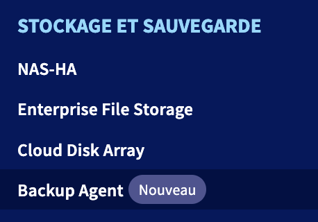{.thumbnail}

Cliquez sur votre vspc-tenant, dans la partie `Services`{.action}.

{.thumbnail}

Allez dans la partie `Agents`{.action}.

{.thumbnail}

Cliquez sur le bouton `Ajouter une configuration`{.action}.

{.thumbnail}

Sélectionnez votre serveur et le système d'exploitation.

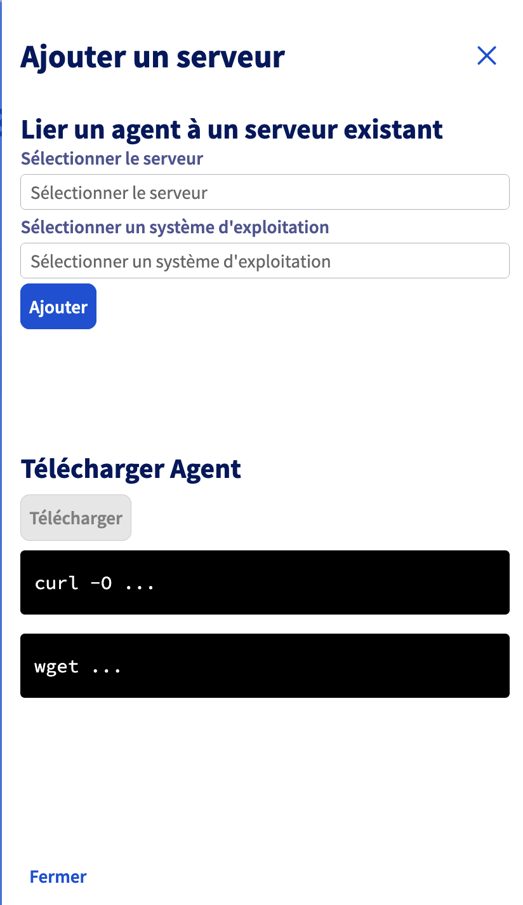{.thumbnail}

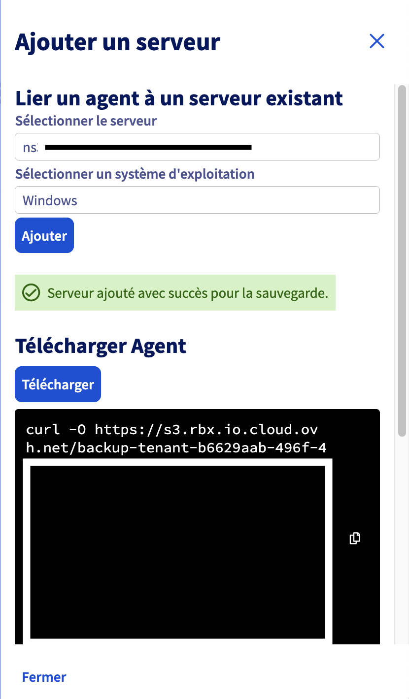{.thumbnail}

### Sauvegarde

Vous avez deux possibilités de faire des sauvegardes : automatique et manuelle.

#### Sauvegarde automatique

La sauvegarde automatique est intégrée dans la politique de sauvegarde que nous appliquons sur votre Backup Agent.

Il s'agit d'une sauvegarde complète de votre serveur, qui sera envoyée vers votre point de stockage distant.

> [!warning]
> 
> Celle-ci va se déclencher entre 22 heures et 6 heures (sur le fuseau horaire CET pour l'Europe et sur le fuseau horaire EST pour le Canada et l'Asie).

> [!primary]
> 
> Vous n'avez pas de possibilité de modifier ou désactiver cette sauvegarde automatique.

Vous pourrez voir le succès de cette sauvegarde via :

- Le rapport quotidien des sauvegardes.
- Le tableau de bord "Backup Jobs" de la console Veeam Service Provider.

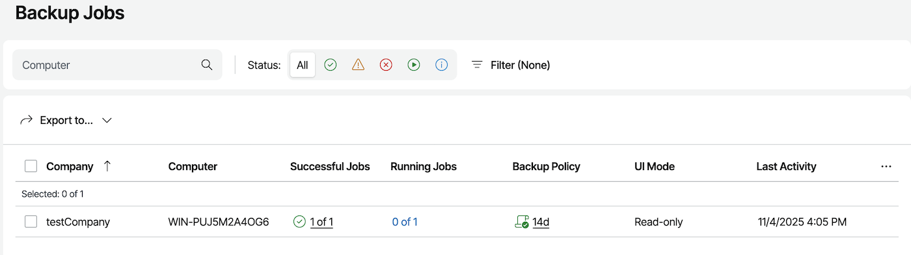{.thumbnail}

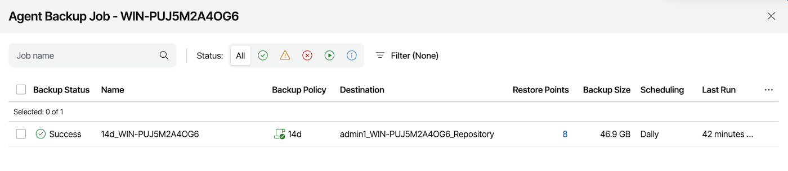{.thumbnail}

#### Sauvegarde manuelle

En cas de besoin, vous pouvez déclencher une sauvegarde manuelle.

Celle-ci fera également une sauvegarde complète de votre serveur, toujours envoyée vers votre point de stockage distant.

Pour créer une sauvegarde manuelle, ouvrez l'application "Veeam Agent" sur le serveur Bare Metal :

{.thumbnail}

Cliquez sur le bouton `Backup Now`{.action} pour lancer une sauvegarde :

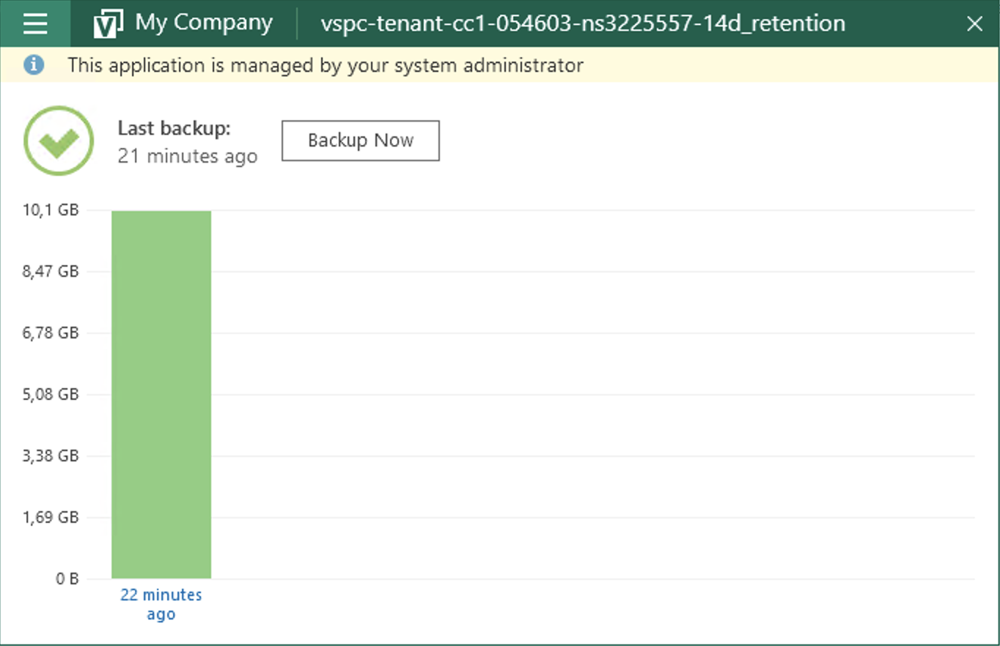{.thumbnail}

### Restauration

En cas de besoin de restaurer des données, vous avez deux possibilités :

- via l'assistant de restauration de fichiers ;
- via l'ISO Veeam Baremetal Recovery.

#### Assistant de restauration de fichiers

Ouvrez l'application "Veeam Agent" sur votre serveur Baremetal :

{.thumbnail}

Allez dans le menu et sélectionnez `Restore File`{.action} :

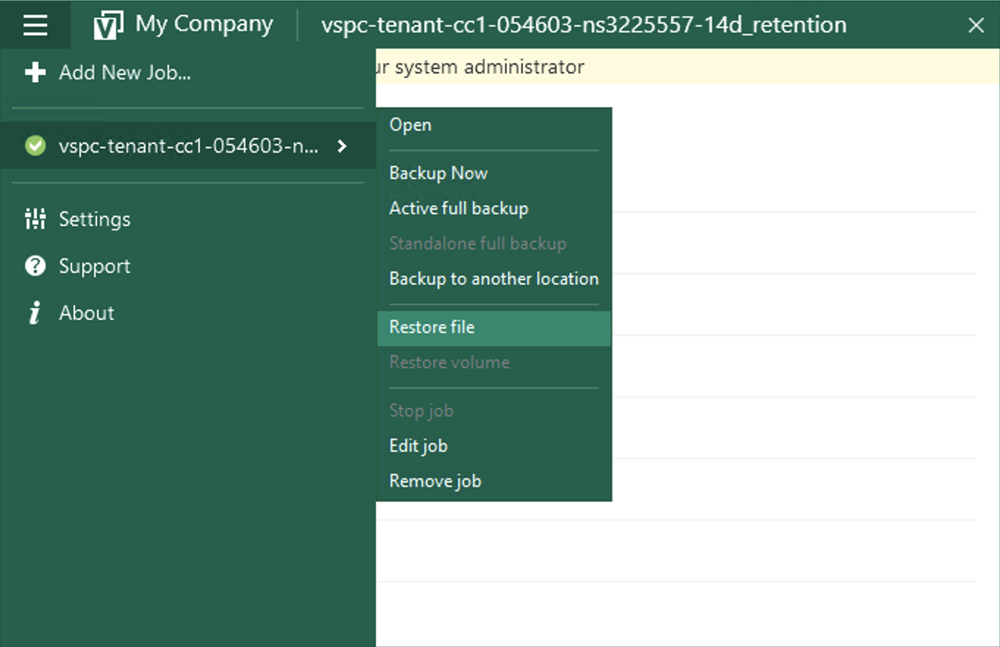{.thumbnail}

Sélectionnez le point de restauration souhaité dans l'assistant :

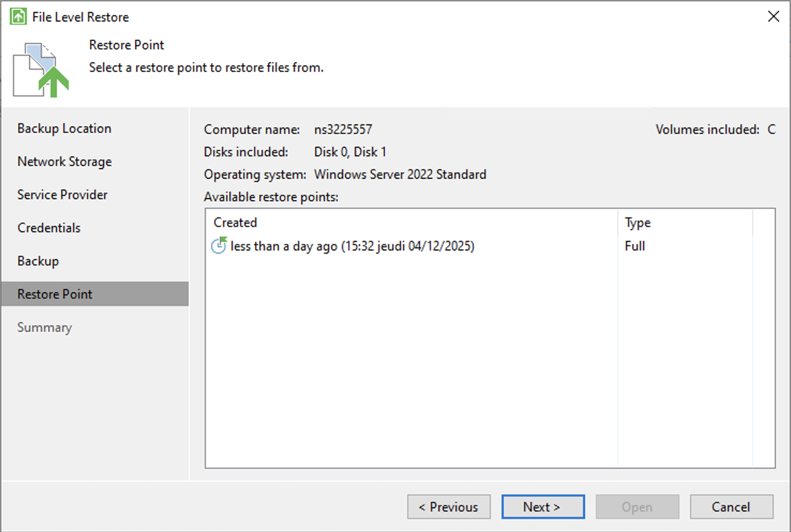{.thumbnail}

Puis validez :

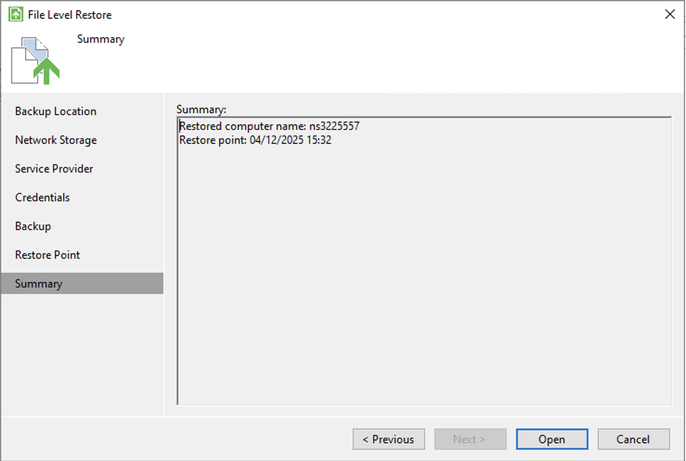{.thumbnail}

Enfin, cherchez votre fichier et sélectionnez une option :

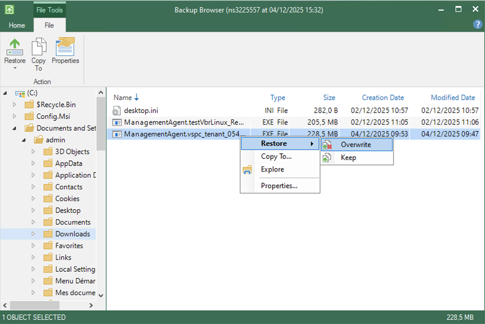{.thumbnail}

- Restore - Overwrite : vous permet de restaurer le fichier tout en écrasant celui actuellement présent sur le serveur.
- Restore - Keep : vous permet de restaurer le fichier tout en gardant celui actuellement présent sur le serveur.
- Copy To : vous permet de copier le fichier dans un emplacement de votre serveur.
- Explore : vous permet d'explorer la sauvegarde.
- Properties : vous permet de voir les propriétés du fichier.

Lancer une restauration vous permettra d'avoir une dernière fenêtre qui affichera le transfert :

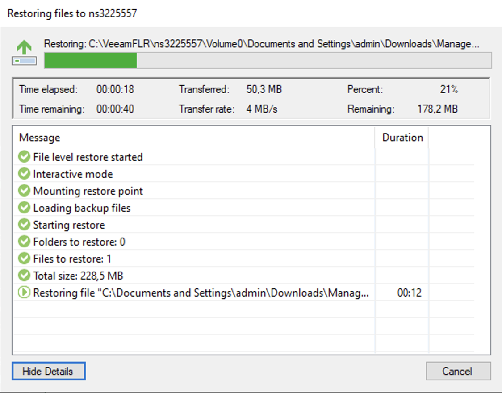{.thumbnail}

### ISO Veeam Baremetal Recovery

Bare Metal Recovery est une fonctionnalité de Veeam qui consiste à créer à l'avance un ISO personnalisé, qui peut ensuite être utilisé pour démarrer un système et le restaurer à partir d'une sauvegarde stockée sur un autre serveur.

Consultez ce guide pour plus d'informations : [Restaurer un serveur Bare Metal avec Veeam Backup Agent](/pages/storage_and_backup/backup_and_disaster_recovery_solutions/veeam/veeam_agent_bare_metal_recovery).

Vous devrez adapter le serveur et les identifiants avec ceux que nous vous aurons fournis.

## Aller plus loin

Échangez avec notre [communauté d'utilisateurs](/links/community).