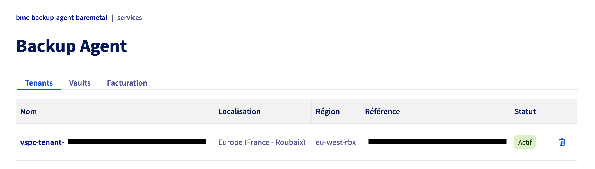
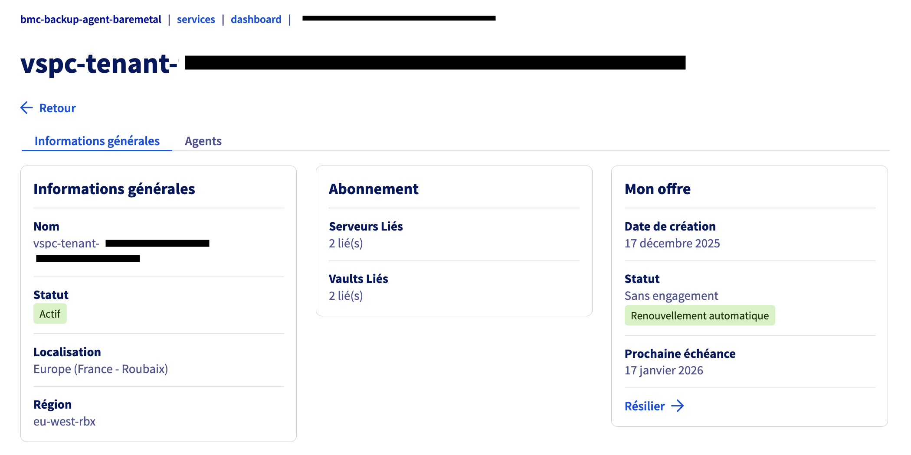
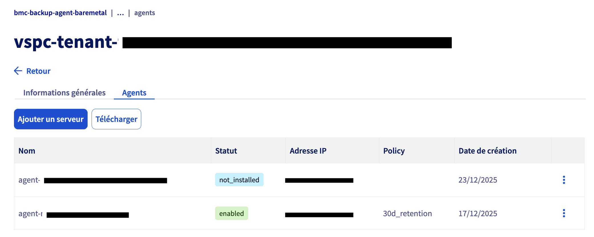
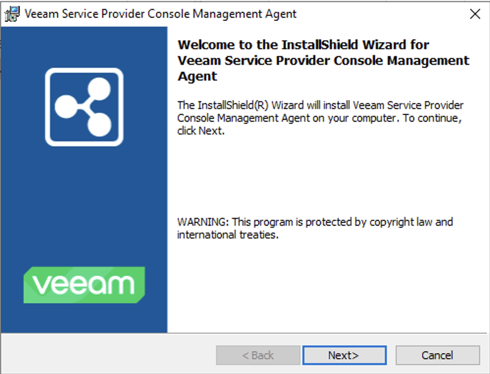
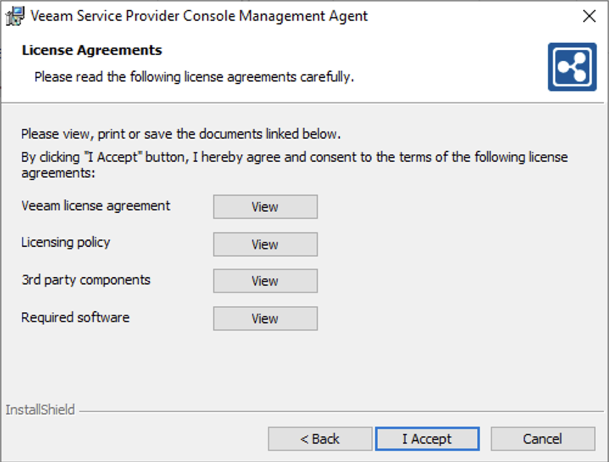
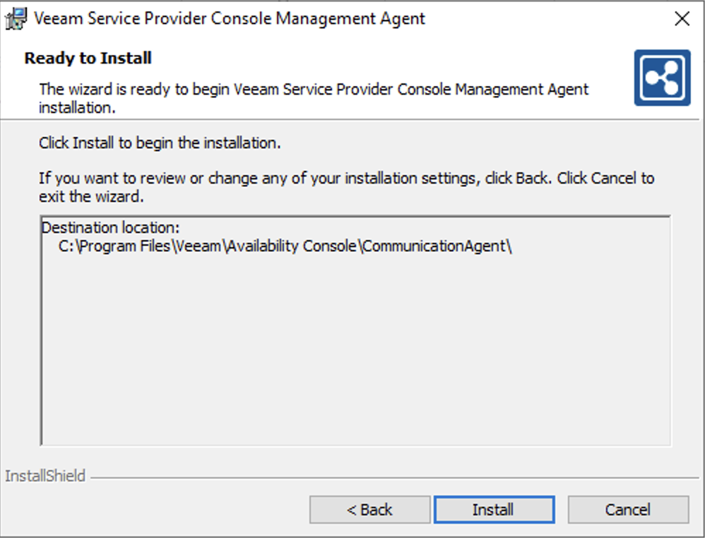
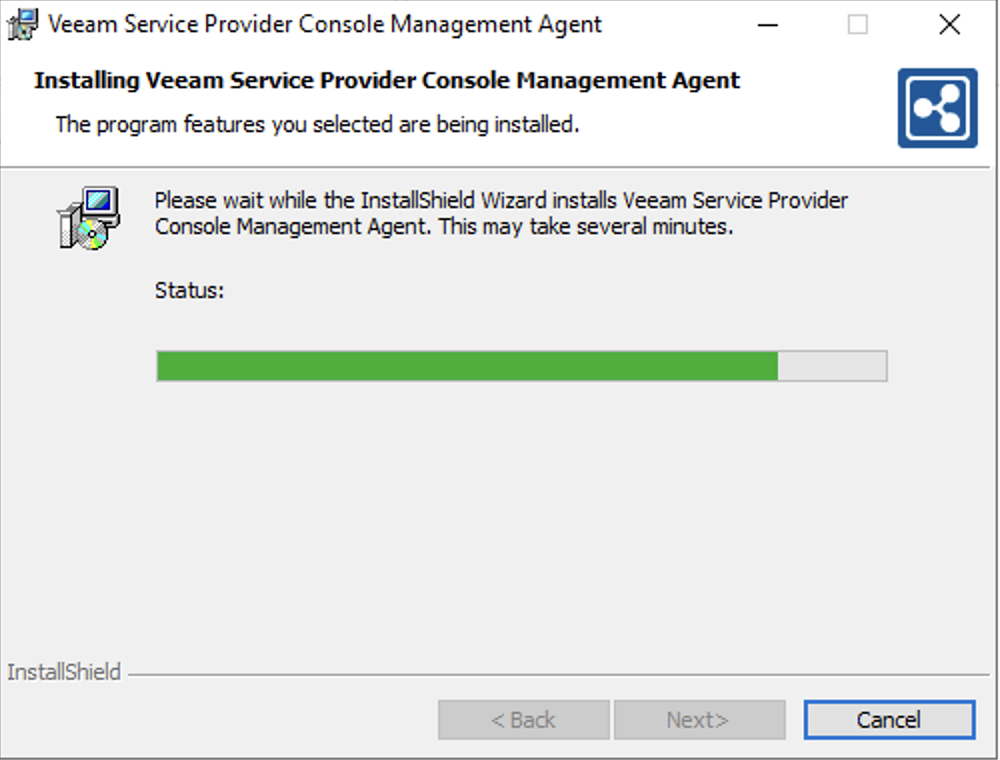
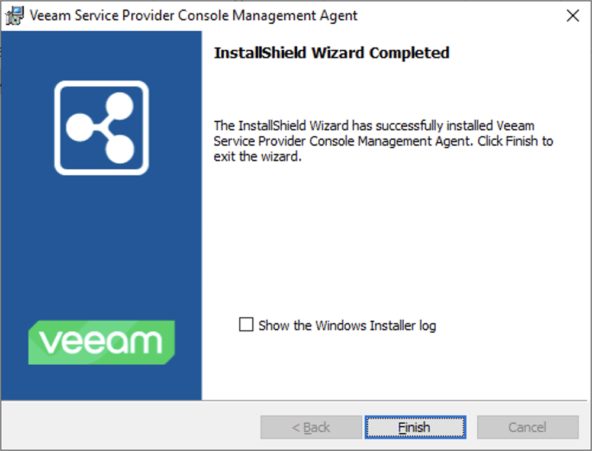
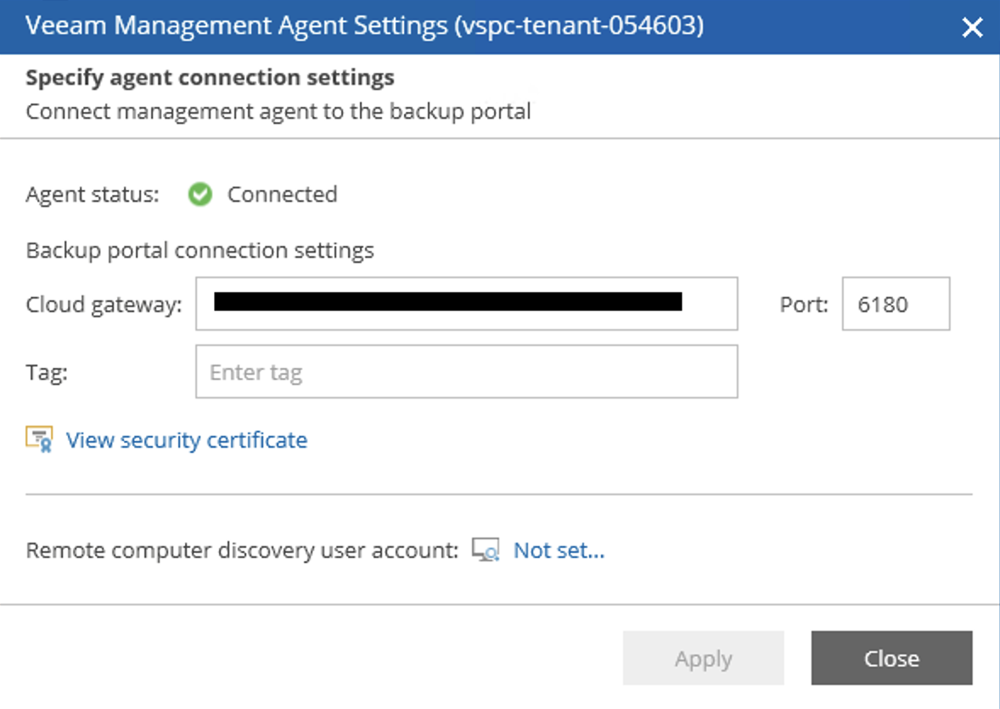
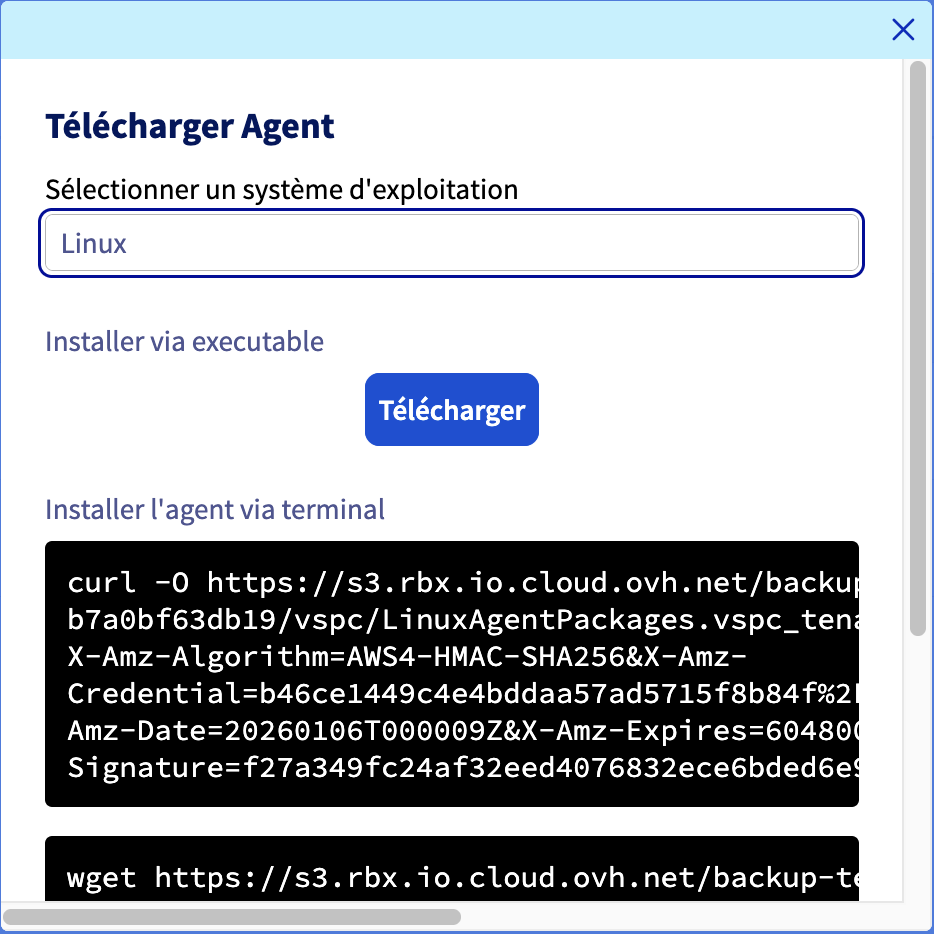

## Objective

You have just ordered your Backup Agent solution for your Bare Metal server, and you want to set up your first backups.

## Requirements

* You must have ordered a Backup Agent via your bare metal server, or via the "Backup Agent" menu in your Manager.
* You need to have booted and configured an operating system on your bare metal server.

## In practice

In order to configure your first backup, you must install the agent on your bare metal server.

The functioning is as follows:

* {.thumbnail} 

Once the agent has been installed, it will receive the backup policy and allow backups to be performed.

To install your agent on your bare metal server, follow the steps below:

### Windows

* Go to your Manager, in the Backup Agent section.
    * {.thumbnail}
* Click on your vspc-tenant, in the Services section.
    * {.thumbnail}
* Go to the "Agents" section
    * {.thumbnail}
* Click on the "Download" button at the top of the table of your Agents.
    * {.thumbnail}
* Select your operating system and choose either to download the installation file or use one of the commands provided to retrieve it.
    * {.thumbnail}
* Once the installation file is on your bare metal, you can run it and follow the procedure of the software:
    * {.thumbnail}
    * {.thumbnail}
    * {.thumbnail}
    * {.thumbnail}
    * {.thumbnail}

Once you have set it up, you will be able to see your agent connect to our infrastructure in order to go back to your backup policy:
    * {.thumbnail}
    * {.thumbnail}

Finally, once you go back down, you can see your backup agent configured and present on your Bare Metal server:
    * {.thumbnail}
    * {.thumbnail}

By default, your backups are triggered between 10pm and 6am, but you can launch backups manually by clicking the "Backup Now" button.

### Linux

* Go to your Manager, in the Backup Agent section.
    * {.thumbnail}
* Click on your vspc-tenant, in the Services section.
    * {.thumbnail}
* Go to the "Agents" section
    * {.thumbnail}
* Click on the "Download" button at the top of the table of your Agents.
    * {.thumbnail}
* Select your operating system and choose either to download the installation file or use one of the commands provided to retrieve it.
    * {.thumbnail}
* Once you have installed the installation file on your bare metal, you can run it in the following manner by going to the folder containing it:

```bash
sudo ./LinuxAgentPackages.<YOURCOMPANYNAME>.sh
```

Once the installation is complete, you can check its installation with this command:

```bash
sudo veeamconsoleconfig -s

Management agent
Connection state       : Connected
Cloud Gateway          : <OVHDOMAIN>:6180
Connection account     : <USER>
Backup agent
Status                 : Not installed
```

# Go further

Join our [community of users](/links/community).