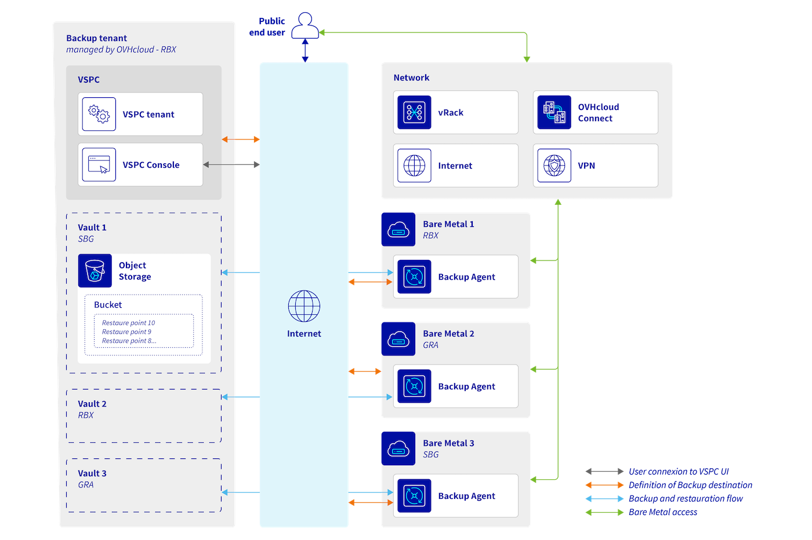

## Objectif

Ce guide vous aidera à comprendre le fonctionnement du produit Backup Agent et ses avantages pour vos services Bare Metal.

## Présentation du produit

Le produit Backup Agent permet de sauvegarder vos serveurs Bare Metal en utilisant un agent qui va, selon une politique de sauvegarde que vous avez choisie, envoyer les données de votre serveur vers un point de stockage externe.

Le produit Backup Agent s'appuie sur deux produits de l'éditeur logiciel Veeam :

- La Veeam Service Provider Console (VSPC).
- Le Veeam Agent.

La VSPC permet de redescendre les politiques de sauvegardes aux agents enregistrés dessus, et permet de donner les informations du stockage et des identifiants à chaque agent lors du démarrage de sa sauvegarde.

Une fois que l'agent obtient les informations, il envoie directement les données vers le point de stockage sans jamais transitionner par l'infrastructure VSPC.

Le schéma de principe est le suivant :

{.thumbnail}

Il est à noter que :

- L'infrastructure VSPC est hébergée dans les datacenters OVHcloud et n'envoie pas de données vers les serveurs de Veeam.
- Les points de stockage sont des buckets [OVHcloud Object Storage](/links/public-cloud/object-storage) qui sont hébergés dans les datacenters OVHcloud.

Plusieurs points forts sont présents dans cette offre :

- Première politique de sauvegarde automatique avec 14 jours de rétention.
- Possibilité de passer à 30 jours de rétention.
- 14 jours d'immutabilité sur nos buckets.
- La période des sauvegardes automatiques est entre 22h00 et 06h00 (fuseau horaire CET pour l'Europe - fuseau horaire EST pour le Canada et l'Asie).
- Chiffrement géré par OVHcloud du stockage hébergeant vos données de sauvegardes.
- Envoi en direct de la donnée de sauvegarde vers le bucket sans mettre de copie sur notre infrastructure.
- Point de stockage toujours distant de la localisation de votre serveur Bare Metal (si vous êtes à Roubaix, votre point de stockage sera à Gravelines).

## Aller plus loin

Échangez avec notre [communauté d'utilisateurs](/links/community).