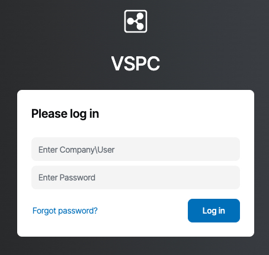
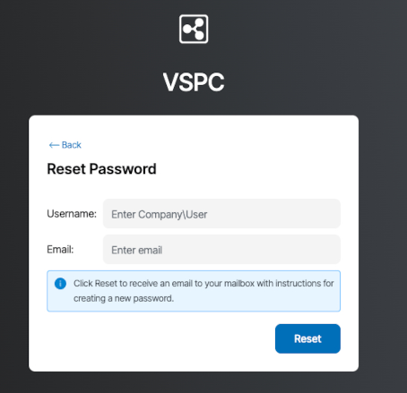

<style>
/* ---FAQ only--- */
details {
    margin: 0.1rem 1;
    border: 1px solid transparent;
    border-radius: 4px;
    background: #ffffffff;
}
details > summary {
    padding: 0.1rem 1rem;
    font-weight: 500;
    color: #268fd4ff;
    cursor: pointer;
    list-style: none;
}
details > summary::before {
    content: '\25B6';
    display: inline-block;
    margin-right: 0.5ch;
    transition: transform 0.2s;
}
details[open] > summary::before {
    content: '\25BC';
}
details:hover {
    border: 1px solid #147DE8;
    border-radius: 4px;
    transition: border-color 0.5s ease;
}
details[open] > summary {
    background: #ffffffff;
}
details > :not(summary) {
    padding: 0.25rem 0.5rem;
    box-sizing: border-box;
    list-style-position: inside;
}
.smallish-gap {
    display: block;
    margin-top: 0.25rem;
    margin-bottom: 0.25rem;
}
</style>


## Objective

Here is a list of potential issues you may encounter with the Backup Agent product and how to solve them.

## Requirements

- At least one Bare Metal server with the Backup Agent installed on it. Read our guide [How to configure your first backup](/pages/storage_and_backup/backup_agent/backup_agent_first_configuration) for more information.

## List of possible issues

/// details | My Backup Agent is unable to connect to your server.

Make sure your firewall allows you to communicate with our server `vspc-cgw1.prod01.eu-west-rbx.backup.ovhcloud.com` (137.74.125.230) in Europe with TCP port and UDP 6180.

Ensure that no other services are using ports that could conflict with your server.

You can find your agent logs in the folder: `C:\ProgramData\Veeam\` or `/var/logs`.

///

/// details | Your server cannot install the Backup Agent on my server.

The Backup Agent supports Windows distributions and Linux native kernels. If you have made changes to your kernel, you must ensure that you have the correct packages to install the agent. You can find the list of required parameters here: <https://helpcenter.veeam.com/docs/agentforlinux/userguide/system_requirements.html?ver=13>.

///

/// details | My agent cannot back up. I have the error: "Failed to perform backup. Neither blksnap nor veeamsnap module was found."

The agent supports Windows distributions and Linux native kernels. If you have made changes to your kernel, you must ensure that you have the correct packages to install the agent. You can find the list of required parameters here: <https://helpcenter.veeam.com/docs/agentforlinux/userguide/system_requirements.html?ver=13>

You will need the Linux kernel headers first, and you can then try to install or reconfigure your veeamsnap or veeamblksnap or blksnap package, depending on your Operating System.

///

/// details | My agent cannot back up. I get the error: `POSIX: Failed to create or open file [/.veeamsnapstorage/veeamsnapstore`

To back up, Veeam takes snapshots in addition to preserving the data that will be written to the backup. This snapshot is called "veeamsnapstorage".

To resolve the issue, you can increase the size of the snapshot via the `/etc/veeam/veeam.ini` file:

```bash
[blksnap]
 
# The minimum allowable size of the difference storage in sectors
diffStorageMinimum = 2097152
```

Replace the value in bytes with the desired number of GB (GB divided by 512, for 3GB you must put 3221225472 / 512 = 6 291 456)

Then restart the veeamservice service.

///

/// details | I cannot start a manual backup.

[Contact OVHcloud support](/links/support) to investigate. Make sure to provide logs and screenshots.

///

/// details | My storage usage did not refresh after an agent was removed.

We keep your data for 14 days following an agent deletion, storage usage will be updated following the 14 days and data deletion.

///

/// details | I want to change the password for accessing the Veeam Service Provider Console (VSPC).

Passwords can be changed via the “Forgot password?” link available on the VSPC console.





///

/// details | I have uninstalled my Veeam Agent, how do I reinstall it?

[Contact OVHcloud support](/links/support) to help you reinstall your agent.

/// details | I have reinstalled my server. How do I reinstall the Backup Agent?

You must delete your agent in the Agents section of your vspc-tenant, then download and install the agent on your new Operating System.

///

## Go further

Join our [community of users](/links/community).