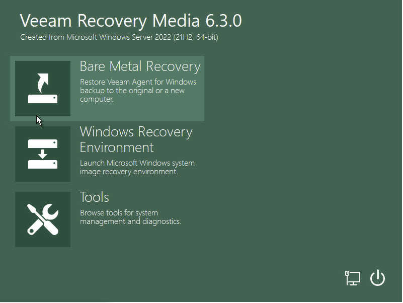
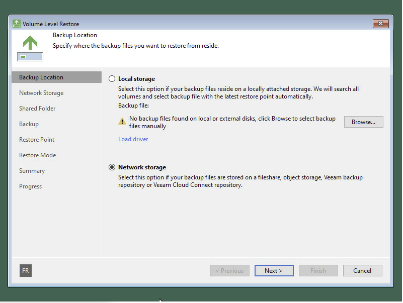
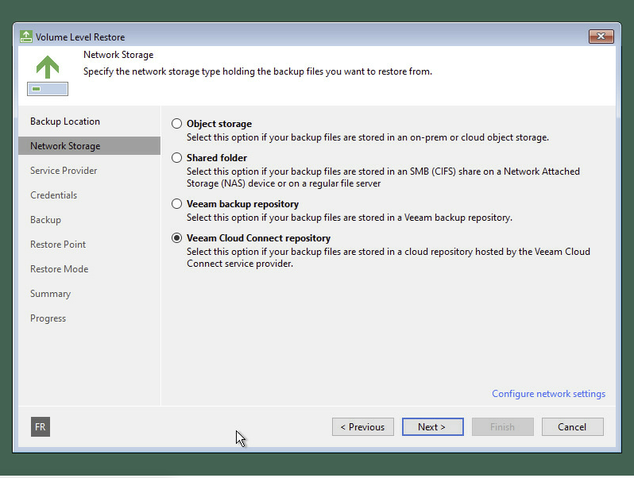
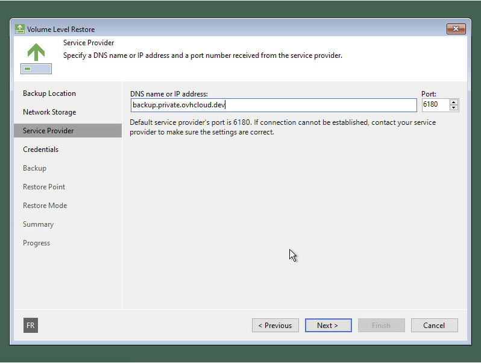
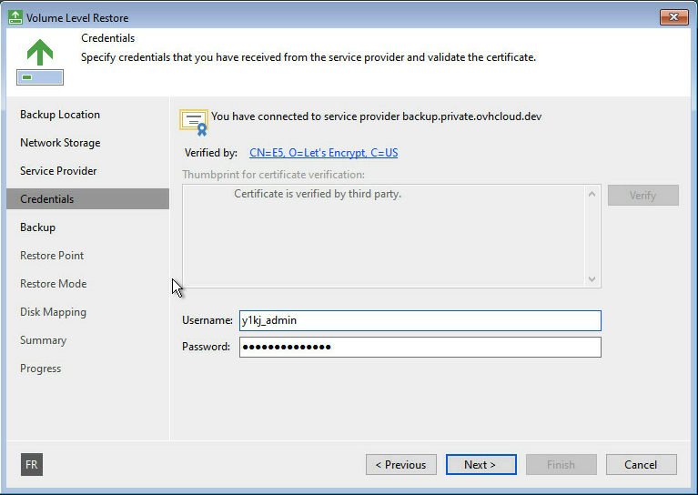
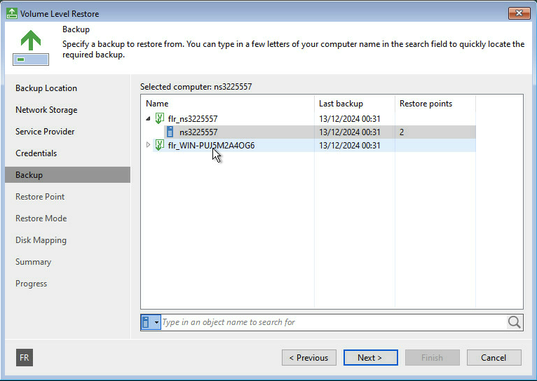
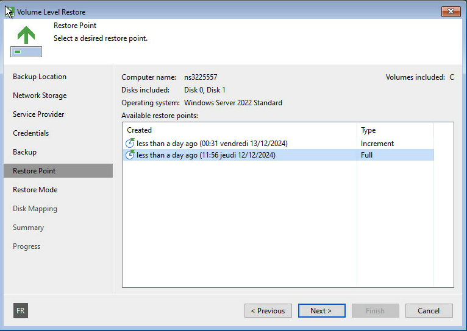
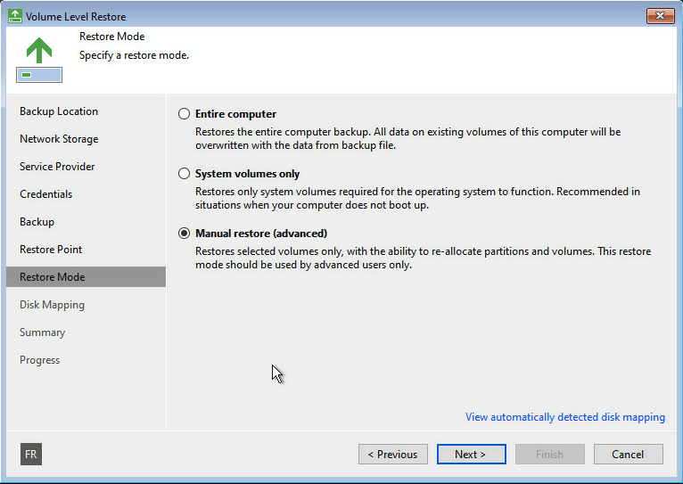
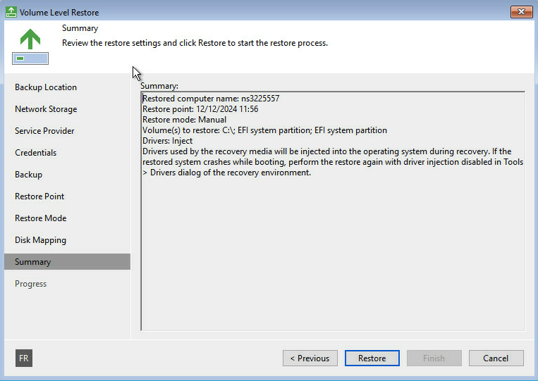
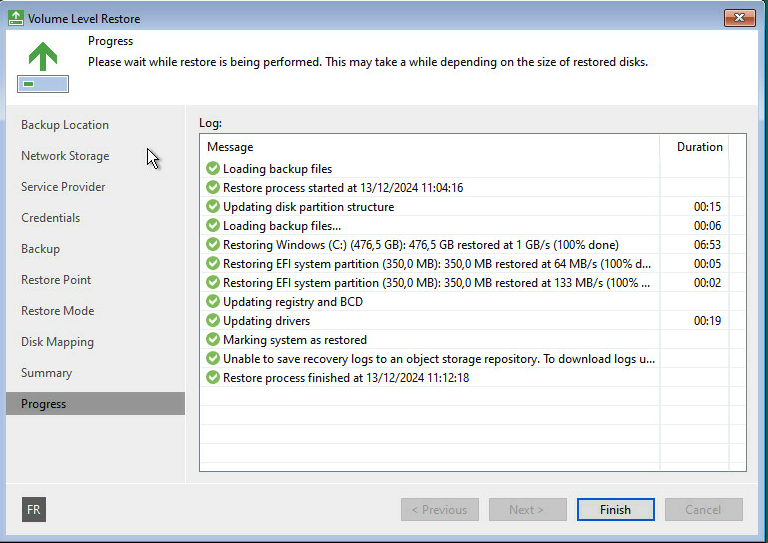

## Objective

**This guide explains how to recover your entire Windows system using Veeam's Bare Metal Recovery, with your backups stored on OVHcloud’s Cloud Connect service.**

You’ll learn how to:
- Create a recovery ISO (a file that helps you start your PC when Windows doesn’t work)
- Use it to boot your computer and restore everything from your latest backup

## Requirements

Before you begin, make sure you have:

- A tenant delivered with the Alpha Backup Agent
- A machine where the Veeam Backup Agent is running and has already pushed at least one backup

## Instructions

### Step 1: Create your recovery media ISO

If your computer ever stops working, you’ll need a recovery ISO to boot it up. Let’s create it now.

1. Open the **Create Recovery Media** tool on your computer (it comes with the Veeam Backup Agent).

    {.thumbnail}

2. Veeam will ask if you want to include extra drivers.

    > **Tip:** If you’re using special hardware (like a RAID controller or a Wi-Fi dongle), select the drivers you need. Otherwise, the default is usually fine.

    {.thumbnail}

3. Choose where to save the recovery ISO and give it a name.

    {.thumbnail}

4. Let the tool finish. Your ISO file will be created.

    {.thumbnail}

You can now use this ISO to create a bootable USB stick using a tool like Rufus or your favorite ISO-to-USB tool.

### Step 2: Boot your computer from the recovery ISO

If your system isn’t working and you need to restore it:

1. Plug in the USB stick or insert the ISO and **boot your computer from it**.

    > **Not sure how to boot from USB?** Restart your PC and press the key shown (usually F2, F12, ESC, or DEL) to access the boot menu.

2. Once the system starts, the Veeam Recovery Wizard will open. Click **Bare Metal Recovery**.

    {.thumbnail}

3. Choose **Network Storage** to access your online backups.

    > **Important:** If your internet doesn’t work at this stage, you may need to manually configure the network. The recovery system may not recognize your network card automatically.

    {.thumbnail}

4. Select **Veeam Cloud Connect repository**.

    {.thumbnail}

5. Enter the following address when prompted for the service provider:

backup.private.ovhcloud.dev

    {.thumbnail}

6. Enter your username and password to log in.

    {.thumbnail}

7. Select the server you want to restore.

    {.thumbnail}

8. Choose the restore point (date/time) you want to go back to.

    > **Tip:** We recommend using the most recent successful backup unless you have a specific reason to go back further.

    {.thumbnail}

9. Choose the recovery mode that fits your situation—usually “Entire computer.” 

    {.thumbnail}

Then start the restore process.

{.thumbnail}

{.thumbnail}

> **Note:** The recovery can take some time, depending on your backup size and internet connection. Once complete, your system will reboot with everything restored as it was at the time of the selected backup.

## Go Further

If you need training or technical assistance to implement our solutions, please contact your Technical Account Manager or click on [this link](/links/professional-services) to get a quote and ask our Professional Services experts for a custom analysis of your project.

Ask questions, give your feedback and interact directly with the team building our Hosted Private Cloud services on the dedicated [Discord](https://discord.gg/ovhcloud) channel.

Join our [community of users](/links/community).