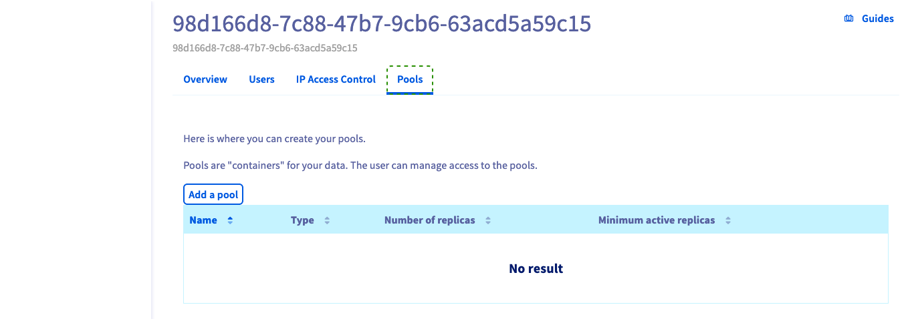

## Objectif

Ce guide vous montre comment créer un pool pour votre cluster ceph, en utilisant l'espace client OVHcloud ou l'API OVHcloud.

## Prérequis

- Une solution [Cloud Disk Array](/links/storage/cloud-disk-array)
- Être connecté à l’[espace client OVHcloud](/links/manager) ou à l’[API OVHcloud](/links/api)

## En pratique

> [!primary]
>
> L'utilisation de l'espace client OVHcloud est le moyen le plus simple de créer un pool.
>

### Depuis l'espace client OVHcloud

Tout d'abord, connectez-vous au [l’espace client](https://www.ovh.com/manager/dedicated/#/configuration){.external} et dans la rubrique Plates-formes et services vous trouverez le service Ceph.

Vous trouverez ici les pools existants dans `Pools`{.action}.

{.thumbnail}

Entrez un nom de pool, votre pool doit comporter au moins trois caractères.

{.thumbnail}

Après la création du pool, vous revenez au gestionnaire, vous pouvez voir que le statut du cluster a changé car le pool est en cours de création.

{.thumbnail}

## Depuis l'API OVHcloud

> [!api]
>
> @api {v1} /dedicated/ceph POST /dedicated/ceph/{serviceName}/pool
>
serviceName est le fsid de votre cluster.

Vous pouvez vérifier la création d'un pool en consultant la liste des pools.

> [!api]
>
> @api {v1} /dedicated/ceph GET /dedicated/ceph/{serviceName}/pool
>
Par example:

```bash
GET /dedicated/ceph/98d166d8-7c88-47b7-9cb6-63acd5a59c15/pool
[
{
  replicaCount: 3
  serviceName: "98d166d8-7c88-47b7-9cb6-63acd5a59c15"
  name: "rbd"
  minActiveReplicas: 2
  poolType: "REPLICATED"
  backup: false
},
{
  replicaCount: 3
  serviceName: "98d166d8-7c88-47b7-9cb6-63acd5a59c15"
  name: "testpool"
  minActiveReplicas: 2
  poolType: "REPLICATED"
  backup: true
  }
]
```

## Aller plus loin

Rendez-vous sur notre chaîne Discord dédiée : <https://discord.gg/ovhcloud>. Posez des questions, fournissez des commentaires et interagissez directement avec l'équipe qui construit nos services de stockage et de sauvegarde.

Si vous avez besoin d'une formation ou d'une assistance technique pour la mise en oeuvre de nos solutions, contactez votre commercial ou cliquez sur [ce lien](https://www.ovhcloud.com/fr/professional-services/) pour obtenir un devis et demander une analyse personnalisée de votre projet à nos experts de l’équipe Professional Services.

Échangez avec notre [communauté d'utilisateurs](/links/community).
