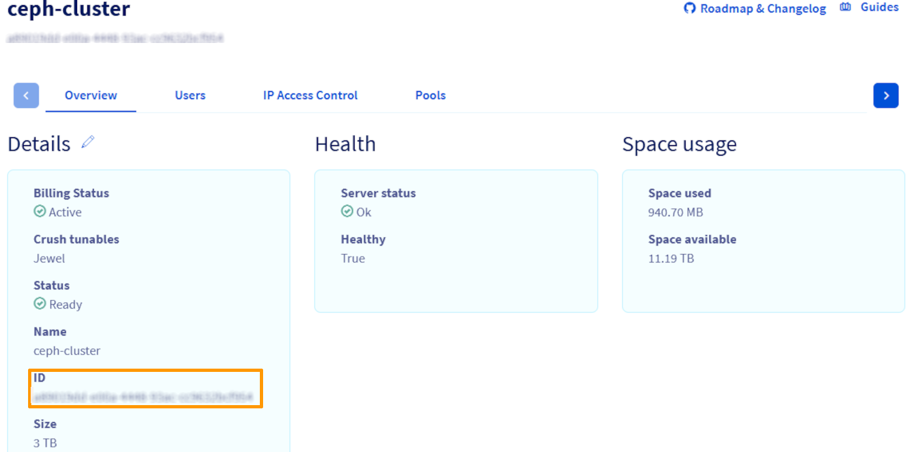

<style>
details>summary {
    color:rgb(33, 153, 232) !important;
    cursor: pointer;
}
details>summary::before {
    content:'\25B6';
    padding-right:1ch;
}
details[open]>summary::before {
    content:'\25BC';
}
</style>

## Objectif

Ce guide explique comment mettre à niveau votre cluster OVHcloud Cloud Disk Array (CDA) pour augmenter sa capacité de stockage. Il décrit le comportement technique d'une mise à niveau en direct, les appels API nécessaires et la manière de récupérer les informations de service requises. Cette opération est réalisée entièrement en ligne, sans interrompre l'accès en lecture/écriture à vos données, et n'est disponible que via l'API OVHcloud.

> [!primary]
>
> Pour le moment, la mise à niveau d'un cluster Cloud Disk Array (CDA) n'est disponible que via l'API OVHcloud. Elle ne peut pas être effectuée via l'espace client OVHcloud.
>

## Prérequis

- Une solution [Cloud Disk Array](/links/storage/cloud-disk-array)
- Être connecté à l’[API OVHcloud](/links/api)

> [!success]
> Si vous n'êtes pas familier avec l'utilisation de l'API OVHcloud, consultez notre guide « [Premiers pas avec les API OVHcloud](/pages/manage_and_operate/api/first-steps) ».

## En pratique

### Fonctionnement de la mise à niveau d’un Cloud Disk Array (CDA)

La mise à niveau d’un cluster Cloud Disk Array (CDA) s’effectue entièrement en ligne, sans interruption de service. Les clients conservent un accès complet en lecture et en écriture à leurs données pendant toute la durée de l’opération.

> [!primary]
>
> Une légère dégradation des performances ou une hausse temporaire de la latence des entrées/sorties (E/S) peut être observée durant le rééquilibrage des données au sein du cluster. Ce comportement est normal et attendu.
>

/// details | **Déroulement de la mise à niveau**

Le processus de mise à niveau suit les étapes ci-dessous :

- **Lancement de la commande de mise à niveau :** Le client initie la demande de mise à niveau via l’API OVHcloud, puis procède au paiement.
- **Provisionnement de nouveaux nœuds de stockage :** De nouveaux nœuds Ceph OSD (Object Storage Daemon) sont automatiquement provisionnés et ajoutés au cluster. Ces nœuds sont déployés par groupes de trois, chacun dans une baie distincte afin de garantir la redondance et l’isolation des domaines de défaillance.
- **Confirmation côté client :** Une fois les nouveaux nœuds opérationnels, le système considère l’opération comme terminée du point de vue du client. Aucune action supplémentaire n’est requise de sa part.
- **Rééquilibrage automatique des données :** En arrière-plan, Ceph lance une phase de rééquilibrage des données. Les données existantes sont redistribuées sur l’ensemble du cluster, y compris les nouveaux nœuds, tout en maintenant le niveau de réplication configuré (généralement trois réplicas).
- **Stabilisation des performances :** Le rééquilibrage se poursuit jusqu’à ce que la distribution des données soit homogène, selon les algorithmes internes de placement de Ceph. Une fois cette étape terminée, le cluster retrouve son niveau de performance optimal.

///

### Récupération des informations nécessaires

Avant de lancer une mise à niveau de CDA, vous aurez besoin de deux informations essentielles :

- Le nom de service de votre cluster CDA.
- Le code de plan correspondant à votre configuration actuelle

Suivez les étapes ci-dessous pour les récupérer à l'aide de l'API OVHcloud.

/// details | **Étape 1. Obtenez le nom de votre service (passez à l'étape suivante si vous le connaissez déjà)**.

Vous pouvez le récupérer via l'espace client OVHcloud ou l'appel API suivant :

> [!tabs]
> Via l'API OVHcloud
>>
>> > [!api]
>> >
>> > @api {v1} /dedicated/ceph GET /dedicated/ceph
>> >
>>
>> Cette commande renvoie une liste de vos services CDA. Chaque service est identifié par un UUID, par exemple 48e5f77f-427b-4261-9799-7861033659fb
>>
> Via l'espace client OVHcloud
>> Tout d'abord, connectez-vous à votre [espace client OVHcloud](/links/manager) et rendez-vous dans la section `Bare Metal Cloud`{.action}. Cliquez sur `Platformes et services`{.action} puis sur le service `ceph-cluster`{.action}.
>>
>> Dans les « Détails », localisez le champ « ID ». Cette valeur est le nom de votre service CDA.
>>
>> {.thumbnail}
>>

///

/// details | **Étape 2. Identifiez le code de votre plan (passez à l'étape suivante si vous savez quel plan vous utilisez)**

Votre plan CDA détermine le type et la taille de l'espace de stockage utilisé. Les deux plans disponibles sont les suivants :

- storage-2tb - ancienne configuration sur nvme+hdd (sur disques durs de 2TB)
- cda-3tb - nouvelle configuration sur nvme (disques NVME de 3 To)

**Récupérer l'ID du service :**

Utilisez le nom du service (UUID) de l'étape 1 pour obtenir l'ID de service correspondant :

> [!api]
>
> @api {v1} /services?resourceName GET /services?resourceName={serviceName}
>

L'identifiant du service est un nombre, par exemple : 1234567

**Récupérer les détails du service :**

Interrogez maintenant les informations sur le service à l'aide de l'identifiant du service :

> [!api]
>
> @api {v1} /services/{serviceId} GET /services/{serviceId} // Pour cet exemple, remplacez par 1234567
>

Recherchez le champ suivant dans la réponse :

```json
"billing": {
  "plan": {
    "code": "cda-3tb"
  }
}
```

La valeur sous billing.plan.code est le code de votre plan, dont vous aurez besoin pour effectuer la mise à niveau.

///

### Comment effectuer la mise à niveau

Le processus de mise à niveau est simple et ne nécessite qu'un seul appel API.

**Étape 1 : Accéder à la console API**
 
Choisissez la console API appropriée pour votre région :

- [Console de l'API EU](https://eu.api.ovh.com/console-preview/)
- [Console de l'API CA](https://ca.api.ovh.com/console-preview/)

**Étape 2 : Envoyer l'ordre de mise à niveau**

Utilisez la route API suivante :

> [!api]
>
> @api {v1} /order/upgrade/cephaas/{serviceName}/{planCode} POST /order/upgrade/cephaas/{serviceName}/{planCode}
>

Remplacez les espaces réservés par les détails de votre service :

- serviceName : L'UUID de votre cluster CDA (par exemple 6cb82c75-29fd-4d77-9928-0de6ad9ff5fe)
- planCode : Votre code de plan CDA actuel - soit :
    - storage-2tb (ancienne configuration avec HDD + NVMe)
    - cda-3tb (nouvelle génération avec NVMe complet)
- quantity : Le nombre d'unités supplémentaires que vous souhaitez provisionner (1-24). Par exemple :

| Quantité | Capacité totale ajoutée   |
| -------- | ------------------------- |
| 1        | 2 TB (3 x 2TB disks)      |
| 2        | 4 TB (6 x 2TB disks)      |
| ...      | ...                       |
| 24       | 48 TB (72 x 2TB disks)    |

> [!primary]
>
> La quantité fait référence au nombre d'unités que vous voulez au total, et non au nombre d'unités que vous voulez ajouter.
>
> Par exemple, si votre cluster dispose actuellement d'une capacité de stockage de 3 To et que vous souhaitez l'augmenter à 6 To, vous devez définir la quantité = 2 (et non 1).
>
> De même, si votre cluster dispose de 9 To et que vous souhaitez l'augmenter à 12 To, vous devez définir la quantité = 4.
>

**Étape 3 : Récupérer le lien de paiement**

Si l'appel à l'API aboutit, la réponse comprendra une URL de paiement située dans le champ suivant :

```json
"order": {
  "details": {
    "url": "(https://www.ovh.com/cgi-bin/order/display-order.cgi?orderId=174448338&orderPassword=wufe4HQQQQ)",
  }
}
```

**Étape 4 : Confirmer la commande**

Ouvrez l'URL fournie, terminez le processus de paiement et votre mise à niveau commencera automatiquement. Les nouveaux nœuds de stockage sont généralement ajoutés à votre cluster CDA quelques minutes après la confirmation du paiement.

## Aller plus loin

Rendez-vous sur notre chaîne Discord dédiée : <https://discord.gg/ovhcloud>. Posez des questions, ajoutez des commentaires et interagissez directement avec l'équipe qui construit nos services de stockage et de sauvegarde.

Si vous avez besoin d'une formation ou d'une assistance technique pour la mise en oeuvre de nos solutions, contactez votre commercial ou cliquez sur [ce lien](/links/professional-services) pour obtenir un devis et demander une analyse personnalisée de votre projet à nos experts de l’équipe Professional Services.

Échangez avec notre [communauté d'utilisateurs](/links/community).