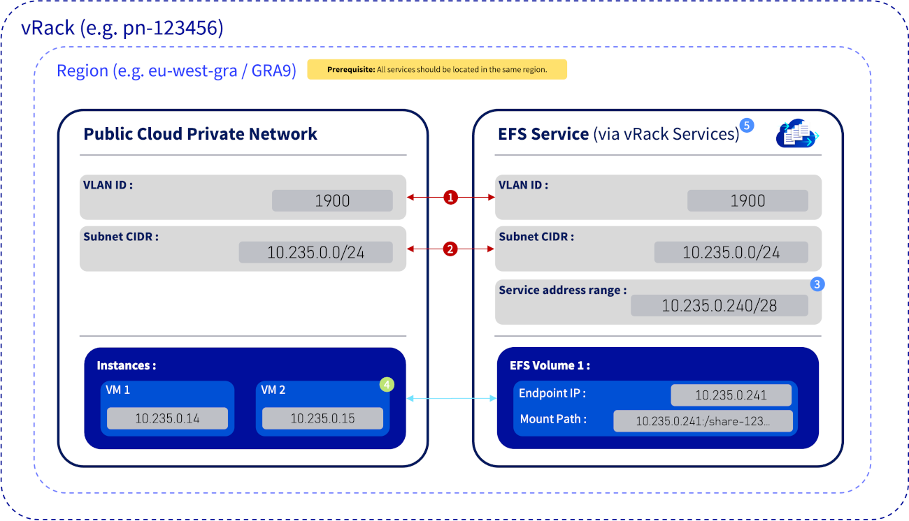
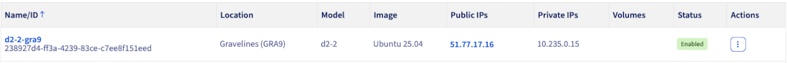
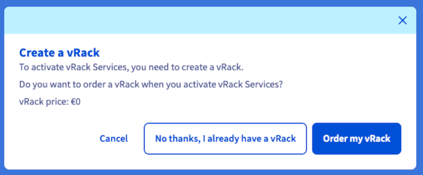
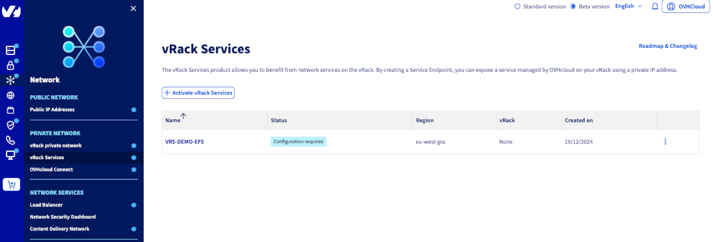
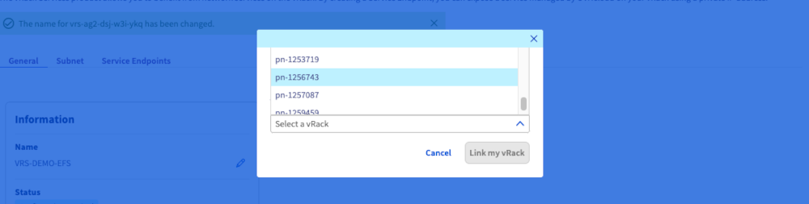
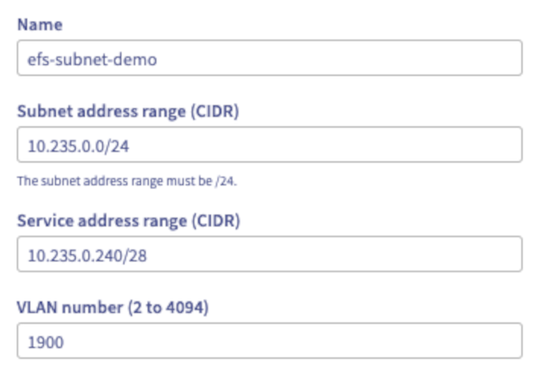
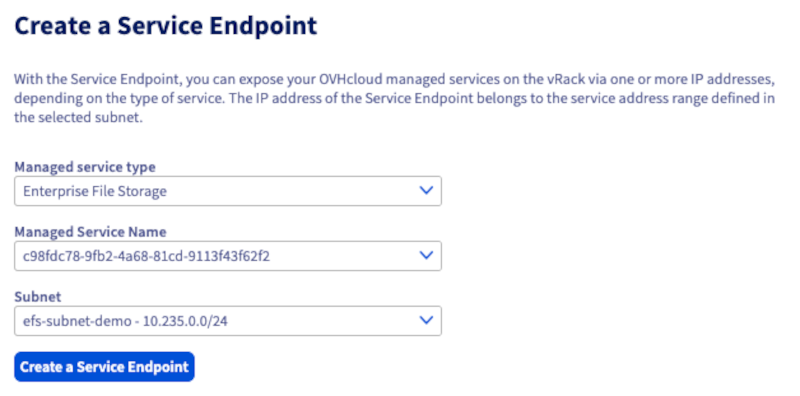
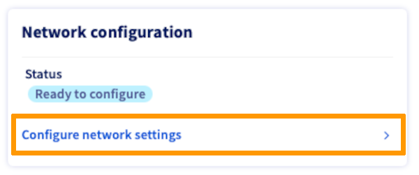

<style>
details>summary {
    color:rgb(33, 153, 232) !important;
    cursor: pointer;
}
details>summary::before {
    content:'\25B6';
    padding-right:1ch;
}
details[open]>summary::before {
    content:'\25BC';
}
</style>

## Objectif

Monter un volume NFS Enterprise File Storage (EFS) depuis une instance Public Cloud via le réseau privé vRack.

Cela garantit que tout le trafic de données reste sur le réseau privé, sans exposition à Internet.

> [!primary]
>
> Le volume EFS et l'instance Public Cloud doivent se trouver dans la même région (par exemple RBX, GRA ou SBG), car les réseaux privés OpenStack sont régionaux.
>

## Prérequis

- Un [service Enterprise File Storage](/links/storage/enterprise-file-storage) dans votre compte OVHcloud.
- Une [instance OVHcloud Public Cloud](/pages/public_cloud/compute/public-cloud-first-steps) dans la même région.
- Un [réseau privé vRack Private Network](/pages/public_cloud/public_cloud_network_services/getting-started-07-creating-vrack) actif dans la même région.
- Avoir accès à l'[espace client OVHcloud](/links/manager) ou à la [CLI Openstack](/pages/public_cloud/public_cloud_cross_functional/loading_openstack_environment_variables).

## Vue d'ensemble

Le diagramme ci-dessous illustre comment un volume Enterprise File Storage (EFS) se connecte à une instance Public Cloud via le réseau privé vRack.

{.thumbnail}

1. Correspondance critique — VLAN ID

    L’identifiant VLAN (par exemple : `1900`) doit être strictement identique à la fois dans le réseau privé du Cloud Public et dans la configuration des services vRack.

2. Correspondance critique — Sous-réseau (CIDR)

    Le CIDR du sous-réseau (par exemple : `10.235.0.0/24`) doit également correspondre entre les deux services afin qu’ils fonctionnent au sein du même réseau logique dans le vRack.

3. Information — Plage d’adresses de service

    La plage d’adresses de service (par exemple : `10.235.0.240/28`) est un sous-ensemble réservé du sous-réseau principal. Ces adresses IP sont exclusivement utilisées par les points de terminaison du service EFS (par exemple : `10.235.0.241`) et ne doivent pas être attribuées à des instances.

4. Sécurité — Règle ACL

    La liste de contrôle d’accès (ACL) du volume EFS doit autoriser explicitement l’adresse IP privée de toute instance nécessitant un accès (par exemple : `10.235.0.15`).

5. Concept — Services vRack

    Les services vRack agissent comme un pont réseau sécurisé, permettant à des services managés tels qu’EFS situés en dehors de votre projet Public Cloud de se connecter de manière transparente à votre réseau privé vRack.

## En pratique

### Étape 1 - Associer le projet Public Cloud au vRack

Avant de déployer votre volume Enterprise File Storage (EFS) via un réseau privé vRack, votre projet Public Cloud doit d'abord être associé à un vRack.

Cette association permet le réseau privé entre vos instances Public Cloud et les services gérés par OVHcloud tels que l'EFS.

Suivez la procédure décrite dans l'**étape 1 : activer et gérer un vRack** de notre guide « [Configuration du vRack Public Cloud](/pages/public_cloud/public_cloud_network_services/getting-started-07-creating-vrack) ».

### Étape 2 - Créer un réseau privé dans votre projet Public Cloud <a name="step2"></a>

Pour connecter votre instance Public Cloud à un volume EFS via vRack, provisionnez d'abord un réseau privé dédié dans votre projet.

Ce réseau isolé permet une communication sécurisée entre vos instances et les ressources de stockage OVHcloud via l'architecture vRack.

Suivez la procédure décrite dans l'**étape 2 : créer un réseau privé dans le vRack** de notre guide « [Configuration du vRack Public Cloud](/pages/public_cloud/public_cloud_network_services/getting-started-07-creating-vrack) ».

### Étape 3 — Démarrer l'instance sur le réseau privé

Déployez votre instance Public Cloud dans le réseau privé que vous avez créé. Assurez-vous qu'elle est connectée au bon sous-réseau pour permettre une communication sécurisée via le vRack.

Suivez la procédure décrite dans l'**étape 3 : intégrer une instance au vRack** de notre guide « [Configuration du vRack Public Cloud](/pages/public_cloud/public_cloud_network_services/getting-started-07-creating-vrack) ».

{.thumbnail}

Assurez-vous qu'une adresse IP est attribuée à l'instance dans le sous-réseau sélectionné (par exemple : `10.235.0.15`).

### Étape 4 - Créer une ressource de service vRack pour EFS

Il existe deux méthodes pour créer une ressource de service vRack pour votre volume EFS.

Ces deux méthodes atteignent le même objectif : connecter en toute sécurité votre service EFS à votre vRack et à vos instances Public Cloud.

/// details | Première méthode : création via vRack Services

Une ressource de service vRack agit comme un adaptateur réseau, reliant des services gérés comme l'EFS à votre vRack et à son sous-réseau privé.

Pour des instructions détaillées, consultez la documentation officielle d'OVHcloud : [vRack Services - Exposer un service managé sur votre vRack](/pages/network/vrack_services/global).

1. Dans l'[espace client OVHcloud](/links/manager), accédez à la section `Network`{.action}, puis cliquez sur `vRack Services`{.action}. 

2. Cliquez ensuite sur `Activer vRack Services`{.action}.

3. Sélectionnez la même région que celle de votre vRack, de votre instance Public Cloud et de votre service EFS. Cliquez ensuite sur `Activer vRack Services`{.action}. <span id="step4-a-region-selection"></span>

4. Sélectionnez `Non merci, j'ai déjà un vRack`{.action} et acceptez les conditions générales pour confirmer.

    {.thumbnail}

5. Localisez votre nouvelle ressource de service vRack dans la liste et cliquez sur son nom.

{.thumbnail}

6. Modifiez le service vRack avec la configuration suivante :

    - Private Network : Sélectionnez le même vRack que celui utilisé pour votre projet Public Cloud.

    {.thumbnail}

    - Créez un sous-réseau :

        {.thumbnail}

        > [!primary]
        > 
        > Assurez-vous que le CIDR correspond à votre réseau privé Public Cloud.
        >

        - Plage d'adresses du sous-réseau : par exemple, `10.235.0.0/24`.
        - Plage d'adresses du service : par exemple, `10.235.0.240/28`.
            - Sous-ensemble réservé du sous-réseau privé pour attribuer des adresses IP aux services EFS gérés dans le vRack.
        - VLAN : Utilisez le même numéro VLAN que celui de votre réseau privé Public Cloud (voir [Step 2](#step2)).
        - Cliquez sur `Créer un sous-réseau`{.action}.

    - Créez un Service Endpoint :

    {.thumbnail}

///

/// details | Seconde méthode : création via la section Enterprise File Storage

1. Dans l'[espace client OVHcloud](/links/manager), accédez à la section `Bare Metal Cloud`{.action}. Cliquez sur `Enterprise File Storage`{.action} dans la rubrique **Stockage et sauvegarde**, puis sélectionnez votre service EFS.

2. Dans l'encadré `Configuration du réseau`, cliquez sur `Configurer les paramètres réseaux`{.action}.

    {.thumbnail}

3. Sélectionnez votre vRack.

4. Si aucun service vRack n’a été créé, activez les services vRack et suivez la [première méthode : création via vRack Services](step4-a-region-selection) à partir du point 3.

5. Si vous avez déjà créé un service vRack, sélectionnez votre service dédié.

///

### Étape 5 — Connecter le volume EFS au vRack

Une fois les étapes précédentes accomplies avec succès, tous les volumes créés dans votre service EFS résideront automatiquement dans votre vRack et son sous-réseau dédié, les rendant immédiatement accessibles à vos instances Public Cloud.

### Étape 6 — Configurer le contrôle d'accès (ACL)

Dans l'onglet `Contrôle d'accès (ACL)`{.action} de votre volume EFS :

- Ajoutez les adresses IP ou plages CIDR autorisées à monter le volume :

    - Pour autoriser une instance unique, renseignez l'adresse IP de l'instance, par exemple : `10.235.0.15`.
    - Pour autoriser toutes les instances du sous-réseau, renseignez l'adresse du sous-réseau, par exemple : `10.235.0.0/24`.

- Définissez le niveau d'accès souhaité : **Lecture et écriture** ou **Lecture seule**.

> [!primary]
>
> **Recommandation :** Utilisez des adresses IP individuelles autant que possible pour renforcer la sécurité.
>

Après avoir appliqué les ACL, vérifiez la connectivité réseau depuis votre instance Public Cloud :

```bash
ping <IP-DE-VOTRE-SERVICE-EFS>
```

### Étape 7 — Monter le volume NFS

1. Installez le client NFS sur votre instance Public Cloud :

    ```bash
    sudo apt install -y nfs-common
    ```

2. Montez le volume EFS :

    ```bash
    sudo mkdir -p /mnt/efs
    sudo mount -t nfs -o vers=3,timeo=600,retrans=2 <IP-DE-VOTRE-SERVICE-EFS>:/share_<ID> /mnt/efs
    df -h /mnt/efs
    ```

### Étape 8 — Activer le montage automatique au démarrage (facultatif)

Pour garantir que votre volume EFS soit monté automatiquement au démarrage, ajoutez l'entrée suivante dans le fichier `/etc/fstab` :

```bash
<IP-DE-VOTRE-SERVICE-EFS>:/share_<ID> /mnt/efs nfs vers=3,timeo=600,retrans=2 0 0
```

Testez ensuite la configuration :

```bash
sudo umount /mnt/efs
sudo mount -a
```

Si aucune erreur ne se produit, le volume EFS sera désormais monté automatiquement au démarrage.

## Résultat attendu

- L'instance peut accéder au volume EFS via l'<IP-DE-VOTRE-SERVICE-EFS>.
- Toute la communication se déroule en privé au sein du vRack.
- Le montage NFS est entièrement fonctionnel et persistant après les redémarrages.

## Troubleshooting

| Symptôme                           | Cause probable                                                | Résolution                                                                                                                                                |
| ---------------------------------- | ------------------------------------------------------------- | --------------------------------------------------------------------------------------------------------------------------------------------------------- |
| mount.nfs: No route to host        | Instance et EFS pas dans la même région, ou VLAN ID incorrect. | Vérifiez que l'instance, l'EFS et les services vRack sont dans la même région. Recréez le service vRack en utilisant le même VLAN ID que le réseau privé. |
| mount.nfs: access denied by server | ACL EFS manquantes ou incorrectes.                             | Ajoutez l'IP de l'instance (par exemple : `10.235.0.x`) ou le sous-réseau (par exemple : `10.235.0.0/24`) avec le protocole NFSv3 et l'accès en Lecture/Écriture.                |
| mount command hangs indefinitely   | Version NFS incorrecte ou point de terminaison non réactif.    | Utilisez : `-o vers=3,timeo=600,retrans=2` pour forcer NFSv3 et définir des délais d'attente.                                                             |
| mount succeeds but no read/write   | ACL ou permissions POSIX trop restrictives.                    | Ajustez les ACL ou mettez à jour les permissions au niveau du volume.                                                                                     |
| mount works, but not after reboot  | Aucune entrée dans `/etc/fstab`.                               | Ajoutez : `<IP-DE-VOTRE-SERVICE-EFS>:/share_<ID> /mnt/efs nfs vers=3,timeo=600,retrans=2 0 0`.                                                             | 
| vRack Services shows “Inactive”    | Service non encore provisionné.                                | Attendez la fin du provisionnement, ou réattachez le service depuis l'onglet Réseau privé de l'EFS.                                                           |

## Aller plus loin

[Enterprise File Storage - Gestion depuis l'espace client OVHcloud](/pages/storage_and_backup/file_storage/enterprise_file_storage/netapp_control_panel)

[Enterprise File Storage - API Quickstart](/pages/storage_and_backup/file_storage/enterprise_file_storage/netapp_quick_start)

[Enterprise File Storage - Gestion des volumes](/pages/storage_and_backup/file_storage/enterprise_file_storage/netapp_volumes)

[Enterprise File Storage - Gestion des ACL de volume](/pages/storage_and_backup/file_storage/enterprise_file_storage/netapp_volume_acl)

[Enterprise File Storage - Gestion des snapshots de volumes](/pages/storage_and_backup/file_storage/enterprise_file_storage/netapp_volume_snapshots)

Si vous avez besoin d'une formation ou d'une assistance technique pour la mise en oeuvre de nos solutions, contactez votre commercial ou cliquez sur [ce lien](/links/professional-services) pour obtenir un devis et demander une analyse personnalisée de votre projet à nos experts de l’équipe Professional Services.

Échangez avec notre [communauté d'utilisateurs](/links/community).