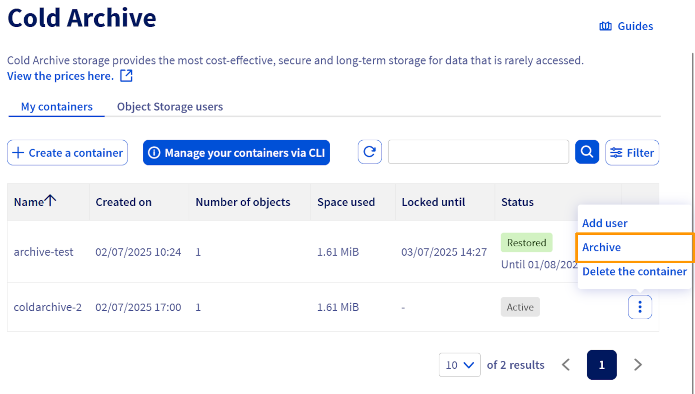
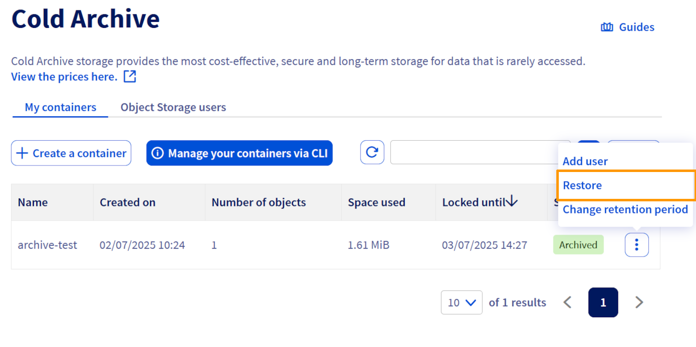
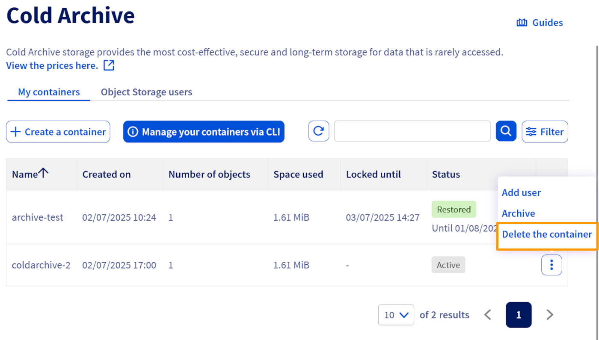
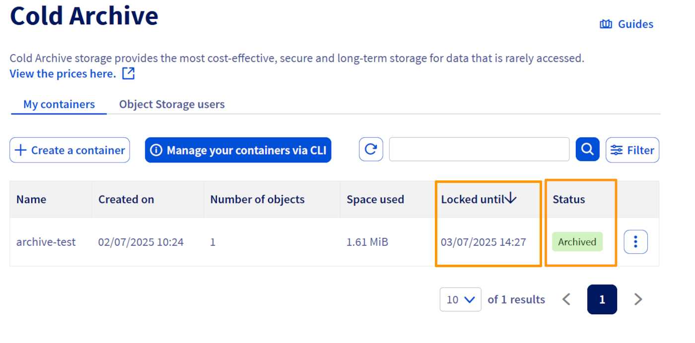

> [!warning]
>
> **This page is only for existing customers of the OVHcloud standalone bucket-granular Cold Archive introduced in 2023.**
>
> **You're looking for S3<sup>1</sup>-compatible archiving solutions?**
>
> OVHcloud Object Storage now offers individual objects archiving feature rather than archiving the entire container thanks to the addition of the **Cold Archive** class in the Object Storage lifecycle. Indeed, the feature is now directly available in your Object Storage dashboard, from your existing Object Storage containers:
>
> - Upload your objects in the Cold Archive class,
> - or use lifecycle transitions to move data to Cold Archive class.
>
> To learn more about this storage class, see our guide "[Choosing the right storage class for your needs](/pages/storage_and_backup/object_storage/s3_choosing_the_right_storage_class_for_your_needs)".
>
> Moreover, the standalone bucket-granular Cold Archive won't be available from the Control Panel for new customers, with no impact to existing customers. APIs will continue to work and data will of course remain secure and available at any moment: we only modify the way users will access and manage objects.

## Objective

Cold Archive provides long-term data storage by archiving bucket objects onto physical tapes.
Restoration may take some time since data is read from tapes.

**This guide explains how to set up and manage storage on tapes with Cold Archive, in coexistence with your Object Storage.**

## Requirements

- [Getting started with Object Storage](/pages/storage_and_backup/object_storage/s3_getting_started_with_object_storage#using-aws-cli)
- `awscli` version >= 1.16.62

## Instructions

> [!primary]
>
> You can find the Cold Archive storage presentation and workflow [here](/pages/storage_and_backup/object_storage/cold_archive_overview).
>

This section explains the step-by-step process to configure, archive, restore, and delete buckets with Cold Archive, in coexistence with your Object Storage.

In this tutorial, **awscli aliases** are used to simplify the commands.

### Initial Setup: create AWS CLI Aliases

To simplify commands, create or edit the `~/.aws/cli/alias` file:

```bash
mkdir -p ~/.aws/cli
touch ~/.aws/cli/alias
```

Add the following content:

```bash
[toplevel]

put-ovh-archive = s3api put-bucket-intelligent-tiering-configuration --id myid --intelligent-tiering-configuration '{"Id": "myid", "Status": "Enabled", "Tierings": [{"Days": 999,"AccessTier": "OVH_ARCHIVE"}]}' --bucket

put-ovh-restore = s3api put-bucket-intelligent-tiering-configuration --id myid --intelligent-tiering-configuration '{"Id": "myid", "Status": "Enabled", "Tierings": [{"Days": 999,"AccessTier": "OVH_RESTORE"}]}' --bucket

get-ovh-bucket-status = s3api get-bucket-intelligent-tiering-configuration --id myid --bucket

delete-ovh-archive = s3api delete-bucket-intelligent-tiering-configuration --id myid --bucket
```

> [!primary]
>
> - `Id` is a string used to identify the S3<sup>1</sup> Intelligent-Tiering configuration. Its value is arbitrary and up to you. It will be necessary for further PUT, GET and DELETE operations on the intelligent-tiering configuration.
>
> - `Status` and `Days` are mandatory but not used. `Days` is only meaningful with certain access tiers.
>

### Check for Incomplete Multipart Uploads Before Archiving

Run this command to ensure there are no incomplete multipart uploads on your bucket:

```bash
aws --endpoint-url https://s3.rbx-archive.io.cloud.ovh.net s3api list-multipart-uploads --bucket <bucket_name>
```

### Upload your objects

To add objects to the bucket you wish to archive, use the following command:

```bash
aws --endpoint-url https://s3.rbx-archive.io.cloud.ovh.net s3api put-object --bucket <bucket-name> --key <object-name> --body <object-name>
```

> [!primary]
>
> This operation is not currently available via the OVHcloud Control Panel. It must be performed on the command line via the S3 API.
>

### Archive a bucket

> [!primary]
>
> Before archiving a bucket, make sure there are no incomplete multipart uploads.
>

> [!tabs]
> Via the AWS S3 API
>> ```bash
>> aws --endpoint-url https://s3.rbx-archive.io.cloud.ovh.net put-ovh-archive <bucket_name>
>> ```
>>
> Via the OVHcloud Control Panel
>> Click the `⋮`{.action} button then select `Archive`{.action}
>>
>> {.thumbnail}
>>

- The bucket status changes to "Archiving".
- Objects cannot be read or written during this process; only listing is allowed.
- Archiving to tapes takes some time.

### Archive a bucket with retention lock (WORM Compliance)

By default, an archive is not locked i.e you can still delete an archive after it has been written to tapes. To ensure your archive follows the WORM (Write Once Read Many) model, you can set a retention period in your intelligent tiering configuration using the `OVH_ARCHIVE_LOCK` access tier and a number of days. The archive will be then locked until the current date + the number of days specified.

> [!primary]
>
> With the default `OVH_ARCHIVE` access tier, the `Days` attribute has no effect.
> Unlike the previous intelligent tiering configuration, by using the `OVH_ARCHIVE_LOCK` access tier, the `Days` attribute will be taken into account in calculating the lock duration and must be a positive integer.
>

```json
{
    "Id": "myid",
    "Status": "Enabled",
    "Tierings": [
        {"Days": <retention_in_days>, "AccessTier": "OVH_ARCHIVE_LOCK"}
    ]
}
```

> [!primary]
>
> You cannot have multiple intelligent tiering configurations on your archive.
> Similarly, you cannot have multiple access tiers in your intelligent tiering configuration i.e either you use the `OVH_ARCHIVE` access tier or you use the `OVH_ARCHIVE_LOCK` access tier but not both.
>

### Lock an already archived bucket

If you have buckets that have been previously archived without using the `OVH_ARCHIVE_LOCK` access tier, you can still lock them by re-applying an intelligent tiering configuration to your bucket using the `OVH_ARCHIVE_LOCK` access tier and specifying a retention duration in days.

> [!primary]
>
> In order to lock an already archived bucket, it must be in the "Archived" or "Restored" status.
> You must also use the same intelligent tiering configuration "Id".
>

If you want to edit the retention period, similarly, re-apply the intelligent tiering configuration using the same "Id".

> [!primary]
>
> You cannot reduce a previously set retention period i.e the new retention period (current date + number of days) must be higher than the previous retention period.
> Example:
>
> - On 2024-02-22 you have set up a 10 days lock, the retention period will be until the 2024-03-03. 
> - On 2024-02-23, you change your mind and decide to set the lock duration to 5 days. 
> - OVHcloud Cold Archive will return an error because 2024-02-23 + 5 days < 2024-03-03.
>

### Restore a bucket

> [!tabs]
> Via the AWS S3 API
>> Restore a bucket :
>>
>> ```bash
>> aws --endpoint-url https://s3.rbx-archive.io.cloud.ovh.net put-ovh-restore <bucket_name>
>> ```
>>
> Via the OVHcloud Control Panel
>> Click the `⋮`{.action} button then select `Restore`{.action}.
>>
>> {.thumbnail}
>>

- Bucket status changes to "Restoring".
- Once the restoration is complete, ojects become accessible in read-only mode for 30 days. After this period, a new restoration operation must be launched to access the archived objects.
- Objects in the archived bucket can still be listed at any time.

### Delete an archive

> [!primary]
>
> If the bucket is locked, deletion before the retention period expires will fail.
> `An error occurred (BadRequest) when calling the DeleteBucketIntelligentTieringConfiguration operation: Archive deletion is locked until 2124-01-19T15:24:56.000Z`
>

### Delete an intelligent-tiering configuration and objects of a bucket

> [!tabs]
> Via the AWS S3 API
>>
>> ```bash
>> aws --endpoint-url https://s3.rbx-archive.io.cloud.ovh.net delete-ovh-archive <bucket_name>
>> ```
>>
> Via the OVHcloud Control Panel
>> Click on the `⋮`{.action}, then select `Delete`{.action}.
>>
>> {.thumbnail}
>>

After this request, the objects of the bucket are not deleted yet as the deletion is done asynchronously.<br>
The operation will delete everything (on tapes and all objects if restored) and the bucket status will be in a "Deleting" status.<br>

> [!primary]
>
> Although data deletion is done asynchronously, billing is stopped as soon as you submit the request!<br>
> Deletion is done on a best effort basis and there is no committed duration.<br>
> In the "Deleting" status, the bucket is locked and cannot be accessed.<br>
>

Once the deletion is completed:

- The bucket status will be "Flushed".
- In this state, the bucket still exists (but is empty and does not contain any objects) and data has been removed from the tapes.
- The bucket can be released and you can remove your bucket:

```bash
aws s3 rb s3://<bucket_name>
```

### Check the bucket status and retention tags

> [!tabs]
> Via the AWS S3 API
>> Once an intelligent-tiering configuration has been pushed (via a `put-bucket-intelligent-tiering-configuration` operation) and until it is removed (via a `delete-bucket-intelligent-tiering-configuration` operation), the status of a bucket is readable through:
>>
>> ```bash
>> aws --endpoint-url https://s3.rbx-archive.io.cloud.ovh.net >> s3api get-bucket-tagging --bucket <bucket_name>
>> ```
>>
>> If you have locked your archive, you can check the retention period using the `get-bucket-tagging command`.
>>
>> - Example:
>>
>> ```bash
>> aws --endpoint-url https://s3.rbx-archive.io.cloud.ovh.net s3api get-bucket-tagging --bucket <bucket_name>
>>
>> {
>>     "TagSet": [
>>         {
>>             "Key": "ovh:intelligent_tiering_status",
>>             "Value": "Archived"
>>         },
>>         {
>>             "Key": "ovh:intelligent_tiering_archive_lock_until",
>>             "Value": "2124-01-19T15:24:56.000Z"
>>         }
>>     ]
>> } 
>> ```
>>
> Via the OVHcloud Control Panel
>> You can check the status of your bucket by looking at the value in the `Status` column, as well as its retention period in the `Locked until` column.
>>
>> {.thumbnail}
>>


#### List of bucket statuses

| Status      | Description                                                                      | Objects permissions    |
|-------------|----------------------------------------------------------------------------------|------------------------|
| `None`      | No Intelligent-Tiering configuration pushed on the bucket yet.                   | All                    |
| `Archiving` | Archiving in progress on tapes.                                                  | Listing                |
| `Archived`  | Objects archived on tapes only.                                                  | Listing                |
| `Restoring` | Restoration in progress from tapes.                                              | Listing                |
| `Restored`  | Objects restored and accessible.                                                 | Read-only + Listing    |
| `Deleting`  | Objects deletion from tapes (and disks if restored) in progress.                 | Listing                |
| `Flushed`   | Bucket is empty and can safely be removed.                                       | Listing (empty bucket) |

### Advanced Verification: Inspect Intelligent Tiering Configuration

To retrieve the full intelligent-tiering configuration JSON applied to your bucket:

```bash
aws s3api get-bucket-intelligent-tiering-configuration --bucket <bucket_name> --id myid
```

This command returns detailed configuration info which can be useful for debugging or verification.

## Go further

Check out our dedicated Discord channel: <https://discord.gg/ovhcloud>. Ask questions, share feedback, and interact directly with the team behind our storage and backup services.

If you need training or technical assistance to implement our solutions, contact your sales representative or click on [this link](/links/professional-services) to get a quote and ask our Professional Services experts for assisting you on your specific use case of your project.

Join our [community of users](/links/community).

<sup>1</sup>: S3 is a trademark of Amazon Technologies, Inc. OVHcloud’s service is not sponsored by, endorsed by, or otherwise affiliated with Amazon Technologies, Inc.
