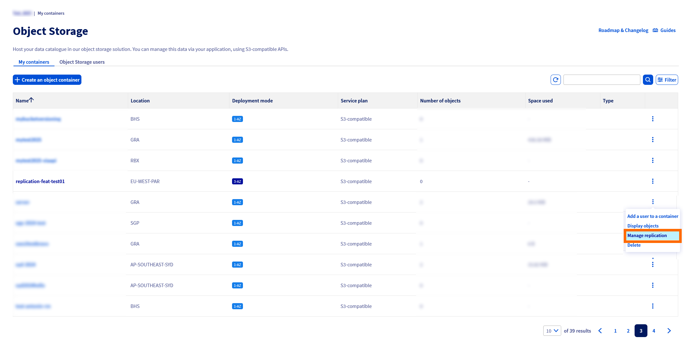
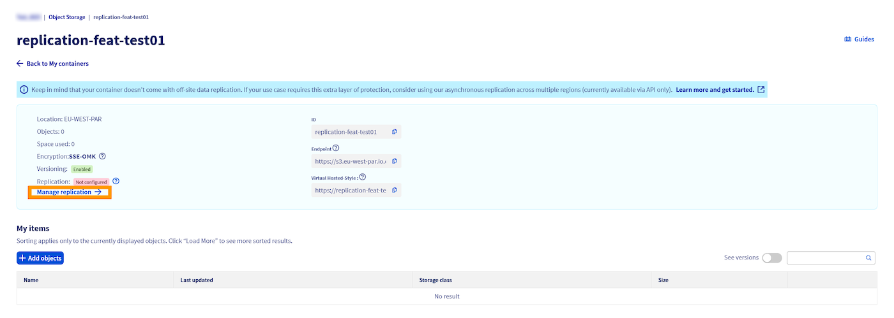
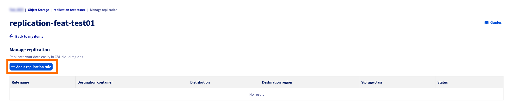
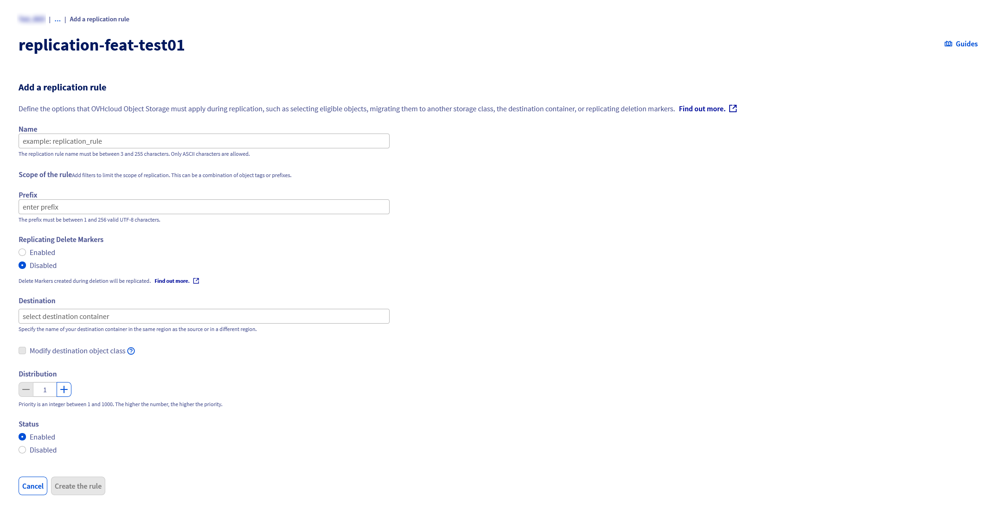
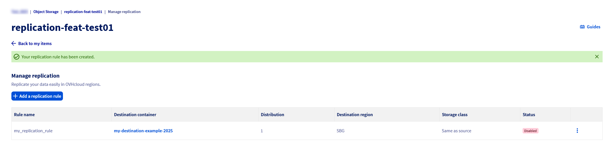
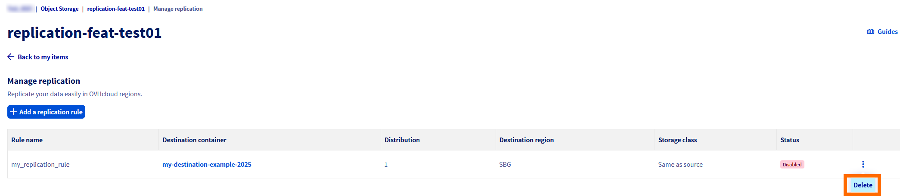
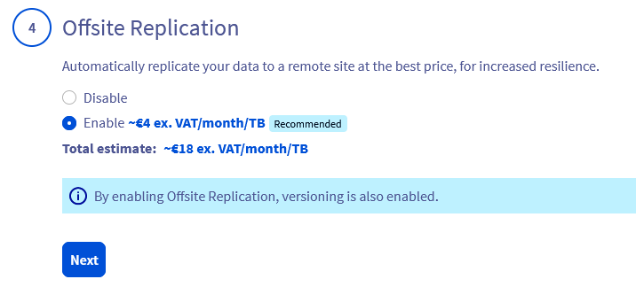

## Introduction

Object replication is a powerful feature that facilitates the automatic and asynchronous replication of objects within a source bucket to one or several destination buckets. This capability is crucial for maintaining data consistency, availability, and redundancy across different storage locations.

Destination buckets can reside within a single region or be dispersed across multiple regions, tailored to your specific requirements. This flexibility allows for strategic data placement and management across global infrastructure networks.

## Objectives

This guide aims to equip you with the knowledge and skills to:

- **Set up object replication**: Learn to configure object replication across buckets for automated data duplication from a source to one or more destinations.
- **Enhance data availability**: Understand how object replication improves data resilience by creating copies in different regions or storage zones.
- **Achieve compliance**: Explore how replication aids in meeting regulatory requirements for data geo-redundancy and backup.
- **Reduce storage costs**: Discover strategies to lower storage expenses by replicating data to more cost-effective storage classes.
- **Facilitate data sharing**: See how object replication streamlines data sharing and synchronization across teams, boosting operational efficiency.

## Requirements

- **Cloud storage account**: An active account with access to cloud storage services that support object replication.
- **Buckets configured**: At least two buckets set up within your cloud storage account, designated as the source and destination.
- **Data backup**: A recent backup of your data, particularly important if setting up replication for existing data to avoid accidental loss.
- **Understanding of storage classes**: Familiarity with the various storage classes offered by your cloud service, along with their cost and performance implications.
- **Familiarity with cloud storage policies**: Knowledge of the policies and permissions necessary for performing object replication.
- **CLI tools or management console access**: The ability to use your cloud provider's command line interface (CLI) tools or management console to set up and manage replication rules.
- **Versioning enabled**: Versioning must be activated on your buckets if required by your cloud service for object replication.
- **Object Storage User**: An Object Storage user account already created within your project.
- **AWS CLI configuration**: The AWS CLI installed and configured on your system. For a guide on configuring the CLI, refer to the OVHcloud documentation on ["Getting started with Object Storage"](/pages/storage_and_backup/object_storage/s3_getting_started_with_object_storage).

## Instructions

### Key use cases for object replication

- **Exact object copies with metadata replication**: Replication is not just about duplicating the object; it includes the replication of all associated metadata (e.g. object creation time, version ID, etc.). This ensures that the replicas are true copies of the source objects, maintaining integrity and consistency for critical applications.

- **Data synchronization across teams**: This facilitates seamless synchronization of data across various teams, enhancing collaboration and data sharing based on predefined access controls and policies. It is crucial to note that while data synchronization is a significant advantage, storage options and configurations must be carefully managed to ensure they meet the specific needs of each team in terms of access and security.

- **Cost-effective data storage management**: Organizations need to explore alternative strategies to optimize their backup and storage costs, considering the current limitations related to data replication. At present, it is important to highlight that data replication occurs only within the same storage class. If the source is in a HIGH-PERFORMANCE storage class, all replicated objects will also be in HIGH-PERFORMANCE. Nevertheless, organizations can still optimize their storage management by carefully assessing their needs and selecting the most suitable storage class from the outset to balance cost and performance without compromising data availability or durability.

- **Enhanced data resiliency across regions**: Enhance your data protection strategies by replicating critical data across multiple geographical regions. This increases resiliency against data loss and ensures business continuity in the face of regional disruptions.

- **Reduced latency for global access**: Positioning your data closer to your end users minimizes access latency and improves the overall user experience. Replication allows for strategic data placement in OVHcloud regions nearest to your customer base.

- **Efficiency boost for computational workloads**: By bringing your data closer to your OVHcloud compute resources, replication enhances the efficiency and performance of your workloads, facilitating faster data processing and analysis.

- **Compliance and regulatory fulfillment**: Many compliance frameworks mandate that data be stored at a considerable distance from the primary location or require multiple copies of critical data. Object replication simplifies the process of meeting these requirements by enabling automatic replication across vast distances and into multiple storage mediums.

Implementing object replication ensures not only the safety and availability of your data but also enhances operational efficiency and compliance posture.

### What is asynchronous replication?

#### Basic concepts

At its core, the asynchronous replication is designed to facilitate several key operations in the management and safeguarding of your data. This includes the following actions:

- **Exact replica creation**

{.thumbnail}

- **Replicate data within the same region**

{.thumbnail}

- **Replicate data to a different region**
  
{.thumbnail}

- **Replicate data to two different regions**

{.thumbnail}


### What is replicated and what is not

The following table provides the **default** behavior of the OVHcloud Object Storage Asynchronous Replication feature:

| What is replicated                                           | What is not replicated                                       |
|--------------------------------------------------------------|--------------------------------------------------------------|
| - Objects created *after* the upload of the replication configuration<br> - Unencrypted objects and objects encrypted with SSE-OMK (OVHcloud managed keys)<br> - Objects in the source bucket for which the bucket owner has permissions to read and access ACLs<br> - Object metadata from the source objects to the replicas<br> - Object Lock retention configuration<br> - Object ACL updates<br> - Object tags <br><br><br><br>| - Objects created *before* the upload of the replication configuration<br> - Objects that have already been replicated to a previous destination<br> - Object replicas i.e. objects that are the result of a previous replication operation<br> - Objects encrypted with SSE-C (customer provided keys)<br> - Bucket configurations i.e. lifecycle configuration, CORS configuration, bucket ACLs, etc.<br> - Actions resulting from Lifecycle Configuration actions<br> - Delete marker i.e. objects deleted in the source bucket are not automatically deleted by default in the destination bucket<br> - Objects that are stored in the Cold Archive temporary storage<br> - Replication to a bucket in a different Public Cloud Project i.e. source and destination buckets must be in the same project |


### Replication configuration

A replication configuration is defined through a set of rules within a JSON file. This file is uploaded and applied to the source bucket, detailing how objects are to be replicated.

### Each replication rule defines:

- A **unique rule ID** to identify the rule.
- **Rule priority** to determine the order of execution when multiple rules exist.
- **Destination bucket** where the replicated objects will be stored.
- **Objects to be replicated**: By default, all objects are eligible for replication. However, you can specify a subset of objects by filtering them with a prefix and/or tags.

### Replication rule structure

The basic structure of a replication rule within the configuration JSON file is as follows:

```json
{
  "Role": "arn:aws:iam::<your_project_id>:role/s3-replication",
  "Rules": [
    {
      "ID": "string",
      "Priority": integer,
      "Filter": {
        "Prefix": "string",
        "Tag": {
          "Key": "string",
          "Value": "string"
        },
        "And": {
          "Prefix": "string",
          "Tags": [
            {
              "Key": "string",
              "Value": "string"
            }
          ]
        }
      },
      "Status": "Enabled"|"Disabled",
      "Destination": {
        "Bucket": "arn:aws:s3:::<your_bucket_name>",
        "StorageClass": "STANDARD"|"STANDARD_IA"|"EXPRESS_ONEZONE"
      },
      "DeleteMarkerReplication": {
        "Status": "Enabled"|"Disabled"
      }
    }
  ]
}
```

| Attribute               | Description                                                                                                             | Required |
|-------------------------|-------------------------------------------------------------------------------------------------------------------------|----------|
| Tag                     | Filter the objects by tag key and/or value.                                                                              | No       |
| Status                  | Tells if your replication rule is *Enabled* or *Disabled*.                                                                  | Yes      |
| Role                    | OVHcloud IAM role needed to allow OVHcloud Object Storage to access data from the source bucket & write data to destination buckets. Currently, OVHcloud has set a unique role "s3-replication". | Yes      |
| Priority                | If there are two or more rules with the same destination bucket, objects will be replicated according to the rule with the highest priority. The higher the number, the higher the priority. | Yes      |
| Prefix                  | An object key name prefix that identifies the object or objects to which the rule applies. To include all objects in a bucket, specify an empty strin.g | No       |
| ID                      | Each replication rule has a unique ID.                                                                                   | Yes      |
| Filter                  | A filter that identifies the subset of objects to which the replication rule applies. To replicate all objects in the bucket, specify an empty object. | Yes      |
| Destination             | A container for information about the replication destination and its configurations.                                    | Yes      |
| DeleteMarkerReplication | Tells if delete operations should be replicated.                                                                         | Yes      |
| Bucket                  | The destination bucket (to replicate to multiple destinations, you must create multiple replication rules).              | Yes      |
| StorageClass | The destination storage class. By default, OVHcloud Object Storage uses the storage class of the source object to create the object replica.<br><br> Please note that **not all storage classes are available in all regions** i.e some storage classes are not supported in some regions such as EXPRESS_ONEZONE which is not supported in 3AZ regions. To learn more about the available storage classes in each region check [our documentation](/pages/storage_and_backup/object_storage/s3_location). | Yes |
| And                     | You can apply multiple selection criteria in the filter.                                                                 | No       |

### Delete marker replication

> [!warning]
> **IMPORTANT**
> 
> If you specify a `Filter` in your replication configuration, you **must** also include a `DeleteMarkerReplication` element. If your `Filter` includes a `Tag` element, the `DeleteMarkerReplication` Status **must be set to _Disabled_**.
>

### Understanding delete markers

When a delete object operation is performed on an object in a versioning-enabled bucket, it does not delete the object permanently but it creates a delete marker on the object. This delete marker becomes the latest and current version of the object with a new version ID.

A delete marker has the following properties:

- A key and version ID like any other object.
- It does not have data associated with it, thus it does not retrieve anything from a `GET` request (you get a 404 error).
- By default, it is not displayed in the Control Panel UI anymore.
- The only operation you can use on a delete marker is `DELETE`, and only the bucket owner can issue such a request.

To permanently delete an object, you have to specify the version ID in your `DELETE` object request.

> [!warning]
> By default, OVHcloud Object Storage does not replicate delete markers nor replicate the permanent deletion to destination buckets. This behavior protects your data from unauthorized or unintentional deletions.

However, you can still replicate delete markers by adding the `DeleteMarkerReplication` element to your replication configuration rule. `DeleteMarkerReplication` specifies if delete markers should or should not be replicated (when versioning is enabled, a delete operation is performed on an object it does not actually delete the object but it flags it with a delete marker).

```json
{
  "Role": "arn:aws:iam::<your_project_id>:role/s3-replication",
  "Rules": [
    {
      ...
      "DeleteMarkerReplication": {
        "Status": "Enabled"|"Disabled"
      }
    }
  ]
}
```

### Checking the replication status

The replication status can be used to determine the status of an object that is being replicated. To get the replication status of an object, you can use the `head-object` command via the AWS CLI:

```bash
$ aws s3api head-object --bucket <source_bucket> --key <object_name>
{
   "LastMoodified" : "Fri, 15 Mar 2024 10:18:15 GMT",
   "ContentLength": 3481,
   "Etag": "\"417947d3634d4645e05ca9e875f5b202\"",
   "VersionId": "17104978950.04081",
   "ContentType": "binary/octet-stream",
   "Metadata": { },
   "StorageClass": "STANDARD",
   "ReplicationStatus": "COMPLETED"
}
```

> [!warning]
> The replication status only applies to objects that are eligible for replication.

The `ReplicationStatus` attribute can have the following values:

| Source object                                          | Replica Object                                      |
|--------------------------------------------------------------|--------------------------------------------------------------|
| COMPLETED | REPLICA |
| FAILED | n/a as the replica does not exist |
| PENDING | n/a as the replica does not exist yet|

> [!warning]
> When you replicate objects to multiple destination buckets, the value of `ReplicationStatus` is "*COMPLETED*" only when the source object has been successfully replicated to all the destination buckets, otherwise, the attribute remains at the "*PENDING*" value.
> 
> If one or more destination fail replication, the value of the attribute becomes "*FAILED*".

### Replication between buckets with object lock enabled

Object Lock can be used with replication to enable automatic copying of locked objects across buckets. For replicated objects, the object lock configuration of the source bucket will be used in the destination bucket. However, if you upload an object directly to the destination bucket (outside of the replication process), it will use the lock configuration of the destination bucket.

> [!warning]
> To replicate data in buckets with object lock on, you must have the following prerequisites:
>
> - Versioning must be enabled on both source and destination buckets.
> - Object Lock must be enabled on both source and destination buckets.
>

#### Example of replication configuration

Simple replication between 2 buckets:

```json
{
  "Role": "arn:aws:iam::<your_project_id>:role/s3-replication",
  "Rules": [
    {
      "ID": "ruleId",
      "Status": "Enabled",
      "Priority": 1,
      "Filter": { },
      "DeleteMarkerReplication": { "Status": "Disabled" },
      "Destination": {
        "Bucket": "arn:aws:s3:::destination-bucket"
      }
    }
  ]
}
```

This configuration will replicate all objects (indicated by the empty `Filter` field) to the bucket `destination-bucket`.

#### Replication of delete markers

```json
{
  "Role": "arn:aws:iam::<your_project_id>:role/s3-replication",
  "Rules": [
    {
      "ID": "ruleId",
      "Status": "Enabled",
      "Priority": 1,
      "Filter" : {
        "Prefix": "backup"
      },
      "Destination": {
        "Bucket": "arn:aws:s3:::destination-bucket"
      },
      "DeleteMarkerReplication": { "Status": "Enabled" },
    }
  ]
}
```

This configuration will replicate all objects that have the prefix "backup" to the bucket `destination-bucket`. Additionally, we indicate that deletion operations in the source bucket should be also replicated.

#### Replicating source to multiple regions

```json
{
  "Role": "arn:aws:iam::<your_project_id>:role/s3-replication",
  "Rules": [
    {
      "ID": "rule1",
      "Status": "Enabled",
      "Priority": 1,
      "Filter": { }
      "Destination": {
        "Bucket": "arn:aws:s3:::region1-destination-bucket"
      },
  "DeleteMarkerReplication": {
    "Status": "Disabled"
  }
    },
    {
      "ID": "rule2",
      "Status": "Enabled",
      "Priority": 2,
      "Filter": { }
      "Destination": {
        "Bucket": "arn:aws:s3:::region2-destination-bucket"
      },
    "DeleteMarkerReplication": {
    "Status": "Disabled"
    }
    }
  ]
}
```

Suppose the source bucket, `region1-destination-bucket` and `region2-destination-bucket` are 3 buckets in 3 OVHcloud regions, this configuration will allow you to back up all objects in the source bucket to 2 different regions.

#### Replicating 2 subsets of objects to different destination buckets

```json
{
  "Role": "arn:aws:iam::<your_project_id>:role/s3-replication",
  "Rules": [
    {
      "ID": "rule1",
      "Status": "Enabled",
      "Priority": 1,
      "Filter" : {
        "Prefix": "dev"
      },
      "Destination": {
        "Bucket": "arn:aws:s3:::destination-bucket1"
      },
      "DeleteMarkerReplication": { "Status": "Enabled" },
    },
    {
      "ID": "rule2",
      "Status": "Enabled",
      "Priority": 2,
      "Filter" : {
        "Prefix": "prod"
      },
      "Destination": {
        "Bucket": "arn:aws:s3:::destination-bucket2"
      },
      "DeleteMarkerReplication": { "Status": "Disabled" }
    }
  ]
}
```

**This configuration contains 2 replication rules**:

- `rule1` will replicate all objects with prefix "dev" to bucket `destination-bucket1` and additionally, will replicate also deletion operations.
- `rule2` will replicate all objects with prefix "prod" to bucket `destination-bucket2` without replicating deletion operations.


> [!warning]
> Versioning must be activated in source bucket and destination bucket(s).

### Using the CLI

#### Create source and destination buckets

The source bucket is the bucket whose objects are automatically replicated and the destination bucket is the bucket which will contain your object replicas.

```bash
$ aws s3 mb s3://<bucket_name>

```

**_Example:_** Creation of a source bucket and a destination bucket

```bash
$ aws s3 mb s3://my-source-bucket
$ aws s3 mb s3://my-destination-bucket
```

#### Activate versioning in source and destination bucket

```bash
$ aws s3api put-bucket-versioning --bucket <bucket_name> --versioning-configuration Status=Enabled
```

**_Example:_** Activation of versioning in previously created source and destination buckets

```bash
$ aws s3api put-bucket-versioning --bucket my-source-bucket --versioning-configuration Status=Enabled
$ aws s3api put-bucket-versioning --bucket my-destination-bucket --versioning-configuration Status=Enabled
```

#### Apply replication configuration

Using the AWS CLI, replication configuration is applied on the source bucket.

```bash
$ aws s3api put-bucket-replication --bucket <source> --replication-configuration file://<conf.json>
```

**_Example:_**: Replicate all objects with prefix "docs" having a tag "importance" with value "high" to `my-destination-bucket` and replicate the delete markers i.e objects marked as deleted in source will be marked as deleted in destination.

```bash
{
   "Role": "arn:aws:iam::<your_project_id>:role/s3-replication",
   "Rules": [
    {
      "ID": "replication-rule-456",
      "Status": "Enabled",
      "Priority": 1,
      "Filter": {
        "And": {
          "Prefix": "docs",
          "Tags": [
            {
              "Key": "importance",
              "Value": "high"
            }
          ]
        }
      },
      "Destination": {
        "Bucket": "arn:aws:s3:::my-destination-bucket"
      },
      "DeleteMarkerReplication": {
        "Status": "Enabled"
      }
    }
  ]

}
```

### Using the OVHcloud Control Panel

#### Prerequisites

- A source and a destination bucket
- Versioning **must** be activated on source **and** destination bucket

#### Apply replication configuration

Find your source bucket in the bucket listing.

Either open the menu and click on `Manage replication`{.action}.

{.thumbnail}

Or click directly on your bucket and click on `Manage replication`{.action}.

{.thumbnail}

Choose `Add a replication rule`{.action}.

{.thumbnail}

Specify a name for your rule to help identify it later. The name is required and must be unique within the bucket.

{.thumbnail}

You can specify a prefix and/or tags to limit the scope of the objects to be replicated.

> [!warning]
> As a reminder, you cannot replicate delete markers if you are using tags to filter your objects.

Under **Destination**, select a destination bucket. The selected bucket must have versioning enabled and if object lock has been enabled on the source bucket then it also must be enabled on the destination bucket.

- By default, the objects will be replicated with the same storage class. However, you can choose to replicate the objects to another storage class.
- If there are two or more rules with the same destination bucket, objects will be replicated according to the rule with the highest priority. The higher the number, the higher the priority.

Under **Status**, `Enabled` is selected by default. An enabled rule starts to work as soon as you save it. If you want to disable the rule at creation and activate it later, choose `Disabled`.

To finish, click on `Create the rule`{.action}.

{.thumbnail}

#### Delete a replication rule

In the Replication rules management view, you can delete a rule from the menu.

{.thumbnail}

### Offsite Replication option in 3-AZ regions

With Object Storage in a 3-AZ region, we have introduced a new option called **Offsite Replication**, which simplifies the replication process and automatically replicates your data to a remote site for greater resiliency with a one-click action in the OVHcloud Control Panel. 
This feature is only available for primary Object Storage in a 3-AZ region (to know more about existing 1-AZ and 3-AZ regions, see [Endpoints and Object Storage geoavailability](/pages/storage_and_backup/object_storage/s3_location)) and is based on an OVHcloud auto-generated and managed replication rule configuration:

- Data is replicated on a remote 1-AZ region. The system will automatically determine the most suitable location among Strasbourg, Gravelines, and Roubaix, ensuring efficient and reliable offsite data protection.
- Objects stored in the replica bucket are stored in an **Infrequent Access** class and are billed differently. View pricing on [this page](/links/public-cloud/prices). This class is designed for less frequently accessed data and allow you to reduce your overall Object Storage bill together with Standard-class performance level. This said, if the destination bucket storage class doesn’t suit your needs, you can choose another approach and use the asynchronous replication feature and manage the replication rule configuration by yourself. 
- The replica bucket and the replication rule configuration are then available for modification if needed.

### Offsite Replication Q&A

#### How can I access the option in the OVHcloud Control Panel?

When creating a new bucket/container in a **3-AZ region**, you will be asked if you want to activave or not the Offsite Replication option. If enabled, and because it relies on the asynchronous replication feature, the versioning will be automatically enabled too.

{.thumbnail}

#### What are the differences between the asynchronous replication feature and the Offsite Replication feature available in 3-AZ regions?

The Offsite Replication option offered in 3-AZ regions is based on the asynchronous replication feature. With this Offsite Replication option, OVHcloud automatically generates a replication rule configuration with pre-filled parameters, whereas the S3-compatible asynchronous replication functionality allows the user to take control of the entire function (configuration and deployment).

#### What if a replica bucket is deleted?

The source objects that are to be replicated will have a replication status `FAILED` when Object Storage tries to replicate them but you will not get any errors.

#### What about the initial replication rule?

The initial rule will remain unchanged and active until you modify or disable it.

#### What if a source bucket with offsite replication enabled is deleted? And what about the initial replication rule?

Your replica bucket still exists but no more objects are replicated to it from your original source bucket. The initial replication rule is set up on the source bucket and thus will also be deleted.

#### Where will be stored the replicated data as the replication rule configuration is managed by OVHcloud?

Your replicated data is stored as any other data and will be stored in a bucket automatically generated by OVHcloud in a region of our choosing. The system will automatically determine the most suitable location between Strasbourg, Gravelines, and Roubaix, ensuring efficient and reliable offsite data protection.

#### Can I modify the replication rule configuration?

We recommend that you do not modify the auto-generated replication rule configuration to ensure optimal operation. However, as it is a standard asynchronous replication rule configuration, you can decide to enrich/upgrade it for advanced protection by following the steps highlighted in the sections above.

#### What is the name of the replica bucket?

The destination bucket name follows the pattern `backup-{src-region}-{dst-region}-{timestamp_in_ms}-{src-bucket}`.

#### How can I access my backed up data and which actions are possible with the replica bucket?

You can list/head/delete objects on this replica bucket. Data stored on the replica bucket are using the Infrequent Access storage class to help you optimizing your storage costs. As it is used for data protection reasons and supposed to be rarely accessed, this storage class is adapted and designed for such use cases. The replica bucket is exclusively dedicated to the Offiste Replication option. You can also read those objects, however a retrieval fee is applied for the Infrequent Access target storage class. View pricing on [this page](/links/public-cloud/prices).

#### Which users/credentials can be used to access the destination bucket?

When you activate the Offsite Replication during the source bucket creation, the same user that you associated with your source bucket will be associated with the replica bucket.

#### How will my backup data be billed?

You can access the details of the Offiste Replication pricing on the global Object Storage [pricing page](/links/public-cloud/prices). It is billed according to the storage space used, with a granularity of 1 GiB. To ensure readability, the price is displayed per GiB/month, but the billing granularity is per GiB/hour.

## Go further

If you need training or technical assistance to implement our solutions, contact your sales representative or click on [this link](/links/professional-services) to get a quote and ask our Professional Services experts for a custom analysis of your project.

Join our [community of users](/links/community).
