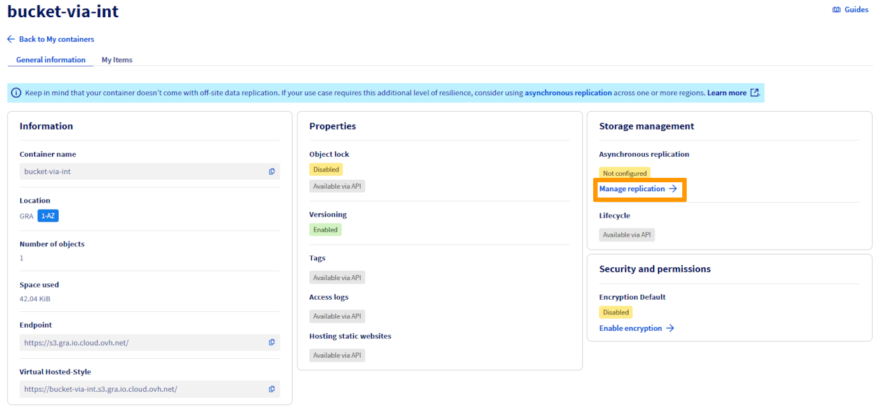
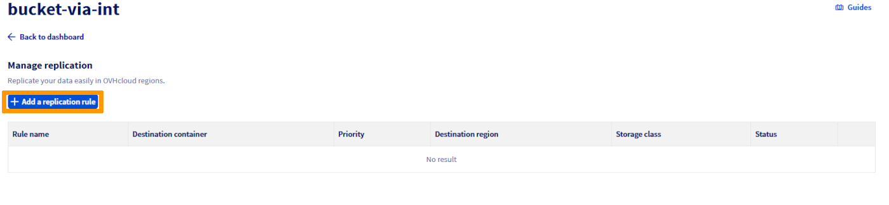
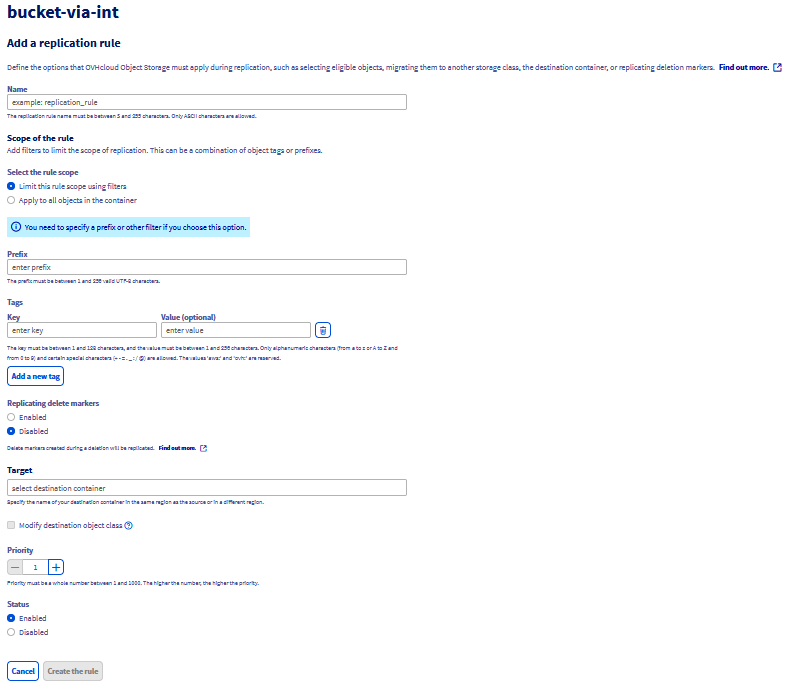
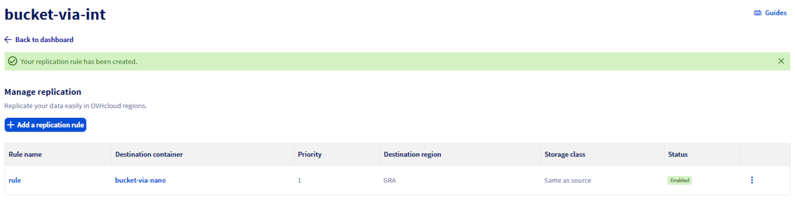
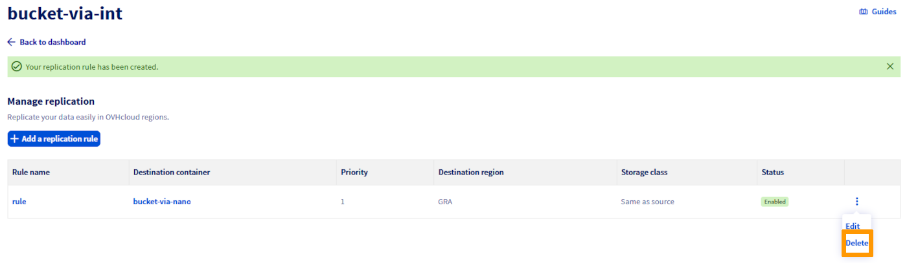
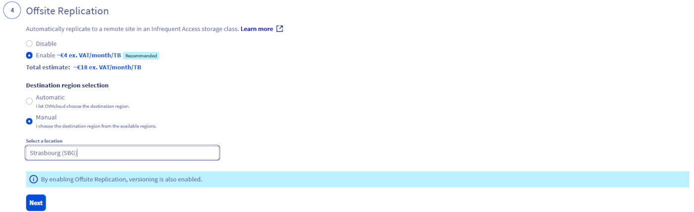

## Introduction

La réplication d'objets est une fonctionnalité puissante qui facilite la réplication automatique et asynchrone d'objets au sein d'un bucket source vers un ou plusieurs buckets de destination. Cette fonctionnalité est essentielle pour maintenir la cohérence, la disponibilité et la redondance des données sur différents emplacements de stockage.

Les buckets de destination peuvent résider dans une seule région ou être répartis sur plusieurs régions, en fonction de vos besoins spécifiques. Cette flexibilité permet le placement et la gestion stratégiques des données sur les réseaux d'infrastructure mondiaux.

## Objectifs

Ce guide vise à vous doter des connaissances et des compétences pour :

- **Configurer la réplication d'objets** : apprenez à configurer la réplication d'objets entre des buckets pour la duplication automatisée des données d'une source vers une ou plusieurs destinations.
- **Améliorer la disponibilité des données** : comprendre comment la réplication d'objets améliore la résilience des données en créant des copies dans différentes régions ou zones de stockage.
- **Mise en conformité** : découvrez comment la réplication contribue au respect des exigences réglementaires en matière de géo-redondance et de sauvegarde des données.
- **Réduire les coûts de stockage** : découvrez des stratégies pour réduire les dépenses de stockage en répliquant les données vers des classes de stockage plus rentables.
- **Faciliter le partage des données** : découvrez comment la réplication d'objets rationalise le partage et la synchronisation des données entre les équipes, améliorant ainsi l'efficacité opérationnelle.

## Prérequis

- **Compte de stockage cloud** : un compte actif ayant accès à des services de stockage cloud prenant en charge la réplication d'objets.
- **Buckets configurés** : au moins deux buckets configurés au sein de votre compte de stockage cloud, désignés comme source et destination.
- **Sauvegarde de données** : sauvegarde récente de vos données, particulièrement importante si vous configurez une réplication pour des données existantes afin d'éviter une perte accidentelle.
- **Compréhension des classes de stockage** : connaissance des différentes classes de stockage proposées par votre service cloud, ainsi que de leurs implications en termes de coût et de performance.
- **Familiarité avec les politiques de stockage cloud** : connaissance des politiques et des permissions nécessaires pour effectuer la réplication d'objets.
- **Accès aux outils CLI ou à la console de gestion** : possibilité d'utiliser les outils d'interface de ligne de commande (CLI) ou la console de gestion de votre fournisseur de cloud pour configurer et gérer les règles de réplication.
- **Versioning activé** : le versioning doit être activé sur vos buckets si votre service cloud l'exige pour la réplication d'objets.
- **Utilisateur Object Storage** : un compte utilisateur Object Storage déjà créé au sein de votre projet.
- **Configuration AWS CLI** : AWS CLI installé et configuré sur votre système. Pour obtenir un guide sur la configuration du CLI, reportez-vous à la documentation OVHcloud « [Premiers pas avec Object Storage](/pages/storage_and_backup/object_storage/s3_getting_started_with_object_storage).

## En pratique

### Cas d’utilisation clés pour la réplication d’objets

- *Copies d'objets exactes avec réplication des métadonnées** : la réplication ne consiste pas seulement à dupliquer l’objet, elle inclut la réplication de toutes les métadonnées associées (ex : heure de création de l’objet, ID de version, etc.). Cela garantit que les copies sont des copies conformes des objets sources, tout en préservant l’intégrité et la cohérence des applications critiques.

- **Synchronisation des données entre les équipes** : cela facilite la synchronisation transparente des données entre les différentes équipes, améliorant la collaboration et le partage des données en fonction de contrôles d'accès et de règles prédéfinis. Il est essentiel de noter que, bien que la synchronisation des données soit un avantage important, les options et les configurations de stockage doivent être gérées avec soin afin de s'assurer qu'elles répondent aux besoins spécifiques de chaque équipe en termes d'accès et de sécurité.

- **Gestion rentable du stockage des données** : les entreprises doivent explorer d'autres stratégies pour optimiser leurs coûts de sauvegarde et de stockage, compte tenu des limites actuelles liées à la réplication des données. À l'heure actuelle, il est important de souligner que la réplication des données se produit uniquement au sein de la même classe de stockage. Si la source est dans une classe de stockage HIGH-PERFORMANCE, tous les objets répliqués seront également dans HIGH-PERFORMANCE. Néanmoins, les entreprises peuvent toujours optimiser la gestion de leur stockage en évaluant soigneusement leurs besoins et en sélectionnant la classe de stockage la plus appropriée dès le départ pour équilibrer les coûts et les performances sans compromettre la disponibilité ou la durabilité des données.

- **Résilience accrue des données entre les régions** : améliorez vos stratégies de protection des données en répliquant les données critiques sur plusieurs régions géographiques. Cela augmente la résilience contre la perte de données et assure la continuité des activités face aux perturbations régionales.

- **Latence réduite pour un accès global** : le positionnement de vos données au plus près de vos utilisateurs finaux minimise la latence d'accès et améliore l'expérience globale de l'utilisateur. La réplication permet un positionnement stratégique des données dans les régions OVHcloud les plus proches de votre clientèle.

- **Gain d’efficacité pour les charges de travail computationnelles** : en rapprochant vos données de vos ressources de calcul OVHcloud, la réplication améliore l’efficacité et les performances de vos charges de travail, facilitant ainsi un traitement et une analyse plus rapides des données.

- **Conformité et respect de la réglementation** : de nombreux cadres de conformité exigent que les données soient stockées à une distance considérable du site principal ou nécessitent plusieurs copies des données critiques. La réplication d’objets simplifie le processus de satisfaction de ces exigences en permettant une réplication automatique sur de grandes distances et sur plusieurs supports de stockage.

La mise en œuvre de la réplication d'objets garantit non seulement la sécurité et la disponibilité de vos données, mais améliore également l'efficacité opérationnelle et la conformité.

### Qu’est-ce que la réplication asynchrone ?

#### Concepts de base

La réplication asynchrone d’Object Storage est conçue pour faciliter plusieurs opérations clés dans la gestion et la protection de vos données. Cela inclut les actions suivantes :

- **Création d'une copie exacte**

{.thumbnail}

- **Répliquer les données dans la même région**

{.thumbnail}

- **Répliquer les données dans une autre région**

{.thumbnail}

- **Répliquer les données dans deux autres régions**

{.thumbnail}

### Ce qui est répliqué et ce qui ne l’est pas

Le tableau suivant présente le comportement **par défaut** de la fonctionnalité de réplication asynchrone d’OVHcloud Object Storage :

| Ce qui est répliqué                                       | Ce qui n'est pas répliqué                                    |
|-----------------------------------------------------------|--------------------------------------------------------------|
| - Objets créés *après* l'application de la configuration de réplication<br> - Objets non chiffrés et objets chiffrés avec SSE-OMK (clés managées par OVHcloud)<br> - Les objets du bucket source dont le propriétaire dispose des autorisations nécessaires pour lire et accéder aux ACL<br> - Métadonnées d'objet des objets sources vers les réplicas<br> - Configuration de la rétention des verrous d'objet<br> - Mises à jour de la liste de contrôle d'accès des objets<br> - Tags d'objets<br><br><br><br>| - Objets créés *avant* l'upload de la configuration de réplication<br> - Objets déjà répliqués vers une destination précédente<br> - Les réplicas d’objets, c’est-à-dire les objets résultant d’une opération de réplication précédente<br> - Objets chiffrés avec SSE-C (clés fournies par le client)<br> - Configurations de buckets, c’est-à-dire configuration du cycle de vie, configuration CORS, ACL de buckets, etc.<br> - Actions résultant des actions de configuration du cycle de vie<br> - Les marqueurs de suppression, c'est-à-dire que les objets supprimés dans le bucket source ne sont pas automatiquement supprimés par défaut dans le bucket destinataire<br> - Objets stockés dans le stockage temporaire Cold Archive<br> - Réplication vers un bucket dans un autre projet Public Cloud, c'est-à-dire que les buckets source et de destination doivent se trouver dans le même projet |

### Configuration de la réplication

Une configuration de réplication est définie via un ensemble de règles dans un fichier JSON. Ce fichier est téléchargé et appliqué au bucket source, en détaillant la façon dont les objets doivent être répliqués.

### Chaque règle de réplication définit :

- Un **ID de règle unique** pour identifier la règle.
- Une **priorité de règle** pour déterminer l'ordre d'exécution lorsque plusieurs règles existent.
- Un **bucket de destination** où seront stockés les objets répliqués.
- Les **objets à répliquer** : par défaut, tous les objets sont éligibles à la réplication. Toutefois, vous pouvez spécifier un sous-ensemble d'objets en les filtrant avec un préfixe et/ou des tags.

### Structure des règles de réplication

La structure de base d'une règle de réplication dans le fichier JSON de configuration est la suivante :

```json
{
  "Role": "arn:aws:iam::<your_project_id>:role/s3-replication",
  "Rules": [
    {
      "ID": "string",
      "Priority": integer,
      "Filter": {
        "Prefix": "string",
        "Tag": {
          "Key": "string",
          "Value": "string"
        },
        "And": {
          "Prefix": "string",
          "Tags": [
            {
              "Key": "string",
              "Value": "string"
            }
          ]
        }
      },
      "Status": "Enabled"|"Disabled",
      "Destination": {
        "Bucket": "arn:aws:s3:::<your_bucket_name>",
        "StorageClass": "STANDARD"|"STANDARD_IA"|"EXPRESS_ONEZONE"
      },
      "DeleteMarkerReplication": {
        "Status": "Enabled"|"Disabled"
      }
    }
  ]
}
```

| Attribut | Description | Requis |
|-----|----|----|
| Tag | Filtrer les objets par clé et/ou valeur de tag. | Non |
| Status | Indique si votre règle de réplication est *Activée* ou *Désactivée*. | Oui |
| Role | Rôle IAM OVHcloud nécessaire pour permettre à l'Object Storage OVHcloud d'accéder aux données du bucket source et d'écrire des données dans les buckets de destination. Actuellement, OVHcloud a défini un rôle unique : `s3-replication`. | Oui |
| Priority | S'il existe plusieurs règles avec le même bucket de destination, les objets seront répliqués en fonction de la règle ayant la priorité la plus élevée. Plus le nombre est élevé, plus la priorité est élevée. | Oui |
| Prefix | Préfixe de nom de clé d'objet qui identifie le ou les objets auxquels la règle s'applique. Pour inclure tous les objets d'un bucket, spécifiez une chaîne vide. | Non |
| ID | Chaque règle de réplication possède un ID unique. | Oui |
| Filter | Filtre qui identifie le sous-ensemble d'objets auquel la règle de réplication s'applique. Pour répliquer tous les objets du bucket, spécifiez un objet vide. | Oui |
| Destination | Conteneur d'informations sur la destination de réplication et ses configurations. | Oui |
| DeleteMarkerReplication | Indique si les opérations de suppression doivent être répliquées. | Oui |
| Bucket | Le bucket de destination (pour effectuer une réplication vers plusieurs destinations, vous devez créer plusieurs règles de réplication). | Oui |
| StorageClass | La classe de stockage de destination. Par défaut, OVHcloud Object Storage utilise la classe de stockage de l'objet source pour créer la copie de l'objet.<br><br>Veuillez noter que **toutes les classes de stockage ne sont pas disponibles dans toutes les régions**, c'est-à-dire que certaines classes de stockage ne sont pas prises en charge dans certaines régions telles que EXPRESS_ONEZONE qui n'est pas prise en charge dans les régions 3AZ. Pour en savoir plus sur les classes de stockage disponibles dans chaque région, consultez [notre documentation](/pages/storage_and_backup/object_storage/s3_location). | Oui |
| And | Vous pouvez appliquer plusieurs critères de sélection dans le filtre. | Non |

### Réplication des marqueurs de suppression (Delete marker replication)

> [!warning]
> **IMPORTANT**
> 
> Si vous spécifiez un filtre (`Filter`) dans votre configuration de réplication, vous **devez** inclure également un élément `DeleteMarkerReplication`. Si votre élément `Filter` comprend un élément `Tag`, le statut `DeleteMarkerReplication` **doit être défini sur _Disabled_**.
>

### Présentation des marqueurs de suppression

Lorsqu'une opération de suppression d'objet est effectuée sur un objet dans un bucket avec gestion des versions, elle ne supprime pas l'objet de manière permanente, mais crée un marqueur de suppression sur l'objet. Ce marqueur de suppression devient la dernière version de l'objet avec un nouvel ID de version.

Un marqueur de suppression possède les propriétés suivantes :

- Une clé et un ID de version comme tout autre objet.
- Il n'a pas de données associées, donc il ne récupère rien d'une requête `GET` (vous obtenez une erreur 404).
- Par défaut, il n'est plus affiché dans l'espace client.
- La seule opération que vous pouvez utiliser sur un marqueur de suppression est `DELETE`, et seul le propriétaire du bucket peut émettre une telle demande.

Pour supprimer définitivement un objet, vous devez spécifier l'ID de version dans votre demande de suppression (`DELETE`) d'objet.

> [!warning]
> Par défaut, OVHcloud Object Storage ne réplique ni les marqueurs de suppression ni la suppression définitive vers les buckets de destination. Ce comportement protège vos données contre les suppressions non autorisées ou involontaires.

Toutefois, vous pouvez toujours répliquer des marqueurs de suppression en ajoutant l'élément `DeleteMarkerReplication` à votre règle de configuration de réplication. `DeleteMarkerReplication` spécifie si les marqueurs de suppression doivent ou non être répliqués (lorsque le versioning est activé, une opération de suppression est effectuée sur un objet ; elle ne supprime pas réellement l'objet, mais elle le signale par un marqueur de suppression).

```json
{
  "Role": "arn:aws:iam::<your_project_id>:role/s3-replication",
  "Rules": [
    {
      ...
      "DeleteMarkerReplication": {
        "Status": "Enabled"|"Disabled"
      }
    }
  ]
}
```

### Vérification de l'état de réplication

L'état de réplication permet de déterminer l'état d'un objet en cours de réplication. Pour obtenir l'état de réplication d'un objet, vous pouvez utiliser la commande `head-object `via le AWS CLI :

```bash
$ aws s3api head-object --bucket <source_bucket> --key <object_name>
{
   "LastMoodified" : "Fri, 15 Mar 2024 10:18:15 GMT",
   "ContentLength": 3481,
   "Etag": "\"417947d3634d4645e05ca9e875f5b202\"",
   "VersionId": "17104978950.04081",
   "ContentType": "binary/octet-stream",
   "Metadata": { },
   "StorageClass": "STANDARD",
   "ReplicationStatus": "COMPLETED"
}
```

> [!warning]
> L'état de réplication ne s'applique qu'aux objets éligibles à la réplication.

L'attribut `ReplicationStatus` peut avoir les valeurs suivantes :

| Objet source | Objet répliqué |
|--|--|
| COMPLETED | REPLICA |
| FAILED | n/a car la copie n'existe pas |
| PENDING | n/a car la copie n'existe pas encore|

> [!warning]
> Lorsque vous répliquez des objets vers plusieurs buckets de destination, la valeur de `ReplicationStatus` est *COMPLETED* uniquement lorsque l'objet source a été répliqué avec succès vers tous les buckets de destination, sinon l'attribut reste à la valeur *PENDING*.
> 
> Si la réplication d'une ou plusieurs destinations échoue, la valeur de l'attribut devient *FAILED*.

### Réplication entre buckets avec le verrouillage d'objet activé

Le verrouillage d'objet peut être utilisé avec la réplication pour permettre la copie automatique d'objets verrouillés entre les buckets. Pour les objets répliqués, la configuration du verrouillage d'objet du bucket source sera utilisée dans le bucket de destination. Cependant, si vous téléversez un objet directement dans le bucket de destination (en dehors du processus de réplication), il utilisera la configuration de verrouillage du bucket de destination.

> [!warning]
> Pour répliquer des données dans des buckets avec un verrouillage d'objet, vous devez disposer des prérequis suivants :
>
> - Le versioning doit être activé sur le bucket source et le bucket de destination.
> - Le verrouillage d'objet doit être activé sur les buckets source et de destination.
>

#### Exemple de configuration de réplication

Réplication simple entre 2 buckets :

```json
{
  "Role": "arn:aws:iam::<your_project_id>:role/s3-replication",
  "Rules": [
    {
      "ID": "ruleId",
      "Status": "Enabled",
      "Priority": 1,
      "Filter": { },
      "DeleteMarkerReplication": { "Status": "Disabled" },
      "Destination": {
        "Bucket": "arn:aws:s3:::destination-bucket"
      }
    }
  ]
}
```

Cette configuration répliquera tous les objets (indiqués par le champ `Filter` vide) vers le bucket `destination-bucket`.

#### Réplication des marqueurs de suppression

```json
{
  "Role": "arn:aws:iam::<your_project_id>:role/s3-replication",
  "Rules": [
    {
      "ID": "ruleId",
      "Status": "Enabled",
      "Priority": 1,
      "Filter" : {
        "Prefix": "backup"
      },
      "Destination": {
        "Bucket": "arn:aws:s3:::destination-bucket"
      },
      "DeleteMarkerReplication": { "Status": "Enabled" },
    }
  ]
}
```

Cette configuration répliquera tous les objets qui ont le préfixe « backup » dans le bucket `destination-bucket`. En outre, nous indiquons que les opérations de suppression dans le bucket source doivent également être répliquées.

#### Réplication de la source vers plusieurs régions

```json
{
  "Role": "arn:aws:iam::<your_project_id>:role/s3-replication",
  "Rules": [
    {
      "ID": "rule1",
      "Status": "Enabled",
      "Priority": 1,
      "Filter": { }
      "Destination": {
        "Bucket": "arn:aws:s3:::region1-destination-bucket"
      },
  "DeleteMarkerReplication": {
    "Status": "Disabled"
  }
    },
    {
      "ID": "rule2",
      "Status": "Enabled",
      "Priority": 2,
      "Filter": { }
      "Destination": {
        "Bucket": "arn:aws:s3:::region2-destination-bucket"
      },
    "DeleteMarkerReplication": {
    "Status": "Disabled"
    }
    }
  ]
}
```

Supposons que le bucket source, le bucket `region1-destination-bucket` et le bucket `region2-destination-bucket` soient 3 buckets dans 3 régions OVHcloud, cette configuration vous permettra de sauvegarder tous les objets du bucket source dans 2 régions différentes.

#### Réplication de 2 sous-ensembles d'objets vers différents buckets de destination

```json
{
  "Role": "arn:aws:iam::<your_project_id>:role/s3-replication",
  "Rules": [
    {
      "ID": "rule1",
      "Status": "Enabled",
      "Priority": 1,
      "Filter" : {
        "Prefix": "dev"
      },
      "Destination": {
        "Bucket": "arn:aws:s3:::destination-bucket1"
      },
      "DeleteMarkerReplication": { "Status": "Enabled" },
    },
    {
      "ID": "rule2",
      "Status": "Enabled",
      "Priority": 2,
      "Filter" : {
        "Prefix": "prod"
      },
      "Destination": {
        "Bucket": "arn:aws:s3:::destination-bucket2"
      },
      "DeleteMarkerReplication": { "Status": "Disabled" }
    }
  ]
}
```

**Cette configuration contient 2 règles de réplication** :

- `rule1` répliquera tous les objets avec le préfixe « dev » vers le bucket `destination-bucket1` et répliquera également les opérations de suppression.
- `rule2` répliquera tous les objets avec le préfixe « prod » dans le bucket `destination-bucket2` sans répliquer les opérations de suppression.


> [!warning]
> Le contrôle de version doit être activé dans le bucket source et le(s) bucket(s) de destination.

### En pratique

#### Créer les buckets source et destinataire

> [!primary]
>
> Pour créer un bucket via l'espace client OVHcloud, veuillez vous référer à notre guide [Object Storage - Premiers pas avec Object Storage](/pages/storage_and_backup/object_storage/s3_getting_started_with_object_storage)
>

Le bucket source est le bucket dont les objets sont automatiquement répliqués et le bucket destinataire est le bucket qui va contenir vos copies d'objet.

```bash
$ aws s3 mb s3://<bucket_name>
```

**_Exemple :_** Création d'un bucket source et d'un bucket destinataire.

```bash
$ aws s3 mb s3://my-source-bucket
$ aws s3 mb s3://my-destination-bucket
```

#### Activer le versioning dans le bucket de destination et la source

> [!primary]
>
> Pour activer le versioning dans un bucket via l'espace client OVHcloud, veuillez vous référer à notre guide [Object Storage - Premiers pas avec la gestion de versions](/pages/storage_and_backup/object_storage/s3_versioning)
>

```bash
$ aws s3api put-bucket-versioning --bucket <bucket_name> --versioning-configuration Status=Enabled

```

**_Exemple :_** Activation du versioning dans les buckets source et destinataire précédemment créés

```bash
$ aws s3api put-bucket-versioning --bucket my-source-bucket --versioning-configuration Status=Enabled
$ aws s3api put-bucket-versioning --bucket my-destination-bucket --versioning-configuration Status=Enabled
```

#### Appliquer la configuration de réplication

> [!tabs]
> Via l'AWS S3api
>> À l'aide de la CLI AWS, la configuration de réplication est appliquée au bucket source.
>>
>> ```bash
>> $ aws s3api put-bucket-replication --bucket <source> --replication-configuration file://<conf.json>
>> ```
>>
>> **_Exemple :_** : Répliquer tous les objets avec le préfixe « docs » ayant un tag « importance » avec la valeur « high » vers `my-destination-bucket` et répliquer les marqueurs de suppression, c'est-à-dire que les objets marqués comme supprimés dans la source seront marqués comme supprimés dans la destination.
>>
>> ```bash
>> {
>>    "Role": "arn:aws:iam::<your_project_id>:role/s3-replication",
>>    "Rules": [
>>     {
>>       "ID": "replication-rule-456",
>>       "Status": "Enabled",
>>       "Priority": 1,
>>       "Filter": {
>>         "And": {
>>           "Prefix": "docs",
>>           "Tags": [
>>             {
>>               "Key": "importance",
>>               "Value": "high"
>>             }
>>           ]
>>         }
>>       },
>>       "Destination": {
>>         "Bucket": "arn:aws:s3:::my-destination-bucket"
>>       },
>>       "DeleteMarkerReplication": {
>>         "Status": "Enabled"
>>       }
>>     }
>>   ]
>>
>> }
>> ```
>>
> Via l'espace client OVHcloud
>> > [!primary]
>> >
>> > Il vous faudra comme prérequis :
>> >
>> > - Un bucket source et un bucket de destination.
>> > - Le versioning **doit** être activé sur le bucket source **et** le bucket de destination.
>> >
>>
>> Rendez vous directement sur le panel d'informations du bucket concerné puis cliquer sur `Gérer la réplication`{.action} :
>>
>> {.thumbnail}
>>
>> Sélectionnez `Ajouter une règle de réplication`{.action}.
>>
>> {.thumbnail}
>>
>> Spécifiez un nom pour votre règle pour vous aider à l'identifier plus tard. Ce nom est requis et doit être unique au sein de votre bucket.
>>
>> {.thumbnail}
>>
>> Vous pouvez spécifier un préfixe et/ou des tags pour limiter le champ d'application des objets à répliquer.
>>
>> > [!warning]
>> >
>> > Pour rappel, vous ne pouvez pas répliquer les marqueurs de suppression si vous utilisez des tags pour filtrer les objets.
>> >
>>
>> Sous **Destination**, sélectionnez un bucket de destination. Le bucket sélectionné doit avoir le versioning activé et si l'object lock a également été activé sur le bucket source, alors il doit aussi l'être sur le bucket de destination.
>>
>> - Par défaut, les objets seront répliqués en conservant leur classe de stockage d'origine. Cependant, vous pouvez choisir de les répliquer vers une autre classe de stockage.
>> - S'il existe plusieurs règles avec le même bucket de destination, les objets seront répliqués en fonction de la règle ayant la priorité la plus élevée. Plus le nombre est élevé, plus la priorité est élevée.
>>
>> Sous **Status**, `Activé` est sélectionné par défaut. Une règle activée commence à fonctionner dès que vous l'enregistrez. Si vous souhaitez désactiver la règle lors de sa création et l'activer ultérieurement, sélectionnez `Désactivé`.
>>
>> Pour terminer, cliquez sur `Créer la règle`{.action}.
>>
>> {.thumbnail}
>>

#### Supprimer une règle de réplication

Dans la vue de gestion des règles de réplication, vous pouvez supprimer une règle à partir du menu.

{.thumbnail}

### Option Offsite Replication dans les régions 3-AZ

Lorsque vous utilisez Object Storage dans une région 3-AZ, nous vous proposons une nouvelle option appelée **Offsite Replication** (réplication hors site), qui simplifie le processus de réplication en répliquant automatiquement vos données sur un site distant pour une plus grande résilience, et ce en un seul clic depuis l'espace client OVHcloud. 
Cette fonctionnalité n'est disponible que pour les régions 3-AZ (pour en savoir plus sur les régions 1-AZ et 3-AZ, consultez notre page [Endpoints et géo-disponibilité de l'Object Storage](/pages/storage_and_backup/object_storage/s3_location)) et repose sur une configuration de réplication automatique et gérée par OVHcloud :

- Les données sont répliquées sur une région distante 1-AZ. Le système détermine automatiquement l'emplacement le plus approprié parmi **Strasbourg, Gravelines et Roubaix**, assurant une protection des données hors site efficace et fiable.
- Les objets stockés dans le bucket de destination (aussi appelé *replica bucket*) le sont dans une classe différente, nommée **Infrequent Access**, et sont facturés différemment. Consultez la tarification sur [cette page](/links/public-cloud/prices). Cette classe est conçue pour des données moins fréquemment consultées et vous permet de réduire vos coûts Object Storage tout en gardant des performances comparables à la classe Standard. Cependant, si la classe du bucket de destination ne convient pas, il est possible de privilégier une autre approche et d'utiliser la fonctionnalité de réplication asynchrone permettant de gérer l'ensemble des paramètres de la configuration.
- Le bucket de destination et la configuration de la règle de réplication peuvent ensuite être modifiés par l'utilisateur.

### FAQ Offsite Replication

#### Comment puis-je accéder à l’option depuis mon espace client ?

Lors de la création d'un nouveau bucket/conteneur dans une région **3-AZ**, un message vous demande si vous souhaitez activer ou non l'option Offsite Replication. Si elle est activée et qu'elle repose sur la fonctionnalité de réplication asynchrone, le versioning sera automatiquement activé également.

{.thumbnail}

#### Quelles sont les différences entre la fonctionnalité de réplication asynchrone et l'option Offsite Replication ?

L'option Offsite Replication proposée dans les régions 3-AZ repose sur la fonction de réplication asynchrone. Avec cette option Offsite Replication, OVHcloud se charge de générer automatiquement une configuration de règle de réplication avec des paramètres pré-remplis, là où la fonctionnalité de réplication asynchrone compatible S3 permet à l'utilisateur d'avoir la main sur l'ensemble de la fonction (configuration et déploiement).

#### Où seront stockées les données répliquées puisque la configuration des règles de réplication est gérée par OVHcloud ?

Les données répliquées sont stockées comme toutes les autres données, dans un bucket créé automatiquement par OVHcloud. Le système choisit l’emplacement le plus adapté : Strasbourg, Gravelines ou Roubaix—afin d’assurer une protection hors site efficace et fiable.

#### Que se passe-t-il si le bucket de destination est supprimé ?

Les objets du bucket source à répliquer auront un statut de réplication `FAILED` lorsque l'outil tentera de les répliquer, mais vous ne recevrez aucune erreur.

#### Qu'en est-il de la règle de réplication initiale ?

La règle de réplication initiale reste inchangée tant qu'elle n'est pas modifiée ou supprimée.

#### Que se passe-t-il si un bucket source avec l'option activée est supprimé ? Et qu'en est-il de la règle de réplication initiale ?

Votre bucket de destination existe toujours, mais aucun objet n'est répliqué à partir de votre bucket source d'origine. La règle de réplication est définie sur le bucket source et sera donc également supprimée.

#### Où sont stockées les données répliquées, étant donné que la configuration de la règle de réplication est gérée par OVHcloud ?

Vos données répliquées sont stockées comme toute autre donnée et seront stockées dans un bucket de destination automatiquement généré par OVHcloud dans une région de notre choix. Le système déterminera automatiquement l'emplacement le plus approprié parmi Strasbourg, Gravelines et Roubaix, assurant une protection des données hors site efficace et fiable.

#### Puis-je modifier la configuration de la règle de réplication ?

Nous vous recommandons fortement de ne pas modifier la configuration de la règle de réplication générée automatiquement pour garantir un bon fonctionnement. Toutefois, étant donné qu'il s'agit d'une configuration de réplication asynchrone standard, vous pouvez décider de l'enrichir ou la mettre à niveau pour une protection accrue. Veuillez vous référer au [guide de réplication asynchrone](/pages/storage_and_backup/object_storage/s3_asynchronous_replication) pour plus de détails sur la configuration.

#### Quel est le nom du bucket de destination ?

Le nom du bucket de destination suit le modèle suivant : `backup-{region-src}-{region-dst}-{timestamp_en_ms}-{src-bucket}`.

#### Comment accéder à mes données sauvegardées et quelles actions sont possibles avec le bucket de réplication ?

Il est possible d'effectuer les requêtes *list/head/delete* sur les objects contenus dans le bucket de destination. Les données stockées sur le bucket de destination se retrouvent dans une classe Infrequent Access quelle que soit leur classe dans le bucket source afin de vous permettre d'optimiser vos coûts de stockage. Cette option étant dédiée à une stratégie de protection de données et vu que les objets en destination sont voués à être rarement consultés, cette classe de stockage est parfaitement adaptée et conçue spécialement pour ces cas d'usage. Le bucket de destination est donc exclusivement conçu pour cette option. Il est également possible d'effectuer des requêtes de lecture de type *get* en sachant que la classe Infrequent Access applique un coût d'extraction/rappel par Go rappelé. Pour plus de détails, consultez la tarification sur [cette page](/links/public-cloud/prices).

#### Quels utilisateurs/informations d'identification peuvent accéder au bucket de destination ?

Lorsque vous activez l'Offsite Replication pendant la création du bucket source, l'utilisateur que vous avez associé à votre bucket source sera associé au bucket de destination.

#### Comment seront facturées mes données répliquées ?

Vous pouvez consulter les détails de tarification de l'option Offsite Replication sur la [page de tarification globale](/links/public-cloud/prices) du service Object Storage. L'option est facturée en fonction de l'espace de stockage utilisé, avec une granularité de 1 Gio. Pour assurer sa lisibilité, le prix est affiché au Gio/mois, mais la granularité de la facturation est au Gio/heure.

## Aller plus loin

Si vous avez besoin d'une formation ou d'une assistance technique pour la mise en oeuvre de nos solutions, contactez votre commercial ou cliquez sur [ce lien](/links/professional-services) pour obtenir un devis et demander une analyse personnalisée de votre projet à nos experts de l’équipe Professional Services.

Échangez avec notre [communauté d’utilisateurs](/links/community).
