## Objective

This guide aims to help you configure and use OVHcloud Object Storage as a backup target in Cohesity NetBackup, through a deduplicated Disk Pool.

It covers the steps to add a cloud volume, configure optional WORM (Write Once Read Many) settings, and integrate the storage into NetBackup backup policies.

## Requirements

- A NetBackup Primary Server installed and configured. See the following documentation: "[Installing NetBackup Primary Server](https://www.veritas.com/support/en_US/doc/27801100-157469020-0/v13834345-157469020)".
- A Media Server with deduplication option installed on Red Hat Enterprise or SUSE Linux Enterprise Server. See the following documentation: "[Deduplication Guide](https://www.veritas.com/support/en_US/doc/25074086-168257404-0/index)".
- Approximately 1 TB of local disk space available for deduplication metadata management.

## Instructions

This section provides a step-by-step guide to configuring a deduplicated Disk Pool using OVHcloud Object Storage as a cloud volume in Cohesity NetBackup.

You will be guided through the entire process, from selecting the Storage Server to integrating the configuration into your backup policies. Each step is accompanied by a screenshot to assist with setup.

1. Ensure that an MSDP Storage Server is already created.

2. Log in to the NetBackup interface as an administrator.

    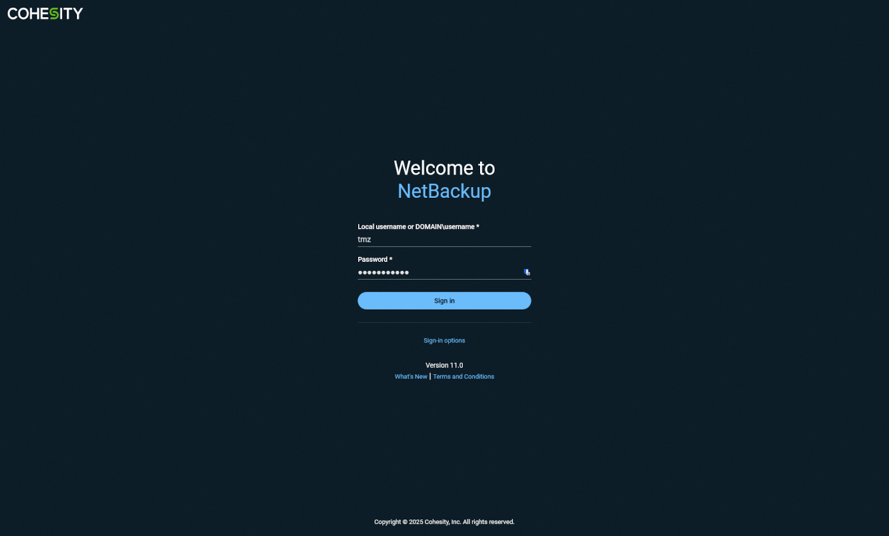{.thumbnail}

3. Access the `Storage`{.action} menu, the `Disk storage`{.action} submenu, then click the `Storage Servers`{.action} tab.

    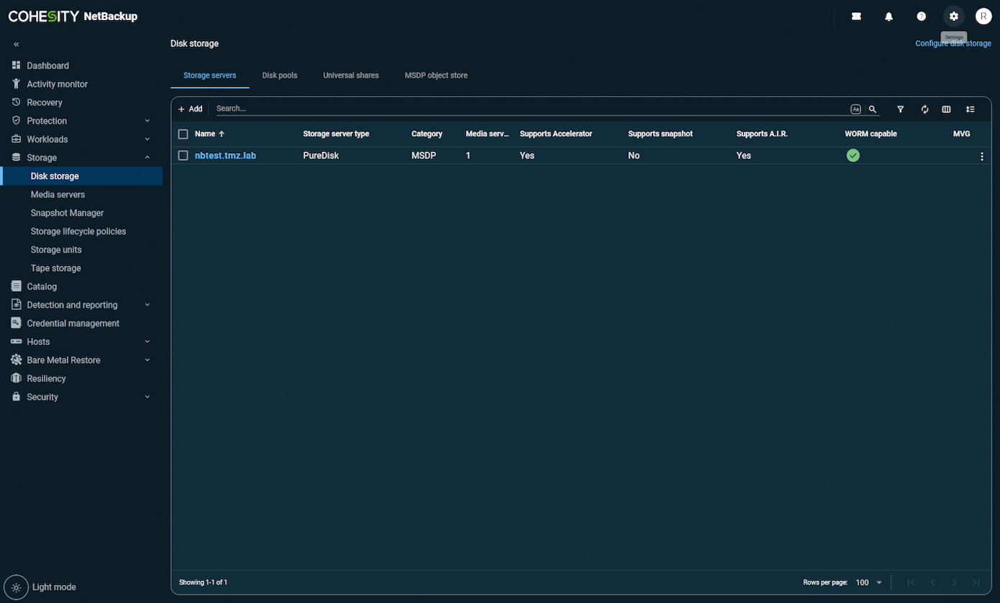{.thumbnail}

4. Open the `Disk Pools`{.action} tab and click on `Add`{.action} to create a new Disk Pool.

    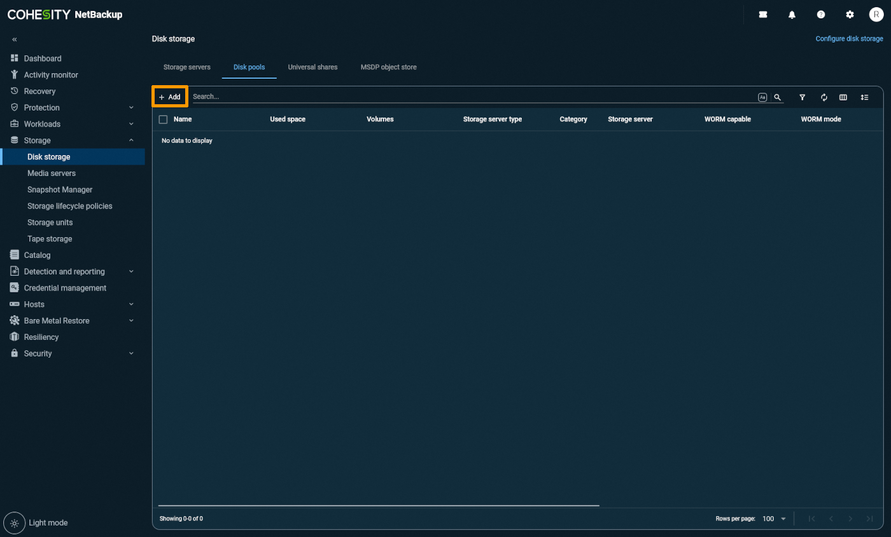{.thumbnail}

5. Select the `Storage Server MSDP`{.action} on which you want to create the deduplicated pool.

    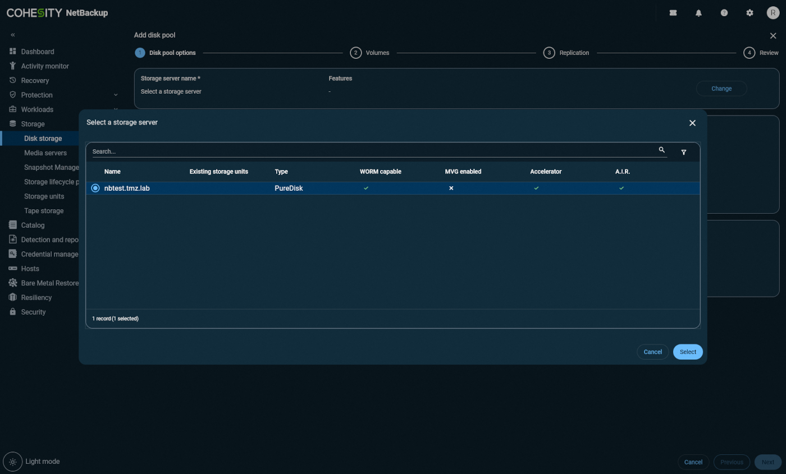{.thumbnail}

6. When selecting the volume, click on `Add Cloud Volume`{.action}.

    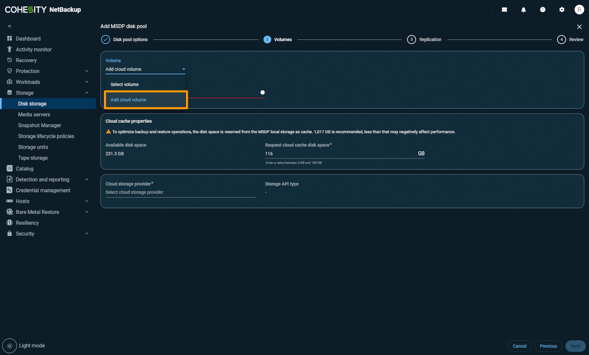{.thumbnail}

7. Choose `OVHcloud Standard Object Storage`{.action} as the cloud storage type.

    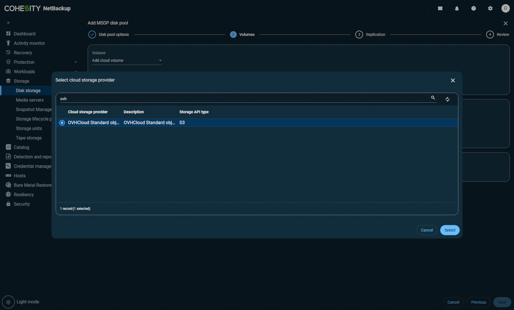{.thumbnail}

8. Select the desired endpoint, and add the OVHcloud credential if not already done.

    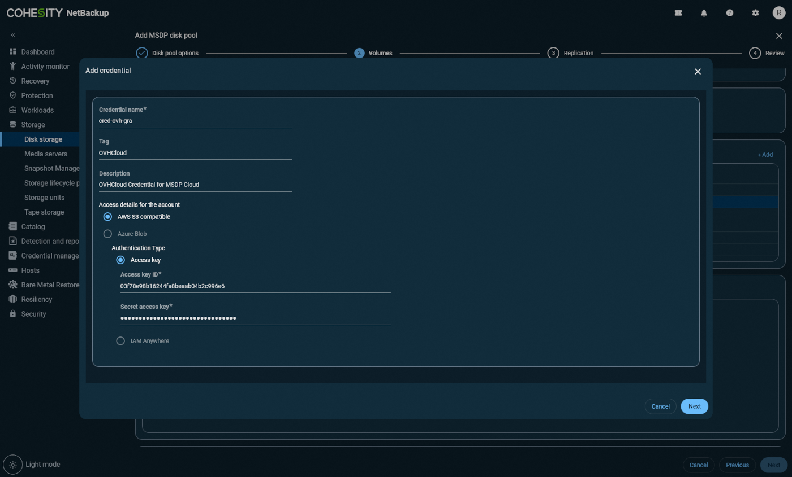{.thumbnail}

9. (Optional) To enable WORM mode (S3 Object Lock), check `Use Object Lock`{.action}. Select the NetBackup lock mode matching the OVhcloud Object Lock mode:

    - Compliance -> Compliance
    - Enterprise -> Governance

    Then, set the minimum and maximum retention periods for the lock.

    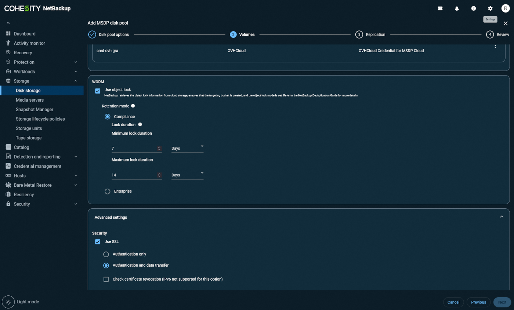{.thumbnail}

10. Enter the name of the bucket you want to use, or create a new one.

    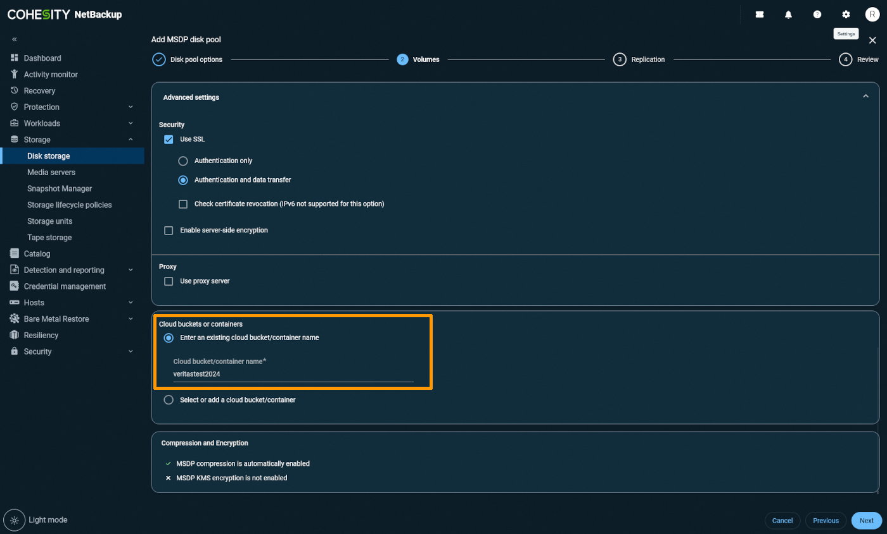{.thumbnail}

11. Click on `Next`{.action}, then review the settings in the Review tab.

    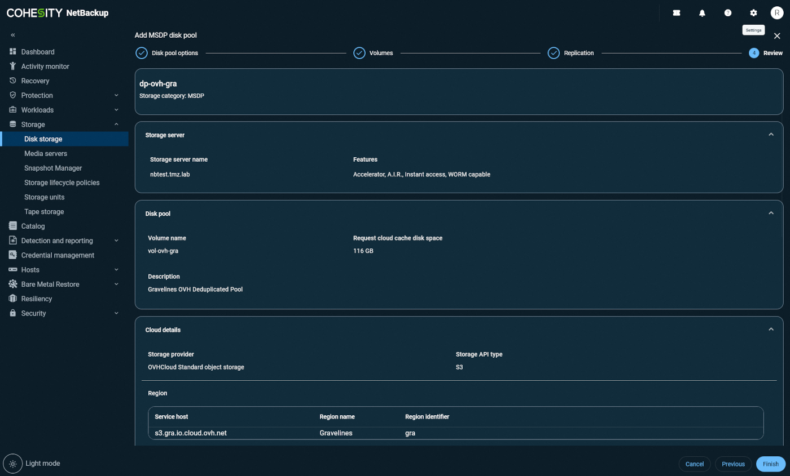{.thumbnail}

12. Click on `Add Storage Unit`{.action} at the top of the screen, then name the storage unit.

    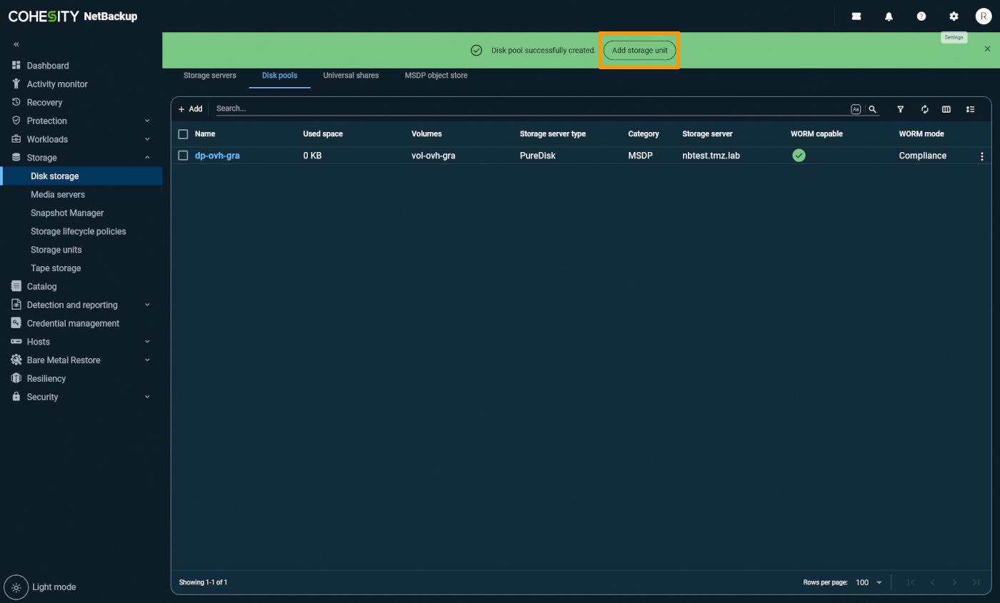{.thumbnail}

    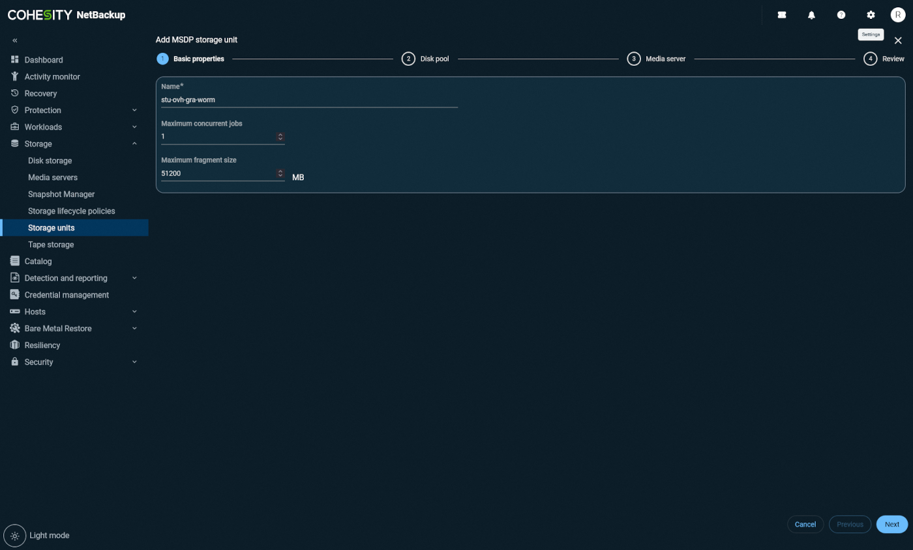{.thumbnail}

13. (Optional) To enable WORM locking, check `Lock until Expiration`{.action}.

    > [!primary]
    >
    > Note: WORM and non-WORM data can coexist within the same deduplicated Disk Pool.
    >

14. Review all settings in the Review tab, then confirm.

    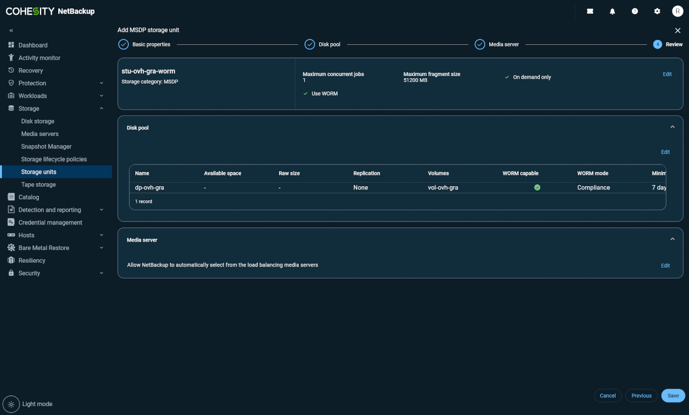{.thumbnail}

15. You can now:

    - Use the storage unit directly in your backup jobs,
    - Or use it as a secondary target via a Storage Lifecycle Policy (SLP).

16. Modify your backup policies accordingly to integrate OVHcloud Object Storage.

    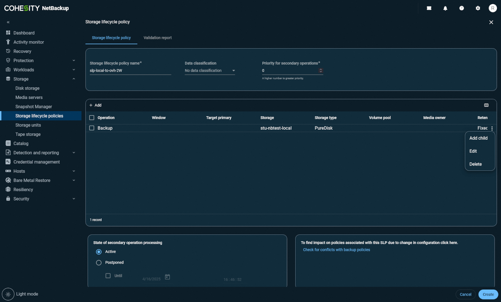{.thumbnail}
    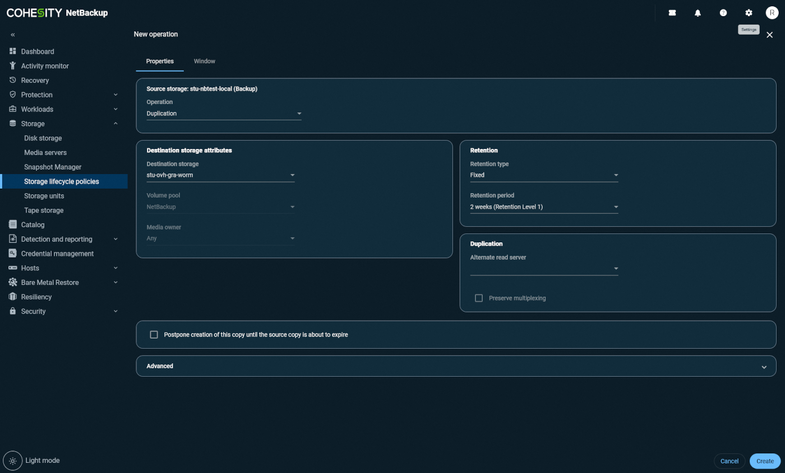{.thumbnail}
    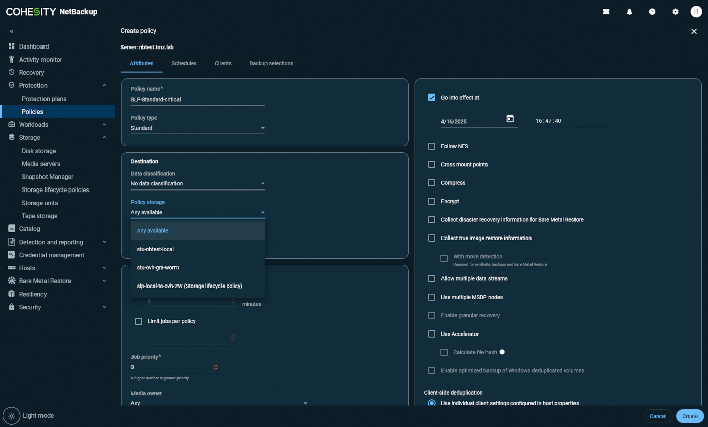{.thumbnail}
    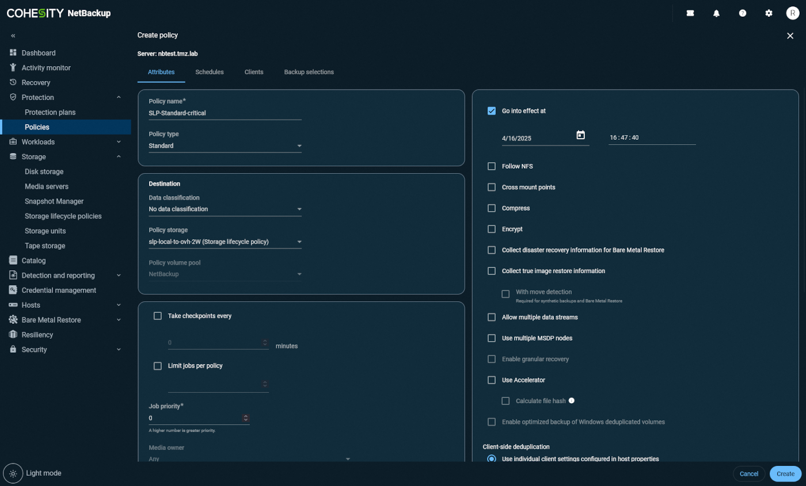{.thumbnail}

## Go further

If you need training or technical assistance to implement our solutions, contact your sales representative or click on [this link](/links/professional-services) to get a quote and ask our Professional Services experts for assisting you on your specific use case of your project.

Join our [community of users](/links/community).