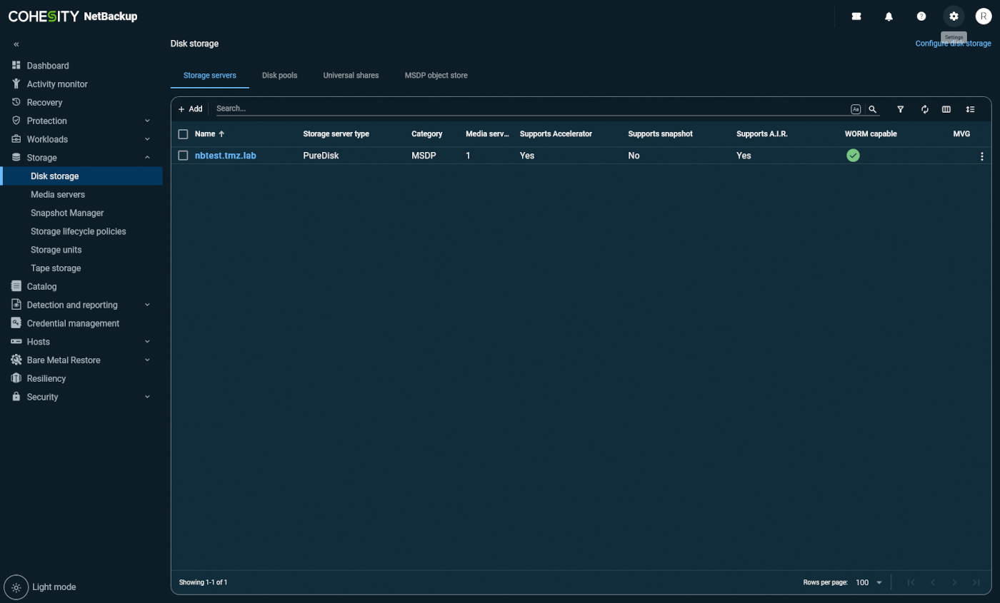

## Objectif

Ce guide a pour objectif de vous accompagner dans la configuration et l’utilisation de l’Object Storage OVHcloud comme cible de sauvegarde dans Cohesity NetBackup, via un Disk Pool dédupliqué.

Il couvre notamment l’ajout d’un volume cloud, la configuration des paramètres WORM (facultatif) et l’intégration dans les politiques de sauvegarde NetBackup.

## Prérequis

- Un Primary Server NetBackup installé et configuré. Voir [Installing NetBackup primart server](https://www.veritas.com/support/en_US/doc/27801100-157469020-0/v13834345-157469020){.external}
- Un serveur de médias avec option de déduplication installé sur Red Hat Enterprise ou SUSE Linux Enterprise Server (voir [Deduplication Guide](https://www.veritas.com/support/en_US/doc/25074086-168257404-0/index){.external})
- Un espace disque local disponible d’environ 1 To pour la gestion des métadonnées de déduplication.

## En pratique

Cette section décrit, étape par étape, comment configurer un Disk Pool dédupliqué utilisant OVHcloud Object Storage comme volume cloud dans Cohesity NetBackup.
Vous serez guidé tout au long de la procédure, depuis la sélection du Storage Server jusqu'à l'intégration dans vos politiques de sauvegarde. Chaque étape est accompagnée d’une capture pour faciliter la configuration.

1. Assurez-vous qu’un Storage Server MSDP est déjà créé.

2. Connectez-vous à l’interface NetBackup en tant qu’administrateur.

{.thumbnail}

3. Accédez au `menu Storage`{.action} puis `Storage Servers`{.action}.

{.thumbnail}

4. Ouvrez l’onglet `Disk Pools`{.action} et cliquez sur `Add`{.action} pour créer un nouveau Disk Pool.

{.thumbnail}

5. Sélectionnez le `Storage Server MSDP`{.action} sur lequel vous souhaitez créer le pool dédupliqué.

{.thumbnail}

6. Lors de la sélection du volume, cliquez sur `Add Cloud Volume`{.action}.

{.thumbnail}

7. Choisissez `OVHcloud Standard Object Storage`{.action} comme type de stockage cloud.

{.thumbnail}

8. Sélectionnez l’endpoint souhaité, et ajoutez le credential OVHcloud si ce n’est pas déjà fait.

{.thumbnail}

9. (Optionnel) Pour activer le mode WORM (S3 Object Lock), cochez `Use Object Lock`{.action}. Sélectionnez le mode de verrouillage NetBackup correspondant au mode OVhcloud Object Lock :

- Compliance -> Compliance
- Enterprise -> Governance

Et définissez les durées de rétention minimum et maximum du verrouillage.

{.thumbnail}

10. Entrez le nom du bucket que vous souhaitez utiliser, ou créez-en un nouveau.

{.thumbnail}

11. Cliquez sur `Next`{.action}, puis vérifiez les paramètres dans l’onglet Review.

{.thumbnail}

12. Cliquez sur `Add Storage Unit`{.action} en haut de l'écran, puis nommez l’unité de stockage.

{.thumbnail}

{.thumbnail}

13. (Optionnel) Pour activer le verrouillage WORM, cochez `Lock until Expiration`{.action}.

> [!primary]
>
> Remarque : des données WORM et non-WORM peuvent coexister dans un même Disk Pool dédupliqué.
>

14. Vérifiez tous les paramètres dans l’onglet Review, puis validez.

{.thumbnail}

15. Vous pouvez maintenant :

- Utiliser l’unité de stockage directement dans vos jobs de sauvegarde,
- Ou l’utiliser en tant que cible secondaire via une Storage Lifecycle Policy (SLP).

16. Modifiez vos politiques de sauvegarde en conséquence pour intégrer le stockage OVHcloud.

{.thumbnail}
{.thumbnail}
{.thumbnail}
{.thumbnail}

## Aller plus loin

Si vous avez besoin d'une formation ou d'une assistance technique pour la mise en oeuvre de nos solutions, contactez votre commercial ou cliquez sur [ce lien](/links/professional-services) pour obtenir un devis et demander une analyse personnalisée de votre projet à nos experts de l’équipe Professional Services.

Échangez avec notre [communauté d'utilisateurs](/links/community).