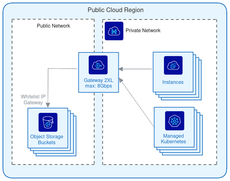

## Objectif

Ce guide explique comment utiliser l'Object Storage avec d'autres ressources dans un réseau privé.

## Prérequis

Vous devez disposer des éléments suivants :

- Un [bucket Object Storage](/pages/storage_and_backup/object_storage/s3_getting_started_with_object_storage).
- Un [réseau privé vRack](/pages/public_cloud/public_cloud_network_services/getting-started-07-creating-vrack).
- Une [Gateway Public Cloud](/pages/public_cloud/public_cloud_network_services/getting-started-02-create-private-network-gateway).
- D'autres ressources (instances Public Cloud, Managed Kubernetes, Bare Metal servers, etc.).

## En pratique

### Contexte

Selon vos besoins, une connexion sécurisée entre un réseau privé et votre bucket Object Storage peut s'avérer nécessaire. Nos services **réseau privé vRack** et **Gateway Public Cloud** sont conçus pour répondre à vos besoins spécifiques en matière de sécurité et de performance.

Cela vous permet également d'interconnecter deux buckets Object Storage avec vos ressources rassemblées dans un réseau privé vRack (voir le diagramme d'architecture ci-dessous).

{.thumbnail}

### Création d'un réseau privé vRack et d'une Gateway Public Cloud

Afin de créer et de configurer à la fois une Gateway Public Cloud et un réseau privé vRack, veuillez suivre le guide « [Créer un réseau privé avec une Gateway](/pages/public_cloud/public_cloud_network_services/getting-started-02-create-private-network-gateway) ». Ce guide explique comment :

- Sélectionner et créer la Gateway appropriée en termes de performance et de géo-disponibilité.
- Rattacher un réseau privé vRack existant ou nouvellement créé à la Gateway.

### Whitelisting des IP

Une fois la Gateway créée et associée à un réseau privé vRack, l'étape suivante consiste à mettre en place un whitelisting d'un ensemble d'adresses IP que souhaitez autorisées pour dialoguer avec vos ressources Object Storage. 
Pour ce faire, plusieurs moyens existent :

- Utilisation des Bucket Policies Object Storage : cette fonctionnalité n'est pas encore implémentée, elle sera bientôt disponible.
- Utilisation des User Policies où vous pouvez explicitement whitelister un ensemble d'adresses IP
  
#### Politique utilisateur (User Policies)

#### Contexte

Tout dabord petit rappel du processus actuel d'évaluations des autorisations utilisateur :

1. si elle existe, évaluer la politique utilisateur sinon se référer aux ACLs
    1. vérifier s'il existe un *Deny* explicite : s'il existe un *Deny* explicite, refuser l'autorisation, sinon, vérifier s'il existe un *Allow* explicite
    2. vérifier s'il existe un *Allow* explicite : s'il existe un *Allow* explicite, accorder l'autorisation
    3. s'il n'existe ni *Deny* explicite ni *Allow* explicite, se référer aux ACL
2. se référer aux ACLs

Ce processus d'évaluation sera susceptible d'être modifié avec la mise en œuvre prochaine des bucket policies.

#### Implémentation

Dans notre scénario, nous allons autoriser toutes les opérations pour un ensemble d'IP spécifiquement whitelistées en utilisant la politique suivante :

```json
{
  "Statement": [{
    "Sid": "ExampleStatement01",
    "Effect": "Allow",
    "Action": "s3:*",
    "Resource": ["*"],
    "Condition": {
      "IpAddress": {
        "aws:SourceIp": "10.0.0.5/16"
      }
    }
  }]
} 
```
Pour appliquer cette nouvelle politique à votre utilisateur S3, veuillez suivre lles étapes définies dans le guide le guide « [Object Storage - Gestion des identités et des accès](/pages/storage_and_backup/object_storage/s3_identity_and_access_management) », et ainsi finaliser l'interconnexion entre vos ressources Object Storage et celles présentes au sein de votre réseau privé.

## Aller plus loin

Si vous avez besoin d'une formation ou d'une assistance technique pour la mise en oeuvre de nos solutions, contactez votre commercial ou cliquez sur [ce lien](/links/professional-services) pour obtenir un devis et demander une analyse personnalisée de votre projet à nos experts de l’équipe Professional Services.

Échangez avec notre [communauté d'utilisateurs](/links/community).
